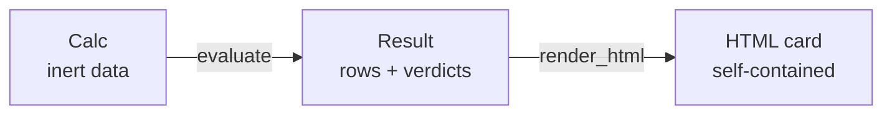

# calcsheet

Completed calculations as artifacts.

A calculation is declared as **data** — inputs, formulas, references, checks —
evaluated **once**, and rendered as a self-contained HTML card in the "C4
four-slot" layout with a binary pass/fail verdict.

The rendered string never drives a decision. Rows, values and verdicts are all
pure functions of one `Result`, so the card can never disagree with the numbers
it was built from. Same calc in ⇒ byte-identical HTML out.



## What "self-contained" means here

- Math is native **MathML** (via sympy → LaTeX → `latex2mathml`), which browsers
  typeset with **zero JavaScript**. No KaTeX, no node, no CDN.
- Inline CSS only. No external stylesheets, fonts, images or scripts.
- Enforced, not just claimed: markup embedded in the card is checked for
  `<script`, `onerror`, `onload`, `href=`, `src=` and `http` before it is
  emitted, and every caller-supplied string (title, refs, units, descriptions)
  is HTML-escaped.

Two runtime dependencies, both pure Python: `sympy` and `latex2mathml`.

## API

```python
Input(value, ref="", unit="")            # a given quantity
Formula(symbol, expr, ref="", unit="")   # expr: string over prior symbols
Check(expr, description="")              # boolean expression over the scope
Calc(title, as_of, inputs, formulas, checks, precision=3)

calc.evaluate() -> Result
render_html(result) -> str
```

```python
from calcsheet import Calc, Check, Formula, Input, render_html

calc = Calc(
    title="Capacity check",
    as_of="2026-07-24",
    inputs={
        "F_max": Input(120, ref="forces.csv · max"),
        "C_min": Input(210, ref="members.csv · min"),
    },
    formulas=[
        Formula("r", "F_max / C_min", ref="demand / capacity"),
        Formula("U", "100 * r", ref="utilisation", unit="%"),
    ],
    checks=[
        Check("U < 100", "capacity not exceeded"),
        Check("U < 50", "utilisation target"),
    ],
)

result = calc.evaluate()   # r = 0.571, U = 57.1 %, result.passed is False
html = render_html(result)
```

### Semantics

- **Order matters.** Formulas run in declaration order over ONE scope seeded by
  the inputs; each result joins the scope for the formulas after it. A formula
  may only reference symbols declared before it.
- **Checks see the final scope** and produce real Python booleans.
- **Binary severity.** Any false check ⇒ overall `passed is False`. There is no
  warn level.
- **`as_of` is caller-provided**, never `datetime.now()`.
- **Errors are early and named.** Unknown symbol, duplicate symbol, unparseable
  expression and a non-boolean check all raise `CalcError` naming the offending
  symbol or expression and listing the available names.
- **Formatting** is `f"{value:.{precision}g}"`, `precision=3` by default ⇒ `120`,
  `0.571`, `57.1`. `unit` is a plain display string; this package does no unit
  algebra.
- Underscored symbols render as subscripts: `F_max` ⇒ F with subscript "max".

### The card

| slot | content |
| --- | --- |
| symbol | MathML |
| definition | MathML (formulas only — inputs get a single `=`) |
| value + unit | right-aligned, tabular numerals, unit upright and muted |
| reference | right-hand gutter, plain text, hairline rule |

The substituted middle step is deliberately dropped — that is the C4 model, and
it is why `handcalcs` is not used here. Design checks render as one row each:
check expression as math, its description, the substituted boolean
(`57.1 < 50 = False`) and a PASS/FAIL badge. Light and dark themes ship via
`prefers-color-scheme`.

## Setup, tests, example

From a clean checkout, in this directory (`calcsheet/`). `uv` creates and syncs
the environment on the first run — no separate install step:

```bash
# tests (32 of them)
uv run --extra dev python -m pytest -q

# the example: writes out/capacity-check.html and opens it in a browser
uv run python -m calcsheet.examples.capacity
uv run python -m calcsheet.examples.capacity --no-open   # write only
```

Explicit environment, if you prefer one:

```bash
uv venv && uv pip install -e '.[dev]'
uv run python -m pytest -q
```

Without `uv`:

```bash
python -m venv .venv && . .venv/bin/activate
pip install -e '.[dev]'
python -m pytest -q
python -m calcsheet.examples.capacity --no-open
```

The example prints the output path and the overall status (FAIL — 57.1 %
clears the 100 % safety limit but misses the 50 % target).

## Scope

This package is a standalone library with no side effects at import: no clock,
no filesystem, no network. It has **no coupling to the graph engine** and works
if that directory does not exist. Later it can be used from a graph merely by
decorating a function that calls `render_html`.

Out of scope for now: snapshot testing, a CI gate, and real unit algebra
(`unit` is a plain string).
