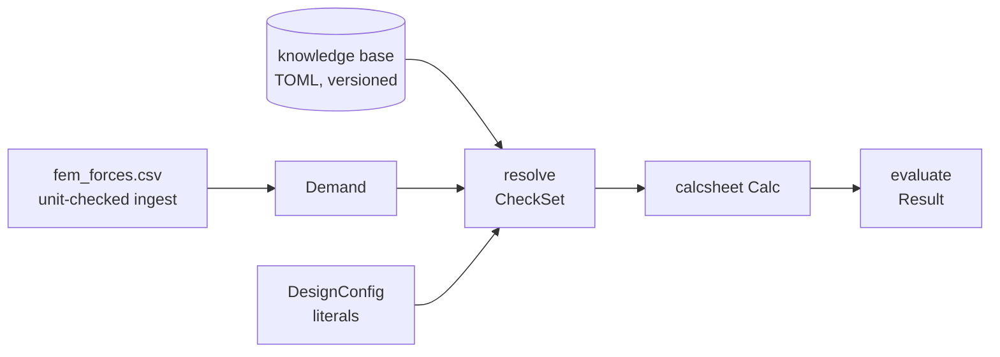

# designcheck

Building-code clauses, compiled into a calculation.

A versioned knowledge base of materials, fastener products and code clauses; a
resolver that decides which clauses govern *this* connection and binds their
symbols to *these* materials, products, factors and actions; and exactly one
output — a plain [`calcsheet.Calc`](../calcsheet).

That is the whole design. Evaluation, `Result`, utilisation reporting and every
renderer are inherited from `calcsheet`, not reimplemented, so **the proof can
never disagree with the numbers: it *is* the generic pipeline**.



`designcheck` depends on `calcsheet`. Nothing depends on `designcheck`.

## The types

| # | Type | Origin | What it is |
|---|---|---|---|
| T1 | `DesignConfig` | authored | run-level knobs: code pin, service class, load duration, target utilisation, `as_of` |
| T2 | `Timber` · `Steel` · `Concrete` · `FastenerSteel` | kb | a closed tagged union of material families, each with a `KbRef` identity header |
| T3 | `StructuralMember` (+ `RectSection`) · `Screw` | authored geometry + kb material / kb product | column and beam are authored, the screw is looked up whole |
| T4 | `ScrewConnection` | computed | the subject of the proof, as one object |
| T5 | `BuildingCode` | kb | one code *edition*: γ_M and k_mod tables, its clauses, its symbol dictionary |
| T6 | `Clause` | kb | an id, a formula, applicability predicates and a citation — nothing else |
| T7 | `CheckSet` | computed | the applicable clauses, the bindings ledger, and the compiled `Calc` |
| T8 | `KnowledgeBase` | data on disk | TOML shipped as package data, plus user overlay directories |
| T9 | `ActionRow` · `Demand` | computed | FEM actions, unit-checked at ingest, reduced to one governing magnitude |

## Headless, end to end

```python
from designcheck import (
    DesignConfig, RectSection, ScrewConnection, StructuralMember,
    get_code, get_fastener, get_material, governing_action, load_kb,
    read_fem_actions, resolve,
)

kb     = load_kb()
code   = get_code(kb, "codes/ec5")
timber = get_material(kb, "materials/timber/C24")
screw  = get_fastener(kb, "fasteners/screw/csk-6.0x120")

column = StructuralMember("col-B2", "column", RectSection(120, 120), timber, 2800)
beam   = StructuralMember("beam-B2-4", "beam", RectSection(60, 180), timber, 4200)
conn   = ScrewConnection("conn-01", screw, (column, beam), n=4, shear_planes=1,
                         spacing=60, angle_to_grain=90)

demand = governing_action(read_fem_actions("fem_forces.csv"), "conn-01", "V_z")
config = DesignConfig(code="codes/ec5", service_class=2, load_duration="medium",
                      target_utilisation=0.833, as_of="2026-07-24")

result = resolve(code, conn, demand, config).calc.evaluate()
result.governing            # ('eta <= eta_max', 0.7589...)
result.passed               # True
```

`render_html(result)` from `calcsheet` turns it into the four-slot card; nothing
in this package renders anything.

## The knowledge base

TOML shipped as package data under `src/designcheck/kb/`, read with stdlib
`tomllib`. One `kb.toml` per root declares the **snapshot version** that every
loaded value is pinned to.

```
kb/kb.toml                    version = "2024.1"
kb/materials/timber.toml      materials/timber/C24
kb/fasteners/screws.toml      fasteners/screw/csk-6.0x120
kb/codes/ec5.toml             codes/ec5   @2004-A2-2014
```

Addresses are `<kind>/<family>/<id>` (`codes/<id>` for codes). A user overlay
directory with the same layout sits *earlier* in the search path and wins by
address, so entries can be added without forking the shipped tables:
`load_kb(["/srv/our-kb"])`, or `DesignConfig.kb_overlays`.

Numeric properties carry their unit in the key — `"rho_k[kg/m^3]" = 350.0` —
and are dimension-checked on load against what the schema expects. The same
bracket convention labels FEM CSV columns.

> **Illustrative, not certified engineering.** The shipped EC5 entry is a
> deliberately reduced subset: one Johansen failure mode, β = 1, rope effect and
> spacing/edge-distance rules neglected. Each neglect is named in the clause's
> `notes` and renders as fine print. The numbers are coherent and dimensionally
> sound; this proves the *pipeline*, not a building.

## Semantics

- **Clauses are data, and applicability is declarative.** A clause governs when
  every predicate in `applies` holds against a flat table of connection facts
  (`"fastener.d <= 6.0"`, `"members.all_timber"`). The vocabulary is closed and
  hand-evaluated — no `eval`, so KB content never executes. A predicate naming
  an unknown fact is an **error**, not a quiet `False`: a typo must not silently
  drop a clause from a proof.
- **Ordering is topological, depth-first**, so a clause sits next to the clause
  that needs it. A cycle names the clauses in it; a required symbol that no
  clause defines and no `[symbols]` entry binds is refused by name.
- **Characteristic in, design out, exactly once.** Materials store
  characteristic values only. `X_d = k_mod · X_k / γ_M` happens as *rows of the
  sheet*: `k_mod` and `gamma_M` are inputs with table citations, and Eq (2.17)
  is a formula row. A reviewer sees which γ_M was used, and where it came from,
  on the line where it was applied.
- **Units are checked at the boundaries.** FEM ingest, KB load and symbol
  binding each compare declared dimensions; inside `calcsheet` a unit stays a
  display string, exactly as that package documents. The small `units` module
  here does that job — there is no `forallpeople` dependency.
- **Every emitted row has a ref.** KB `address@version` for KB-bound inputs,
  `file · column · case` for demand, the table citation for factors, the clause
  citation for formulas. `CheckSet.bindings` is the same ledger as data.
- **`as_of` is caller-provided**, never `datetime.now()`; `CheckSet.pins`
  records the KB snapshot, the code edition and `as_of`, so a run reproduces
  from module source plus KB version.

## Setup and tests

From a clean checkout, in this directory (`designcheck/`). `uv` creates and
syncs the environment on the first run:

```bash
uv run --extra dev python -m pytest -q
```

Requires Python 3.11+ (`tomllib`). One runtime dependency, `calcsheet`, resolved
from the sibling checkout; everything else is standard library.

## Scope

This is the pure library layer (ADR 0022 phase 2). No graph nodes, no
renderers, no example graph — those layer on top and import this, never the
reverse. Out of scope here and named in the ADR: load-combination generation,
member self-checks, design iteration, FEM formats beyond CSV, and completing
the code content.
