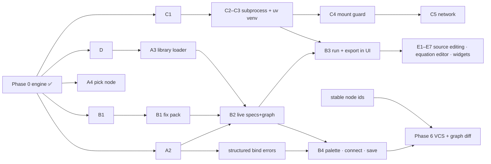

# Roadmap — graph-based Python calculation IDE

Living roadmap, refreshed after the Wave-1 integration review (`integration/wave-1`,
PRs #1–#4) and a hands-on UI bug-hunt. Grounded in what's actually in the tree.

**Constraints that hold across everything:** demos use only **simple mock calcs**
(average/median/basic math) — no domain content; the **engine stays pure stdlib**;
**no CDNs** (all web assets bundled via npm); and **"the graph is ordinary
Python"** — node bodies live in real `.py` files, resolved via `module.qualname`,
never serialized into the graph.

## Where we are

| Piece | State |
|---|---|
| **Phase 0 engine** | ✅ shipped — `node_spec`, `Graph`, `bind` (single validation step), `run`, `to_python`, decorator/tracing authoring, qualified ids, additive-tolerant schema. Pure stdlib. |
| **A2** — FastAPI server | 🔵 PR #1 — `/api/specs · /graphs/validate · /run · /export`; graph JSON verbatim; `bind`-as-validate. |
| **C1** — env descriptor schema | 🔵 PR #2 — optional `environment` block (deps + mounts + network), deny-all default; schema only. |
| **D** — node packs | 🔵 PR #3 — simple-math `calc` pack (→ HTML card), `sources` (`read_csv` + in-process `mock_api` swap), readings example. |
| **B1** — ReactFlow render | 🔵 PR #4 — read-only render of the example graph; bundled offline. Ships with a **B1 fix pack** outstanding (below). |

Integration branch: **72 tests green**; the CSV↔mock-API source swap produces identical output.

## UI feedback (from the hands-on hunt)

Renders correctly (4 nodes/edges, output badge, accurate socket states, self-contained
offline bundle). Defects, priority order — the **B1 fix pack** = items 1–6:

| # | Sev | Issue | Fix |
|---|---|---|---|
| 1 | High | Half-controlled ReactFlow → **minimap renders 0 nodes**, **node drag is dead** | `useNodesState`/`useEdgesState` + `onNodesChange` (or `defaultNodes`) |
| 2 | High | Edges into a **missing-spec node vanish** (no handles on the "unknown" card; no id/type shown) | render generic handles + show `id`/`type` |
| 3 | High | Fixed `ROW_H=200` **overlaps tall nodes** (inputs hidden) | height from socket count + doc length; measured layout at B2 |
| 4 | Med | Minimap/Controls light-themed on dark canvas | `colorMode="dark"` |
| 5 | Med | Handle dots misaligned (offset varies per node) | anchor handles to the card border |
| 6 | Low | `favicon.ico` 404 every load | inline data-URI favicon |
| 7–9 | Low | all edges `animated`; minimap overlaps at small viewport; `minZoom 0.5` can't fit wide graphs | static edges (animate at B3); collapse minimap; `minZoom 0.1` |
| 10 | Low | Fixture drift unguarded (manual copies of `engine/schemas/`) | obsoleted by B2 (`/api/specs`); until then diff-check |
| 11–12 | Low | a11y (`aria-label`, tooltip-only docstrings, 10px text); `spec` typed non-null while guarded at runtime | add labels; make `spec: NodeSpec \| null` |

## UI quality pass (in progress — Fable)

Raised from a hands-on review of the live UI. These gate any positive first
impression and so gate the symbolic-math pull-forward below.

| # | Sev | Item | Approach |
|---|---|---|---|
| U1 | High | **Default auto-layout is unacceptable** (single node shown on load, poor arrangement) | Layered/Sugiyama L→R layout in a dedicated `layout.ts`; layer by longest path, crossing-minimization sweep, spacing from **measured** node sizes; re-layout + `fitView` after `useNodesInitialized`. |
| U2 | High | **Node content overflows the card background** (long literal values, e.g. a file path, spill outside the border) | `min-width:0` on flex rows + clamp/ellipsis with full value on `title` (or clean wrap); audit every card row at realistic content lengths. |
| U3 | Med | **No per-node run inspection** — can't see a node's inputs/outputs from a run | Click-to-inspect a node; resolve inputs from literals + upstream run outputs (derivable from the run response, no new endpoint); show inputs+outputs with `previewType`/`previewValue`, truncated. |

Delivered as one coherent redesign (they all rewrite the node-card + layout
surface); parallel patches would collide and look bolted-on.

## Dependency / critical path

**Critical path:** B1 fix pack → B2 → B3 → B4. The **C stream runs fully in parallel** (server-side). **E** hangs off B3.

## Phases

**Wave-1 close-out (now)**
- **B1 fix pack** (UI items 1–6), then merge PR #4 — don't ship a canvas with a dead minimap + dead drag.
- Merge **A2 / C1 / D** (contract-first seams; sound). Open a ticket for A2's deferred **structured per-node bind errors** — B4 needs it.

**Wave 2 — make the UI honest**
- **B2** live specs + graph over HTTP (deletes the fixture-drift class; first moment all four streams provably compose). Fold the measured-height layout fix in here.
- **A3** library loader (packs from `nodepacks/`), feeds B2's palette.
- **Structured bind errors** (`{code, message, nodeId}` from `bind`) — B4's drag-to-connect UX depends on it.
- **B3** run + export in UI: Run → `/api/run`, per-node `$repr/$type` previews, render the HTML card in a **sandboxed iframe** (`sandbox=""`), Export → `to_python` side-by-side. First end-to-end "graph is ordinary Python" demo in a browser.

**Wave 3 — editing + enforcement (parallel)**
- **B4** palette / connect (validate-on-connect via `/api/graphs/validate`) / save. Turns the viewer into an IDE.
- **C2→C3→C4→C5**: subprocess + ephemeral `uv` venv (dependency whitelisting becomes real) → mount guard → network posture; honor `environment` on `/api/run`. Threat model stays honest-mistake isolation (ADR 0003).
- **A4** `pick` node (nested-output access without paths-on-edges).

**PULLED FORWARD — Symbolic math, in two ordered steps (features 5–7):**

**(A) Symbolic-math node pack (`nodepacks/sym`) — define the math in Python → rendered HTML.** **SymPy** (build an expression · `solve`/rearrange · `lambdify` to numbers), **forallpeople** (real units on values), **handcalcs** (typeset the substituted steps → HTML). Nodes only, no UI. Deps behind a `sym` extra and **lazy-imported** (so listing specs needs nothing installed); declares `environment.dependencies` via the C1 descriptor; runs in-process today, reproducibly under **C2–C5** later. Simple, non-structural demos (solve a quadratic symbolically then verify it numerically; a unit-carrying formula rendered by handcalcs). *This is the first step.*

**(B) Custom node rendering + editing (feature 7).** The node-declared-UI seam — open `widget.kind` → a web **renderer + editor** registry — applied to the sym pack: a symbolic node whose **equation/calculation is edited directly on the canvas**, its value fed through as a **widget literal** (so it still round-trips via the composite as a string the node converts to SymPy, per ADR 0004), and the workflow runs unchanged. Covers both a node's *rendering* (how the symbolic result displays — bundle KaTeX, no CDN) and *editing* (the equation input widget, e.g. MathLive). Builds on the widget seam + B2/B3; pairs with source-editing (Phase 5 E5/E6). *Second step, after (A).*

**Phase 5 — rich editing (E1–E7)**
- Source editing over `GET/PUT /api/source/{id}` (routes reserved 501). Write path edits the **real `.py`** via `module`/`qualname`; imports read-only (shown, not edited) per the current decision; re-introspect + re-`bind` on save.
- Node-declared widgets: renderer registry over the open `widget.kind` vocabulary — **before** the equation editor (the editor is just another widget).
- Equation editor: MathLive/KaTeX **bundled from npm** (verify license + offline bundle).

**Phase 6 — VCS + graph-aware diff.** Blocked on **stable node ids** (trace ids are call-order dependent). Solve the id scheme when B4 save lands, or every saved graph becomes diff-noise.

## Build next / don't build yet / open decisions

**Build next (in order):** B1 fix pack + merge all four PRs → B2 live specs (+ layout fix, delete fixtures) → structured bind errors → B3 run/export. Yields a "load → run → see HTML card → export flat Python" loop in two small steps.

**Don't build yet:** Phase-6 VCS (blocked on ids); `network` values beyond `"none"` (can't enforce yet); cross-language / IPC (YAGNI); SSE/streaming runs (sync is fine); equation editor before the widget-registry seam; auth/multi-user; a layout-engine dep at B1.

**Open decisions (human):**
1. **Where do saved graphs live?** Recommend **files on disk** (keeps the ordinary-Python + diffable-JSON story; sets up Phase-6 git for free) over a server store. *Blocks B4.*
2. **Stable node id scheme** — explicit `id=` in tracing vs content-hash. Decide **with B4 save**, or accumulate migration debt.
3. **`position` as authored data** — once B4 lets users drag, write positions back to the (nullable) `position` field; auto-layout only fills `null`. Recommend yes.
4. **HTML-output rendering** — sandboxed iframe (recommended) vs text-only, decided at B3 before habits form.
5. **PR base branch** — the stream PRs stack on `claude/nodezator-gui-python-conversion-nm1tgv`; confirm whether to retarget `master` before merging.
