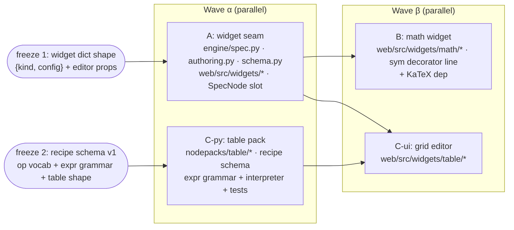

# ADR 0005 — Node-declared UI widgets and tabular recipe editing

Status: **accepted** (2026-07) · Scope: `graph-engine/` · Relates to: ADR 0001 (spec/widget
seam), ADR 0003 (environment descriptor), ADR 0004 (graph ⟷ source bijection)

Designs three features as one architecture: **(A)** a node-declared editing-UI
seam authored in Python, **(B)** its first consumer — inline symbolic-equation
editing on the canvas, and **(C)** Excel-like operations over a CSV with a
Python ⟷ UI bijection. The common thread: every editable surface reduces to a
**widget literal** that round-trips through the ADR 0004 composite, so editing
in the UI is always, literally, editing a Python literal.

## Context

What exists today:

- **The widget seam is already half-open.** `engine/spec.py` derives a
  `widget: {kind, subtype?}` from a parameter's type (`float` → `number`,
  `str` → `text`, …); ADR 0001 decision 7 made `widget.kind` an **open
  vocabulary**. The web side (`web/src/types.ts`, `SpecNode.tsx`) types and
  displays the widget kind but renders no editor.
- **Literals already round-trip.** ADR 0004: a literal argument in the `@main`
  composite ⟷ a widget value in the graph. `engine/composite.py` emits literals
  with `repr()` and parses them back with `ast.literal_eval()`; `PUT /api/graph`
  rewrites the wiring lines of the real `.py` (`server/workspace.py`).
- **The source editor is the other editing path.** `GET/PUT /api/source/{id}`
  edits a `@node` **body** (behavior); this ADR adds editing of **values**.
  The two are complementary and never overlap: widget edits rewrite a literal
  in the composite's wiring line; source edits rewrite a function body.
- **The sym pack** (`nodepacks/sym`) already takes equations as plain SymPy
  strings (`parse_expr(text="x**2 - 5*x + 6")`) with lazy-imported heavy deps
  behind the `sym` extra — the pattern C reuses.

Constraints upheld throughout: engine pure stdlib and UI-agnostic; node bodies
never serialized into the graph; only the dataflow subset is
graph-representable; demos are simple mock calculations; **no CDNs** — every
web asset is npm-bundled offline.

---

## Part A — the node-declared UI seam

### A-D1: Python declares a *contract*, never a UI

A node (or one of its inputs) declares **`kind` + JSON config + the value type
it produces** — nothing else. No HTML, no React, no callbacks. The engine
serializes the declaration into the node spec's existing `widget` field; the
web app decides what (if anything) to render for that kind. An engine running
headless, or a future non-React front-end, ignores or reinterprets it freely.

### A-D2: Declaration API — a `widgets=` kwarg on `@node`

```python
# engine/spec.py (new, ~30 lines, pure stdlib)
class Widget:
    """A declarative editing-widget contract for one input.

    kind    -- registry key the UI resolves to an editor component.
    config  -- JSON-serializable options, opaque to the engine.
    """
    def __init__(self, kind: str, **config: object) -> None:
        self.kind = kind
        self.config = config
        json.dumps(config)  # fail at import time, not save time

    def to_dict(self) -> dict:
        d: dict = {"kind": self.kind}
        if self.config:
            d["config"] = self.config
        return d
```

```python
# nodepacks/sym/__init__.py — the consumer's view (Part B)
from engine import node, Widget

@node(widgets={"text": Widget("math", syntax="sympy")})
def parse_expr(text: str = "x") -> object:
    """Parse ``text`` into a SymPy expression (or equation)."""
    return _sympify(text)
```

`node_spec()` gains a `widgets: dict[str, Widget] | None` parameter, threaded
through `node()` → `registry.register()` exactly like the existing
`outputs=[...]`. A **declared widget overrides the type-derived one**; inputs
without a declaration keep today's derivation unchanged. Introspection-time
validation: a `widgets` key naming no parameter raises `EngineError` (typos
fail at import, like everything else in the spec layer).

*Alternative considered — `Annotated[str, Widget("math")]` on the parameter.*
Prettier co-location, but it requires `get_type_hints(include_extras=True)`,
which *evaluates* annotations. Every pack uses
`from __future__ import annotations`, so this would introduce a
forward-reference/eval failure class into a spec layer that today treats
annotations as inert strings. The kwarg matches the existing `outputs=[...]`
precedent and touches nothing. **Recommend kwarg now; `Annotated` can be added
later as sugar that compiles to the same spec field.** (Open confirmation 1.)

*Node-level panels are deferred.* Both B and C are fully served by a widget on
**one input**; a whole-node `panel=` spec adds surface with no consumer.
The `widget` dict shape is additive-tolerant, so a node-level `editor` field
later is a MINOR change (ADR 0001 D7).

### A-D3: Spec wire format — extend the existing `widget` field, additively

```jsonc
// node spec input entry (today's derived form is unchanged and still valid)
{ "name": "text", "type": "str", "kind": "positionalOrKeyword",
  "required": false, "default": "x",
  "widget": { "kind": "math", "config": { "syntax": "sympy" } } }
```

`config` is optional (absent for the derived kinds), `additionalProperties:
true`, unknown fields ignored. No schema-version bump (additive optional
field). The declaration lives in the **node spec** only — never in the graph
JSON, which continues to carry just the literal value in `nodes[].inputs`.

### A-D4: JS side — a `kind → editor` registry, bundled, with fallback

```tsx
// web/src/widgets/registry.ts
export interface WidgetEditorProps<V = unknown> {
  value: V;                          // current literal from graph.nodes[].inputs[name]
  config: Record<string, unknown>;   // spec.widget.config, opaque to the shell
  input: SpecInput;                  // name/type/required, for labels + fallback
  onCommit: (next: V) => void;       // shell writes the literal + PUT /api/graph
}
export type WidgetEditor = React.ComponentType<WidgetEditorProps>;

const REGISTRY = new Map<string, WidgetEditor>();
export const registerWidget = (kind: string, e: WidgetEditor) => REGISTRY.set(kind, e);
export const editorFor = (w: Widget | null): WidgetEditor =>
  (w && REGISTRY.get(w.kind)) ?? DefaultEditor;   // unknown kind -> today's behavior
```

- Built-ins (`number`, `text`, `checkbox`) register at startup in
  `web/src/widgets/index.ts`; heavy editors (`math`, `table-recipe`) are
  `React.lazy` chunks — **code-split but npm-bundled, zero CDN**.
- `SpecNode.tsx` grows one slot: an unwired input with a widget renders
  `editorFor(input.widget)` (collapsed to the current value chip; expands on
  click) instead of the passive kind label.
- **Unknown `kind` falls back to `DefaultEditor`** (text/number by `input.type`)
  — a spec authored against a newer pack degrades gracefully, which *is* the
  versioning story for the open vocabulary (A-D6).

### A-D5: Value flow and validation — Python is authoritative

Round trip (identical for every kind — this is the whole point):

```
editor onCommit(v) ─→ graph.nodes[id].inputs[param] = v      (client state)
                  ─→ PUT /api/graph                          (existing endpoint)
                  ─→ workspace rewrites the wiring line:      expr = parse_expr(text='x**2 - 5*x + 6')
                  ─→ reparse module → graph (round-trip proof, already served)
```

Widget values are constrained to the **literal-JSON subset**: `str · int ·
float · bool · None` and lists/dicts thereof — exactly what survives both
`JSON ⟷ repr()/ast.literal_eval()` directions (bind already rejects
non-serialisable literals). Non-finite floats (`nan`/`inf`) are excluded —
representable in neither JSON nor `literal_eval`.

Validation is **layered, with one authority**:

| Layer | Who | What | Binding? |
|---|---|---|---|
| keystroke | JS editor | UX-level (parse-as-you-type, grammar hints) | no — best effort |
| save | engine `bind` | literal is JSON-serialisable; structural graph checks | yes |
| run | the node body | **semantic** validity (`sympify` fails, unknown op, bad column) → `UserError` | **yes — authoritative** |

We deliberately do **not** add a per-kind server-side validation RPC in v1: the
node body already is the validator, `/api/run` already surfaces per-node
errors, and a duplicate validation path is the first step onto the
two-implementations treadmill Part C is designed to avoid. If pre-run
validation proves necessary, a `POST /api/widgets/validate {kind, value}`
dispatching to a pack-registered validator is an additive later step.

### A-D6: Versioning the `kind` vocabulary

- `kind` stays an **open vocabulary** (ADR 0001 D7); the registry fallback is
  the forward-compatibility mechanism — no central enum to bump.
- Core kinds are flat names (`number`, `text`, `checkbox`, `math`,
  `table-recipe`); packs introducing exotic kinds should namespace
  (`sym.matrix`) to avoid collisions.
- `config` is additive-tolerant; a config schema change that would break an
  older editor is a **new kind**, not a mutated one.
- Where the *value* has internal structure (the table recipe), the version
  lives **in the value** (`{"version": 1, ...}`) and is enforced by the node
  body — the widget seam stays dumb.

### Coexistence with the source editor

Two orthogonal write paths to the same `.py`: the **source editor** changes
*what a node does* (`PUT /api/source/{id}`, body rewrite, re-introspect); the
**widget** changes *what a node is fed* (`PUT /api/graph`, wiring-line literal
rewrite). They compose: declare a widget on a node, then edit that node's body
— the spec (including the widget declaration, which lives in the decorator
call) re-introspects on save. The only interaction rule needed: after a source
save, the UI refetches specs (it already does), so a widget added/removed in
the decorator appears/disappears live.

---

## Part B — symbolic-equation inline editing (`kind: "math"`)

The first consumer of A, and intentionally thin once A exists.

- **Kind:** `"math"`, config `{ "syntax": "sympy" }` (room for
  `variables: [...]` hints later).
- **The widget literal is the SymPy expression string** — `"x**2 - 5*x + 6"`,
  a `str`. Not LaTeX, not MathJSON. Rationale: it is what `sym.parse_expr`
  already consumes with zero new Python deps; it reads as ordinary Python in
  the composite (`expr = parse_expr(text='x**2 - 5*x + 6')`); and it keeps the
  bijective literal human-diffable. LaTeX-as-value would force
  `sympy.parsing.latex` (an ANTLR dependency) into the run path — rejected.
- **Editor, two stages behind the same kind:**
  - **v1 (recommended):** a text input with a **live typeset preview**. Preview
    translates the *constrained* subset we actually demo (arithmetic, `**` →
    superscript, `sqrt`, simple fractions, `=`) to LaTeX client-side and
    renders with **KaTeX**; anything the mini-translator can't handle falls
    back to monospace text — never blocks saving, since Python is the
    authority (A-D5). Small, shippable, no two-way conversion risk.
  - **v2 (optional upgrade):** **MathLive** `<math-field>` for two-way visual
    editing, using its Compute Engine to serialize the field back to an
    expression string. This adds a LaTeX↔sympy-string conversion boundary —
    exactly the kind of dual-semantics seam Part C warns about, so it should
    be added only when the demo visibly needs 2-D input.
- **Dependencies (all npm, offline, no CDN):** KaTeX — MIT, ≈280 KB min JS +
  CSS + ≈120 KB woff2 fonts. MathLive — MIT, ≈700 KB min + fonts;
  `@cortex-js/compute-engine` — MIT, large (≈1 MB class). Both license-clean;
  the cost argument is bundle size, which is why v1 is KaTeX-only, lazy-loaded
  (A-D4). Verify exact sizes against a bundle budget (suggest: the `math`
  chunk ≤ 400 KB gz) at implementation time.
- **Rendering results** (the typeset *output*) is already solved server-side —
  `sym.latex_to_mathml` emits zero-JS MathML into the HTML card. B adds input
  editing only; it does not move result rendering into the client.

Round-trip: edit in widget → `text` literal in graph JSON → wiring line in the
composite → `parse_expr` sympifies at run. One string, one owner, no
translation layer in the bijection.

---

## Part C — Excel-like tabular operations with a Python ⟷ UI bijection

### The bijection problem, stated honestly

The instinctive design — embed SheetJS (or any spreadsheet engine) and map the
sheet to Python — fails structurally, not incidentally:

1. **Unbounded surface.** Excel's formula language is ~500 functions with
   vendor-specific semantics. Any "map formulas to Python" layer is a
   perpetually incomplete compiler that must track two evolving targets.
2. **Semantic divergence you cannot patch away.** Date systems (1900 leap-year
   bug), empty-cell coercion, error values (`#DIV/0!` vs exceptions), float
   display vs storage, implicit type coercion — SheetJS semantics ≠
   pandas/polars ≠ stdlib. A "bijection" over that surface silently becomes an
   approximation, which is worse than no claim at all.
3. **Cell-address state.** A sheet's identity is cell-positional (`B7`); the
   graph's identity is name-based dataflow. Mapping mutable cell grids onto a
   dataflow node breaks ADR 0004 D7's clean subset the same way arbitrary
   control flow would.
4. **Two executors.** If the grid computes (JS) and the node computes (Python),
   every op exists twice and every discrepancy is a bug report. This is the
   maintenance treadmill.

Also a practical wrinkle: SheetJS CE's maintained builds are distributed from
the vendor's own registry (`cdn.sheetjs.com` tarballs), not npm proper — the
npm `xlsx` package is stale. Installable offline at build time, so not a CDN
violation, but a supply-chain oddity we shouldn't take on without a reason.

### C-D1: Operations-as-data — a closed, versioned recipe is the bijective surface

Adopted (pressure-tested below): tabular editing is a **closed vocabulary of
operations**, stored as an ordered **recipe** — a JSON/dict value. The recipe
is the bijective surface (recipe ⟷ Python pipeline semantics), exactly
analogous to graph ⟷ composite in ADR 0004. The grid is **only a view and an
op-emitter**, never a source of truth and never an executor.

**Recipe schema v1** (concrete example):

```jsonc
{
  "version": 1,
  "ops": [
    { "op": "select",    "columns": ["value", "day"] },
    { "op": "filter",    "expr": "value > 10" },
    { "op": "derive",    "name": "scaled", "expr": "value * 1.5" },
    { "op": "sort",      "by": ["scaled"], "descending": true },
    { "op": "aggregate", "group_by": ["day"],
      "aggs": [{ "col": "scaled", "fn": "mean", "as": "scaled_mean" }] }
  ]
}
```

**v1 op vocabulary (closed):** `select`, `rename`, `filter`, `derive`, `sort`,
`aggregate` (with optional `group_by`; `fn ∈ {sum, mean, median, min, max,
count}`), `limit`. **Excluded from v1:** `join` (needs multi-table input
plumbing — it becomes a second table-typed socket when needed, an additive op),
cell-level edits (see bijectivity table), pivot.

**Constrained expression grammar** for `filter`/`derive` — a closed subset of
Python expression syntax over column names, parsed with stdlib `ast` and
validated by a whitelist walker:

- allowed: `+ - * / % **`, comparisons, `and or not`, unary `-`, names
  (must be existing columns), `int/float/str/bool` constants, calls to
  `{abs, round, min, max}`;
- rejected: attributes, subscripts, lambdas, comprehensions, f-strings,
  anything else — `UserError` naming the offending construct.

The expression **text** is the bijective literal (same status as the sym
string in B). It is *deliberately not Excel formula syntax*: it is a grammar
we fully own, small enough to specify, validate, and keep stable.

### C-D2: One node, recipe as a widget literal — not ops-as-graph-nodes

```python
# nodepacks/table/__init__.py  (new pack, pure stdlib in v1)
from engine import node, Widget

@node
def read_table(path: str = "readings.csv") -> dict:
    """Read a whole CSV into a table: {'columns': [...], 'rows': [[...]]}.

    Cells are parsed as float when possible, else kept as str. Column order
    follows the header row.
    """

@node(widgets={"recipe": Widget("table-recipe")})
def apply_recipe(table: dict, recipe: dict = None) -> dict:
    """Apply a versioned op-list to a table; returns a new table.

    ``recipe`` is {'version': 1, 'ops': [...]} (schema in ADR 0005). Unknown
    version or op -> UserError listing what v1 supports. Ops run in order,
    each a pure table -> table step; expressions use the constrained grammar
    (ast-whitelist, stdlib eval of compiled expression per row).
    """

@node
def table_summary(table: dict, title: str = "Table") -> str:
    """Render a table as a small self-contained HTML card (inline CSS)."""
```

Composite wiring line (the round-trip artifact — an ordinary dict literal):

```python
@main
def report(path: str = "readings.csv") -> str:
    raw = read_table(path)
    cleaned = apply_recipe(table=raw, recipe={'version': 1, 'ops': [
        {'op': 'filter', 'expr': 'value > 10'},
        {'op': 'derive', 'name': 'scaled', 'expr': 'value * 1.5'},
        {'op': 'aggregate', 'group_by': [], 'aggs': [
            {'col': 'scaled', 'fn': 'mean', 'as': 'scaled_mean'}]}]})
    return table_summary(cleaned, title='Readings')
```

*Why one node with a recipe value, not one graph node per op:* the ops are a
**linear, single-input pipeline** — they need no per-op sockets, no fan-in/out,
no independent rewiring. Expanded to nodes, a 10-step recipe drowns the canvas
and bloats the composite with 10 wiring lines that can only ever be a chain.
As a value, the recipe is exactly what ADR 0004 already round-trips (a dict
literal), the grid gets one anchor node, and "split pipeline here" remains
possible later by cutting one recipe into two `apply_recipe` nodes. The graph
stays about *dataflow between meaningful stages*; the recipe is intra-stage
detail, like an equation string. (Open confirmation 3.)

**Table value shape** between nodes: `{"columns": [str], "rows": [[cell]]}` —
column-ordered, JSON-serialisable, compact to preview, stdlib-friendly.
(`sources.read_csv` — single column → `list[float]` — stays for the existing
demos; `table.read_table` is the table-shaped source.)

### C-D3: Execution — pure stdlib interpreter in v1; polars is a swap, not a rewrite

The v1 interpreter is ~150 lines of stdlib (`csv`, `ast`, `statistics`) in
`nodepacks/table`, matching the demo constraint (averages/sums/filters over a
mock CSV) and the engine's pure-stdlib ethos — **no new Python dependency at
all** for the demo. Because the recipe is *data with defined semantics*, a
`polars` backend later is a second interpreter of the same recipe behind the
sym-pack pattern (lazy import, `table` extra, `environment.dependencies:
[{"name": "polars", ...}]` per ADR 0003) — chosen per-graph, with the recipe
untouched. We do **not** ship two backends in v1; stdlib is the reference
semantics. (Open confirmation 4.)

### C-D4: What the grid is — and exactly what SheetJS is/isn't for

The grid editor (`kind: "table-recipe"`) is an **op-emitting view**:

- shows a **preview** of the table (input → after each op → output). Previews
  come **from Python execution only** — the existing `/api/run` per-node
  outputs in v1 (the widget shows the anchor node's input/output tables). A
  dedicated `POST /api/table/preview {table?, recipe, upTo}` for per-op
  stepping is an additive later endpoint. **The grid never computes.**
- interactions *emit ops*: column-header menu → `sort`/`rename`/`select`/
  `aggregate`; a filter row → `filter`; a formula bar (constrained grammar,
  with JS-side parse feedback per A-D5) → `derive`. Each accepted interaction
  appends/edits an op in the recipe and commits via the standard widget path.
- shows the **recipe as a visible, reorderable step list** — the recipe is the
  product; the grid is how you write it.

**Grid component:** a minimal custom React grid (we need render + header menus
+ a formula bar — not editing semantics, selection models, or virtual scroll
for the demo's ~dozens of rows). AG-Grid Community (MIT, ≈1 MB+) is the
upgrade path if interactions outgrow it; Handsontable is out (non-commercial
license). (Open confirmation 6.)

**SheetJS's role narrows to `.xlsx` import/export — and v1 doesn't need even
that** (the demo is CSV, stdlib-read). Recommendation: **no SheetJS in v1.**
If/when `.xlsx` import lands, SheetJS CE (Apache-2.0) is used *only* to convert
file ⟷ `{"columns", "rows"}` at the boundary — formulas in imported files are
ignored (values only), and it is never part of the operation model. (Open
confirmation 5.)

### C-D5: Versioning the op vocabulary

- The recipe's `"version"` is checked first by `apply_recipe`; unknown version
  → `UserError` (no silent reinterpretation).
- Within version 1 the vocabulary is **closed**: unknown `op` or `fn` →
  `UserError` listing the supported set. Adding an op or agg fn is additive
  (still version 1); changing the *meaning* of an existing op bumps to
  version 2 with an explicit migration.
- The JS grid targets a version; on encountering a newer recipe it degrades to
  read-only step-list display + raw JSON editing (same spirit as the widget
  registry fallback).

### Comparison against naive full-SheetJS (the position, justified)

| | Full SheetJS surface | Ops-as-data recipe (this ADR) |
|---|---|---|
| Bijective surface | open formula language (unbounded) | closed op vocab + closed expr grammar |
| Executors | two (JS grid + Python node) — permanent parity work | **one** (Python); grid never computes |
| Semantics | Excel/SheetJS quirks vs Python — divergence is structural | defined once, by us, in the interpreter |
| Round-trip artifact | sheet blob / formula strings — opaque in the composite | a readable dict literal in ordinary Python |
| ADR 0004 fit | cell-positional state ≠ dataflow subset | value-level literal, exactly the existing seam |
| Versioning | tracks two third parties | one version field we own |
| Cost of "just works" feel | high initial wow, unbounded tail | narrower v1 (no free-form cells), bounded tail |

The honest cost of the recommendation: users cannot type arbitrary Excel
formulas or edit cell `B7` in place. That is a **feature at this stage** —
what they get instead is a pipeline that is inspectable, diffable, and
provably identical to the Python that runs.

---

## Bijectivity analysis (both paths, stated honestly)

| Surface | Bijective (identity round-trip) | Deliberately excluded / lossy |
|---|---|---|
| **Widget literal (A/B)** | editor value ⟷ graph `inputs[param]` ⟷ composite literal, over the literal-JSON subset (`str·int·float·bool·None` + lists/dicts) | tuples/sets/custom objects (not JSON); `nan`/`inf`; literal *formatting* (normalized by `repr` on emit, per ADR 0004); the widget *declaration* itself (spec-side, not graph state) |
| **Math (B)** | the SymPy string ⟷ the `text` literal (char-for-char) | the *typeset preview* (a view, like layout in ADR 0004 D6); mathematical equivalence (`x+1` vs `1+x` are different literals — no canonicalization) |
| **Recipe (C)** | op-list JSON ⟷ composite dict literal (structural identity); recipe semantics ⟷ interpreter behavior (closed vocab) | arbitrary Excel formulas (out of scope by design); cell-level edits (the source CSV owns values; the recipe transforms, never patches cells); grid presentation (column widths, styling — view only); JSON key order (dicts compare by value) |

The pattern in all three rows is the same one ADR 0004 established: **bijection
over a deliberately closed subset, views excluded** — never a claimed bijection
over an open surface.

---

## Sequencing — parallel-vs-stacked plan

The starting hypothesis (**A ∥ C-py**, then **B ∥ C-ui**) holds, with one
sharpening: two contracts must be **frozen before the dependent streams
start**, and A must land its (small) touches to the shared web files first so
B and C-ui only ever *add* files.



**Freeze before wave α starts** (they are this ADR's Parts A-D3/A-D4 and C-D1;
accepting this ADR freezes them):

1. **Widget contract:** spec field `{"kind": str, "config"?: object}`; editor
   props `{value, config, input, onCommit}`; unknown-kind fallback.
2. **Recipe contract:** the v1 op vocabulary, expression grammar whitelist,
   `{"columns", "rows"}` table shape, and `"version": 1` envelope.

**Stream file ownership** (worktree agents; disjoint by construction):

| Stream | Owns (writes) | Must not touch |
|---|---|---|
| **A** | `engine/spec.py`, `engine/authoring.py`, `engine/registry.py` (thread `widgets=`), `engine/schema.py`, `web/src/widgets/registry.ts` + built-ins, `web/src/types.ts` (Widget config field), `web/src/components/SpecNode.tsx` (editor slot), engine tests | `nodepacks/*` |
| **C-py** | `nodepacks/table/` (new), `pyproject.toml` (packages list + optional future extra), `tests/test_nodepacks_table.py`, `examples/` table demo | `engine/*`, `web/*` |
| **B** | `web/src/widgets/math/` (new), `nodepacks/sym/__init__.py` (decorator `widgets=` lines only), `web/package.json` (katex), sym tests | `SpecNode.tsx`, `registry.ts` core |
| **C-ui** | `web/src/widgets/table/` (new), `web/package.json` (grid dep, if any) | `SpecNode.tsx`, `nodepacks/table` internals |

Shared-file conflict surface after wave α: B and C-ui each add **one
registration line** in `web/src/widgets/index.ts` and one dependency line in
`package.json` — trivially mergeable. `pyproject.toml` packages list gains
`nodepacks/table` in C-py only.

**Sequencing risks:** (a) if freeze 2 wobbles mid-flight, C-ui rebases on a
moving schema — so C-py must land the schema + `UserError` messages *first*,
even before the interpreter is complete; (b) A's `SpecNode.tsx` slot is the
single real merge hazard — keep it a minimal `editorFor(...)` mount so B/C-ui
never need to touch that file.

---

## Risks

- **Bundle growth** (B, C-ui): KaTeX/MathLive/grid chunks. Mitigation:
  `React.lazy` per kind, a per-chunk gz budget checked in CI, v1 choices that
  defer MathLive and AG-Grid entirely.
- **Expression-grammar creep** (C): users will ask for "just one more
  function". Mitigation: the whitelist is the spec; additions are deliberate,
  versioned events, and the `UserError` names exactly what's supported.
- **Recipe ergonomics ceiling** (C): no cell edits and no joins in v1 may feel
  restrictive in demos. Mitigation: demo script sticks to filter/derive/
  aggregate (which it must anyway — simple mock calcs only); `join` is a
  designed-for additive op.
- **Preview latency** (C-ui): previews are server round-trips by design.
  Fine at demo scale; the dedicated preview endpoint is the escape valve, and
  it still executes only Python.
- **Two editors, one file** (A + source editor): a widget commit and a source
  save racing on the same module. Existing workspace writes are whole-file,
  last-write-wins today; acceptable for a single-user demo, flagged for the
  VCS phase (Phase 6).
- **Grammar security** (C): expressions are `ast`-whitelisted before any eval;
  no names beyond columns, no attribute access, no calls beyond the fixed four.
  Same trust posture as node bodies (ADR 0003 applies to the run, regardless).

## Consequences

- `engine/spec.py` gains `Widget` + `widgets=` threading; schema `widget` field
  gains optional `config` (no version bump; additive).
- New `nodepacks/table` (pure stdlib) with `read_table` / `apply_recipe` /
  `table_summary`; recipe schema documented here, validated in the node body.
- New `web/src/widgets/` subtree: registry, built-ins, then `math/` and
  `table/` chunks. `SpecNode.tsx` gains one editor slot.
- No new HTTP endpoints in v1 (widget commits ride `PUT /api/graph`; previews
  ride `/api/run`).
- The engine remains pure stdlib and UI-agnostic; nothing new is serialized
  into the graph beyond ordinary literals.

## Open confirmations — RESOLVED

**All seven accepted as recommended** (2026-07): (1) `widgets=` kwarg; (2) math
v1 = text + KaTeX preview, MathLive deferred; (3) one `apply_recipe` node with
the recipe as a widget literal; (4) v1 pure-stdlib table backend, polars later;
(5) no SheetJS in v1; (6) minimal custom grid, AG-Grid as the upgrade path;
(7) both wave-α contracts (widget `{kind, config}` + editor props; recipe schema
v1) frozen as specified. The original recommendations are retained below.

1. **Widget declaration API = `@node(widgets={...})` kwarg** — vs
   `Annotated[...]` on parameters. *(Recommend: kwarg now — matches
   `outputs=[...]`, avoids annotation-eval risk under
   `from __future__ import annotations`; `Annotated` sugar can compile to the
   same spec field later.)*
2. **Math widget v1 = text input + KaTeX-rendered preview**, MathLive two-way
   editing deferred to a v2 behind the same `"math"` kind — vs MathLive now.
   *(Recommend: v1 first; MathLive adds a LaTeX↔sympy conversion boundary and
   ~1 MB+ of bundle for demo value we haven't proven we need.)*
3. **Tabular pipeline = one `apply_recipe` node with the recipe as a widget
   literal** — vs expanding each op into a graph node. *(Recommend: one node;
   ops are a linear intra-stage pipeline, and the dict literal is exactly what
   ADR 0004 already round-trips. Splitting a recipe across two nodes stays
   possible.)*
4. **v1 table backend = pure stdlib interpreter** (reference semantics);
   polars later as a second interpreter of the same recipe behind a `table`
   extra + `environment.dependencies` — vs polars from day one. *(Recommend:
   stdlib — zero deps for the demo, and ops-as-data makes the backend
   swappable by construction.)*
5. **No SheetJS in v1** — CSV only via stdlib; SheetJS CE returns (import/
   export only, values-only, never the op model) if `.xlsx` support is asked
   for. *(Recommend: yes — also sidesteps its off-npm distribution.)*
6. **Grid component = minimal custom React grid** for the demo, AG-Grid
   Community as the documented upgrade path — vs adopting AG-Grid now.
   *(Recommend: custom — the grid only renders previews and emits ops.)*
7. **Freeze points** — sign off the two wave-α contracts (widget dict shape +
   editor props; recipe schema v1 incl. the expression whitelist) so the four
   streams can run as parallel worktrees against fixed seams. *(Recommend:
   freeze both as specified in this ADR.)*
