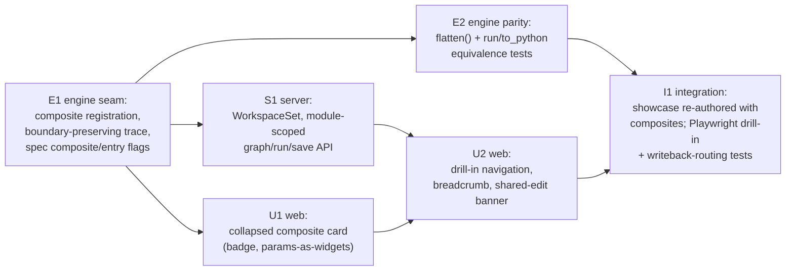

# ADR 0006 — Collapsible composite nodes (nodepack-internals hiding)

Status: **proposed — ready for review** (promoted from the deferred stub,
2026-07; design pass complete, all six open questions resolved with
recommendations below) · Scope: `graph-engine/` · Relates to: ADR 0001 (engine
core), ADR 0004 (graph ⟷ source bijection), ADR 0005 (node-declared UI),
ADR 0008 (sync — in parallel design), ADR 0009 (entry points — in parallel
design)

> Promotion note: the DEFERRED placeholder recorded the question and the
> leading direction. This revision resolves the open questions into concrete
> decisions (C1–C8), adds code sketches and a build plan, and lists the
> confirmations a human must sign off before implementation. **Do not
> implement until the FOR HUMAN REVIEW items below are confirmed.**

## Context — the question

When an example or client program **invokes a nodepack's functionality**, the
canvas currently shows *every internal node* of that functionality (the
showcase renders ~12 nodes because its render pipelines are authored as
separate node calls). A consumer shouldn't need to see a pack's internals —
they should be **hidden or collapsed by default, and expandable** on demand.

Today composites (`@graph`/`@main`) are **flattened**: `Composite.__call__`
under a trace runs its body so the child calls record into the parent's trace
(`engine/authoring.py`), and the resulting `Graph` contains only primitives.
There is no collapsed representation anywhere in the model, so the UI cannot
offer one.

## Decisions

### C1 — The collapsible unit is the `@graph` composite, not the nodepack

Unchanged from the stub, now a decision. A nodepack is a *namespace*
(`table.*`); a composite is a real **dataflow boundary** with defined inputs
(its parameters) and an output (its return). Collapse follows boundaries, not
namespaces. Nodepack-level *visual grouping* (tint/box all `table.*` nodes)
stays a possible later, purely cosmetic filter — it is out of scope here.

### C2 — Composites become registered node types; graph JSON stays flat per level

*(Resolves open question 3 — graph-model impact.)*

**Recommendation: nesting is *not* stored in the graph JSON. A composite
registers in the `NodeRegistry` like a primitive, and a collapsed composite is
just a node whose spec is flagged `composite`. The composite's internals are
reconstructed on demand from its own module's source — each level of nesting
is its own ADR 0004 bijection surface.**

Mechanics:

- `@graph`/`@main` gains registration: the decorator registers the composite
  function in the registry under its `module.qualname` id, exactly like
  `@node`. Its spec is derived by the same introspection (`node_spec`):
  inputs = the composite's parameters (defaults → widget values), one
  `result` output typed from the return annotation. The spec gains two
  additive fields: `"composite": true` and `"entry": <bool>`.
- The **parent graph JSON does not change shape**. A call
  `card = render_pipeline(...)` in a parent composite parses (ADR 0004 D4,
  `from_composite`) to an ordinary node `{id: "card", type:
  "pack.render_pipeline"}` — `_resolve_type` already resolves imported names
  through the registry, which now contains composites. No new JSON nesting
  construct, no schema restructuring; the schema bump is additive
  (`composite`/`entry` on the spec — minor version).
- **Expansion is a fetch, not a field.** The composite's own graph is obtained
  by parsing *its* module with the existing `from_composite` — recursion of
  machinery we already have (module + `.layout.json` sidecar per level).

Why not nested graph JSON (rejected): a recursive `nodes[].subgraph` would
duplicate the source of truth (ADR 0004 D2 says the module is canonical), have
to be kept in sync with the composite's `.py` on every edit from any parent,
and force every consumer (`bind`, `run`, layout, diffing) to grow recursion.
Reconstructing from source keeps one authority and zero new sync problems.

Why not pure view-layer reconstruction with *no* model change (rejected): the
UI would have to re-derive "which calls are composites" from imports itself,
and `bind`/`run` would still choke on an unregistered type. Registration is
the minimal model change that makes the boundary real everywhere at once.

### C3 — Boundary-preserving trace, with `flatten()` as the explicit inline op

*(The engine seam: what changes in `authoring.py`, and what `to_python`/`run`
keep doing.)*

- **Tracing preserves the boundary.** `Composite.__call__` under a trace
  records **one node** (same code path as `NodePrimitive.__call__`) instead of
  inlining its body. The traced *root* composite is unaffected — `trace()`
  invokes `composite.fn` directly, bypassing `__call__`, so the graph being
  built still expands its own body. Nested composite calls become single
  nodes. An explicit `composite.inline(...)` escape hatch keeps the old
  behaviour for callers that want it.
- **Execution needs no new machinery.** `run` invokes `entry.fn`
  (`engine/execute.py`); for a composite node that is the composite function
  itself, which — called outside a trace — executes its body eagerly
  (`Composite.__call__` already does exactly this). A collapsed composite node
  therefore runs as **one call**, and its `result` socket is the composite's
  return value. No recursion in the executor.
- **`flatten(graph)` is a new, explicit engine operation** that inlines every
  composite node into its internals (recursively), prefixing internal ids with
  the composite node's id (`card.parse_expr`) to keep ids unique. The flat
  `to_python` export of today is then `to_python(flatten(g))` — the derived
  compile target (ADR 0004 D1) is unchanged in spirit; only the default *graph*
  is no longer pre-flattened. `run(flatten(g))` must produce the same output
  as `run(g)` — this equivalence is the core engine test.

### C4 — The bijection per level (this is ADR 0004, applied recursively)

A collapsed composite node ⟷ a single call in the parent's source:

```python
# parent module (what the parent canvas is bijective with, ADR 0004)
from pack import render_pipeline

@main
def report(path: str = "data.csv"):
    card = render_pipeline(title="Q3", path=path)   # ⟷ ONE collapsed node "card"
    return card
```

```python
# pack module (what the drill-in canvas is bijective with — its own surface)
@graph
def render_pipeline(title: str = "Untitled", path: str = "data.csv") -> str:
    table = read_table(path)
    summary = table_summary(table)
    return render_card(title, summary)              # ⟷ three internal nodes
```

Collapse/expand is literally "call the function" vs "inline it" — both honest
Python views of the same computation, which is why this feature is natural
under ADR 0004 rather than in tension with it.

### C5 — Default state and expansion model

*(Resolves open questions 1 and 2.)*

**Default state — recommendation: the canvas always shows *one module's*
composite; everything imported renders collapsed.** The module you opened is
"the graph you're authoring" — its wiring is fully visible. Any composite it
*calls* (necessarily imported or locally defined elsewhere) is a single node.
This makes "collapsed for imported, expanded for authored" fall out of the
model rather than being a per-node toggle to persist: there is no
"expanded-in-place" state to store at all in v1.

**Expansion model — recommendation: drill-in, not inline growth.**
Double-click (or an "Open" affordance on the collapsed card) replaces the
canvas with the composite's own graph; a breadcrumb
(`report › render_pipeline`) navigates back. Rationale:

- Each level is a complete existing surface: its own module, its own
  `from_composite` parse, its own layout sidecar, its own auto-layout, its own
  inspector/source-editing. Drill-in **reuses `GraphView` unchanged** — the
  canvas still renders exactly one flat graph.
- Inline in-place expansion (ReactFlow group/subflow) forces nested layout,
  nested hit-testing, edge routing across the group border, and a persisted
  per-instance expanded state — a large UI investment that also muddies the
  "one canvas = one module = one bijection surface" story that makes C2 cheap.
- An inline **read-only "peek" preview** (hover/expand a thumbnail of the
  internals) is a good later affordance and is listed under deferred work; it
  does not change the model.

### C6 — Edits inside an expanded composite write to the composite's module

*(Resolves open question 4 — write-back routing.)*

Drill-in makes routing structural: the drilled-in canvas is a workspace over
the **composite's own module**, so wiring edits rewrite *that* file's
composite body (ADR 0004 D5 / A1 statement-level write-back, unchanged), its
layout goes to *that* module's sidecar, and node-body edits already route by
the spec's own module (`Workspace._file_for`). The parent's `.py` is only
touched when the parent-level call changes (arguments/wiring of the collapsed
node — edited from the parent canvas).

**Consequence to surface honestly: a composite is a shared definition.**
Editing inside `render_pipeline` changes it for **every** call site, exactly
like editing a `@node` body changes every node of that type today. The UI must
say so (the inspector's existing `sharedNodeCount` banner pattern, extended to
the drill-in header: "Editing pack.render_pipeline — used by N graphs").
Copy-on-expand (forking internals into the parent) was considered and
rejected: it silently destroys reuse and breaks the pack-consumer story.

### C7 — Widgets on collapsed nodes

*(Resolves open question 5.)*

**Recommendation: the composite's parameters surface as inputs with the same
widget rules as primitives — no new mechanism.** Widget inference and explicit
declaration reuse ADR 0005: `@graph(widgets={"title": Widget("text")})` mirrors
`@node(widgets=...)`, and literal arguments at the call site are the widget
values (already exactly how `from_composite` treats them). A parent-canvas
user edits a collapsed node's `title` like any other widget; the write-back is
a literal edit of the parent's call line. Pack authors curate the collapsed
surface simply by choosing the composite's signature — parameters *are* the
public interface.

### C8 — Composition with ADR 0008 (sync) and ADR 0009 (entry points)

*(Resolves open question 6. Both ADRs are in parallel design; this section is
the coordination contract, not their design.)*

- **Entry points are composites viewed from the top.** `@main` is already
  `@graph(entry=True)`; with C2 the registry carries `entry` on the spec, so
  an entry-point picker (ADR 0009) is a registry query, and "open an entry
  point" is the same operation as "drill into a composite" with an empty
  breadcrumb. One artifact, two doors — the ADRs share the composite registry
  and the drill-in navigation seam defined here, and must not invent parallel
  representations. If 0009 needs first-class *graph input ports* (parameters
  rendered as port nodes inside the drill-in view), that lands as an extension
  of C2's spec, not a competing model.
- **Sync (ADR 0008) attaches per module.** C2 deliberately keeps every level a
  self-contained module + sidecar, so whatever sync protocol 0008 defines for
  "one module's graph" applies unchanged at every nesting level; drill-in just
  changes *which* module the client is subscribed to.

## What does NOT change

- Graph JSON shape (nodes/edges/output) — only the *spec* gains additive
  fields. Existing graphs and golden snapshots stay valid.
- ADR 0004's projection, D5/A1 write-back, layout sidecars — applied per
  module, recursively.
- The flat `to_python` export semantics — now spelled `to_python(flatten(g))`.
- The dataflow-only subset (D7) — a composite body remains straight-line
  wiring; that is what makes it drillable at all.

## Code sketches (illustrative, not final)

### Engine — registration + boundary-preserving trace (`engine/authoring.py`)

```python
class Composite:
    def __init__(self, fn, *, entry=False, record=None):
        self.fn = fn
        self.entry = entry
        self.record = record            # RegisteredNode (id, spec) or None
        functools.update_wrapper(self, fn)

    def __call__(self, *args, **kwargs):
        state = _current()
        if state is None:
            return self.fn(*args, **kwargs)          # eager: run for real
        # Under a trace: record ONE node — the boundary is preserved.
        return _record_call(state, self.record, args, kwargs)  # shared with NodePrimitive

    def inline(self, *args, **kwargs):
        """Escape hatch: old behaviour — inline this composite into the trace."""
        return self.fn(*args, **kwargs)


def graph(fn=None, *, entry=False, widgets=None, registry=None):
    def wrap(target):
        reg = registry or DEFAULT_REGISTRY
        record = reg.register(target, widgets=widgets,
                              composite=True, entry=entry)  # spec: composite/entry flags
        return Composite(target, entry=entry, record=record)
    return wrap if fn is None else wrap(fn)
```

`trace()` is untouched: it calls `composite.fn` directly, so the root still
expands. `from_composite` needs **no change** — imported composite calls now
resolve through the registry like any node type.

### Engine — the explicit inline op (`engine/flatten.py`, new)

```python
def flatten(graph, registry=None, *, _prefix="") -> Graph:
    """Inline every composite node into its internals, recursively.

    Internal ids are namespaced by the composite node's id ("card.summary").
    Call-site literals/edges substitute into the internals' parameter uses;
    the composite's return wires to whatever consumed the collapsed node.
    run(flatten(g)) == run(g) — the parity test that anchors this ADR.
    """
```

### Server — module-scoped workspaces (`server/workspace.py`, `server/app.py`)

```python
class WorkspaceSet:
    """One Workspace per authoring module, created on first touch."""
    def for_module(self, module_name: str) -> Workspace: ...

# API deltas (all additive):
#   GET  /api/graph?module=pack.render_pipeline   (default: the root module)
#   PUT  /api/graph?module=...                    write-back routes per C6
#   POST /api/run?module=...                      run that module's composite
#   GET  /api/workspace                           gains modules[] + entry flags
# /api/source/{spec_id} already routes to the spec's own file — unchanged.
```

### Web — collapsed card + drill-in (`web/src`)

```tsx
// SpecNode.tsx: spec.composite → render the composite treatment
//   (badge, double border, "Open" affordance); params render as widget rows
//   exactly like a primitive's inputs (C7). No buildGraph/layout changes —
//   a collapsed composite is just a node.

// App.tsx: navigation stack instead of a single graph
const [stack, setStack] = useState<ModuleRef[]>([root]);   // breadcrumb trail
const current = stack[stack.length - 1];                    // module the canvas shows
// onNodeDoubleClick(node): if spec.composite → push({module: spec.module,
//   qualname: spec.qualname}); breadcrumb click → truncate stack.
// GraphView renders `current`'s graph — component unchanged.
```

## Build plan

Phasing is chosen so the engine seam lands (and is testable headlessly) before
any UI work, and the two UI phases can start against mocks in parallel.



- **E1 (engine seam, blocking):** decorator registration, `Composite.__call__`
  boundary recording + `.inline()`, additive spec fields + schema bump, bind
  and execute of composite nodes (no executor change expected — prove it).
- **E2 (parity, parallel after E1):** `flatten()`; property tests
  `run(g) == run(flatten(g))` and `to_python(flatten(g))` matches today's flat
  export for the existing examples.
- **S1 (server, parallel after E1):** `WorkspaceSet`, `?module=` on
  graph/run/save, workspace info payload. Write-back routing tests per C6.
- **U1 (web, parallel after E1 — can start on mocked specs):** composite card
  treatment; widgets on collapsed params.
- **U2 (web, after S1+U1):** drill-in stack + breadcrumb, shared-definition
  banner, Escape/back interactions.
- **I1 (integration):** re-author the showcase's render pipelines as two
  `@graph` composites (the motivating ~12-node canvas becomes ~4 nodes
  collapsed), Playwright coverage for drill-in, edit-inside-composite routing,
  and export parity.

Estimated shape: E1+E2 are the risk-bearing engine work; S1 is mechanical; U1
small; U2 is the main UI effort. No step requires touching ADR 0004's
write-back internals.

## Open confirmations (need a human decision before implementation)

1. **FOR HUMAN REVIEW (MAJOR) — C2 model choice:** composites register as node
   types; graph JSON stays flat per level; nesting is reconstructed from
   source on demand — vs. a nested-subgraph JSON representation.
   *(Recommend: registration + flat-per-level, as argued in C2.)*
2. **FOR HUMAN REVIEW (MAJOR) — C5 expansion model:** drill-in with breadcrumb
   as the only v1 expansion; inline in-place expansion (and any per-node
   expanded state) explicitly deferred. This is the user-facing shape of the
   feature. *(Recommend: drill-in.)*
3. **FOR HUMAN REVIEW (MAJOR) — C6 shared-definition edit semantics:** editing
   inside a drilled-in composite changes every call site (with a visible
   banner), and copy-on-expand is rejected. Pack consumers can therefore edit
   packs they use. If that is unacceptable, the alternative is read-only
   drill-in for out-of-workspace modules (the `allowed_roots` boundary already
   gives the enforcement point). *(Recommend: editable within `allowed_roots`,
   read-only outside — i.e. lean on the existing workspace boundary.)*
4. **FOR HUMAN REVIEW (MAJOR) — drill-in run semantics / parameter ports:**
   v1 drill-in shows the composite under its *default* parameterization
   (`from_composite` collapses parameter references to their literal defaults
   today), and Run inside a drill-in runs it standalone with those defaults —
   call-site arguments do **not** flow into the drilled-in view. First-class
   "parameter port" nodes that would fix this are deferred and coordinated
   with ADR 0009. Confirm this v1 limitation is acceptable.
5. **C3 default-trace flip:** nested composites record as one node *by
   default*, with `.inline()` as the escape hatch (a behaviour change for any
   existing `to_graph()` caller relying on flattening — the examples in-tree
   are updated in I1). *(Recommend: yes; the old default is exactly the
   problem this ADR exists to fix.)*
6. **C7 widget surface:** composite params get widgets by the same
   inference/declaration rules as `@node` params — no separate curation
   mechanism. *(Recommend: yes.)*
7. **C8 coordination contract** with ADR 0008/0009 as stated: shared composite
   registry + drill-in seam; sync attaches per module. *(Needs an ack from
   both parallel design efforts, not a decision here.)*

## Deferred (recorded, out of scope for this ADR's build)

- Inline read-only "peek" preview of a collapsed node's internals.
- Nodepack-level visual grouping/tinting (namespace cosmetics).
- Parameter-port nodes inside a drill-in view (with ADR 0009).
- Per-internal-node telemetry when a composite runs collapsed (v1 reports the
  composite as one call; a failure inside surfaces as the collapsed node's
  error with the inner traceback).
- Multi-output composites (a composite returning a dict of declared sockets).
