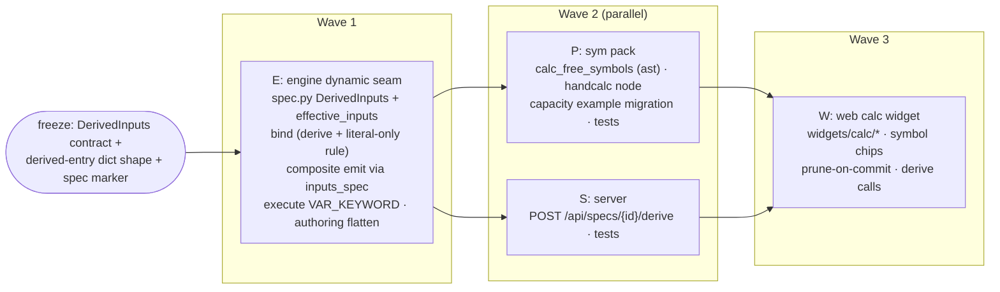

# ADR 0007 — Dynamic handcalc node (value-derived input sockets)

Status: **accepted** (2026-07) · Scope: `graph-engine/` · Relates to: ADR 0001
(engine core, spec seam), ADR 0004 (graph ⟷ source bijection), ADR 0005
(node-declared UI widgets), ADR 0006 (collapsible composites, deferred)

## Context

The capacity-check example already typesets a handcalcs card from wired graph
values, but the authoring experience is inside-out. The user must:

1. know in advance which symbols the equation uses,
2. build a `pack_values(force=..., capacity=...)` helper node whose only job is
   to bundle wired numbers into the `{symbol: number}` dict that
   `sym.typeset_calc(lines, values)` consumes
   (`examples/capacity_check/capacity_check.py`),
3. keep the helper's keys and the equation text in sync by hand — rename
   `F_max` in the equation and nothing tells you `pack_values` is now wrong
   until run time.

The feature: **edit the calculation directly in the UI** — type
`margin = C_min - F_max` or `E_k = 1/2*m*v**2` into the node — and have the
equation's **free symbols become the node's input sockets automatically**. Each
symbol socket is then either **wired from the graph** (exactly like the
capacity example wires the two CSV extremes) or **given an inline value**. Edit
the equation → the sockets update. The graph still runs, still renders the
typeset MathML card, still round-trips through the ADR 0004 bijection.

### The crux

`engine/spec.py` derives a node's inputs **statically from its Python function
signature**, once, at `@node` time. Everything downstream leans on that:
`bind()` validates edges/literals against `spec["inputs"]`; `to_composite`
emits arguments by walking `spec["inputs"]`; the web palette renders sockets
from `GET /api/specs`. A node whose sockets depend on one of its *values* (the
equation text) breaks the invariant **"spec is a function of the node type
alone"**. This ADR designs the smallest honest replacement:
**effective inputs = f(type, one designated literal)** — a *parametric* spec
with a single, engine-owned derivation seam — and contains the blast radius.

## Options considered

**(a) Parametric spec, server re-derives.** The node type declares a pure
deriver; the engine computes the instance's effective sockets from the equation
literal; the server exposes them to the UI. Real sockets → real edges → the
capacity wiring works. Cost: the spec layer, bind, emit, execute, and trace all
learn about derived inputs.

**(b) Static spec + smart widget (no new sockets).** Keep
`typeset_calc(lines, values)` exactly as is; a rich widget on `values`
auto-derives per-symbol *fields* inside the dict editor. Zero engine change —
but the symbols are fields of one dict literal, **not sockets**, so a symbol
cannot be wired from an upstream node individually. The whole `values` dict can
be wired (that is today's `pack_values` status quo), which is precisely what
the feature must remove. **Fails the requirement.**

**(c) Hybrid: derived symbols are real sockets, each wired *or* inline-valued.**
(a)'s mechanics with the socket-level UX made explicit: every derived socket
behaves like any other unwired-input-with-widget (ADR 0005 A-D4) — wire it, or
type a number in place. There is no auto-matching magic in v1 (a socket is
never silently wired because an upstream happens to share the name; that is
deferred UI sugar, offered as a suggestion at most).

**Decision: (c)** — which is (a)'s dynamic-spec model plus ADR 0005's existing
wire-or-widget behaviour per socket. (b) is rejected because graph wiring of
individual symbols is the point of the feature; a values-dict widget is a
cosmetic wrapper over the problem.

---

## D1 — The dynamic-spec seam: `@node(dynamic=DerivedInputs(...))`

A node type may declare that **extra input sockets are derived from the value
of exactly one literal parameter**:

```python
# engine/spec.py (new, pure stdlib)
@dataclass(frozen=True)
class DerivedInputs:
    """Extra input sockets derived from one literal parameter's value.

    param   -- the static input whose *value* drives derivation (e.g. "lines").
               Must name a declared parameter; bind requires it to be a
               literal, never wired (D2).
    derive  -- pure function: value -> ordered list of input-spec entries
               (same dict shape as spec["inputs"], plus "derived": True).
               Contract: deterministic, no I/O, no exec of the value, cheap
               (it runs at bind time and per keystroke via the derive
               endpoint). Raises UserError on an invalid value.
    """
    param: str
    derive: Callable[[Any], list[dict]]
```

Threaded like `outputs=` / `widgets=`: `node(dynamic=...)` →
`registry.register(dynamic=...)` → `node_spec(dynamic=...)`. The **callable**
lives on `RegisteredNode` (a new `dynamic: DerivedInputs | None` field) — never
in the JSON spec. The JSON spec gains only an additive marker:

```jsonc
// node spec (GET /api/specs) — static, unchanged shape, one new optional field
{ "id": "sym.handcalc", ...,
  "inputs": [ { "name": "lines", ... }, { "name": "precision", ... } ],
  "dynamicInputs": { "param": "lines" } }
```

**Signature rule amendment.** `node_spec` today rejects `*args`/`**kwargs`
("cannot be named input sockets"). Amended: a node **with** a `dynamic=`
declaration must have a `**kwargs` receptacle (the derived values arrive as
keyword arguments); `*args` stays rejected always, and `**kwargs` stays
rejected for non-dynamic nodes. The `**kwargs` parameter itself is *not* an
input socket — the derived entries are. Validated at import time, like every
other spec error.

**Effective inputs** (one helper, one definition, three consumers):

```python
# engine/spec.py
def effective_inputs(spec: dict, dynamic: DerivedInputs | None,
                     literals: dict) -> list[dict]:
    """spec["inputs"] + derived entries from literals[dynamic.param].

    Derived entries are keyword-only, ordered as the deriver returned them,
    and rejected if any name collides with a static input.
    """
```

Consumers: `bind()` (validation), `to_composite`/`wiring_lines` (emission, via
`BoundNode`), and the server's derive endpoint (D4). `BoundNode` grows an
`inputs_spec` field computed once in bind pass 1, so emit and execute never
re-derive.

### Containment (what keeps this from infecting the model)

- **One deriving param per node type**, declared explicitly. No node computes
  its sockets from "its inputs" in general — from *one literal*.
- The deriver is a **pure stdlib function of the value** — it never executes
  the equation (that stays exclusively in the node body at run time, ADR 0003
  trust posture unchanged) and never imports heavy deps (D3's deriver is an
  `ast` parse; sympy is *not* in the derive path).
- **`bind` remains the single choke point** (ADR 0001): derivation happens in
  bind pass 1; a deriver failure is a `BindError` carrying the node id, raised
  before anything executes — same guarantee as every other structural error.
- The **static spec remains the palette**: `GET /api/specs` is unchanged in
  meaning; `dynamicInputs` is additive (no schema-version bump, per ADR 0001
  D7 additive-field policy; `freeze_schemas.py` snapshot updated additively).
- The **graph JSON is unchanged**: derived sockets are *never stored* — they
  are recomputed from the `lines` literal wherever needed. No drift possible
  between "stored sockets" and the equation, because there is no store.

## D2 — The deriving param must be a literal (never wired)

If `lines` could arrive on a wire, the node's socket set would be unknowable
until upstream execution — `bind`, `to_composite`, and the canvas would all
have to run the graph to know its own shape. Rejected outright:
`bind` raises `BindError("the deriving input 'lines' of a dynamic node must be
a widget literal, not wired")` when an edge targets the deriving param. The
equation is a **widget value, period** — the same status as the sympy string
(ADR 0005 Part B) and the table recipe (Part C). This is the honesty line that
keeps the graph statically bindable and the bijection total.

## D3 — Free-symbol derivation (the `sym` deriver)

`lines` is one or more Python assignment statements — handcalcs executes it as
Python — so **`ast.parse` is the parser**, stdlib-only, no sympy:

```python
# nodepacks/sym/__init__.py (module-level helper; stdlib only, cheap)
def calc_free_symbols(lines: str) -> list[dict]:
    """Free names of the calc, in first-appearance order, as input entries.

    - Parse ``lines`` with ast.parse (SyntaxError -> UserError naming line).
    - Walk statements in order; a Name loaded before any assignment to it is
      free; a Name assigned earlier (an LHS) is a local result, not an input.
      Multi-line: ``d = v*t`` then ``E = m*d`` derives {v, t, m}, not d.
    - Excluded: Python builtins (abs, min, round, ...) and the small math
      whitelist the node pre-binds (sqrt, sin, cos, tan, log, exp, pi) — they
      typeset fine and must not become sockets.
    - A derived name colliding with a static param (lines, precision) ->
      UserError("rename the symbol ...").
    - Only ast.Assign with a single Name target per statement is accepted
      (mirrors handcalcs' own expectations); anything else -> UserError.
    """
    # returns e.g. [{"name": "C_min", "type": "float", "kind": "keywordOnly",
    #               "required": True, "default": None,
    #               "widget": {"kind": "number", "subtype": "float"},
    #               "derived": True}, ...]
```

Decisions inside this:

- **Ordering = first appearance in the text.** Deterministic, human-matching,
  and stable under emit (D5's canonical kwarg order).
- **Derived sockets are `required`, keyword-only, typed `float`** with the
  standard `number` widget. Required because a silent default of `0` would
  typeset confidently wrong cards; the user must wire or type each symbol
  (bind pass 3 enforces, unchanged). Non-numeric symbol values (a wired sympy
  object, a unit-carrying quantity) still flow — `float` is the widget hint,
  `bind` does not type-check wires today and this ADR does not change that.
- **Invalid identifiers can't occur** (`ast.parse` enforces Python names);
  unicode identifiers are allowed because Python allows them.
- **LHS names do not become output sockets** in v1 — outputs stay static
  (`latex`, `results`; the `results` dict already carries every computed
  variable). Per-LHS derived *output* sockets are a symmetric future step,
  deferred (open confirmation 8).

## D4 — Server: one derive endpoint, Python authoritative

The UI must know the socket list *before* saving (sockets appear as you type).
Two ways: duplicate the parser in JS, or ask Python. ADR 0005 A-D5 already
settled this pattern — **Python is authoritative, one implementation**:

```
POST /api/specs/{spec_id}/derive        body: {"value": "margin = C_min - F_max"}
  200 -> {"inputs": [ ...derived entries... ]}
  422 -> {"errors": [{"code": "UserError", "message": "line 1: ..."}]}
  404 -> spec unknown or not dynamic
```

Stateless, registry-only (no workspace required), dispatches to
`entry.dynamic.derive`. The calc widget calls it debounced (~300 ms) while
typing to preview the pending sockets, and the canvas calls it (cacheable by
`(spec_id, value)`) when rendering a dynamic node instance. The graph JSON
stays a **pure projection** of the module (ADR 0004 D2) — the server does not
annotate the served graph with derived sockets; the client resolves them
through this endpoint. *(Alternative — enrich `GET /api/graph` nodes with a
`derivedInputs` projection — rejected: it muddies "graph JSON = projection of
the module" with server-computed view state.)*

There are exactly **two call sites** of derivation (bind, this endpoint) and
**one implementation** (the pack's deriver via `effective_inputs`).

## D5 — Bijection round-trip (ADR 0004 kept intact)

### The source form

Derived sockets serialize as **ordinary keyword arguments** on the node's
wiring line — wired symbols are references, unwired symbols are literals:

```python
# emitted by to_composite / written by PUT /api/graph (statement-level, A1)
steps = handcalc(lines='margin = C_min - F_max',
                 C_min=min_capacity['value'], F_max=max_force['value'])
```

and the E_k flavour with one wired, one inline symbol:

```python
steps = handcalc(lines='E_k = 1/2*m*v**2', m=2.0, v=picked['result'])
```

D3 (node id = variable name) and D7 (straight-line dataflow) are untouched:
still one single-assignment call per node, arguments still only references or
literals. The equation is one more string literal; the symbols are one more
set of kwargs. **The wiring line is self-describing** — a reader (or `git
diff`) sees the equation and its feeds in one statement, with no `pack_values`
indirection.

### `from_composite` (source → graph): no change required

`_parse_assignment` already maps positional args through the static spec and
passes **any keyword through by name** — references become pending edges,
literals become widget values — and defers legality to `bind`. `C_min=...` is
not in the static input list, so today bind rejects it; with D1, bind derives
the effective inputs from the `lines` literal *in the same graph node* and
accepts it. Parse-time behaviour is byte-for-byte identical.

### `to_composite` / `wiring_lines` (graph → source): one substitution

`_arg_exprs` iterates `bound.spec["inputs"]`; it now iterates
`bound.inputs_spec` (the effective list from bind). Derived entries are
keyword-only, so they emit as `name=value` after the static params, in deriver
(= appearance) order — canonical and deterministic. Statement-level write-back
(ADR 0004 A1) is unaffected: statements compare by parsed meaning, so a save
that doesn't change the equation or its feeds is still a no-op.

### Round-trip proof obligation

`from_composite(to_composite(g)) == g` for a graph containing a dynamic node
with (i) all symbols wired, (ii) mixed wired/inline, (iii) a multi-line calc —
added to the existing bijection tests. The equation literal round-trips
char-for-char (same status as the sympy string, ADR 0005 honesty table).

## D6 — Execution and tracing (two contained fixes)

- **`engine/execute.py`** — `_invoke` passes only names matching declared
  params, so derived kwargs would be silently dropped. Fix: when the callable
  has a `VAR_KEYWORD` param, pass every remaining `provided` entry through it.
  (~4 lines.)
- **`engine/authoring.py`** — under trace, `bind_partial` folds
  `C_min=<NodeHandle>` into `bound.arguments["symbols"]` as a *dict*, and a
  handle inside a dict never becomes an edge (the very reason `pack_values`
  exists today). Fix: in `NodePrimitive.__call__`, flatten the `VAR_KEYWORD`
  entry into per-name literals/edges. This makes the programmatic-tracing path
  agree with the AST-parse path — the capacity example's `@main` keeps working
  through both.

## D7 — The node: `sym.handcalc`

```python
# nodepacks/sym/__init__.py — supersedes pack_values + typeset_calc in examples
@node(
    outputs=["latex", "results"],
    widgets={"lines": Widget("calc", language="python-calc", multiline=True)},
    dynamic=DerivedInputs(param="lines", derive=calc_free_symbols),
)
def handcalc(lines: str = "", precision: int = 3, **symbols) -> dict:
    """Typeset calculation ``lines`` with the symbol sockets substituted.

    Each free symbol of ``lines`` is an input socket (wire it or give it a
    value). ``lines`` is executed as Python at run time, exactly like
    typeset_calc — same trust posture (ADR 0003). A small math whitelist
    (sqrt, sin, cos, tan, log, exp, pi) is pre-bound and never a socket.
    """
    values = {**_MATH_WHITELIST, **symbols}
    return typeset_calc(lines, values=values, precision=precision)
```

`typeset_calc` **stays** (ordinary callable first, node second — `handcalc`
calls it eagerly; it also remains the right node when a `values` dict is
computed by an upstream node). `pack_values` is deleted from the capacity
example, whose wiring collapses to:

```python
steps = handcalc(lines='margin = C_min - F_max',
                 C_min=min_capacity.value, F_max=max_force.value)
mathml = latex_to_mathml(steps.latex)
```

The downstream render pipeline (`latex_to_mathml` → `render_math_card`) is
unchanged; hiding *that* noise is ADR 0006's collapsible-composite question,
not this one.

## D8 — The UI (node-declared, per ADR 0005)

Widget kind **`"calc"`** (new; `"math"` stays the single-expression sympy
editor — different value language, different editor, per A-D6 "a breaking
config change is a new kind"). Registered lazily like `math`; unknown-kind
fallback applies.

The calc editor (inside the standard `WidgetSlot`, props unchanged from
A-D4):

- **multiline monospace input** for the assignment lines;
- **live symbol chips**: debounced `POST /api/specs/sym.handcalc/derive` on
  the draft text shows the pending socket list (added symbols highlighted,
  removed symbols struck through with "will unwire" when currently wired) —
  Python is the only parser (D4);
- **commit on blur/Cmd-Enter** → standard widget path: literal into
  `graph.nodes[id].inputs.lines` → `PUT /api/graph` → wiring-line rewrite.
  Sockets change **on commit, not per keystroke** — edges must never flicker
  under a half-typed equation;
- **per-symbol rows on the node**: each derived socket renders exactly like
  any unwired-input-with-widget today — wired shows the source chip, unwired
  shows the inline `number` editor. Derived sockets get a subtle visual mark
  (they came from the equation);
- **typeset preview**: after a run, the node shows the rendered card
  (`latex`/`results` are already in the run outputs; `web/src/preview.ts`
  seam). Typeset-as-you-type (client-side KaTeX of the *symbolic* form) is a
  deferred nicety — v1 previews symbols instantly and typesetting after run.

**Dangling edges on equation edit**: removing a symbol that is wired would
make the save fail bind (edge into an unknown input — correct and unchanged).
The client therefore **prunes edges to removed symbols in the same commit**
and toasts what it unwired ("F_old removed from equation — unwired from
select_extreme_2"). Renaming a symbol is remove+add (wire dropped, toast
says so); rename-detection heuristics are deferred.

Monaco source editing composes for free: edit the wiring line's kwargs or the
equation string in the source editor → reparse → same graph; edit the
`handcalc` *body* via `PUT /api/source/sym.handcalc` → re-introspect → specs
refetch (existing flow).

---

## Bijectivity / honesty analysis

| Bijective (identity round-trip) | Deliberately excluded / lossy / by design |
|---|---|
| equation string ⟷ the `lines` literal, char-for-char | the **derived socket list** — computed state, *never serialized* anywhere (graph JSON, sidecar, or source); recomputed from the literal on every consumer |
| each derived symbol's feed ⟷ one kwarg on the wiring line (reference = edge, literal = widget value) | **kwarg order** on a hand-written line — normalized to appearance order when (and only when) that statement is rewritten (ADR 0004 A1 scope) |
| symbol set ⟷ free names of the equation (one parser, Python-side) | a **wired deriving param** — unrepresentable by design (D2); the equation is always a literal |
| | **mathematical meaning** — `1/2*m*v**2` vs `m*v**2/2` are different literals; no canonicalization (same stance as ADR 0005 math) |
| | the typeset card — a run output (a view), not graph state |

The real departure, stated plainly: **spec is no longer a function of the node
type alone** — for dynamic nodes it is a function of (type, one literal). What
breaks and how it's contained:

- *"The spec you fetched is the node you see"* — no longer true for dynamic
  nodes; the canvas must consult the derive endpoint per instance. Contained:
  the static spec still renders (deriving param + static inputs) even if
  derivation fails; a derive failure badges the node with the error and keeps
  existing wires on screen rather than dropping them.
- *bind totality* — unchanged: derivation runs inside bind, failures are
  `BindError`s before execution, and the deriver contract (pure, no exec,
  stdlib) keeps bind cheap and side-effect-free.
- *emit totality* — `to_composite` needs effective inputs, which need the
  deriver; a graph whose dynamic node has an unparseable equation cannot emit.
  Acceptable: it cannot *bind* either, and the source that produced it still
  exists (the module is the source of truth, D2 of ADR 0004 — emit is only
  invoked on save, which requires a valid graph).
- *one more registry of behaviour* — no: the deriver rides the existing
  `RegisteredNode`, and there is exactly one derivation implementation with
  two callers.

## Risks

- **Deriver drift between UI and engine** — impossible by construction (single
  Python implementation; JS never parses). Latency cost: one debounced POST
  per edit — fine at demo scale.
- **Socket churn eats wires** — mitigated by commit-time (not keystroke)
  socket updates, the strike-through preview, and the prune-with-toast rule.
  Undo is the module file's history until Phase 6 VCS.
- **Whitelist creep** (math names that shouldn't be sockets) — the whitelist
  is small, documented in the node docstring, and additive; a name outside it
  simply becomes a socket, which is visible, not silent.
- **A second dynamic node** will want a different deriver shape (e.g. recipe
  columns). `DerivedInputs` is deliberately value→entries generic; if a second
  consumer strains it, that is the moment to generalize — not before.
- **`**kwargs` loophole** — dynamic nodes reopen a door `node_spec` closed.
  Contained: allowed only with `dynamic=`, the receptacle is never a socket,
  and non-dynamic packs are unaffected.
- **Equation is exec'd at run** — unchanged from `typeset_calc` (ADR 0003
  posture); derivation itself never execs. Cap `lines` length at derive to
  bound parse cost.

## Sequencing — minimum lovable version and streams

**MLV:** `sym.handcalc` with auto-derived, wire-or-value sockets; the capacity
example rewritten without `pack_values`; calc widget with live symbol chips;
round-trip + writeback tests green. **Deferred:** per-LHS output sockets,
typeset-as-you-type, rename detection, auto-wire-by-name suggestions,
unit-aware socket types, MathLive.



| Stream | Owns (writes) | Must not touch |
|---|---|---|
| **E** | `engine/spec.py`, `engine/registry.py`, `engine/bind.py`, `engine/composite.py`, `engine/execute.py`, `engine/authoring.py`, `engine/schema.py` (additive marker), engine tests, `freeze_schemas.py` snapshot | `nodepacks/*`, `server/*`, `web/*` |
| **P** | `nodepacks/sym/__init__.py`, `examples/capacity_check/*`, `tests/test_nodepacks_sym.py`, `tests/test_capacity_check_*` | `engine/*`, `web/*` |
| **S** | `server/app.py` (one route), server tests | `engine/*` beyond public API, `web/*` |
| **W** | `web/src/widgets/calc/*` (new), one registration line in `web/src/widgets/index.ts` | `SpecNode.tsx` beyond the existing `WidgetSlot` seam, `registry.ts` core |

Freeze before wave 2: the `DerivedInputs` contract, the derived-entry dict
shape (`{name, type, kind: "keywordOnly", required, default, widget,
derived: true}`), and the `dynamicInputs` spec marker. S and P are disjoint;
W merges one registration line (same shape as ADR 0005's B/C-ui streams).

## Consequences

- `engine/spec.py` gains `DerivedInputs` + `effective_inputs`; `**kwargs`
  legal only on dynamic nodes; spec gains additive `dynamicInputs` marker.
- `bind` derives effective inputs (pass 1), enforces literal-only deriving
  param; `BoundNode` gains `inputs_spec`; emit and execute consume it.
- New endpoint `POST /api/specs/{spec_id}/derive`; graph JSON and
  `GET /api/specs` semantics unchanged.
- `sym.handcalc` (new) + `calc_free_symbols`; `typeset_calc` retained;
  `pack_values` removed from the capacity example.
- New `web/src/widgets/calc/` chunk; no other web-core changes.
- Engine stays pure stdlib; nothing new is serialized into graph or source
  beyond ordinary literals and kwargs.

## Open confirmations — RESOLVED

**Accepted (2026-07): all as recommended EXCEPT #5, amended below.** #5 was
changed to inherit Python's own required/optional semantics rather than a flat
"always required" rule: a derived socket is satisfied by a wire **or** an inline
value; **no default + unsatisfied → required → bind fails loudly** (the default
for a freshly-typed symbol), while **a default makes the symbol optional** — it
binds unsatisfied and uses the default. So the loud-failure property Fable
wanted is the *default behaviour*, and optionality is opt-in via a per-symbol
default (`has-a-default ⇒ optional`, exactly as in Python — where a default may
sit on a positional *or* keyword parameter; required-vs-optional is the presence
of a default, not the positional/keyword axis). No silent `0`.

1. **Model = hybrid dynamic sockets (option c)** — real derived sockets,
   each wired or inline-valued — vs widget-only (b) or bare parametric (a).
   *(Recommend: c — b cannot wire individual symbols, which the capacity
   example requires; c is a's mechanics plus the existing ADR 0005 per-socket
   behaviour.)*
2. **Deriving param must be a literal, never wired** (D2), enforced in bind.
   *(Recommend: yes — the alternative makes the graph's own shape
   run-time-dependent and the bijection partial.)*
3. **New `sym.handcalc` node with `**symbols`; keep `typeset_calc`** — vs
   mutating `typeset_calc` in place. *(Recommend: new node — `typeset_calc`
   remains correct for computed values-dicts and for composition; examples
   migrate to `handcalc`.)*
4. **Derivation = stdlib `ast` parse** (free names minus earlier LHS, minus
   builtins + a small math whitelist, first-appearance order) — vs sympy
   `free_symbols`. *(Recommend: ast — the calc is Python (handcalcs execs
   it), the deriver stays stdlib/cheap enough for bind + keystroke use, and
   sympy stays out of the derive path.)*
5. **Derived sockets inherit Python required/optional semantics**, keyword-only,
   `float`-hinted with a `number` widget: a socket satisfied by neither a wire
   nor an inline value **and with no default is required → bind fails loudly**
   (naming the symbol); a socket **with a default is optional** → binds
   unsatisfied and uses the default. A freshly-typed symbol defaults to
   **required** (no silent `0`). *(ACCEPTED as amended — the loud failure is the
   default; optionality is opt-in via a per-symbol default, mirroring Python.)*
6. **UI derives sockets via `POST /api/specs/{id}/derive`** (Python
   authoritative, debounced) — vs a duplicate JS parser. *(Recommend:
   endpoint — one implementation, per ADR 0005 A-D5; a JS parser is the
   two-implementations treadmill.)*
7. **Sockets update on commit; client prunes edges to removed symbols in the
   same save, with a toast** — vs hard-failing the save on dangling edges.
   *(Recommend: prune + toast — bind's hard error stays as the backstop for
   non-UI callers.)*
8. **Outputs stay static in v1** (`latex`, `results`) — per-LHS derived
   *output* sockets deferred. *(Recommend: defer — `results` already carries
   every computed variable; symmetric derived outputs can reuse this seam
   later.)*
