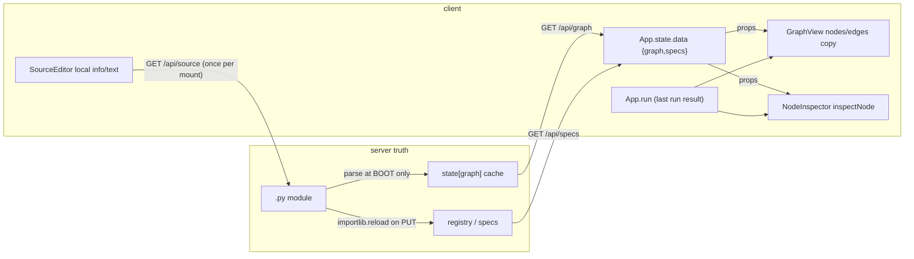

# ADR 0008 — Frontend sync model (one truth, one store, live views)

Status: **proposed** · Scope: `graph-engine/web` + the server seams it reads/writes ·
Relates to: ADR 0002 (HTTP API), ADR 0004 (graph ⟷ source bijection),
ADR 0005 (widgets, the A-D5 commit seam), ADR 0007 (dynamic handcalc)

> **Amended 2026-07-23 — store mechanism re-decided.** Open confirmation 2
> originally recommended Zustand. After pushback ("React ships state updates;
> prefer the simplest React-default pattern we can easily enforce and check, if
> one genuinely suffices"), the mechanism was re-compared on the merits and the
> recommendation is now **`useSyncExternalStore` over a hand-rolled vanilla
> store — zero dependencies** (§ The store, Open confirmation 2). Everything
> else in this ADR — the diagnosis, the normalized single-source-of-truth
> model, seq-gated ingestion, the single-flight write queue, the phased plan —
> stands unchanged.

## Context

A user edits a node in the UI. The backend `.py` updates (via
`PUT /api/source/{id}` or `PUT /api/graph`) — but the frontend does not
consistently reflect the write: the node's card on the canvas keeps showing the
original content, and re-opening the node's inspector/preview shows the old
values. The suspicion: the client renders **cached snapshots** rather than
reactively deriving every view from one source of truth.

This ADR does two things: (1) it **diagnoses** the actual reconciliation gaps
in the current code, surface by surface and write path by write path, and
(2) it designs the sync model that keeps the three conceptual layers —
**Python source (server truth)** → **graph/spec projection** → **every UI
view** — consistent and live, without full-page reloads and without
O(graph) refetches per keystroke.

## Part 1 — Diagnosis: where the current architecture drops writes

### How data flows today (as implemented)



Concretely, in `web/src/App.tsx`:

- `state.data` (`{version, specs, graph}`) is loaded by `reload()` /
  `reload({quiet: true})` → `fetchLiveGraph()` = **two** GETs (`/api/specs` +
  `/api/graph`), always both.
- `run` (the last `POST /api/run` result) is separate state, set by the Run
  button, cleared only by the user (close/Escape) or a transport error.
- Widget commits go through `makeGraphCommitter` (`widgets/context.tsx`): a
  per-committer serialized queue that, per commit, does
  `GET /api/specs + /api/graph` (rebase) → patch one literal →
  `PUT /api/graph` → `onSaved` → `reload({quiet: true})` → **again**
  `GET /api/specs + /api/graph`. The `PUT` response — which already carries
  the re-served, round-trip-proven graph — is **discarded**.
- Source saves (`components/SourceEditor.tsx`) do `PUT /api/source/{id}` →
  `onSaved` → `reload({quiet: true})`. The response — which already carries
  the fresh `spec` and the new source — is used only inside the editor;
  App refetches everything anyway.
- `GraphView.tsx` seeds ReactFlow state once (`useNodesState(initialNodes)`)
  and reconciles later `graph`/`specs` prop changes via a `structureKey`
  effect: same topology → patch node `data` in place (explicitly **preserving**
  `n.data.result` / `n.data.hasError`, i.e. the old run's values); topology
  change → reseed + re-layout.
- On the server (`server/app.py`), `GET /api/graph` serves a one-slot cache
  `state["graph"]`, filled **once at boot** (`workspace.parse_graph()`) and
  refreshed **only** by `PUT /api/graph`. `PUT /api/source/{id}` rewrites the
  `.py` and reloads the module/registry — but never re-projects
  `state["graph"]`; it only re-*binds* the stale cached graph to report
  `graphErrors`.

### The reconciliation gaps, pinpointed

**Gap G1 — run-derived values are never invalidated (the reported bug).**
Nothing ties `App.run` to the write paths. After a source save or a widget
commit, `run` survives unchanged; `GraphView`'s patch path deliberately keeps
`n.data.result`, and `inspectNode()` keeps mapping the stale `runOutputs` onto
the (fresh) graph. Every surface that shows *values* — the result chips on the
canvas card, the inspector's input/output value lines, the run-results panel —
keeps showing what the **pre-edit** code computed. This exactly reproduces the
report: edit a node's source (say, change what `render` emits), save, and the
node card and re-opened inspector still show the original text — because that
text is the old run's output, rendered as if it still described the current
graph. Worse, the views mix epochs: `inspectNode` shows a *fresh* literal as
that input's "run value" (`run = {value: bound[name]}` whenever `runOutputs`
is non-null) next to *stale* wired values from the old run, and
`RunResultsPanel` counts "N of M nodes" with N from the old run and M from the
new graph.

**Gap G2 — the quiet-reload response race can stick a stale graph.**
`reload({quiet})` accepts whichever `fetchLiveGraph()` response lands last —
there is no request sequencing. Each widget commit fires its own quiet reload,
and the committer's own rebase GETs interleave with them. Two rapid commits →
two overlapping reloads; if the older response resolves last (ordinary HTTP
concurrency), `setState` overwrites the newer graph with the older one — the
canvas shows the *first* value again, the file holds the *second*, and nothing
ever refetches to repair it until the next user action. This is the second
face of "the card still shows the original", and it is a stuck-stale, not a
flicker.

**Gap G3 — server truth gap: `PUT /api/source` never re-projects the graph.**
ADR 0004 D2 says "code edits **reparse** to the graph". The server does not:
`state["graph"]` stays the boot-time parse. Today this is *coincidentally*
benign for `@node` body edits (they don't touch `@main`'s wiring), but it is a
landmine: any source edit that changes the projection — an `@main` edit once
Monaco grows beyond node bodies, a handcalc equation literal (ADR 0007), an
**external IDE edit** to the `.py` — leaves `GET /api/graph` serving a stale
projection *even across a browser F5*. Only a server restart re-parses. The
client's "refresh after save" reads a cache believing it read truth.

**Gap G4 — PUT responses discarded; O(graph) over-fetch per edit.**
Every widget commit costs **five** requests (GET specs + GET graph rebase, PUT
graph, GET specs + GET graph reload) although the PUT response already returns
the authoritative graph and specs almost never change on that path. Debounced
editors (the math widget commits per change) turn typing into a stream of
full-graph round trips — each one also a server-side module rewrite + reload.
Latency window: after "Done", the chip renders the *old* literal until the
second round trip lands. This violates the "no O(graph) refetch on every
keystroke" requirement and widens G2's race window.

**Gap G5 — per-view fetch-once caches.** `SourceEditor` fetches
`GET /api/source/{id}` once per mount (keyed on `[specId]`) into local
`info`/`text` state. Re-opening refetches (so *this* path is fresh), but an
editor kept open is never told the file changed underneath it — a widget
commit rewrites the same module's wiring lines, shifting the displayed
`path · lines N–M` and leaving Monaco (in flight) editing a buffer whose
on-disk basis moved. `BranchBadge` similarly fetches `/api/workspace` once per
session. These are exactly the "per-view cached snapshot" pattern suspected.

**Gap G6 — shape changes half-propagate.** A write that changes a node's
*shape* — a source save that alters the signature, or (in flight) a handcalc
equation edit whose free symbols are the sockets (ADR 0007) — reaches the card
as new socket rows (the spec object identity changes, so the data patch
applies), but `structureKey` covers only node ids + edge ids: the patch path
keeps the old measured geometry and never re-lays-out or re-frames, so grown
cards overlap and handles sit at stale offsets until an unrelated topology
change re-seeds everything.

**Gap G7 — a failed quiet refresh unmounts the workspace.** `reload({quiet})`
on a transient fetch failure sets `{status: 'error'}` — the entire canvas (and
the open editor the quiet mode exists to protect) is torn down into a
full-screen error, after a save that in fact *succeeded*.

### Diagnosis table — surface × write path

Write paths: **W** = widget commit (`PUT /api/graph` via committer),
**S** = source save (`PUT /api/source/{id}`), **X** = external `.py` edit
(IDE; no client path today).

| Surface | W: widget commit | S: source save | X: external edit |
|---|---|---|---|
| Canvas card — title/doc/socket rows (spec) | updates (after 2nd round trip; over-fetch G4) | updates via quiet reload; **geometry stale on shape change (G6)**; can stick stale via race (G2) | **stale forever (G3)** |
| Canvas card — literal chips (`boundInputs`) | updates late (chip shows old value until reload lands, G4); race can revert it (G2) | n/a (unchanged) | **stale forever (G3)** |
| Canvas card — result chips (run values) | **stale (G1)** — old run kept deliberately | **stale (G1)** — the reported symptom | **stale (G1 + G3)** |
| Node inspector — structure rows (source tags, types) | updates (derived from props) | updates | **stale forever (G3)** |
| Node inspector — value lines (run/preview) | **mixed epochs (G1)**: fresh literal shown as "run value" beside stale wired values | **stale (G1)** — re-opened inspector still shows old outputs | **stale** |
| Source editor (open) | file `path · lines` label stale; buffer basis shifts silently (G5) | fresh (uses own PUT response); App still refetches (G4) | **stale until remount (G5)** |
| Source editor (re-opened) | fresh (refetch on mount) | fresh | fresh text — but specs/graph around it stale (G3) |
| Widget chips/editors (open editor) | editor holds local draft; commit stream = O(graph) round trips (G4) | shape change under an open editor not handled (G6) | stale |
| Run-results panel | **stale run × fresh graph mix (G1)** | **stale mix (G1)** | stale |
| Topbar output label / BranchBadge | updates / session-static (G5) | updates / session-static | stale / stale |

The through-line: **there is no single client store and no epoch discipline.**
`App.state.data`, `App.run`, ReactFlow's node-data copies, and each panel's
local fetch results are four caches with hand-maintained, incomplete
invalidation edges between them — and the server itself holds a fifth
(`state["graph"]`) that `PUT /api/source` forgets to refresh.

## Part 2 — The sync model

### Principles

1. **Server truth, one client projection.** The `.py` (through its parse) is
   authoritative — ADR 0004 D2 stands. The client holds exactly **one**
   normalized reactive store; every view derives from it via selectors. No
   view fetches for itself; no view keeps a private copy of shared state.
2. **Writes return truth; reads don't repeat it.** Every PUT already responds
   with the re-served state (`PUT /api/graph` → `{graph}`; `PUT /api/source` →
   `{spec, source…}`). The store ingests the response; the write path performs
   **zero** follow-up GETs. GETs happen at boot, on explicit refresh, and on
   push events — nowhere else.
3. **Epochs are explicit.** Authoritative state carries a monotone revision.
   Run results are stamped with the revision they executed; any surface
   rendering run-derived values compares stamps and renders "stale" honestly
   instead of mixing epochs.
4. **Optimistic is an overlay, never a mutation.** Pending writes live beside
   the authoritative state, are composed at derivation time, and are dropped
   the moment the server confirms or rejects — so no view can show a rejected
   value for longer than the in-flight window, and none can get stuck stale.

### The store — mechanism (revised 2026-07-23)

The original draft recommended Zustand here. The pushback — *"isn't some
version of state updates built into React from the beginning? If there's a
React default pattern, opt for the simplest possible solution that we can
easily enforce and is easy to check the correctness of"* — is the right
question, so the mechanism was re-derived from the constraints instead of from
library habit. The constraints, from Part 1 and the principles above:

- **R1 — readable *and writable* from plain async code, no hooks.** The
  single-flight write queue must **read** the current authoritative graph as
  its rebase base at PUT-build time and **write** the response back
  (`ingestGraph`); the phase-2 SSE handler does the same. Both are plain async
  modules outside React. A mechanism whose state is only reachable inside a
  component forces a mirror copy (a ref or module variable shadowing React
  state) — a *second source of truth*, which is precisely the disease this ADR
  treats. This constraint is structural: it eliminates candidates, not just
  ranks them.
- **R2 — per-node subscription granularity.** One literal edit must re-render
  one card's chip, not every consumer. Nuance from the code as it stands: the
  canvas itself is already insulated — `GraphView` is a *controlled* ReactFlow
  (`useNodesState`) whose reconciliation effect patches node `data`
  identity-preservingly (`sameGraphData`), so ReactFlow's memoized node
  components skip unchanged cards under *any* store mechanism. R2 bites on the
  **direct subscribers**: widget chips reading the optimistic overlay, the
  inspector, the source panel. During a typing burst the overlay updates per
  coalesced commit; those updates must not fan out to every chip on the
  canvas. (Today they already do, accidentally: `commit` is remade per graph
  identity, so every `WidgetSlot` re-renders through context churn — the
  store fixes this by making commit a stable module function.)
- **R3 — correctness testable without a renderer.** Seq-gated ingestion,
  coalescing, rejection rollback are pure state-machine logic; the mechanism
  should let vitest drive them as plain function calls — no JSDOM, no
  `renderHook` — so the invariants in this ADR translate 1:1 into unit tests.

#### Candidates compared

| | (a) Zustand (~1.2 kB dep) | (b) `useReducer` + Context | (c) `useSyncExternalStore` + vanilla store | (d) `useState` lifted to App |
|---|---|---|---|---|
| R1: queue/SSE read+write, no hooks | yes — `store.getState()` / actions | **no** — `dispatch` can be smuggled to module scope, but *reading* current state from async code needs a mirror copy | yes — `getState()` / actions are plain module functions | **no** — same mirror problem |
| R2: per-node subscription | yes — selectors | **no** — context has no selector; every consumer re-renders per dispatch; fixing it means split contexts + `memo` on every consumer | yes — per-hook selector; re-render iff the selected reference/primitive changes | **no** — whole tree under App re-renders |
| Seq-gate / coalesce / rollback expressible | yes | yes (in the reducer) | yes (in actions) | yes — phase 0 proves the minimal form |
| R3: unit-testable without React | yes (vanilla core) | reducer is a pure fn, but queue↔state integration needs a renderer (state lives in the tree) | **fully** — store + queue are plain TS; the React binding is one line of official API | no |
| New runtime dependency | 1 | 0 | 0 | 0 |
| Mechanism code we own | ~0 lines | context plumbing + memo discipline (diffuse) | **~50 lines** (subscribe/setState/hook) | ~0 lines |
| Enforceability of correct use | convention + lint | hard — the memo/split-context discipline lives in *every consumer* | easy — three local, lint-able rules (below) | n/a (fails R1/R2 anyway) |
| Provider component needed | no | yes (above `ReactFlowProvider`; value churn re-renders subtree) | no | no |

**(d)** is the phase-0 vehicle and stays exactly that: the correctness patches
(run-staleness stamp, reload seq guard) fit `useState` fine, but the queue's
rebase base would have to be mirrored outside React, and every overlay update
re-renders the full tree. Right for a days-scale fix, wrong as the
architecture. **(b)** centralizes transitions nicely (the reducer is a genuine
plus for R3's state-machine tests), but fails R1 the same way (d) does, and
Context's all-consumers re-render makes R2 a per-consumer vigilance problem —
the mitigation machinery (split contexts, `memo` on every chip, dispatch-ref
plumbing) exceeds (c)'s 50 lines while being spread across the codebase
instead of localized. **(a)** and **(c)** both clear every bar — because they
are the *same design*: Zustand v4+ is internally a vanilla store bound to
React through `useSyncExternalStore`(-with-selector). The question therefore
reduces to: do we need what Zustand adds on top (equality-fn selectors /
`useShallow`, middleware, devtools, SSR handling)? With one store, one app, no
SSR, and selectors kept reference-stable by construction (rule below): no.

**Decision: (c) — `useSyncExternalStore` over a hand-rolled vanilla store.**
It is React's official built-in primitive for exactly this shape — a store
living outside the tree, components subscribing with selectors, tear-free by
contract — so it satisfies the "React default pattern" preference *without*
giving up either property Zustand was originally picked for (R1, R2). The ~50
lines we own are not incidental complexity: they are the seq-gate/overlay
state machine this ADR obliges us to test anyway, now with zero third-party
semantics between the tests and the behavior. — Open confirmation 2, **FOR
HUMAN REVIEW**.

**The one honest cost of (c), and its containment.** `useSyncExternalStore`
re-renders when `getSnapshot()` returns a new value, and warns (dev) or loops
if the snapshot is freshly allocated on every call. So selectors must return
**stored references or primitives** — derivations (`effectiveGraph`, the
per-node lookup map, run staleness inputs) are computed **once per `setState`
inside the store**, identity-preserving (untouched nodes keep their object),
and cached on the state object; selectors only *read*. This is rule-shaped,
not vigilance-shaped, and it is enforced three ways:

1. **Single mutation funnel:** only `store/sync.ts` calls `setState`; every
   mutation is an exported named action. Lint: `no-restricted-imports` on the
   store's internal module everywhere else. (The same funnel the CRDT seam in
   Part 3 requires — the rule pays twice.)
2. **Selectors don't allocate:** selectors passed to `useSyncSelector` are
   field reads (including cached derived fields). Violations self-announce —
   React's unstable-snapshot dev warning fires on first render — so the check
   is automatic, not review-dependent.
3. **No parallel state:** any server payload rendered by more than one
   component enters via an `ingest*` action, never via component-local
   `useState` (that is Gap G5's pattern, now nameable in review).

```ts
// web/src/store/sync.ts — zero-dependency vanilla store (sketch)
interface PendingWrite {
  seq: number;                     // client-assigned, monotone
  kind: 'literal';                 // v1: widget commits; source saves are not optimistic
  nodeId: string; param: string; value: unknown;
  state: 'queued' | 'inflight';
}

interface SyncState {
  // authoritative (server-confirmed) state — replaced only by ingest*()
  specs: NodeSpecs;
  graph: GraphDoc | null;
  version: string | null;          // contract version, /api/specs
  rev: number;                     // bumps on every authoritative acceptance
  sources: Record<string, SourceInfo & { rev: number }>; // per-spec source cache
  derived: Record<string, SpecInput[]>; // ADR 0007: key `${specId} ${literal}`
  run: (RunResult & { forRev: number }) | null;
  workspace: WorkspaceInfo | null;

  // optimistic overlay
  pending: PendingWrite[];

  // derived — recomputed once per setState (identity-preserving), never in selectors
  effective: { graph: GraphDoc | null; nodesById: ReadonlyMap<string, GraphNode> };
}

let state: SyncState = INITIAL;
const listeners = new Set<() => void>();
export const getState = (): SyncState => state;
export function subscribe(fn: () => void): () => void {
  listeners.add(fn);
  return () => listeners.delete(fn);
}

function setState(patch: Partial<SyncState>): void {
  // withDerived recomputes `effective` = authoritative ⊕ pending, reusing the
  // object of every node the overlay didn't touch (referential stability).
  state = withDerived({ ...state, ...patch });
  for (const fn of listeners) fn();
}

// actions — the ONLY mutation funnel (and the future CRDT seam, Part 3)
export function hydrate(live: LiveGraph): void { /* boot / explicit refresh */ }
export function ingestGraph(graph: GraphDoc, ackSeqs: number[] = []): void {
  setState({
    graph,
    rev: state.rev + 1,
    pending: state.pending.filter((w) => !ackSeqs.includes(w.seq)),
  });
}
export function ingestSpec(spec: NodeSpec, source?: SourceInfo): void { /* PUT /api/source response */ }
export function commitLiteral(nodeId: string, param: string, value: unknown): void {
  // coalesce: latest value wins per (nodeId, param) among still-queued writes
  setState({
    pending: coalesce(state.pending, {
      seq: nextSeq(), kind: 'literal', nodeId, param, value, state: 'queued',
    }),
  });
  void pump(); // kick the write queue (plain async module, below)
}
export function rejectWrite(seq: number): void {
  setState({ pending: state.pending.filter((w) => w.seq !== seq) }); // revert to authoritative
}
export function setRun(run: RunResult): void {
  setState({ run: { ...run, forRev: state.rev } }); // stamped with current rev
}
```

```ts
// web/src/store/useSyncSelector.ts — the ENTIRE React binding
import { useSyncExternalStore } from 'react';
import { getState, subscribe, type SyncState } from './sync';

export function useSyncSelector<T>(selector: (s: SyncState) => T): T {
  // Rule: `selector` returns a stored reference or a primitive (see above).
  return useSyncExternalStore(subscribe, () => selector(getState()));
}
```

```ts
// a node card's widget chip — re-renders ONLY when its own value changes
const value = useSyncSelector((s) => s.effective.nodesById.get(nodeId)?.inputs[param]);
const runIsStale = useSyncSelector((s) => s.run !== null && s.run.forRev !== s.rev); // boolean: stable
```

```ts
// web/src/store/queue.ts — plain async module; replaces makeGraphCommitter.
// Reads and writes the store with zero React involvement (R1).
import { getState, ingestGraph, rejectWrite } from './sync';
import { saveGraph } from '../api';

let inflight = false;
export async function pump(): Promise<void> {
  if (inflight) return;
  const { graph, pending } = getState();
  if (!graph || pending.length === 0) return;
  inflight = true;
  const seqs = pending.map((w) => w.seq);
  try {
    // the store is the rebase base — no pre-PUT GET (client is the only writer here)
    const result = await saveGraph(applyPending(graph, pending));
    ingestGraph(result.graph, seqs);       // seq-gated acceptance: only these acks drop
  } catch (err) {
    for (const s of seqs) rejectWrite(s);  // overlay dropped → instant revert to truth
    reportWriteError(err);                 // existing widgetError banner surface
  } finally {
    inflight = false;
    if (getState().pending.length > 0) void pump(); // drain writes coalesced meanwhile
  }
}
```

**Checkability** (the user's third criterion, made concrete): the store and
queue are plain TS, so the ADR's invariants become renderer-free vitest cases —
call `commitLiteral` twice on one param and assert a single PUT whose body
carries the coalesced value; resolve two responses out of order and assert the
seq guard ignores the stale one (G2 dead by test); reject a PUT and assert the
overlay is gone and `getState().effective` equals authoritative (rollback).
The only untested seam is one line of official React API.

**Reversibility.** If middleware, devtools, multiple stores, or
shallow-equality tuple selectors ever earn their keep, Zustand adopts this
exact shape (`getState`/`subscribe`/actions *are* its vanilla API): the swap
is a mechanical rename, not a migration. The decision is cheap to revisit —
which is itself a reason not to pre-pay for the library today.

**Hydration.** Boot: `fetchLiveGraph()` → `hydrate()` (unchanged two GETs,
once). `PUT /api/graph` response → `ingestGraph(result.graph, [seq])`.
`PUT /api/source` response → `ingestSpec(result.spec, result)` — and, with the
server fix below, `ingestGraph(result.graph)` from the same response.
`POST /api/specs/{id}/derive` responses hydrate `derived` keyed by
`(specId, literal)` — a key that self-invalidates when the equation changes
(ADR 0007 D4). `rev` increments on every ingest; that is the entire
invalidation model. No TTLs, no per-view refetch logic.

**Consumers.** `GraphView` derives `initialNodes` from
`effectiveGraph + specs` exactly as `buildFlow` does today, but subscribes via
selectors; its structure key grows a per-node **socket signature**
(`type + input/output names`, from the spec or the derived-socket cache) so a
shape-changing write re-measures and re-lays-out that node (fixes G6) while a
literal edit still patches in place. The run-fold effect writes
`result: runIsStale ? null-or-dimmed : run.outputs[id]` (fixes G1 on the
canvas). `NodeInspector`/`inspectNode` take `runIsStale` and stop synthesizing
"run values" from literals when the stamp mismatches (fixes the mixed epochs).
`SourceEditor` reads `store.sources[specId]` and refreshes it when
`sources[specId].rev < rev` *and* the buffer is not dirty — dirty buffers get
a non-modal "file changed on disk" bar instead (Monaco-ready, fixes G5).
`RunResultsPanel` renders against the graph snapshot implied by
`run.forRev == rev` or shows the stale banner.

### Optimistic-apply-then-reconcile (writes feel instant, server stays truth)

```
user edit
  └─ commitLiteral(node, param, value)
       ├─ pending += {seq, …}          → every view re-derives NOW (instant)
       └─ queue (single-flight, coalescing):
            • coalesce per (node,param): latest value wins, intermediates dropped
            • body = patch(authoritative graph, ALL pending)   ← store is the
              rebase base; no pre-PUT GET (the client is the only writer here)
            • PUT /api/graph
              ├─ 200 {graph}: ingestGraph(graph, ackedSeqs)
              │     – authoritative graph replaced, rev++
              │     – acked pending dropped; still-queued pending re-applied on top
              │     – late/out-of-order responses ignored via seq guard (fixes G2)
              └─ 4xx/5xx: rejectWrite(seq)
                    – pending entry dropped → views revert to last authoritative
                      value immediately (never shows a rejected value, never stuck)
                    – error banner (existing widgetError surface)
```

Two invariants close the gaps by construction: a view can only ever render
`authoritative ⊕ pending` — there is no third place for a value to live (G2's
"accept whatever response lands last" cannot happen; acceptance is seq-gated
ingestion); and rejection removes the overlay rather than patching state, so
"server said no" and "server never heard" both converge to truth. Source saves
stay **non-optimistic** (they already are): the server reparse/re-bind is the
validation, and the editor keeps its draft + inline error on rejection —
unchanged UX, now with the response feeding the store instead of a refetch.

The serialized, coalescing queue replaces `makeGraphCommitter`'s
per-instance queue + rebase-GET. It is store-owned (module-level), so the
committer-identity race (a new committer minted per graph identity while the
old one's queue is still draining) disappears, and a typing stream in a
debounced widget produces at most one in-flight PUT plus one queued PUT —
O(1) requests per keystroke burst, no GETs (fixes G4).

### Server-side truths this model needs (small, additive — ADR 0002 compatible)

1. **`PUT /api/source` re-projects and returns the graph** (fixes G3):
   after `replace_function_source`, set
   `state["graph"] = workspace.parse_graph()` and include `"graph"` in the
   response beside `spec`/`graphErrors`. Honors ADR 0004 D2 ("code edits
   reparse"); additive response field. — Open confirmation 5.
2. **A change channel for external edits** (finishes G3/G5): file-watch on the
   workspace module → SSE `GET /api/events` emitting
   `{type: 'graph' | 'specs' | 'source', rev}`; the client handles an event
   exactly like a PUT response (fetch the named resource once, `ingest*`).
   Polling with ETags is the degraded fallback. This is phase 2, not part of
   the immediate fix. — Open confirmation 4.

### Interaction with in-flight work

- **Monaco source editor** (`feat/monaco-source-editor`): unaffected API-wise —
  it swaps the textarea for a Monaco buffer inside the same
  fetch-on-mount/save flow. The store gives it what the textarea never had:
  `sources[specId].rev` to detect "changed on disk" under a dirty buffer, and
  (phase 2) the SSE nudge to show it live.
- **Dynamic handcalc** (ADR 0007): the acid test for "a write that changes a
  node's *shape*". Equation literal commit → optimistic overlay updates the
  literal → derived-socket selector misses the `(specId, newLiteral)` cache →
  debounced `POST …/derive` hydrates it → socket signature changes → GraphView
  re-measures/re-lays-out that node; wired-but-no-longer-derived inputs
  surface as bind errors from the PUT response's authoritative graph errors.
  No special-case sync code: shape is just another derivation from the store.

## Part 3 — CRDT / Automerge: evaluated honestly

**What a CRDT would buy.** Automerge/Yjs earn their complexity when there are
**concurrent writers whose edits must merge**: multi-user collaboration,
offline editing reconciled later, or two live representations of the *same
text* (a node body open in Monaco while that same block is edited as part of
the module elsewhere) merging character-level edits without clobbering.

**What it costs here.**

- **A second source of truth, in direct tension with ADR 0004.** The whole
  design rests on "the `.py` is truth; the graph is a parse; writes are
  statement-level splices and the server *re-parses and normalizes*"
  (D2/D5-as-amended: structural edits regenerate the wiring block). A CRDT
  document over the source (or the graph) is authoritative *by construction* —
  its merge function decides the text. Every server reparse/normalization
  would have to be re-imported into the CRDT as a "remote edit", and every
  CRDT merge re-validated by the server, which may rewrite it again. That is
  two authorities negotiating, the exact drift ADR 0004 exists to prevent.
- **Bundle + machinery.** Automerge's WASM core is ~0.8–1.6 MB (Yjs is
  lighter but still needs providers/awareness); plus persistence, sync
  transport, and schema design — for a **single-user local tool** whose server
  round trip is ~ms on localhost.
- **It does not fix the diagnosed bugs.** G1–G7 are invalidation/epoch bugs.
  A CRDT layered on today's per-view caches would still show stale run chips.

**Recommendation: (a) — reactive store now; CRDT only when collaboration or
block-linked concurrent text editing becomes a real requirement.** For one
writer per surface with a server that validates and re-serves truth,
single-flight + coalescing + seq-gated ingestion provides all the consistency
a CRDT would, at a fraction of the cost. — Open confirmation 6.

**The seam, so we don't paint ourselves in** (designed now, built only if
needed):

1. **One mutation funnel.** All writes flow through store actions
   (`commitLiteral`, future `commitSource`). A CRDT adoption swaps the
   *implementation* of those actions (local change → CRDT doc → sync) without
   touching any view.
2. **One acceptance door.** Authoritative state enters only via `ingest*`.
   Today that ingests PUT/SSE payloads keyed by `rev` (a monotone counter);
   under a CRDT it ingests materialized doc heads — `rev` generalizes to
   heads/vector clocks without changing consumers.
3. **Document-shaped state.** Per-spec `sources[specId]` entries and the graph
   doc are kept as discrete, id-keyed units — precisely the units that would
   become Automerge documents (`source:{specId}`, `graph`) — never fused into
   one blob.
4. **Server stays the merge gate.** Even CRDT-first, the bijection survives by
   making the server the *committer*: merged text must pass parse + splice +
   re-import before becoming a new authoritative head, and normalized output
   is fed back as a server edit. Documenting this now prevents a future
   Automerge integration from quietly demoting the `.py`.

## Part 4 — Build plan

**Phase 0 — the immediate fix (ship now, days).** Smallest change that ends
the reported disconnect, no store yet:

1. `web/src/App.tsx`: stamp `run` with a reload counter; on
   `onSourceSaved`/`onWidgetSaved` mark it stale — render result chips/value
   lines dimmed with a "results from before your edit — Run again" banner
   (or simply `setRun(null)`; see confirmation 1). Fold `runIsStale` into the
   props of `GraphView`/`RunResultsPanel`. Guard `reload` with a request seq
   so a late response can't overwrite a newer one (G2), and make a *quiet*
   reload failure show a banner instead of unmounting the workspace (G7).
2. `web/src/App.tsx` + `web/src/widgets/context.tsx`: use `onSaved`'s
   `SaveGraphResult.graph` to patch `state.data.graph` directly; drop the
   post-commit quiet reload (G4's reload half).
3. `server/app.py`: in `put_source`, refresh
   `state["graph"] = workspace.parse_graph()` and return it (G3's PUT half).

**Phase 1 — the store refactor (the architecture, ~1–2 weeks).**
`web/src/store/sync.ts` (vanilla store + actions), `useSyncSelector.ts` (the
one-line React binding), and `queue.ts` added — **zero new dependencies**;
`App.tsx` shrinks to shell + selectors; `GraphView.tsx` reads selectors,
structure key gains the socket signature (G6); `inspectNode` takes epoch
input; `SourceEditor` reads `sources` from the store; `makeGraphCommitter`
retired in favor of the store queue (its lost-update tests carry over).
Renderer-free unit tests for the store/queue state machine (seq-gate,
coalescing, rollback — § Checkability) land beside them. Playwright specs in
`web/tests/` extend: stale-run banner, coalesced commits, shape-change
relayout.

**Phase 2 — liveness (external edits, Monaco dirty-file bar).**
`server/app.py` + `server/workspace.py`: watchfiles-based SSE `/api/events`;
`web/src/store/sync.ts`: subscribe → `ingest*`. Closes column X of the table.

**Phase 3 (optional, gated on a real collaboration requirement).** CRDT per
the seam in Part 3 — explicitly *not* scheduled.

| File | Phase 0 | Phase 1 | Phase 2 |
|---|---|---|---|
| `web/src/App.tsx` | stale-run + seq guard + ingest PUT results | shell only; state moves to store | — |
| `web/src/widgets/context.tsx` | pass PUT result through | retired → store queue | — |
| `web/src/store/` (new) | — | `sync.ts` (vanilla store), `useSyncSelector.ts`, `queue.ts` — no new dependency | SSE client |
| `web/src/GraphView.tsx` | accept `runIsStale` | selectors; socket-signature key | — |
| `web/src/inspect.ts` / `components/NodeInspector.tsx` | epoch-aware values | derive from store | — |
| `web/src/components/SourceEditor.tsx` | — | store-backed source cache | dirty-file bar |
| `server/app.py` | re-project on `put_source` | — | `/api/events` |
| `server/workspace.py` | — | — | file watcher |

## Open confirmations

1. **Stale run results: clear or keep-dimmed?** Clearing (`setRun(null)`) is
   the smallest honest fix; keeping them dimmed with a "stale — Run again"
   affordance preserves context while never lying. **Recommendation:
   keep-dimmed with an explicit re-run affordance** (clear is acceptable for
   phase 0 if the banner work doesn't fit the slot).
2. **Store mechanism — re-decided 2026-07-23 (was: Zustand).** Four candidates
   were compared against the constraints that motivated a store at all (§ The
   store): (a) Zustand, (b) `useReducer` + Context, (c) `useSyncExternalStore`
   over a hand-rolled vanilla store, (d) `useState` lifted to App.
   (b) and (d) fail structurally: React-internal state cannot be *read* from
   the plain-async write queue / SSE handler without a mirror copy (a second
   source of truth — the disease this ADR treats), and neither offers
   per-node subscription (Context re-renders every consumer per dispatch).
   (a) and (c) both suffice and are the same design — Zustand v4+ is a
   vanilla store bound via `useSyncExternalStore` internally — so the
   React-built-in wins on the stated priority (simplest solution, easily
   enforced, easily checked): zero dependencies, ~50 in-repo lines that are
   exactly the state machine we must unit-test anyway, three lint-able usage
   rules, and a mechanical upgrade path to Zustand if middleware/devtools
   ever earn their keep. Constraint carried forward: selectors return stored
   references or primitives; derivations are computed in the store on write.
   **Recommendation: (c) `useSyncExternalStore` + hand-rolled vanilla store.**
   **FOR HUMAN REVIEW** — final store choice.
3. **Auto re-run after a write?** Runs execute arbitrary user code with
   arbitrary cost. **Recommendation: no** — never auto-run; the stale banner's
   one-click re-run is the affordance. Revisit only with per-node caching.
4. **Change-channel transport (phase 2): SSE vs WebSocket vs ETag polling.**
   One-directional, low-rate, FastAPI-native. **Recommendation: SSE**, ETag
   polling as fallback; WebSocket only if bidirectional needs appear.
5. **Enrich `PUT /api/source` response with the re-projected graph** (and
   re-project server-side regardless). Additive per ADR 0002.
   **Recommendation: yes** — it is the same "writes return truth" contract
   `PUT /api/graph` already honors.
6. **CRDT adoption criterion.** **Recommendation: (a) reactive store now**;
   adopt a CRDT only when concurrent multi-writer editing (collaboration /
   offline merge / block-linked text) is a committed product requirement, via
   the Part-3 seam, with the server retained as the merge gate.
7. **Structure key gains a per-node socket signature** so shape-changing
   writes re-measure/re-layout without turning literal edits into re-frames.
   **Recommendation: yes** (phase 1; prerequisite for dynamic handcalc UX).
8. **Commit coalescing semantics:** latest-wins per `(nodeId, param)` with a
   single in-flight PUT; widget-local debounce stays as the first throttle.
   **Recommendation: yes** — with the store as rebase base, dropped
   intermediates are unobservable to the server and the user.
