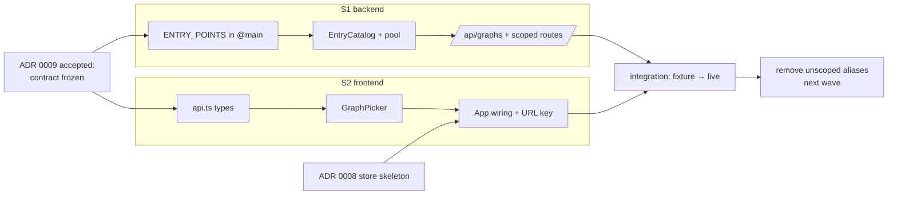

# ADR 0009 — Entry-point registry and in-UI graph picker

Status: **accepted** (implemented; Concurrency strategy section below is FOR REVIEW) · Scope: `graph-engine/` (engine, server, web) · Relates to:
ADR 0002 (HTTP API), ADR 0004 (module = truth), ADR 0008 (frontend sync store —
designed in parallel; this ADR must compose with it, see §UI) · Roadmap: A3
(library loader) / A4, and the "multiple viewable entry points" idea.

## Context

Today the server serves **exactly one program**, chosen at process start:

- `server/demo.py` keeps a hand-maintained `EXAMPLES: dict[str, Path]` of three
  bundled directories; `make_workspace(name)` inserts the directory on
  `sys.path`, imports `<name>.py` (side effect: `@node` registrations land in
  `DEFAULT_REGISTRY`), and binds one `Workspace` to that module.
- `server/__main__.py` exposes this as `--example NAME` (choices = the dict
  keys) and passes a single `workspace` / `sample_graph` / `run_base_dir` into
  `create_app`.
- `server/app.py::create_app` closes over that trio: `GET /api/graph` serves the
  one graph, `PUT /api/graph` writes back through the one workspace,
  `POST /api/run` resolves relative `path` literals against the one
  `run_base_dir`.
- `web/src/App.tsx` fetches the one live graph on mount and renders it; the
  `BranchBadge` shows which git branch edits land on.

Switching programs means killing the server and restarting with a different
flag. Meanwhile every mechanism around the single slot is already generic
(`demo.py`'s own docstring says so): workspaces, run-path resolution, source
editing, the branch badge — none of it is showcase-specific.

We want a **registry of all graph entry points** (`@main` composites) reachable
from the current branch's loaded modules, a server endpoint that **lists** them,
and an **in-UI picker** that **switches between them live** — each entry backed
by its own `Workspace` on the live branch, so inspect / widget-edit / source-edit
/ run all work per entry, exactly as they do for the single program today.

### What the code already gives us (and what it doesn't)

- `@main` is `@graph(entry=True)` (`engine/authoring.py`): the `entry` flag
  "marks the default view, nothing more". Crucially, **composites are not
  registered anywhere** — `NodeRegistry` holds only `@node` primitives. There is
  no data structure that knows which entry points exist.
- `engine/composite.py::find_composite` enforces **exactly one** `@main`/`@graph`
  composite per module — so *module* is a natural unit of identity for an entry
  point today.
- `Workspace` (`server/workspace.py`) is cheap: `(registry, module_name)` plus
  path guards. Nothing about it is singleton-shaped; N workspaces over N modules
  coexist naturally, sharing `DEFAULT_REGISTRY` (spec ids are module-qualified,
  so no collisions).
- `git_branch_info` / `workspace.info()` already report the branch; all entries
  in one server share one repo checkout, hence one branch.

## Decisions (proposed)

### D1 — An entry point is a module with a `@main` composite; id = module name

Entry identity: **`(module, composite qualname)`**, surfaced under the stable id
**`module name`** (e.g. `showcase`, `capacity_check`). Rationale:

- `find_composite` already enforces one composite per module, so the module name
  is unique and sufficient today.
- It matches the existing `--example NAME` vocabulary and `Workspace`'s
  constructor — zero migration for names.
- If we ever allow several `@main`s per module, the id shape widens to
  `module:qualname` **additively** (existing ids stay valid).

`title` is derived: the composite's function name, un-snake-cased
(`readings_report` → "Readings report"), overridable later via
`@main(title="…")` — the decorator already has the factory form
(`main(fn=None)`), so adding keyword-only metadata is non-breaking.

### D2 — Discovery: decorator registration is the truth; a scan of roots decides what gets imported

Two layers, mirroring exactly how `@node` + `DEFAULT_REGISTRY` already work:

1. **`@main` registers.** `engine/authoring.py` gains a process-wide
   `ENTRY_POINTS` registry (a sibling of `DEFAULT_REGISTRY`, engine-owned, pure
   stdlib). `main()` — and only `main()`, not bare `@graph` — records
   `{module, qualname, file, doc}` for the wrapped composite at decoration time.
   This is the **authoritative** list: *whatever is imported and marked `@main`
   is an entry point*. It automatically covers `--library some.module` — import
   a module with a `@main` and it simply appears in the list. Re-import after a
   source edit re-registers (same dedup key `module`), mirroring
   `unregister_module` semantics for nodes.

2. **Scan roots decide what to import.** Registration only sees what's been
   imported, so the server owns a small **catalog** (`server/entries.py`,
   new) with *discovery roots* — default `examples/`, extendable via CLI
   (`--entries DIR`, repeatable). A root scan looks for the existing bundled
   layout, `<name>/<name>.py` (that convention is exactly today's `EXAMPLES`
   dict, minus the hand-maintenance), puts each candidate dir on `sys.path`, and
   imports the module. Import happens **eagerly at catalog build** (server
   start / first `GET /api/graphs`), not per-request:
   - it's cheap — heavy deps (sympy etc.) are lazy-imported inside node bodies
     by convention (see `__main__.py`'s preflight), so importing an example
     registers specs without pulling sympy;
   - the listing is then honest: an entry that fails to import is **listed with
     `status: "error"` + the message** instead of silently missing (the same
     "report, don't hide" stance as `_rebind_current_graph`).

**Rejected alternatives:**
- *Config-only (keep `EXAMPLES`)* — the hand-maintained dict is the thing we're
  deleting; it can't see `--library` modules and rots.
- *Scan-only, no decorator registry* — re-derives "has a `@main`" by AST-sniffing
  files the process has already imported; the decorator knows for free, and only
  the decorator sees non-scanned modules (`--library`).
- *Import lazily on first selection* — makes `GET /api/graphs` a guess (list
  candidates it hasn't verified) and moves import errors to switch-time, the
  worst moment to surface them.

### D3 — Every `@main` is viewable; no opt-in flag

`@main` already *means* "top-level entry/view" (its docstring: "the entry flag
marks the default view"). Adding `@main(viewable=True)` would create a
second-class `@main` with no current use case. `@graph` composites (inlined
sub-wirings) stay unlisted — that's the existing, meaningful distinction. If a
module author doesn't want a composite listed, they use `@graph`. Revisit only
if real registries grow noisy.

### D4 — Server API: coexisting workspaces, id-scoped routes, no server-side "current"

**The list endpoint:**

```
GET /api/graphs
-> {
     "version": SCHEMA_VERSION,
     "default": "showcase",                       # what --example chose
     "entries": [
       {
         "id": "showcase",
         "title": "Showcase",
         "module": "showcase",
         "qualname": "showcase",                   # the @main def's name
         "path": "graph-engine/examples/showcase/showcase.py",  # repo-relative
         "dir": "examples/showcase",               # its run_base_dir, repo-relative
         "status": "ok"                            # | "error"
         // "error": "…"                           # present when status=error
       },
       …
     ]
   }
```

(`GET /api/graphs` sits naturally next to the existing
`POST /api/graphs/validate`; no collision.)

**Scoped resource routes** — the existing single-slot routes, keyed by entry id:

```
GET /api/graphs/{id}/graph          # ≙ GET /api/graph, per entry
PUT /api/graphs/{id}/graph          # ≙ PUT /api/graph  (write-back via that entry's Workspace)
POST /api/graphs/{id}/run           # ≙ POST /api/run   (that entry's run_base_dir)
GET/PUT /api/graphs/{id}/source/{spec_id}   # ≙ /api/source/{spec_id}
```

Unknown id → 404 with the known ids in the message. `status: "error"` entries →
409 on selection-shaped routes, carrying the import error.

**How selection binds a workspace.** The catalog holds a lazily-built,
memoized **workspace pool**: `id → (Workspace, run_base_dir)`. First request for
an id creates `Workspace(DEFAULT_REGISTRY, id)` (module already imported by D2's
scan) and caches it. All workspaces share `DEFAULT_REGISTRY` — node spec ids are
`module.qualname`, collision-proof, and `/api/specs` stays the one global
palette (per-entry palette filtering is a non-goal here). Each entry keeps its
own layout sidecar (`<module>.layout.json`), graph projection, and
`run_base_dir` — the "each entry has its own workspace" requirement, at ~zero
memory cost because `Workspace` is just paths + a module name.

**No server-side "active entry" mutation.** Selection is a **client** concern:
the UI picks an id and calls the scoped routes. The server never stores "which
one is current" (beyond the advisory `default` from the CLI). Rationale: two
browser tabs (or a colleague on the same LAN server) can view *different*
entries without fighting over a global pointer; the server stays stateless
per-request, which is also what a reactive frontend store (ADR 0008) wants to
subscribe against. This is the **multiple-coexisting-workspaces** model; the
single-active-slot alternative (`POST /api/select {id}` mutating the closed-over
trio) was rejected as a shared-mutable-state trap that breaks the second tab.

**Back-compat / migration.** The unscoped routes (`/api/graph`, `/api/run`,
`/api/source/*`) remain as **aliases for the `default` entry** for one wave, so
the current web bundle and tests keep working while the frontend migrates; then
they're removed (or 308-redirected). `--no-demo` (no entries at all) keeps
today's behavior: `GET /api/graphs` returns an empty list, unscoped graph routes
404/501 exactly as now.

**"Backed by a live branch."** Nothing changes: all workspaces write to the
files of the **currently checked-out branch**, `git_branch_info` is
checkout-wide, and `GET /api/workspace` keeps reporting it. Its `modules` list
grows to the modules of *catalog* entries rather than the single bound module
(additive shape change).

### D5 — CLI

- `--example NAME` survives, re-scoped to "the **default** entry" (what
  unscoped aliases serve, what the UI opens first). No longer limits what is
  *served*.
- `--entries DIR` (repeatable) adds discovery roots beyond `examples/`.
- `--library MOD` unchanged — but now, if the module has a `@main`, it shows up
  in `GET /api/graphs` via the D2 registry (a free feature, and the concrete
  payoff of decorator registration over scan-only).
- `demo.py` shrinks to a thin shim over `server/entries.py` (kept temporarily
  for its back-compat wrappers, then deleted).

The sympy preflight in `__main__.py` moves per-entry: checked for the *default*
entry at boot (unchanged UX), and reported as `status`/`error` metadata for
other entries rather than refusing to boot the whole server.

### D6 — UI: a top-bar picker; switch = swap the canvas; URL carries the selection

**Picker placement.** A dropdown in the existing top bar, between the title and
the `BranchBadge` — the same self-contained pattern as `BranchBadge`
(fetches `GET /api/graphs` itself, renders nothing until it resolves; hidden
entirely when the list has ≤ 1 entry, so the single-program experience is
pixel-identical to today). Entries show `title` with the repo-relative `path`
as the secondary line; `status: "error"` entries render disabled with the error
in a tooltip. No sidebar: with a handful of entries a sidebar spends permanent
horizontal space on a rare action. Revisit if registries grow (search, groups).

**Selection state & ADR 0008.** The selected id lives in the **URL**
(`?graph=<id>`), initialized from `GET /api/graphs`' `default`. This is the key
composition point with ADR 0008's reactive store: the id is a plain **input
signal**; everything the store syncs (graph, run results, workspace info) is
**keyed by that id** and refetches/resubscribes when it changes. The picker
never imperatively "loads a graph into" components — it changes the id, the
store reacts. (This ADR deliberately specifies only the *key*; how the store
fetches/pushes is 0008's contract. The picker must not grow its own polling or
caching that would fight 0008.) URL state also gives deep links, reload
persistence, and back/forward switching for free.

**Switching semantics.**

- The canvas **swaps entirely** — new graph, new layout (per-entry sidecar),
  `fitView`. No cross-fade heroics.
- **Unsaved edits:** almost everything is already committed-on-action (widget
  commits `PUT` immediately; graph wiring edits persist on save/commit; runs are
  stateless). The one genuinely volatile surface is an **open source-editor
  buffer with unsaved changes** — switching prompts
  ("Discard unsaved edit to `total`?") before navigating, mirroring the
  existing care in the Escape handler (which deliberately won't discard an
  unsaved body edit).
- **Per-entry panels:** run results and export output are meaningless across
  entries → cleared on switch (not cached per id; simplest correct thing, and
  cache policy belongs to the 0008 store if ever wanted).
- **Branch badge unchanged:** the branch is checkout-global. The picker shows
  *what* you're viewing; the badge shows *where* edits land — same badge for
  every entry.

## Concurrency strategy (concurrent writes on one live branch)

> **FOR REVIEW** — this section was decided at implementation time (the user
> asked for an explicit decision now, revisited as needed). It overlaps with
> ADR 0008's write-queue/seq-gating; the two must compose, and the deferred
> parts below are exactly the parts 0008 owns.

With ADR 0009 the same branch backs **N coexisting views**, so two tabs (or
two views in one tab, or a colleague on the LAN) can write concurrently:
`PUT /api/graphs/{id}/graph`, `PUT /api/graphs/{id}/source/{spec_id}`, and the
unscoped aliases all land on the same checkout — and two *different* entries can
even touch the same file through a shared node pack.

**Decision: last-write-wins between operations, with every write-back
serialized on one in-process lock, and reads that reparse from disk.**

- **Serialized write-backs.** Every workspace write (`save_graph`,
  `replace_function_source`) is a read-modify-write of a real file plus a
  shared module reload. All of them acquire a single process-wide lock
  (`server/workspace.py::_WRITE_LOCK`) around the read→splice→write→reload
  critical section, so concurrent PUTs can never interleave mid-file and
  corrupt the source or the registry. The lock is global rather than
  per-entry because two entries can edit one file via a shared pack.
- **Last-write-wins between operations.** Two tabs editing the same value have
  no version stamps: whichever PUT lands second wins, wholesale. This is safe
  at the file level (each write rebased on the file content read *inside* the
  lock, and the widget committer already rebases each commit on a fresh GET —
  review 0005 #1), and honest at the intent level: the module is the single
  source of truth, and the last save is the truth's newest state.
- **Reparse-on-read.** Scoped `GET /api/graphs/{id}/graph` reparses the module
  from disk on every request (no cached projection), so any tab that refetches
  after a write — which the 0008 store will do reactively — converges on what
  is actually in the file. There is no server-side cache to invalidate and no
  cross-tab staleness beyond "you haven't refetched yet".

**Rejected for now:**

- *Optimistic version/ETag stamps* (a `rev` per entry, `If-Match` on PUT,
  409 on mismatch) — the right long-term shape, but its client half **is** ADR
  0008's seq-gated store: without a store that tracks revisions and replays or
  surfaces conflicts, a bare 409 just breaks the second tab's save with nothing
  good to do about it. Adding stamps now would freeze a contract 0008 should
  design. **Deferred to ADR 0008** — when the store's write queue lands, add
  the `rev` to `GET /api/graphs` + graph/source payloads and gate PUTs on it.
- *Advisory single-writer* (one tab holds an edit lease) — punishes the
  common single-user case with lease UX to solve a conflict LWW already
  resolves tolerably at this scale; multi-writer file editing wants real
  merge/conflict UI, which is far beyond this wave.

**Deferred / revisit triggers:** per-entry revision stamps + conflict surfacing
(with ADR 0008's store); cross-*process* writers (two servers on one checkout —
the in-process lock does not cover them; a lock file would); a dirty-buffer
refresh prompt when the underlying file changed since the buffer opened.

## Consequences

- The `EXAMPLES` dict, `example_dir`, and the back-compat wrappers in
  `demo.py` become an entries catalog anyone extends by *dropping a directory
  in a root* or *importing a module* — no server-code edit to add a program.
- One server process = one palette (`DEFAULT_REGISTRY`) + N viewable programs,
  each independently inspectable/editable/runnable on the live branch.
- Two edges accepted now, documented for later:
  - **`sys.path` growth / module-name collisions** across roots (two roots each
    containing `report/report.py`): first import wins; catalog lists the loser
    as `status: "error"` (duplicate id) rather than guessing.
  - **Cross-entry spec edits:** editing a `@node` shared by two entries (via a
    common pack) affects both — already true today for packs, now visible; the
    per-entry `graphErrors` rebind check runs on the entry being edited only.

## Sketches (illustrative, not implementation)

`engine/authoring.py`:

```python
ENTRY_POINTS = EntryPointRegistry()          # engine-owned, stdlib-only

def main(fn=None, *, title=None):
    def wrap(target):
        comp = graph(target, entry=True)
        ENTRY_POINTS.register(comp, title=title)   # {module, qualname, file, doc}
        return comp
    return wrap if fn is None else wrap(fn)
```

`server/entries.py` (new):

```python
class EntryCatalog:
    def __init__(self, roots: list[Path], registry: NodeRegistry): ...
    def discover(self) -> None:        # scan roots, sys.path + import, capture errors
    def entries(self) -> list[dict]:   # ENTRY_POINTS ∪ import-failures → GET /api/graphs
    def workspace(self, entry_id: str) -> tuple[Workspace, Path]:  # memoized pool
```

`server/app.py`: routes take `entry_id`, resolve `(workspace, run_base_dir)`
through the catalog; the current closure trio becomes the `default`-entry alias.

`web/src/components/GraphPicker.tsx` (new): fetch `GET /api/graphs`; render
dropdown; on change → confirm-if-dirty → set `?graph=` (ADR 0008 store reacts).

## Build plan (two parallel streams)

Contract-first: the **`GET /api/graphs` response shape above is frozen by this
ADR** — that's the seam; the streams never block on each other after it.

**Stream S1 — backend (registry + catalog + routes)**
| Step | Files (owned exclusively by S1) |
|---|---|
| S1a `ENTRY_POINTS` registry + `@main` registration + tests | `engine/authoring.py`, `engine/__init__.py`, `tests/test_authoring*.py` |
| S1b `EntryCatalog` (scan, import, error capture, workspace pool) | `server/entries.py` (new), `tests/test_entries.py` (new) |
| S1c `GET /api/graphs` + scoped routes + unscoped aliases; CLI flags | `server/app.py`, `server/__main__.py`, `server/demo.py`, `tests/test_app*.py` |

**Stream S2 — frontend (picker + keyed reload)**
| Step | Files (owned exclusively by S2) |
|---|---|
| S2a API types + `fetchGraphs()`; scoped-path variants of existing calls | `web/src/api.ts`, `web/src/types.ts` |
| S2b `GraphPicker` component (against a fixture of the frozen shape) | `web/src/components/GraphPicker.tsx` (new), `web/src/styles.css` |
| S2c App wiring: URL-keyed selection, swap/clear semantics, dirty guard | `web/src/App.tsx` |

S2 develops against a static fixture of the frozen contract until S1c lands;
integration is a fixture-for-live swap. S2c is the one step that must
coordinate with **ADR 0008** (the store owns fetching; the picker only moves
the key) — sequence S2c after 0008's store skeleton exists, or land it behind
the same refactor.



## Open confirmations (need a human decision to move to "accepted")

1. **FOR HUMAN REVIEW (MAJOR)** — **Discovery = `@main` decorator registration
   (truth) + server scan roots (what to import), imported eagerly at catalog
   build** (D2) — vs. config-only, scan-only, or lazy import-on-select.
   *(Recommend: as stated; import errors become listed `status:"error"`
   entries.)*
2. **FOR HUMAN REVIEW (MAJOR)** — **Coexisting workspaces + id-scoped routes;
   selection is client-side (URL), no server-side "active entry"** (D4) — vs. a
   single active workspace mutated by a `POST /api/select`. This decides
   multi-tab semantics and the shape every future client codes against.
   *(Recommend: coexisting + scoped; it is stateless and 0008-friendly.)*
3. **FOR HUMAN REVIEW (MAJOR)** — **Entry id = module name** (one `@main` per
   module, enforced today by `find_composite`), widening additively to
   `module:qualname` if that constraint is ever lifted (D1). *(Recommend: module
   name.)*
4. **Every `@main` is viewable; no `viewable=` opt-in** (D3). `@graph` stays
   unlisted. *(Recommend: yes — `entry=True` already means exactly this.)*
5. **Unscoped `/api/graph` & co. stay as default-entry aliases for one wave,
   then are removed** (D4). *(Recommend: yes; keeps the current bundle/tests
   green during migration.)*
6. **`--example` re-scoped to "default entry"; new repeatable `--entries DIR`**
   (D5). *(Recommend: yes.)*
7. **Picker = top-bar dropdown, hidden at ≤ 1 entry; run/export panels cleared
   on switch; confirm-discard only for an unsaved source-editor buffer** (D6).
   *(Recommend: yes; sidebar and per-entry result caching deferred.)*
8. **One global palette (`/api/specs`) across entries** — per-entry palette
   filtering is out of scope here. *(Recommend: yes, defer.)*
