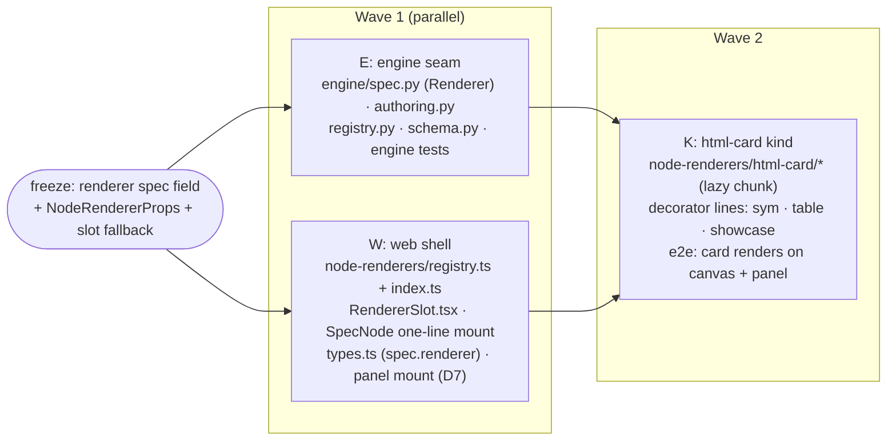

# ADR 0010 — Whole-node custom rendering (node-declared renderer registry)

Status: **proposed** · Scope: `graph-engine/` · Relates to: ADR 0001 (spec
seam, open vocabularies), ADR 0002 (HTTP API), ADR 0004 (graph ⟷ source
bijection), ADR 0005 (node-declared UI widgets — the pattern this ADR mirrors),
ADR 0006 (collapsible composites, parallel design), ADR 0007 (dynamic spec),
ADR 0008 (sync, parallel design), ADR 0009 (entry points, parallel design)

ADR 0005's widget seam customizes **editing, per input**: a node declares
`{kind, config}` for one parameter and a JS registry resolves it to an editor.
This ADR opens the sibling seam for **presentation, per node**: a node type
declares how its **card body and/or its run output** renders on the canvas —
an HTML/MathML card shown inline instead of an `html · 1.2 KB` chip, a chart
over a table value, a status tile — beyond the generic title/doc/sockets card.
Same architecture, deliberately: Python declares a contract `{kind, config}`;
a JS `kind → renderer component` registry resolves it; unknown kinds fall back
to today's card; renderers are lazy-loaded, npm-bundled, offline, no CDN.

## Context

What exists today:

- **The generic card is the only card.** `web/src/components/SpecNode.tsx`
  renders every node identically: header (title · graph id · output badge),
  docstring line, input/output sockets (with the ADR 0005 `WidgetSlot` on
  unwired inputs), and — after a run — `ResultChips`, a compact per-socket
  footer that deliberately summarizes structured values by shape
  (`web/src/preview.ts` `previewChip`: an HTML string shows as
  `html · 1.2 KB`, a list as `list · 3 items`).
- **Rendered output lives only in the results panel.** The one place a value
  is *shown* rather than summarized is `RunResultsPanel.tsx`: the graph's
  declared output socket, when it is a string, renders in a **fully sandboxed
  iframe** (`sandbox=""`, `srcDoc`, never `dangerouslySetInnerHTML`) because
  node output is untrusted HTML. Non-string outputs degrade to
  `previewType: previewValue` text.
- **Packs already produce visual values.** `nodepacks/sym`'s
  `render_math_card` emits a self-contained HTML card (inline CSS, native
  MathML, zero JS — the no-CDN posture is enforced in the node body, which
  refuses scripts/handlers/URLs in its `mathml` input); the showcase example's
  `dashboard` composes two such cards; `table_summary` (ADR 0005 C) renders a
  table as HTML. On the canvas, all of that visual work collapses to a size
  chip; you must run and open the panel, or the inspector, to see anything.
- **The widget seam is per-input by design.** ADR 0005 A-D2 explicitly
  deferred node-level declarations ("node-level panels are deferred … adds
  surface with no consumer"). The consumers now exist — the math card, the
  table summary, the showcase dashboard — and what they need is not an
  *editor* on an input but a *renderer* for the node.
- **Run results already flow to the card.** `SpecNodeData.result`
  (`web/src/types.ts`) carries the node's per-socket values from the latest
  run, JSON-safe with a `{"$repr","$type"}` degradation for non-JSON returns
  (`server/serialize.py`). The data a renderer needs is already at the mount
  point; only the presentation seam is missing.

Constraints carried forward unchanged: the engine stays pure-stdlib and
UI-agnostic (a declaration is data, never a component); node bodies are never
serialized; the spec schema evolves additively (`engine/schema.py`,
`additionalProperties: true`, no version bump for optional fields); **no
CDNs** — every renderer is npm-bundled and code-split; untrusted HTML never
touches the host page.

---

## D1 — Python declares a `Renderer` contract, never a UI

Mirror of ADR 0005 A-D1/A-D2. A node type declares **`kind` + JSON config** —
no HTML, no React, no callbacks. The engine serializes it into the node spec;
a headless engine or a non-React front-end ignores or reinterprets it freely.

```python
# engine/spec.py (new, ~25 lines, pure stdlib — the Widget class's sibling)
class Renderer:
    """A declarative rendering contract for a whole node (ADR 0010 D1).

    kind    -- registry key the UI resolves to a renderer component.
    config  -- JSON-serializable options, opaque to the engine.
    """
    __slots__ = ("kind", "config")

    def __init__(self, kind: str, **config: object) -> None:
        self.kind = kind
        self.config = config
        json.dumps(config)  # fail at import time, not save time

    def to_dict(self) -> dict:
        d: dict = {"kind": self.kind}
        if self.config:
            d["config"] = dict(self.config)
        return d
```

Declared with a `renderer=` kwarg on `@node` — the same precedent as
`outputs=[...]` and `widgets={...}` (and for the same reason ADR 0005 chose
the kwarg over `Annotated`: no annotation evaluation, nothing new to learn):

```python
# nodepacks/sym/__init__.py — the first consumer's view (D6)
@node(renderer=Renderer("html-card", socket="result", height=220))
def render_math_card(title: str = "Calculation", mathml: str = "", caption: str = "") -> str:
    """Render a self-contained HTML card: title, MathML block, caption. …"""
```

Threading: `node_spec()` gains `renderer: Renderer | None = None`, passed
through `node()` → `registry.register()` exactly like `widgets=`.
Introspection-time validation (all `EngineError`, import-time):

- `config` must be JSON-serializable (the `json.dumps` guard, as `Widget`);
- a `socket` config key, when present, must name a declared output socket —
  the one cross-field check worth doing eagerly, since `outputs=[...]` is
  visible at the same call site (typos fail at import, like everything else
  in the spec layer).

**One declaration per node type, not per output.** A per-output
`outputs=[{"name": ..., "renderer": ...}]` variant was considered and
deferred: every identified consumer renders *one* socket (or a composition of
all of them), the card has room for one render surface (D3), and the
`socket:` config key already selects which output a single-socket renderer
reads. Per-output declarations can be added later as an additive spec field
without disturbing this one. **(Open confirmation 1 — MAJOR.)**

## D2 — Spec wire format: a top-level optional `renderer` field

```jsonc
// node spec (today's shape unchanged; the new field is optional)
{
  "id": "sym.render_math_card",
  "name": "render_math_card",
  "title": "render_math_card",
  "doc": "Render a self-contained HTML card: …",
  "inputs":  [ /* unchanged, incl. per-input widget declarations */ ],
  "outputs": [ { "name": "result", "type": "str" } ],
  "renderer": { "kind": "html-card", "config": { "socket": "result", "height": 220 } }
}
```

- Additive: optional field, `additionalProperties: true`, **no schema-version
  bump** (same treatment as `widget.config` in ADR 0005 A-D3).
  `engine/schema.py` gains a `_validate_renderer` mirroring
  `_validate_widget`: `null`/absent, or an object with a string `kind` and an
  optional object `config`; unknown keys tolerated.
- The declaration lives in the **node spec only — never in the graph JSON**.
  Like the widget declaration and like canvas layout (ADR 0004 D6), a
  renderer is a *view* concern: it is spec-side data, excluded from the
  graph ⟷ source bijection, and changing it never dirties a graph.
- `kind` joins the existing **open vocabulary** discipline (ADR 0001 D7,
  ADR 0005 A-D6): core kinds are flat names (`html-card`), pack-specific
  exotic kinds namespace (`sym.plot`); a config change that would break an
  older renderer component is a **new kind**, not a mutated one.

## D3 — Scope: the render surface — what a renderer owns, and what it never owns

The card is not a blank canvas handed to the renderer. Three options were
worked through:

**(a) Full-card replacement** — the renderer component replaces `SpecNode`'s
output entirely. Rejected: every kind would have to reimplement ReactFlow
handles (edges reference `inHandle`/`outHandle` ids), selection, the error
outline, the widget slots of ADR 0005, and whatever collapsed-composite chrome
ADR 0006 lands. One forgotten handle id silently detaches edges. This is the
renderer-registry equivalent of the "two executors" trap ADR 0005 Part C
rejected — N kinds × M shell behaviors, all drifting.

**(b) Per-output render slots** — a renderer per output socket, each rendered
in that socket's row. Rejected for v1: no consumer needs it (D1), and socket
rows are the *wiring* surface — a chart inside a socket row fights the
edge-dragging UX.

**(c) One node-level render surface, shell keeps the frame — chosen.** The
shell (`SpecNode`) always owns: header (title · id · output badge), docstring
line, input/output sockets + handles, widget slots, error styling. The
renderer owns exactly the region where `ResultChips` sits today — the strip
below the sockets:

```
┌──────────────────────────────┐
│ title · id          [output] │  ← shell
│ docstring…                   │  ← shell
│ ○ in-sockets   out-sockets ○ │  ← shell (handles, widget slots)
│ ┌──────────────────────────┐ │
│ │      render surface      │ │  ← RendererSlot: declared renderer,
│ └──────────────────────────┘ │    else ResultChips (today's footer)
└──────────────────────────────┘
```

Semantics of the surface:

- **No declared renderer:** exactly today — chips render iff `result` is
  non-null. Byte-identical fallback, so the read-only canvas is unchanged.
- **Declared renderer:** the slot mounts the component whether or not a run
  has happened; `result: null` before the first run lets the component show a
  placeholder ("run to render") or nothing — its call.
- **Card vs output rendering is a spectrum on one surface, not two seams.**
  An *output* renderer (math card, chart) draws from `result`; a *card*
  renderer (a status tile that colors itself from `boundInputs`, a node whose
  identity is its configuration) draws from the spec + literals and may
  ignore `result` entirely. Both receive the same props (D4) and mount in the
  same slot. A second, separate body-replacement seam (e.g. suppressing the
  docstring, custom header) is **deferred until a consumer needs it** — the
  same "no surface without a consumer" rule ADR 0005 applied to node-level
  panels. **(Open confirmation 2 — MAJOR.)**
- **Widgets compose, trivially:** widget slots live in the socket rows (shell
  territory), the render surface below them. A node can have editable inputs
  *and* a custom render — edit `precision` in the widget, run, see the card —
  with zero coordination between the two registries.

## D4 — JS side: a `kind → renderer` registry, lazy, with the chips as fallback

Mirror of `web/src/widgets/registry.ts`, in a sibling subtree
`web/src/node-renderers/`:

```tsx
// web/src/node-renderers/registry.ts
export interface NodeRendererProps {
  /** The graph node id (the key run results / inspector rows use). */
  nodeId: string;
  /** The node's spec (title/doc/inputs/outputs) — never null at this mount. */
  spec: NodeSpec;
  /** `spec.renderer.config`, opaque to the shell — passed straight through. */
  config: Record<string, unknown>;
  /** Literals bound to unwired inputs (graph.nodes[].inputs). */
  boundInputs: Record<string, unknown>;
  /** Input names fed by an edge rather than a literal. */
  wiredInputs: ReadonlySet<string>;
  /** Per-socket values from the latest run; null before a run or when the
      run failed upstream. Values are JSON-safe with {"$repr","$type"}
      degradation (server/serialize.py) — renderers must tolerate both. */
  result: Record<string, unknown> | null;
  /** True when the latest run failed at this node. */
  hasError: boolean;
  /** Where the renderer is mounted: the node card or the results panel (D7). */
  surface: 'card' | 'panel';
}

export type NodeRenderer = ComponentType<NodeRendererProps>;

const REGISTRY = new Map<string, RegisteredRenderer>();
export const registerNodeRenderer = (kind: string, r: RegisteredRenderer): void => { … };
/** Unknown (or absent) kind → null: the slot falls back to ResultChips. */
export const rendererFor = (r: RendererDecl | null | undefined): RegisteredRenderer | null =>
  (r && REGISTRY.get(r.kind)) ?? null;
export const lazyNodeRenderer = (load: () => Promise<{ default: NodeRenderer }>) => lazy(load);
```

- **One mount, one owned file.** `SpecNode.tsx` changes by exactly one line:
  `{result && <ResultChips result={result} />}` becomes
  `<RendererSlot data={…} />`. `RendererSlot.tsx` (new, owned by the shell
  stream) resolves `rendererFor(spec.renderer)`, supplies the `Suspense`
  boundary for lazy kinds, renders `ResultChips` when there is no renderer
  (or as the error-tolerant fallback), and carries the `nodrag`/`nowheel`/
  `nopan` + `stopPropagation` interaction shielding `WidgetSlot` already
  proved out — consumer streams add renderer files and one registration line,
  and never touch `SpecNode.tsx`. (This repeats ADR 0005's single-merge-hazard
  containment, which held in practice.)
- **Registration point:** `web/src/node-renderers/index.ts`, imported for
  side effects by `RendererSlot` — same self-registering pattern as
  `widgets/index.ts`. Heavy kinds register as `lazyNodeRenderer(...)` chunks:
  code-split, npm-bundled, **zero CDN**.
- **Fallback is the versioning story** (ADR 0005 A-D6): a spec declaring a
  kind this bundle doesn't ship degrades to today's chips — informative, never
  broken. `types.ts` gains `renderer?: { kind; config? } | null` on
  `NodeSpec`, additive-tolerant.
- **Spec-less nodes** (unknown type) keep the existing missing-node branch
  untouched; a renderer needs a spec by definition.
- **Renderer components are trusted; declarations are not code.** The
  registry is **closed at build time**: Python selects a kind by name; it can
  never inject markup or code into the host page through the declaration.
  (`config` is data handed to a trusted component; components must treat
  config strings as text, not markup.)

## D5 — Security: untrusted output keeps the sandboxed-iframe posture

The value a renderer displays is **node output — untrusted**, exactly as
`RunResultsPanel` treats it today. The posture transfers unchanged:

- HTML-bearing kinds render the value in an `<iframe sandbox="" srcDoc={…}>`
  — no scripts, no same-origin, no forms, no top-navigation. **Never**
  `dangerouslySetInnerHTML`, in any kind, ever. The sym card's native MathML
  renders fine with zero JS, so the strictest sandbox costs the demo nothing.
- Only a **plain string** is fed to an iframe; `{"$repr","$type"}` previews,
  non-strings, and missing sockets fall back to chips/text (mirroring the
  panel's `typeof output === 'string'` guard).
- **Sizing without scripts:** a scriptless iframe cannot report its content
  height. v1: the declaration's `height` config (a number of px; default
  ~180) sets the surface height, content scrolls within. The alternative —
  `sandbox="allow-scripts"` plus an injected `postMessage` resize shim — buys
  auto-height at the cost of letting untrusted markup execute JS inside the
  frame (still origin-isolated, but a real posture change: exfiltration
  beacons, resize-message spoofing to consider). Recommend: **no scripts in
  v1**; revisit only with a concrete need and a reviewed shim.
  **(Open confirmation 3 — MAJOR.)**
- **Canvas cost ceiling:** one iframe per rendered node is materially heavier
  than chips. Mitigations, in order: an HTML kind renders its iframe only
  when a result exists (placeholder text before); `loading="lazy"` on the
  iframe; `height` keeps layout stable (no reflow storms); if a graph with
  dozens of rendered cards ever chugs, a "render on demand" toggle per node
  is the additive escape valve. At demo scale (~a dozen nodes, 1–3 rendered)
  this is comfortably fine.

## D6 — First consumers: the `html-card` kind (and what stays out of v1)

One kind ships in v1 — enough to prove the seam end-to-end, small enough to
review:

- **`html-card`** (`web/src/node-renderers/html-card/`, lazy chunk, ~80
  lines): reads `config.socket` (default: the node's single output) from
  `result`, shows it in the sandboxed iframe per D5; placeholder before the
  first run; chips-fallback on non-string values. Config:
  `{ socket?: string, height?: number }`.
- **Declaring packs** (one decorator line each — the whole pack-side cost):
  - `sym.render_math_card` → `Renderer("html-card", height=220)`
  - `table.table_summary` → `Renderer("html-card", height=200)`
  - showcase `dashboard` → `Renderer("html-card", height=420)`

  The showcase graph then reads on the canvas the way it reads in the panel:
  the math card and table card visible *on their nodes*, the dashboard node
  showing the composed report.

Deliberately **not** in v1 (each is a later kind + registration line, no seam
change): a `chart` kind (consumes the ADR 0005 `{"columns","rows"}` table
shape; needs an offline charting choice — plain SVG vs an npm lib — that
deserves its own sizing pass); a `status` tile kind (trivial, but has no
consumer yet); MathML-direct rendering outside an iframe (tempting since
MathML is inert, but "inert" would then need a *sanitizer* to prove — the
iframe posture needs no proof). **(Open confirmation 5.)**

## D7 — The results panel resolves the same registry

`RunResultsPanel`'s "output render" area currently special-cases exactly one
shape: string → iframe. With the registry in place, the panel resolves the
**graph output node's** declared renderer first (`surface: 'panel'`), and
falls back to today's string-iframe / preview-text behavior when the node
declares none. One component, both surfaces, one security posture — and a
future `chart` node renders in the panel for free. Cost: ~10 lines in the
panel. Recommend: **in v1**, since it deletes a special case rather than
adding one. **(Open confirmation 4.)**

## Composition with the parallel ADRs

- **ADR 0005 (widgets):** orthogonal by construction — widgets live in socket
  rows, renderers below them (D3); a node declares both freely. The
  registries share a *pattern*, not code; a shared abstraction over two
  3-file registries would be premature.
- **ADR 0006 (collapsible composites, parallel):** a collapsed composite is
  the natural *second* consumer of this seam — a collapsed "render pipeline"
  showing its output's card is the whole promise of collapsing. Two
  composition routes when 0006 lands: `@graph(renderer=...)` on the
  composite, or inheriting the renderer of the node feeding the composite's
  return socket. **Recorded here, decided there** (forwarded to 0006's open
  questions — its graph-model shape must exist first). Nothing in this ADR
  blocks either route. **(Open confirmation 6.)**
- **ADR 0007 (dynamic spec):** the renderer is **type-level** data; the
  effective-spec derivation (sockets = f(type, one literal)) must carry the
  `renderer` field through unchanged. One sentence of contract for 0007's
  implementation; no interaction otherwise.
- **ADR 0008 (sync, parallel):** the renderer travels inside the node spec,
  so whatever spec refresh/sync 0008 defines propagates it with no extra
  work — the same "refetch specs after source save" rule ADR 0005 relies on.
- **ADR 0009 (entry points, parallel):** no interaction beyond D7 following
  whichever output socket the selected entry designates.

## Sequencing — build and parallelization plan

Two contracts freeze on acceptance of this ADR (the wave-α discipline from
ADR 0005, which held):

1. **Renderer declaration shape** — spec field
   `{"kind": str, "config"?: object}` at the node-spec top level; `Renderer`
   kwarg semantics incl. the `socket` validation (D1/D2).
2. **Renderer component contract** — `NodeRendererProps` (D4) and the
   `RendererSlot` fallback semantics (declared → component, else chips).



**Stream file ownership** (worktree agents; disjoint by construction):

| Stream | Owns (writes) | Must not touch |
|---|---|---|
| **E** | `engine/spec.py` (`Renderer`, `node_spec` threading), `engine/authoring.py` (`renderer=` kwarg), `engine/registry.py`, `engine/schema.py` (+ frozen-schema regen), engine tests | `web/*`, `nodepacks/*` |
| **W** | `web/src/node-renderers/{registry.ts,index.ts,RendererSlot.tsx}` (new), `web/src/types.ts` (additive `renderer` field), `web/src/components/SpecNode.tsx` (the one-line mount), `web/src/components/RunResultsPanel.tsx` (D7 resolve) | `engine/*`, `web/src/widgets/*` |
| **K** | `web/src/node-renderers/html-card/` (new), one registration line in `node-renderers/index.ts`, decorator lines in `nodepacks/sym/__init__.py` · `nodepacks/table/__init__.py` · showcase example, kind tests | `SpecNode.tsx`, `RendererSlot.tsx`, `registry.ts` |

Wave 1's streams share zero files (E is Python, W is TS). Wave 2's conflict
surface is one registration line and one decorator line per pack — trivially
mergeable, exactly as ADR 0005's wave β played out. E and W can even land in
either order: W with no engine support renders nothing new (no spec carries
`renderer`); E with no web support serializes a field the UI ignores
(additive-tolerant by design).

## Risks

- **Surface creep toward full-card replacement** — the first kind that wants
  to hide the docstring or restyle the header will pull at D3's boundary.
  Mitigation: the boundary is the decision; body/header customization is a
  *new, separate confirmation* with its own consumer, not a config flag
  slipped into `html-card`.
- **iframe density** — a pathological graph of 50 `html-card` nodes.
  Mitigation ladder in D5; not a demo-scale problem.
- **Stale renders misread as current** — the card keeps showing the previous
  run's output after an edit. Chips have this today; a rendered card makes it
  more convincing. Mitigation: `RendererSlot` reuses whatever staleness cue
  the shell adopts for chips (and ADR 0008's sync work is the systemic fix);
  flag, don't solve here.
- **Kind-vocabulary drift between packs and bundle** — a pack declares
  `sym.plot`, the bundle doesn't ship it. By design this degrades to chips
  (D4); the residual risk is user confusion, mitigated by the slot title
  ("no renderer for kind 'sym.plot' — showing values").
- **Config as covert markup channel** — a config string interpolated into
  markup by a sloppy kind. Rule in D4 (config is text, never markup); review
  gate for new kinds.

## Consequences

- `engine/spec.py` gains `Renderer` + `renderer=` threading (sibling of
  `Widget`); `engine/schema.py` gains the optional top-level `renderer` field
  + validation — additive, no version bump; the engine remains pure-stdlib
  and UI-agnostic.
- New `web/src/node-renderers/` subtree (registry, slot, `html-card` chunk);
  `SpecNode.tsx` changes by one line; `RunResultsPanel` loses a special case.
- `ResultChips` becomes the named default renderer path — today's canvas is
  the fallback, byte-identical.
- Three pack decorator lines light up the showcase: math card, table card,
  and dashboard render inline on the canvas.
- No new HTTP endpoints; nothing new in the graph JSON; the bijection is
  untouched (renderer = spec-side view data).
- ADR 0007 implementations must pass `renderer` through effective specs;
  ADR 0006 inherits a recorded question (collapsed-composite rendering).

## Open confirmations

> Status: **open** — none resolved yet. Items 1–3 are MAJOR architecture
> decisions and are flagged **FOR HUMAN REVIEW**; 4–7 are scoped calls that
> can be overridden cheaply later.

1. **FOR HUMAN REVIEW (MAJOR) — Declaration shape: one node-level
   `renderer=` kwarg** (`@node(renderer=Renderer(kind, **config))`,
   serialized as one optional top-level spec field) — vs per-output renderer
   declarations, vs a `renderers=[...]` list. *(Recommend: node-level single
   declaration; every identified consumer renders one surface, `socket=`
   config selects the value, and per-output declarations remain additive
   later. Mirrors ADR 0005's resolved kwarg precedent.)*
2. **FOR HUMAN REVIEW (MAJOR) — Renderer scope: the render surface only**
   — shell keeps header/doc/sockets/handles/widget slots; the renderer owns
   the result-area strip; full-card replacement and body/header
   customization are out of v1 entirely. *(Recommend: yes — full-card
   replacement breaks edges/selection/widgets/0006-composition per kind;
   "card-flavored" nodes are still expressible on the surface, ignoring
   `result`.)*
3. **FOR HUMAN REVIEW (MAJOR) — Sandbox posture: `sandbox=""` (no scripts),
   declared `height`, scroll within** — vs `allow-scripts` + a postMessage
   auto-resize shim. *(Recommend: no scripts in v1; MathML needs zero JS, and
   auto-height is not worth letting untrusted output execute. Revisit only
   with a concrete consumer and a reviewed shim.)*
4. **Results-panel mount in v1** (D7): the panel resolves the same registry
   for the output node, falling back to today's behavior. *(Recommend: yes —
   it deletes a special case and unifies the posture.)*
5. **v1 kind vocabulary = `html-card` only**; `chart` (offline charting
   choice needed) and `status` are later kinds behind the same seam.
   *(Recommend: yes — one kind proves the seam; charts deserve their own
   dependency/sizing pass.)*
6. **Collapsed-composite rendering is forwarded to ADR 0006** (composite
   `renderer=` vs inheriting the return-socket node's renderer) rather than
   decided here. *(Recommend: forward — 0006's graph-model shape must exist
   first; nothing here blocks either route.)*
7. **Freeze points** — sign off the two wave-1 contracts (renderer spec
   field; `NodeRendererProps` + slot fallback semantics) so streams E/W/K
   run as parallel worktrees against fixed seams. *(Recommend: freeze both
   as specified.)*
