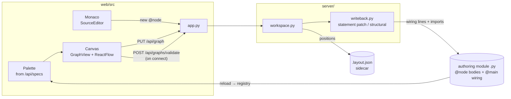
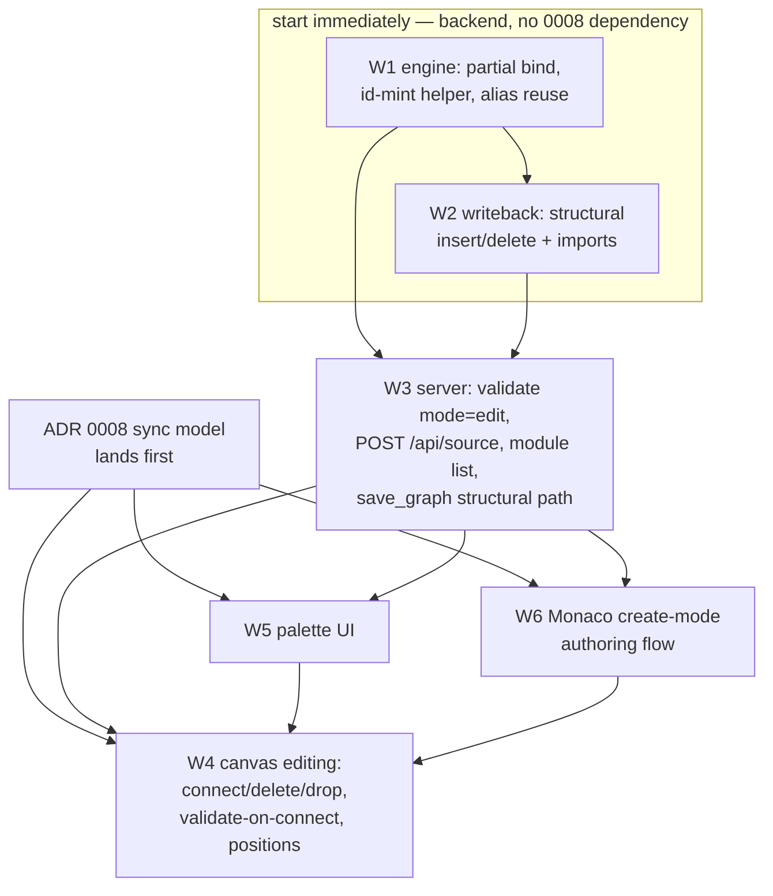

# ADR 0011 — Whole-graph structural editing on the canvas

Status: **proposed** (2026-07) · Scope: `graph-engine/` · Relates to: ADR 0001
(engine core), ADR 0002 (HTTP API), ADR 0004 + Amendment A1 (graph ⟷ source
bijection, statement-level write-back), ADR 0005 (node-declared widgets),
ADR 0006 (collapsible composites, deferred), ADR 0007 (dynamic handcalc),
and the **in-parallel designs** ADR 0008 (front-end sync model), ADR 0009
(entry points), ADR 0010 (node rendering) — numbers 0008–0010 are reserved
for those tracks.

> **This is the largest feature designed so far, and it contains decisions the
> team explicitly wants a human to sign off before any build.** They are
> collected in [MAJOR DECISIONS — HUMAN REVIEW REQUIRED](#major-decisions--human-review-required)
> immediately after the context. Nothing in this ADR is implemented.

## Context — what exists, what's missing

The feature: **whole-graph structural editing on the canvas, written back to
the backing Python**. Create nodes from a palette of registered types, drag
them into position, connect/reconnect edges with validate-on-connect, delete
nodes and edges — and **define brand-new node types in the Monaco source
editor** that land in a real `.py` module and immediately become placeable.
Everything round-trips through the ADR 0004 bijection: canvas edits rewrite
the `@main` composite's wiring; new `@node` functions are appended to a real
backing module.

What the code already gives us:

- **Value edits round-trip today.** Widget commits go through `PUT /api/graph`
  → `server/workspace.py::save_graph` → `server/writeback.py::compute_writeback`,
  which patches only the changed wiring *statements* in place (ADR 0004 A1).
  Node-body edits go through `PUT /api/source/{spec_id}` →
  `Workspace.replace_function_source` (AST-span splice, re-import with
  rollback). Both are proven, tested paths.
- **The palette contract exists.** `GET /api/specs` serves
  `NodeRegistry.specs()` — the docstring on `registry.specs()` literally says
  "the palette a UI renders from". No UI consumes it as a palette yet.
- **Validate-on-connect has a home.** `POST /api/graphs/validate` runs
  `engine.bind()` and returns structured `{code, message, nodeId?, edge?}`
  errors — the `edge` payload was designed so a UI can badge the exact wire.
- **The canvas is structurally read-only.** `web/src/GraphView.tsx` mounts
  ReactFlow with `nodesConnectable={false}`; nodes are draggable "so a
  reviewer can rearrange while exploring" but positions are never persisted;
  `web/src/buildGraph.ts` **ignores the served `position` field entirely** and
  always auto-layouts (`layout.ts`). The engine emits `position: null`.
- **Position persistence is half-built.** `Workspace._save_layout` writes a
  `<module>.layout.json` sidecar from any `position` values in a saved graph,
  and `parse_graph` merges the sidecar back into the served JSON (ADR 0004
  D6). The server side works; the web side neither sends nor honours
  positions.
- **Structural write-back is the known hard case.** ADR 0004 D5 patches
  value/edge edits cleanly; Amendment A1 explicitly flags that adding/removing
  nodes "falls back to regenerating the whole wiring block" with a logged
  warning, eating hand-written comments in the wiring block. A1's closing
  note defers full-fidelity structural edits to "a comment-anchoring model".
  This ADR is where that bill comes due.
- **The Monaco editor is being bundled now** (`feat/monaco-source-editor`,
  `web/src/components/SourceEditor.tsx` + `web/src/monaco/`): it edits
  *existing* `@node` functions. This ADR extends it to *authoring new ones*.
- **`bind()` is all-or-nothing.** A node with a required input that is neither
  wired nor given a literal is a hard `BindError`. Fine for running; fatal for
  editing — a freshly placed node almost always starts incomplete. This
  forces a draft-tolerant validation mode (D6 below).
- **`wiring_lines` refuses unimported types.** Placing a `table.read_table`
  node on a module that doesn't import `table` raises
  `EngineError: …add an import for it before wiring it in place`. Structural
  write-back therefore must also manage the module's **import block** (part of
  HD2).



---

## MAJOR DECISIONS — HUMAN REVIEW REQUIRED

These four decisions shape everything downstream and are **hard** — mostly
because they are about *auto-organizing where things go*, which the team has
called out as the risky part. Each has a recommendation, but none should be
built until a human signs off.

### HD1 — Where does a new `@node` authored in Monaco land?

The user writes a brand-new function in the UI. *Some* real file must receive
it — and whichever default we pick becomes a de-facto code-organization policy
imposed by a canvas tool.

| Option | Mechanics | Pros | Cons |
|---|---|---|---|
| **(a) The graph's own authoring module** (e.g. `examples/showcase/showcase.py`), inserted above the `@main` composite | Uses the existing `Workspace` single-module machinery; `from_composite(module_name=…)` already resolves local defs with no import needed | Zero new placement machinery; the new node is instantly wireable (no import edit); matches the existing "local composing node" pattern (`showcase.dashboard`) | The example module accretes user code; unusable from other graphs without imports; couples "my node" to "this demo file" |
| **(b) A user nodepack** (`nodepacks/user/` or a named new pack), scaffolded on first use | New pack module + import added to the authoring module by write-back | Clean separation, reusable across graphs, mirrors the existing pack layout | New machinery: pack scaffolding, sys.path/registration, import management, naming the pack — and *which* pack when several exist? |
| **(c) User chooses per function** (file picker over `allowed_roots` modules) | UI dropdown listing eligible modules (the workspace module + imported packs + "new pack…") | Honest — no auto-magic; the label "writes to `<path>`" already exists in the source-editor UI pattern | A decision forced on the user at creation time; needs a module-listing endpoint |
| (d) Sidecar/scratch module per graph (`showcase_nodes.py` beside the graph) | Auto-created sibling file, auto-imported | Keeps the graph module clean | Invents a convention nobody asked for; two files to reason about; still needs import management |

**Recommendation: (a) as the v1 default, with (c)'s picker as the visible
escape hatch, defaulted to (a).** Concretely: the "New node" flow shows a
non-editable-by-default target line — "will be written to
`examples/showcase/showcase.py` (change)" — where *(change)* opens a picker
listing the workspace module and the currently imported pack modules within
`allowed_roots`. Pack scaffolding (b) is deferred: it is the right long-term
answer for reuse, but it multiplies v1 surface (naming, registration,
`pyproject` wiring) for a flow that placement-in-module already unblocks.
**The key property to preserve: the destination is always shown before the
write happens — auto-placement is a default, never a secret.**

### HD2 — How do canvas structural edits map to source rewrites?

ADR 0004 A1 solved value/edge edits (statement-level patch) and punted on
structural: today **any** add/remove regenerates the whole wiring block and
logs a warning about dropped comments. Whole-graph editing makes structural
edits the *common* case, so "regen + warn" stops being an acceptable steady
state — a user who lovingly commented their wiring loses it the first time
they drop a node from the palette.

Proposed extension of `server/writeback.py`, in order of preference per edit:

1. **Pure insertion (nodes added, none removed/reordered):** emit the new
   assignment line(s) and splice them in — no existing line is touched, so
   every comment survives. Insertion point per new node: **immediately after
   the last statement it depends on** (its deepest upstream assignment), and
   before its first consumer / the `return`; independent nodes go just before
   the `return` (or at the block end). This is deterministic and reads
   naturally ("define it where its inputs exist").
2. **Pure deletion:** splice out exactly the removed statement's AST line
   span. **Comment policy:** attached leading comment lines (contiguous `#`
   lines immediately above the statement, no blank line between) are removed
   with it; anything else is left in place, even if orphaned. Orphaned
   comments are visible and harmless; silently deleting prose is not.
3. **Insertion + deletion in one save (e.g. replace-node):** apply 2 then 1 —
   still no untouched line is rewritten.
4. **Reorder-only / anything the statement model can't express** (the
   `_wiring_statements` "give up" cases: non-Name targets, weird statements):
   keep A1's **block-regen fallback with the warning** — but now it must also
   be surfaced **in the UI response** (not just a server log), because a
   canvas user will actually hit it.
5. **Import management becomes part of write-back.** Placing a node of a type
   the module neither imports nor defines requires inserting/extending a
   `from <pack> import <fn>` line (aliased via the existing `_aliases`
   collision logic when the name would shadow a node id). Deleting the last
   node of a type does **not** remove the import (harmless, and removing it
   risks breaking node bodies that also use the function). Import edits touch
   only the import block, never the composite.

**What we do NOT do in v1:** CST-based editing (`libcst`). A1 already
considered it and stayed stdlib-only; insertion/deletion by AST span keeps
that property. Reordering with comment migration remains the one lossy case,
now explicit and rare.

**Needs sign-off because:** the insertion-point heuristic and the
comment-deletion policy are irreversible-feeling behaviours users will
attribute to "the tool ate my code", and adding import rewriting expands
write-back's blast radius from "the `@main` body" to "the module header".

### HD3 — Positions: who owns layout once users can drag?

Today the auto-layout owns everything (`buildFlow` discards served
positions). Once users place and drag nodes, that inverts — but only
partially, and the seam is subtle:

- **Proposed model: sidecar-authoritative, auto-layout as fallback and as a
  command.** `buildFlow` honours `position` when present (the server already
  merges the sidecar in); only nodes with `position: null` are auto-placed —
  *relative to the pinned ones*, near their upstream nodes. A new
  **"Tidy layout"** toolbar action runs the existing `layout.ts` algorithm
  over everything and persists the result, replacing today's implicit
  always-relayout.
- **A drop from the palette assigns the drop position** — so in practice every
  user-created node is born pinned, and `null` positions only occur for
  graphs authored in Python (code-first users keep full auto-layout, which is
  exactly ADR 0004 D6's intent).
- **Persistence:** drags debounce into a save. Crucially,
  `compute_writeback` already returns `strategy: "unchanged"` for a
  position-only save and `save_graph` skips the file write — so **dragging
  never touches the `.py`**, only the sidecar. This must be kept true (and
  tested) or every drag becomes a spurious source diff.
- **Interaction with ADR 0008 (sync):** a position save and a wiring save are
  different consistency classes (sidecar-only vs source-mutating). The sync
  design should treat position saves as non-conflicting.

**Needs sign-off because:** this flips the product's layout philosophy from
"the tool arranges your graph" to "the tool remembers your arrangement", and
the mixed mode (pinned + auto for the rest) is the kind of behaviour that
must be deliberately chosen, not emerge from implementation.

### HD4 — Minting node ids for palette-created nodes

ADR 0004 D3: node id = the composite's variable name. A palette drop must
mint one. Proposal:

- **Scheme:** snake_case of the spec's short name, deduped with a numeric
  suffix: first `total`, then `total_2`, `total_3` (matching the `_aliases`
  suffix style). Always a valid Python identifier (sanitize non-identifier
  characters, prefix `n_` if it would start with a digit).
- **Collision set (all must be avoided, per `wiring_lines`'s shadow check):**
  existing node ids ∪ the module's local call names
  (`composite_call_names`) ∪ the composite's parameter names ∪ Python
  keywords/builtins used in the body. Colliding with a call name would make
  `total = total(vals)` read the unbound local — the exact shadow
  `wiring_lines` rejects — so the minting must consult the *module*, not just
  the graph. That means id minting is a **server-assisted** operation (the
  client doesn't know the module's namespace) — either an endpoint
  (`POST /api/graph/mint-id {type}`) or minted client-side from data the
  server already serves and re-checked at save.
- **Rename:** the inspector gains a rename field. A rename changes the
  statement's target *and every downstream reference* — under the current
  differ that looks like "node set changed" → block-regen fallback. v1
  accepts that (renames are rare and the warning shows); a
  rename-aware patch (rewrite the target line + each consumer line
  in place, which the statement patcher can already express as N value-edits)
  is a fast-follow.

**Needs sign-off because:** minted names become permanent identifiers in the
user's source file — `total_2` in your Python is the tool's naming taste on
display — and the server-assisted minting adds an API surface that the
alternative (client mints, server validates at save with a clear error)
avoids at the cost of occasional save-time rejections.

---

## Decisions (design, pending the sign-offs above)

**D1 — The palette is a projection of `GET /api/specs`, grouped by module.**
A left-rail panel lists registered types grouped by pack (`calc`, `table`,
`sym`, the workspace module), searchable by short name and doc first-line.
Drag-out or click-to-place. No new endpoint: the palette re-fetches specs
after any source save (the existing reload path already refreshes the
registry). Types whose spec `module` is not importable/allowed are shown but
marked unplaceable (they would fail write-back's import step).

**D2 — Canvas mutations are local-first, saved whole.** ReactFlow gains
`nodesConnectable`, `onConnect`, `onEdgesDelete`, `onNodesDelete`, drop
handling. Every structural mutation updates a client-side graph document; a
save sends the **whole graph** through the existing `PUT /api/graph` — no new
patch/ops API. The server already diffs against the file (`writeback.py`), so
a whole-graph PUT with one added node produces exactly one inserted line.
This keeps ADR 0002's contract stable and pushes all cleverness into
write-back, where the tests are. (Per-op endpoints — `POST /api/graph/nodes`
etc. — were considered and rejected: they duplicate the diffing the server
must do anyway and multiply the sync surface ADR 0008 has to reason about.)

**D3 — Save timing: eager for structure, debounced for positions.**
Structural edits (create/connect/delete) save immediately on completion of
the gesture — matching the widget-commit precedent (each commit is a PUT) and
keeping the file honest with the canvas. Drags debounce (~500ms) into
position-only saves (HD3). If ADR 0008 lands an explicit dirty/save model
instead, this ADR defers to it — see *Sequencing*.

**D4 — Delete semantics.** Deleting a node deletes its incident edges
(client-side cascade; the server would reject dangling edges at
`validate_graph` anyway). Deleting the node that carries `graph.output`
clears the output (the composite loses its `return` — write-back already
handles return-disappearance, via fallback today, via statement deletion
under HD2). Deleting a node **never** deletes the `@node` function it was an
instance of — types and instances are different lifecycles; type deletion
stays in the source editor.

**D5 — Reconnect and rewire.** Dragging an edge end to a new socket =
delete + add in one gesture (one save). `bind`'s "input wired by more than
one edge" rule is enforced at the UI level too: dropping onto an occupied
input replaces the existing edge (with the replaced edge flashed, not
silently vanished). An edge into an input that has a widget literal keeps the
literal in the file's history but the edge wins (existing `bind` semantics —
the literal is popped); disconnecting restores the input to widget-editable
with its last literal (already how the graph JSON behaves — the literal is
still in `inputs`).

**D6 — Validate-on-connect = `bind`, with an editing mode.** On every
completed connect (and on demand), the client POSTs the candidate graph to
`/api/graphs/validate`. Two changes:

1. **The endpoint gains `{"mode": "edit"}`** (default `"run"`, fully
   backward-compatible): in edit mode, *missing required input* errors are
   returned in a separate `warnings` array instead of `errors`. Everything
   else (unknown type/socket/param, double-wire, cycle) stays a hard error.
   Without this, a half-built graph can never validate and — worse — never
   **save**, since `save_graph → compute_writeback → bind()` hard-fails.
   `bind` gets a `partial=True` flag skipping only pass 3 (required-input
   check). Emit already tolerates missing inputs (`_arg_exprs` emits only
   provided ones), so the written Python is honest: `v = fn()` — valid
   source that fails at run time, exactly like hand-written incomplete code.
2. **Client-side pre-checks for latency:** socket existence, input-occupancy
   and a local cycle check run synchronously during the drag (connection line
   turns red, drop rejected); the server remains the authority on the
   completed graph. Error badging reuses the `{edge, nodeId}` fields the
   error payload already carries.

**D7 — Authoring a new `@node` in Monaco.** A "New node" action (palette
header + canvas context menu) opens the existing `SourceEditor` shell in
*create* mode, pre-filled with a commented template:

```python
@node
def my_node(value: float, factor: float = 1.0) -> float:
    """One line about what this computes."""
    return value * factor
```

Saving calls a new endpoint `POST /api/source`
(`{"source": …, "module": …?}` — module per HD1, defaulting to the workspace
module). Server-side, `Workspace.add_function_source`:

- validates like `_validate_replacement` (parses, exactly one `def`, keeps a
  `@node` decorator) **plus**: the name must not collide with any existing
  top-level def/import in the target module;
- splices the new def **immediately above the `@main` composite** (or at EOF
  for a pure pack module), preserving everything else byte-for-byte;
- re-imports with the existing rollback, re-serves specs — the type appears
  in the palette in the same refresh;
- optionally (flag from the UI: "place on canvas") the client then drops a
  node of the new type at the pending canvas position, so
  *author → place → wire* is one flow.

**D8 — Scope guard: v1 edits the top-level `@main` only.** Structural editing
inside collapsed/expanded composites is ADR 0006's problem and stays
deferred; ADR 0007's dynamic sockets already work through `bind`, so
connect-validation of derived sockets needs no special casing here (the
derived spec is what `/api/specs`/validate see). Multi-`@main` module
selection is ADR 0009's seam; this ADR assumes "the workspace's current
composite" and consumes 0009's choice when it lands.

### Minimum-lovable v1 vs deferred

| v1 (this ADR's build) | Deferred (recorded, not built) |
|---|---|
| Palette from specs, grouped, searchable | Palette favourites/recents, per-pack docs pages |
| Place / drag / connect / reconnect / delete on `@main` | Structural editing inside composites (ADR 0006) |
| Statement-level insert/delete write-back + import management (HD2 1–3, 5) | Comment-migrating reorders; CST/libcst fidelity mode |
| Positions: sidecar-authoritative + "Tidy layout" (HD3) | Multi-select alignment tools, groups/annotations |
| Edit-mode validate; save of incomplete graphs | Type-aware socket compatibility (needs a type system on sockets) |
| New `@node` in Monaco → workspace module (+picker) (HD1 a+c) | Nodepack scaffolding (HD1 b); moving a def between modules |
| Server-checked id minting + save-time collision errors (HD4) | Rename-aware statement patch; rename refactors across modules |
| Undo = per-save file history is git's (branch badge already shown) | In-canvas undo/redo stack (belongs with ADR 0008's store) |

---

## Open confirmations (beyond the HD sign-offs)

1. **`bind(partial=True)` + validate `mode=edit`** (D6) — vs a separate
   `validate_draft` endpoint. *(Recommend: the flag — one validator, one
   error vocabulary.)*
2. **Whole-graph PUT stays the only mutation API** (D2) — vs per-operation
   endpoints. *(Recommend: whole-graph PUT; the server diffs anyway.)*
3. **Eager structural saves** (D3) — vs an explicit Save button batching
   edits. *(Recommend: eager, matching widget commits — but this is exactly
   the seam ADR 0008 owns; if 0008 chooses batched, follow it.)*
4. **New defs insert above `@main`** (D7) — vs below imports / EOF.
   *(Recommend: above `@main` — bodies first, wiring last, matching every
   existing example module's layout.)*
5. **"Tidy layout" persists positions for all nodes** (HD3) — vs tidy being
   view-only until the next drag. *(Recommend: persist; a tidy you can lose
   on reload isn't tidy.)*

## Build & parallelization plan

**Sequencing constraint (stated plainly): the ADR 0008 sync refactor comes
first.** Structural editing multiplies concurrent-writer hazards the current
ad-hoc reload model (`App.tsx`'s `reload({quiet})` + `fix/commit-race`) barely
survives for widget edits: a connect-save racing a Monaco body save, a drag
debounce racing a delete, specs refreshing mid-drop. Building whole-graph
editing on today's sync would mean rebuilding it on 0008 immediately after.
**W1/W2 (engine + write-back) are independent of the front-end and start
now; all canvas workstreams (W4–W6) start after 0008's store/save seam is
merged.**



| Workstream | Owns (files) | Depends on |
|---|---|---|
| **W1 engine** | `engine/bind.py` (`partial=`), `engine/composite.py` (expose alias/mint helpers), new `engine/naming.py` (id minting), tests | HD4 sign-off |
| **W2 write-back** | `server/writeback.py` (insert/delete/imports strategies), `tests/test_writeback_fidelity.py` (structural fidelity cases become the spec) | HD2 sign-off; W1 for `partial` bind |
| **W3 server** | `server/app.py` (`validate mode`, `POST /api/source`), `server/workspace.py` (`add_function_source`, module listing, structural-warning surfacing in the PUT response) | W1, W2; HD1 sign-off |
| **W4 canvas** | `web/src/GraphView.tsx`, `buildGraph.ts` (honour positions), `layout.ts` (partial layout around pinned nodes), new `web/src/editing/` (mutation handlers, save queue) | ADR 0008 store; W3; HD3 sign-off |
| **W5 palette** | new `web/src/components/Palette.tsx` (+ drag payload contract with W4) | W3 (specs unchanged, so can start early behind a flag) |
| **W6 Monaco authoring** | `web/src/components/SourceEditor.tsx` (create mode), `web/src/api.ts` (create call, module targets) | W3; the in-flight `feat/monaco-source-editor` merge |

W1+W2 are the critical path and the highest-risk code; their fidelity tests
(every HD2 case: insert-preserves-comments, delete-takes-attached-comment,
import added/aliased, fallback-warns) should be written *from this ADR*
before implementation, TDD-style, so the sign-off on HD2 is effectively a
sign-off on the test list.

## Consequences

- `server/writeback.py` grows from a two-strategy planner
  (patched/regenerated) to four (＋inserted, deleted, imports-touched) — its
  `WritebackResult` gains fields the PUT response must surface so structural
  normalization is **never silent in the UI** (today it's only a server log).
- `bind` acquires its first behaviour flag (`partial`). Kept to one flag,
  one skipped pass; if it grows further, split a `validate_draft`.
- The web app stops being a viewer: `buildGraph.ts`'s "read-only, no graph
  mutations" comment and `nodesConnectable={false}` are deleted, and layout
  becomes opt-in (HD3) — a product-feel change worth a demo before merge.
- The Monaco editor becomes the authoring surface for *types* while the
  canvas is the authoring surface for *structure* — the ADR 0004 three-surface
  picture (graph / wiring / bodies) finally gets an editor per surface.
