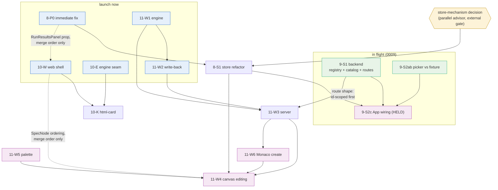

# ADR 0012 — Wave-2 build sequencing and parallelization plan

Status: **planning doc** (2026-07-23) · Scope: ordering/parallelization only —
no design decisions are made here beyond sequencing · Sequences the approved
builds of ADR 0008 (frontend sync), ADR 0009 (entry points — **in flight**),
ADR 0010 (node rendering), ADR 0011 (whole-graph editing) into
`integration/wave-1`. · Explicitly out of scope: ADR 0006 (collapsible
composites) and the execution sandbox — **deferred, not sequenced**.

## Inputs and standing assumptions

- **0009 is already running** on `feat/entry-point-picker` (streams S1 backend
  / S2 frontend per its own build plan). This plan sequences everything else
  *around* it and gives that agent one course correction (hold S2c — see
  §Launch schedule).
- **0008's store mechanism (Zustand vs hand-rolled React) is being re-decided
  by a parallel advisor.** Only the *mechanism* is open; the seam — one store,
  selector-derived views, a single `ingest*` acceptance door, optimistic
  overlay, `rev` epochs — stands either way. 0008 **Phase 0** needs no store
  at all and is not gated.
- **0011's HD1–HD4 are treated as signed off by the green-light.** If that is
  wrong, only 0011-W1/W2/W3 pause; nothing else in this plan moves.
  Per 0011's own plan, dispatching W2 doubles as sign-off on its fidelity
  test list (TDD from the ADR).
- Baseline: `integration/wave-1` at `c075d490` already contains Monaco source
  editing, dynamic handcalc (ADR 0007), and the fix wave.

## Stream inventory

| Id | From | Content | Code surface |
|---|---|---|---|
| **8-P0** | 0008 Phase 0 | Immediate stale-UI fix: run-epoch stamp + seq-guarded reload + ingest PUT responses; server re-projects on `put_source` | `App.tsx`, `widgets/context.tsx`, `GraphView.tsx` (prop), `RunResultsPanel.tsx` (prop), `server/app.py` (~3 lines) |
| **8-S1** | 0008 Phase 1 | The store refactor: `store/sync.ts` + `queue.ts`, App→shell, selector consumers, socket-signature structure key, retire `makeGraphCommitter` | `web/src/store/` (new), `App.tsx`, `GraphView.tsx`, `inspect.ts`, `NodeInspector.tsx`, `SourceEditor.tsx`, `widgets/context.tsx` |
| **9-S1** | 0009 (in flight) | `ENTRY_POINTS` registry, `EntryCatalog`, `GET /api/graphs` + id-scoped routes + unscoped aliases, CLI | `engine/authoring.py`, `server/entries.py` (new), `server/app.py`, `server/__main__.py`, `server/demo.py` |
| **9-S2ab** | 0009 (in flight) | api types + `GraphPicker` against the frozen fixture | `web/src/api.ts`, `types.ts`, `components/GraphPicker.tsx` (new), `styles.css` |
| **9-S2c** | 0009 (in flight, **hold**) | App wiring: URL-keyed selection, swap/clear, dirty guard | `App.tsx` |
| **10-E** | 0010 | Engine seam: `Renderer` class, `renderer=` kwarg threading, schema validation | `engine/spec.py`, `authoring.py`, `registry.py`, `schema.py`, engine tests |
| **10-W** | 0010 | Web shell: renderer registry, `RendererSlot`, one-line `SpecNode` mount, panel mount (D7) | `web/src/node-renderers/` (new), `types.ts` (additive), `SpecNode.tsx` (1 line), `RunResultsPanel.tsx` |
| **10-K** | 0010 | `html-card` kind + pack decorator lines + e2e | `node-renderers/html-card/` (new), 1 line in `node-renderers/index.ts`, decorator lines in `nodepacks/sym`, `nodepacks/table`, showcase |
| **11-W1** | 0011 | Engine: `bind(partial=)`, id minting (`engine/naming.py`), alias helpers | `engine/bind.py`, `engine/composite.py`, `engine/naming.py` (new), tests |
| **11-W2** | 0011 | Write-back: structural insert/delete strategies + import management + fidelity tests | `server/writeback.py`, `tests/test_writeback_fidelity.py` |
| **11-W3** | 0011 | Server: `validate mode=edit`, `POST /api/source`, `add_function_source`, module listing, structural warnings in PUT response | `server/app.py`, `server/workspace.py` |
| **11-W5** | 0011 | Palette UI (drag payload contract with W4) | `components/Palette.tsx` (new) |
| **11-W6** | 0011 | Monaco create-mode authoring flow | `components/SourceEditor.tsx`, `api.ts` |
| **11-W4** | 0011 | Canvas editing: connect/delete/drop, validate-on-connect, positions, save queue | `GraphView.tsx`, `buildGraph.ts`, `layout.ts`, `web/src/editing/` (new), `SpecNode.tsx` (handles/chrome) |

## 1 — Dependency DAG

Solid edges are hard dependencies (can't start / can't finish correctly
without the upstream). Dotted edges are **merge-order-only** constraints:
both streams may run in parallel worktrees, but the named one lands first and
the other rebases (the overlap is a one-line or one-prop touchpoint).

Critical path to full 0011: `store decision → 8-S1 → 11-W4` on the frontend,
and `11-W1 → 11-W2 → 11-W3 → 11-W4` on the backend. W1/W2 start today, so the
backend leg is off the clock immediately; the frontend leg is why the store
decision is the single most schedule-sensitive external input.

## 2 — File-ownership map

Rule: **one writer per file per phase.** Where two streams must touch the
same file, the table names who lands first; the second rebases over a
deliberately tiny touchpoint.

### Hotspots (contended files)

| File | Claimants (in landing order) | Resolution / seam |
|---|---|---|
| `web/src/App.tsx` | **8-P0** → **8-S1** → **9-S2c** | P0 patches the existing reload/run state (small diff). 8-S1 then *rewrites* App into shell + selectors — it owns the file wholesale during Phase B, nobody else touches it. 9-S2c lands after, adding only the URL-key input + `<GraphPicker/>` mount against the store's key API. **The in-flight 0009 agent must not wire App.tsx now** (see course correction). |
| `web/src/components/SpecNode.tsx` | **10-W** → **11-W4** | 10-W's whole contract is a one-line mount (`ResultChips` → `RendererSlot`) — the ADR designed it to be the *only* SpecNode change, precisely so consumers never touch the file again. Land it early; 11-W4's later chrome work (connect affordances/handles) rebases over one line. The reverse order would force 10-W to rebase over W4's large chrome diff. |
| `web/src/GraphView.tsx` | **8-P0** (one prop) → **8-S1** (selectors + socket-signature key) → **11-W4** (editing handlers, deletes `nodesConnectable={false}`) | 8-S1 owns the reconcile/structure-key logic; W4 builds its mutation handlers *on top of* the store-fed GraphView. W4 never reimplements reconciliation — that's the seam that keeps the two diffs disjoint within the file. |
| `web/src/buildGraph.ts`, `layout.ts` | **11-W4** exclusively | 8-S1 *calls* `buildFlow` from selectors but must not edit these files; positions/partial-layout are W4's. |
| `web/src/components/RunResultsPanel.tsx` | **8-P0** (stale banner prop) → **10-W** (D7 registry resolve) | Both diffs are ~10 lines in different regions (banner at top, output-render resolve in body). P0 lands first only because it ships first anyway. |
| `server/app.py` | **8-P0** (~3 lines in `put_source`) → **9-S1** (route rescoping: closure trio → catalog, scoped routes + aliases) → **11-W3** (`validate mode=edit`, `POST /api/source`) | P0 first (tiny, urgent). 9-S1 is the big restructure — 11-W3 waits for it and writes its new endpoints **id-scoped from day one** (`POST /api/graphs/{id}/source`), never building on the doomed unscoped closures. 0008 Phase 2 (SSE `/api/events`) is next-wave and stays out. |
| `server/workspace.py` | **11-W3** exclusively this wave | (0008 Phase 2's file watcher is next wave.) |
| `server/writeback.py` | **11-W2** exclusively | Highest-risk file in the wave; single owner, TDD from the ADR's fidelity list. |
| `web/src/api.ts`, `types.ts` | **9-S2ab** → **10-W** (`renderer` field on `NodeSpec`) → **11-W6** (create call) | All additive appends; conflicts are textual only. Sequenced by merge order; each rebases in minutes. |
| `web/src/widgets/context.tsx` | **8-P0** (pass PUT result through) → **8-S1** (retires it) | Same owner, sequential phases. |
| `engine/authoring.py` | **9-S1** (`ENTRY_POINTS` + `main()` registration) → **10-E** (`renderer=` kwarg) | Different functions in the file (`main` vs `node`); 9-S1 is in flight so it lands first, 10-E rebases trivially. |
| `nodepacks/sym/__init__.py` + showcase example | **10-K** (decorator lines) | One line per pack; no other wave-2 stream touches packs. |

### Uncontended (single-owner) files

| Owner | Files |
|---|---|
| 8-S1 | `web/src/store/` (new), `inspect.ts`, `NodeInspector.tsx`, `SourceEditor.tsx` (store-backed source cache only) |
| 9-S1 | `server/entries.py` (new), `server/__main__.py`, `server/demo.py` |
| 9-S2ab | `components/GraphPicker.tsx` (new) |
| 10-E | `engine/spec.py`, `engine/schema.py`, `engine/registry.py` |
| 10-W | `web/src/node-renderers/{registry.ts,index.ts,RendererSlot.tsx}` (new) |
| 10-K | `web/src/node-renderers/html-card/` (new) |
| 11-W1 | `engine/bind.py`, `engine/composite.py`, `engine/naming.py` (new) |
| 11-W5 | `components/Palette.tsx` (new) |
| 11-W6 | `SourceEditor.tsx` **create mode** (coordinate with 8-S1's touch — see note) |
| 11-W4 | `web/src/editing/` (new) |

**SourceEditor note:** 8-S1 changes how the editor *reads* (store-backed
source cache); 11-W6 changes what it *does* (create mode). W6 starts after
8-S1 has merged (W6 is gated on W3 anyway, which lands later), so in practice
they never hold the file concurrently.

## 3 — Launch schedule

### Dispatch NOW (five parallel worktrees + one course correction)

| # | Stream | Branch (suggested) | Why now |
|---|---|---|---|
| 1 | **8-P0** immediate fix | `fix/stale-run-sync` | Ships the reported-bug fix in days; gates nothing but unblocks honest staleness cues 0010's rendered cards will lean on. No store, no decision dependency. |
| 2 | **11-W1** engine | `feat/graph-edit-engine` | Pure engine Python, zero contention, on 0011's critical path. |
| 3 | **11-W2** write-back | `feat/structural-writeback` | Owns `writeback.py` exclusively. Its only W1 touchpoint (`partial=` bind) is consumed in W3, not here — so it runs parallel to W1, not stacked. Write the fidelity tests from the ADR first (insert-preserves-comments, delete-takes-attached-comment, import-added/aliased, fallback-warns). |
| 4 | **10-E** engine seam | `feat/renderer-spec-seam` | Pure Python mirror of the Widget seam; zero contention (one trivial rebase over 9-S1's `authoring.py` change). |
| 5 | **10-W** web shell | `feat/renderer-slot` | New subtree + one-line SpecNode mount. Runs parallel to 8-P0; merges after it (RunResultsPanel prop). Landing this early is what keeps SpecNode quiet for 11-W4 later. |
| — | **Course-correct the in-flight 0009 agent:** proceed with S1 (all) and S2a/S2b against the frozen fixture; **do not start S2c** (App.tsx wiring). Park the branch at "picker works against fixture + backend routes live"; S2c is re-dispatched as an integration task after 8-S1 merges. This matches 0009's own build plan ("sequence S2c after 0008's store skeleton exists"). | | |

### Stacked / gated (dispatch when the gate clears)

| Stream | Gate | Notes |
|---|---|---|
| **8-S1** store refactor | Store-mechanism decision **and** 8-P0 merged | The moment the parallel advisor decides, dispatch. Also have it pin 0011's D3 answer (eager vs batched structural saves) in the store's save-queue contract *before* W4 dispatch — W4 codes against it. |
| **10-K** html-card kind | 10-E and 10-W merged | Conflict surface is one registration line + decorator lines; quick. |
| **11-W3** server | 11-W1 + 11-W2 merged, **and 9-S1 merged** | Writes `POST /api/graphs/{id}/source` and `validate mode=edit` against the catalog-shaped app.py once, not twice. |
| **9-S2c** picker integration | 8-S1 merged (+ 9-S1/S2ab already on the branch) | Small task: URL key in, store keyed by entry id, fixture→live swap, dirty-buffer confirm. |
| **11-W5** palette | 11-W3 merged (can start earlier behind a flag against `GET /api/specs`, which is unchanged — dispatcher's option if there's idle capacity) | Drag-payload contract with W4 frozen at dispatch. |
| **11-W6** Monaco create mode | 11-W3 merged (needs `POST /api/source` + module listing); 8-S1 already in | |
| **11-W4** canvas editing | 8-S1 + 11-W3 + 10-W merged; W5/W6 contracts frozen (their code can still be in flight) | Last mover by design: it touches the most contended canvas files after everyone else has landed their small claims. |

### Merge order into `integration/wave-1`

1. **8-P0** — small, urgent, first.
2. **9-S1** — backend routes + aliases (in flight; lands when ready, rebasing over P0's 3 lines in `app.py`).
3. **10-E** — pure engine, anytime; slot it early to unblock 10-K.
4. **10-W** — after 8-P0 (RunResultsPanel), before anything else touches SpecNode.
5. **11-W1**, then **11-W2** — engine/server Python, disjoint from all frontend merges; order between them only matters if W2 ends up consuming W1 helpers.
6. **10-K** — after 3+4; trivial.
7. **8-S1** — the big frontend refactor; rebases over 10-W's one line and 9-S2ab's additive api/types. Everything frontend after this point builds on the store.
8. **9-S2c** — 0009 integration complete; **0009 done.**
9. **11-W3** — server complete.
10. **11-W5**, **11-W6** — parallel, either order.
11. **11-W4** — last. **0011 done; wave complete.**

Rationale for the shape: everything that is *small and contended* lands early
(P0, 10-W's one line, 9-S1's route shape), so the two *large* diffs (8-S1
store, 11-W4 canvas) each rebase exactly once over settled ground instead of
everyone rebasing over them.

## 4 — Model routing

| Stream | Model | Rationale |
|---|---|---|
| 8-P0 | **opus** | Small diff, but it *is* the race/epoch reasoning (seq guards, stamp semantics) — correctness-heavy per dollar. |
| 8-S1 store | **opus** | Architecture-central concurrency: single-flight coalescing queue, seq-gated ingestion, optimistic overlay invariants. |
| 9-S1 / 9-S2ab | (in flight — leave as routed) | |
| 9-S2c integration | **sonnet** | Fixture→live swap + URL key against two frozen contracts; integration work. |
| 10-E | **sonnet** | Mechanical mirror of the proven Widget seam; the ADR is effectively the diff. |
| 10-W | **fable** | Design-sensitive shell/slot UI (fallback semantics, interaction shielding, Suspense) with the security posture already decided in the ADR. |
| 10-K | **fable** | Visual card work; sandbox rules are prescriptive (`sandbox=""`, string-only, never `dangerouslySetInnerHTML`) — flag any deviation for review rather than deciding. |
| 11-W1 | **opus** | Bind semantics + namespace-aware id minting; correctness-heavy engine. |
| 11-W2 | **opus** | Highest-risk code in the wave (source-fidelity write-back); TDD from the ADR's test list. |
| 11-W3 | **sonnet** | Endpoint plumbing over W1/W2 primitives and 9-S1's route shape; integration. |
| 11-W5 | **fable** | Palette UX (grouping, search, drag affordance). |
| 11-W6 | **sonnet** | Wiring the existing Monaco editor into create mode against a done endpoint; mostly flow integration. Route to fable instead if the create-flow UX (template, target-module picker) turns out to need design judgment. |
| 11-W4 | **fable**, with the save-queue contract supplied by 8-S1 | Canvas feel is the product risk here; the correctness-heavy part (save queue, validation authority) was deliberately moved into the store (opus) and server (W2/W3) already. |

## 5 — Judgment calls (explicit, overridable)

1. **10-W lands before 11-W4 — no shared-seam pre-refactor.** Both edit
   `SpecNode.tsx`. Alternative considered: extract a shared "card chrome"
   seam first, then let both build on it. Rejected: 10-W's `RendererSlot`
   *is* the seam for the render surface, and its SpecNode footprint is one
   line by design; a pre-refactor would add a serialized step to the
   critical path to save a one-line rebase. **Call: 10-W first, W4 rebases.**
2. **9-S1 lands before 11-W3.** Both restructure `server/app.py` routing.
   Alternative: W3 writes unscoped endpoints now, 0009 rescopes them later —
   that's guaranteed double work and churns `app.py` twice. Cost of the
   chosen order: W3 waits on the in-flight 0009 backend (expected to be the
   earlier finisher anyway, since it's already running). **Call: 9-S1 first;
   W3 is id-scoped from day one.**
3. **8-P0 dispatches now and does not wait for the store decision.** The
   store advisor could conceivably reshape Phase 0's App.tsx patch. But P0
   fixes a live reported bug, its logic (epoch stamp + seq guard + ingest)
   survives verbatim under either store mechanism (0008 Part 4 designed it
   store-free), and 8-S1 subsumes it cleanly. **Call: ship P0 now.**
4. **Holding 9-S2c rather than letting the in-flight agent finish 0009.**
   Alternative: let it wire App.tsx against today's `reload()` model and
   refactor under 8-S1 later. That makes 8-S1 rebase over fresh picker
   wiring *and* rewrite it — the exact double-build 0011's ADR warns about
   for the canvas. The 0009 ADR itself prescribes the hold. **Call: hold
   S2c; re-dispatch post-store as a small integration task.**
5. **11-W5 palette start time.** It's gated on W3 in the 0011 plan, but the
   spec palette reads `GET /api/specs`, which no wave-2 stream changes. If
   there's idle fable capacity mid-wave, W5 can start behind a flag right
   after 8-S1 merges, freezing only the drag-payload contract with W4.
   **Call: dispatcher's option; default to after W3 to avoid a speculative
   contract.**
6. **W2 parallel to W1 rather than stacked.** 0011's own DAG draws W1→W2,
   but the files are disjoint and the one coupling (`partial=` bind) is
   consumed in W3. Running them in parallel takes the two opus-grade
   streams off the clock simultaneously. Risk: if W2 discovers it needs a
   W1 helper (e.g. alias logic), it stacks mid-flight — acceptable.
   **Call: parallel.**
7. **HD1–HD4 assumed signed off.** "Approved for build" is read as covering
   0011's four MAJOR human-review decisions (with the ADR's recommendations:
   HD1 a+c, HD2 as specified, HD3 sidecar-authoritative, HD4 server-checked
   minting). If any is actually still open, pause only W1/W2 (W3 onward is
   already downstream) — the rest of this plan is unaffected.

## Wave exit criteria

- All eleven streams merged in the order above; `integration/wave-1` green.
- 0009's unscoped-alias removal and 0008 Phase 2 (SSE liveness, file
  watcher) are **wave-3 candidates**, recorded here so the aliases don't
  quietly become permanent.
- ADR 0006 and the execution sandbox remain deferred; nothing in this wave
  paints over their seams (0010 forwarded the collapsed-composite renderer
  question to 0006; 0011-D8 scopes editing to top-level `@main`).
