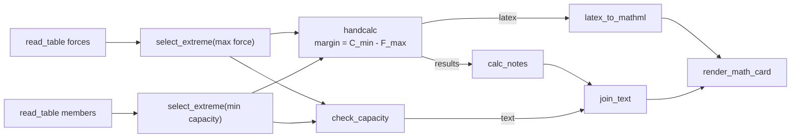
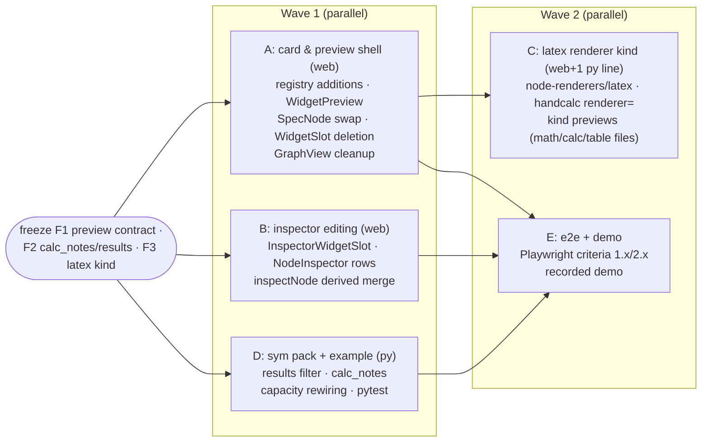

# ADR 0013 — Inspector-hosted widget editing and a single source of truth for the math equation

Status: **proposed** · Scope: `graph-engine/` · Relates to: ADR 0004 (graph ⟷
source bijection — D7 straight-line form), ADR 0005 (widget seam: registry,
editor props, commit path), ADR 0007 (dynamic handcalc: `DerivedInputs`, the
calc widget, `results`), ADR 0010 (node renderer registry / `html-card`),
ADR 0011 (canvas editing), ADR 0012 (wave-2 sequencing)

Two UI improvements, **both already decided in principle** by the user; this
ADR turns them into a buildable design:

1. **All widget editing moves off the node card into the inspector pop-up.**
   The card becomes a read-only face: per-widget rendered preview, sockets,
   and — after a run — the filled-in result. Clicking a node opens the
   inspector; the editors live there, one per widget-bearing input.
2. **The equation is declared once** (Option A, decided): the capacity-check
   caption is generated from `handcalc.results` by a new notes node wired
   `handcalc.results → caption path`, replacing the two `describe(label=...)`
   calls that re-declare the symbol names — and making the
   `handcalc → caption` dependency an explicit wire on the canvas.

Residual decisions the interview did not pin are collected in
**“MAJOR DECISIONS / FOR REVIEW”** at the end.

## Context

What exists today (all on `integration/wave-1`):

- **Editing is inline on the card.** `web/src/components/SpecNode.tsx` mounts
  `web/src/widgets/WidgetSlot.tsx` in every unwired input's socket row. With
  a commit in context (`WidgetEditingProvider` in `App.tsx`, providing the
  store's stable `commitLiteral`), the slot renders a clickable chip that
  expands into `editorFor(input.widget)` — with a large apparatus that exists
  *only because the editor sits inside a ReactFlow canvas*: capture-phase
  click-outside/Escape dismissal, `nodrag`/`nowheel`/`nopan` shielding,
  `stopPropagation` so edits don't select the node, a `Done` bar, and a
  `GraphView.tsx` MutationObserver that zooms the viewport to a slot opening
  at unreadable zoom. `GraphView.onNodeClick` must *exclude* clicks landing
  on `widget-chip`/`widget-slot` so editing doesn't slide the inspector over
  the canvas.
- **The inspector is read-only.** `web/src/components/NodeInspector.tsx`
  (opened by node click, closed by pane click/×) renders each input as a
  passive `InputRow` (`inspector-input`): name, type, a source tag
  (wired/literal/widget/default/required), and the resolved value. No
  editors. It also hosts the source editor (`Edit source` expands the panel —
  the precedent that the inspector can grow an editing mode).
- **The inspector misses derived sockets.** `inspectNode` (`web/src/inspect.ts`)
  reads `spec.inputs` from the *raw* specs; `buildFlow` (`buildGraph.ts`)
  merges the store's `derivedByNode` into each dynamic node's input list for
  the canvas, but `GraphView` calls `inspectNode(graph, specs, …)` without
  it. A `handcalc` node's symbol sockets (`C_min`, `F_max`) therefore render
  on the card but not in the inspector. Tolerable for a read-only panel;
  fatal for the *only* editing surface.
- **The render surface already exists.** `SpecNode` mounts
  `node-renderers/RendererSlot.tsx` below the sockets (ADR 0010 D3): a
  declared renderer kind mounts there (`html-card` on
  `sym.render_math_card`); otherwise `ResultChips` shows post-run per-socket
  chips (`latex · str`, `results · dict`). `handcalc` declares **no**
  renderer, so its typeset output is invisible on the card — you open the
  results panel or inspector to see anything.
- **The calc editor already typesets client-side.** `widgets/calc/CalcEditor.tsx`
  renders a live KaTeX preview of the draft via `calc/translate.ts`
  (calc-line → LaTeX mini-translator, raw-text fallback) — npm-bundled,
  lazy, offline. This is exactly the machinery a read-only card preview
  needs, currently trapped inside the editor component.
- **The caption re-declares the equation.** In
  `examples/capacity_check/capacity_check.py`:

  ```python
  f_note = describe(max_force.value, label="F_max")
  c_note = describe(min_capacity.value, label="C_min")
  caption = join_text(f_note, c_note, verdict.text)
  ```

  The strings `"F_max"`/`"C_min"` restate the equation's symbol names — a
  second source of truth. Rename a symbol in
  `handcalc(lines="margin = C_min - F_max", …)` and the caption silently
  keeps the old name. And because the caption path is fed from
  `select_extreme` values, **no wire connects `handcalc` to the caption** —
  the dependency the reader most wants to see is invisible (the confusion
  that motivated this change).
- **`handcalc.results` is handcalcs' `locals()` dict.** `typeset_calc`
  compiles `lines` into `def _calc(<values keys>): …; return locals()`, so
  `results` = every parameter + every assigned LHS. For the `handcalc` node,
  `values = {**_MATH_WHITELIST, **symbols}` — so `results` today contains
  **the seven injected math-whitelist entries too** (`sqrt`…`exp` are
  *function objects*, serialized as `{"$repr","$type"}` noise; `pi` is a
  float). The useful content is: input symbols in kwargs (= appearance)
  order, then computed LHS values — e.g.
  `{C_min: 210.0, F_max: 120.0, margin: 90.0}` once the whitelist is
  filtered.

Constraints carried forward unchanged: engine pure-stdlib and UI-agnostic;
Python is the authoritative validator (ADR 0005 A-D5); widget commits ride
the store's single-flight queue and `PUT /api/graph` (ADR 0008); the graph ⟷
source bijection is untouched (both changes are view-layer or ordinary-node
work); no CDNs; untrusted output keeps the ADR 0010 D5 posture (deviation in
D5 below is flagged for review).

---

## Part 1 — All editing moves to the inspector (Change 1)

### D1 — One editing surface: the inspector; the card is read-only

Decided. The node card never mounts an editor for any widget kind (`text`,
`number`, `checkbox`, `math`, `table-recipe`, `calc`). Clicking a node opens
the inspector (today's behavior, unchanged — selection *is* opening); the
inspector renders an editor for every widget-bearing unwired input. The card
shows:

- (a) a **read-only rendered preview** of each widget param (D2),
- (b) the **sockets** (unchanged — handles, names, types, wired state),
- (c) **after a run, the filled-in result** via the ADR 0010 render surface —
  for `handcalc`, the substituted handcalcs output (D5).

What this deletes is exactly the canvas-editing apparatus: the chip → expand
state machine, capture-phase dismissal, the `Done` bar, the zoom-to-slot
observer, and the `onNodeClick` widget-slot exclusion. Editing in a docked
panel needs none of it.

### D2 — The read-only preview: a `kind → preview` registry beside the editor registry

Mirror of ADR 0005 A-D4, additively, in the same files:

```tsx
// web/src/widgets/registry.ts (additions — editor contract untouched)
export interface WidgetPreviewProps<V = unknown> {
  /** Current literal from graph.nodes[].inputs[name] (undefined if unset). */
  value: V;
  /** spec.widget.config, opaque to the shell. */
  config: Record<string, unknown>;
  /** The input spec, for labels and the fallback. */
  input: SpecInput;
}
export type WidgetPreview = ComponentType<WidgetPreviewProps>;

/** Where the card mounts this kind's preview: in the socket row (chip-sized)
    or as a block in the card's preview strip (typeset equations, etc.). */
export type PreviewPlacement = 'inline' | 'block';

const PREVIEWS = new Map<string, { component: RegisteredPreview; placement: PreviewPlacement }>();
export const registerWidgetPreview = (
  kind: string, component: RegisteredPreview, placement: PreviewPlacement = 'inline',
): void => { … };
/** Unknown/absent kind → null: the slot falls back to the value chip. */
export const previewFor = (w: Widget | null | undefined) => … ;
```

- **Fallback = today's `ReadOnlyState`** (the value chip / widget-kind label /
  `required` marker currently inside `WidgetSlot`): an unregistered kind
  degrades to exactly the pre-change read-only markup — the same
  forward-compatibility story as `editorFor` (A-D6) and `rendererFor`
  (0010 D4).
- **Per-kind previews (v1):**

  | kind | preview | placement |
  |---|---|---|
  | `text` / `number` / `checkbox` | fallback value chip (no registration needed) | inline |
  | `math` | typeset expression via `math/translate.ts` + KaTeX; raw-text fallback per the existing honesty rule | block |
  | `calc` | typeset assignment lines via `calc/translate.ts` + KaTeX (the CalcEditor draft-preview pipeline, extracted — see D3); raw-text fallback per line | block |
  | `table-recipe` | compact summary chip: `recipe · N steps` with the op names in order (e.g. `filter → derive → aggregate`), from the recipe literal; malformed/absent value → fallback chip | inline |

  Previews render **from the committed literal only** — no store access, no
  derive calls, no run data. They are pure views of the value (the same
  status as layout in ADR 0004 D6: excluded from the bijection).
- **Heavy previews are lazy** and *share the editor's chunk*: the calc/math
  preview components live in `widgets/calc/` / `widgets/math/` next to their
  editors, registered with the existing `lazyEditor`-style wrapper
  (`lazyPreview`), so KaTeX and the translators stay one npm-bundled,
  code-split unit per kind. Registration is one line per kind in
  `widgets/index.ts`, same as editors.

### D3 — The card seam: what moves out of `SpecNode.tsx` / `WidgetSlot.tsx`

File-level plan (web):

| File | Change |
|---|---|
| `web/src/widgets/WidgetPreview.tsx` (new) | The card's only widget mount. Renders `previewFor(input.widget)` (inline or block per registration) with the `ReadOnlyState` fallback; owns the `Suspense` boundary for lazy previews. Read-only by construction — takes no commit, mounts no editor. `data-testid="widget-preview"`, `data-kind`, `data-input`. |
| `web/src/components/SpecNode.tsx` | The socket-row `WidgetSlot` mount becomes `WidgetPreview` (inline placement). A new, thin **preview strip** `div.ge-node__previews` between the sockets body and `RendererSlot` mounts the block-placement previews, one per widget-bearing input whose kind registered `block`. No other change — header, sockets, handles, badges, `RendererSlot` untouched. |
| `web/src/widgets/WidgetSlot.tsx` | **Deleted.** The chip/expand/dismiss machinery is canvas-specific and obsolete; its read-only branch (`ReadOnlyState`, `formatValue`) moves into `WidgetPreview.tsx`; its editor-mounting duty moves to `InspectorWidgetSlot` (D4). |
| `web/src/GraphView.tsx` | Delete the zoom-to-widget-slot `MutationObserver` effect and the `onNodeClick` `widget-chip`/`widget-slot` exclusion (nothing editable is left on a card). Pass `derivedByNode` into `inspectNode` (D4). |
| `web/src/widgets/context.tsx`, `store/*` | **Unchanged.** The commit seam (`WidgetEditingProvider` → `commitLiteral` → store queue → `PUT /api/graph`) is untouched; only the mount point of the consumers moves. `commitEquation` (calc) likewise. |
| `web/src/widgets/calc/CalcEditor.tsx` → `calc/preview.tsx` (new) | Extract the draft-typeset pipeline (`loadKaTeX`, `renderKatex`, `calcLinesToPreview` orchestration + the rendered-lines list) into a shared `CalcPreview` component; `CalcEditor` re-uses it for its live draft preview, the card preview registers it (with the committed literal as value). One typesetting implementation, two mounts. |
| `web/src/widgets/math/…` | Same extraction for the math kind's typeset preview. |
| `web/src/widgets/table/…` | Add the `recipe · N steps` summary preview component. |

The editors themselves (`builtins.tsx`, `DefaultEditor`, `MathEditor`,
`TableRecipeEditor`, `CalcEditor`) are **unchanged in contract** — same
`WidgetEditorProps`, same commit semantics (blur/Enter for text/number,
immediate for checkbox, `commitEquation` with derive-gate and prune-on-commit
for calc). They just mount somewhere else.

### D4 — The inspector hosts the editors

`NodeInspector` gains an editing slot per input row, plus the derived-socket
fix that makes it a complete surface:

- **`web/src/widgets/InspectorWidgetSlot.tsx` (new, owned by the widgets
  subtree):** given `{input, value, hasLiteral, nodeId}`, resolves
  `editorFor(input.widget)`, supplies `Suspense`, and wires
  `onCommit → useWidgetCommit()` — the same context the canvas slot used
  (`NodeInspector` renders inside `GraphView`, which `App.tsx` already wraps
  in `WidgetEditingProvider`, so no provider moves). No chip, no collapse,
  no capture-phase listeners: the editor renders **inline, always expanded**,
  in the row. `data-testid="inspector-widget-slot"`, `data-input`.
- **`NodeInspector.tsx` / `InputRow`:** an **unwired** input whose spec
  declares a widget renders `InspectorWidgetSlot` under the existing
  row head (name · type · source tag); the read-only `ValueLine` remains for
  wired inputs, non-widget inputs, and post-run values (the run value line
  stays visible below the editor — “what it is set to” and “what flowed in
  the last run” are both useful). A wired input stays read-only (its value
  comes from the graph; unwire to edit — unchanged rule from the card era).
- **Derived sockets (the `inspectNode` gap):** `inspectNode` gains a
  `derivedInputs?: SpecInput[]` parameter merged into `inputDecls` exactly as
  `buildFlow` merges `derivedByNode` (static inputs + derived entries, in
  deriver order). `GraphView` passes
  `derivedByNode.get(selectedNodeId)`. Result: a `handcalc` node's inspector
  shows `lines` (calc editor), `precision` (number editor), and every symbol
  socket — wired ones read-only with their source tag, unwired ones with the
  `number` editor. Without this, Change 1 would *remove* the only place
  derived symbols could be given inline values.
- **The calc editor in a panel** is strictly better-housed: its
  derive-debounce, symbol chips, prune-on-commit toast, and multi-line
  textarea (ADR 0007 D8) no longer fight canvas zoom or pointer capture.
  Its store-facing behavior (`commitEquation`) is untouched.
- **Panel ergonomics:** the inspector's width today fits read-only rows; the
  calc and table editors are physically larger. v1: the inspector gets a
  modestly wider layout when the selected node has any block-scale editor
  (`calc`, `table-recipe`) — the same expand-in-place pattern
  `ge-inspector--editing` already uses for the source editor. (Exact
  treatment is a residual decision — FOR REVIEW 4.)

Interaction rules that fall out (no new machinery):

- Click node → inspector opens with editors (existing selection flow).
- Click pane / press Escape / click × → inspector closes; blur-committing
  editors settle on blur as they do today (the panel unmount path must blur
  the focused field first — the one behavior ported from `WidgetSlot`'s
  dismissal code, now in the inspector's close path).
- Editing never moves the viewport: the canvas is not involved.

### D5 — Post-run: the card shows the filled-in result

With the editor gone, the card's post-run duty is display, via the ADR 0010
surface — which already handles most nodes (`html-card` on
`render_math_card`; chips elsewhere). The gap is `handcalc` itself: its
outputs (`latex`, `results`) render as chips, so “the handcalcs output with
the input values substituted” is not on the card. Design:

- **New renderer kind `latex`** (`web/src/node-renderers/latex/`, lazy
  chunk): reads `config.socket` (default `latex`) from `result`; when it is a
  string, renders it client-side with KaTeX (`renderToString`,
  `throwOnError: true`, default `trust: false`); on parse failure or a
  non-string value, falls back to the chips. Before the first run it shows
  the standard placeholder. Registered in `node-renderers/index.ts` (one
  line); `RendererSlot` is untouched.
- **`sym.handcalc` declares it** (one decorator line):

  ```python
  @node(
      outputs=["latex", "results"],
      widgets={"lines": Widget("calc", language="python-calc", multiline=True)},
      dynamic=DerivedInputs(param="lines", derive=calc_free_symbols),
      renderer=Renderer("latex", socket="latex"),
  )
  def handcalc(lines: str = "", precision: int = 3, **symbols) -> dict: …
  ```

  (ADR 0007's effective-spec derivation already passes `renderer` through
  unchanged — the contract sentence recorded in 0010's composition notes.)
- **Card composition, before vs after a run:** the `calc` block preview (D2)
  is the *declared equation* (from the literal, always current); the `latex`
  render surface is the *computed, substituted* result (symbolic + numbers +
  result rows, as handcalcs emits). Before a run: preview + placeholder.
  After: preview + substituted card. They answer different questions
  (“what is configured” vs “what happened”) and the handcalcs output's first
  row repeats the symbolic form — keep both in v1 (FOR REVIEW 3 offers the
  alternative of collapsing the preview when a fresh result exists).
- **Security honesty:** ADR 0010 D5's rule is “HTML-bearing kinds render in a
  `sandbox=""` iframe”. The `latex` kind renders **LaTeX text, not HTML** —
  KaTeX parses it and generates its own markup; `trust: false` (default)
  refuses `\href`/`\includegraphics`-class commands, `throwOnError` falls
  back to chips, and no raw value string is ever interpolated into markup.
  This is the same posture the calc/math widgets already ship for *draft*
  text — but a run **output** is upstream-node-controlled, which is a wider
  trust surface than the user's own draft. This deviation is deliberately
  flagged: **FOR REVIEW 1** (accept KaTeX-in-host-DOM for the `latex` kind,
  or require the iframe posture with inlined KaTeX CSS at a real complexity
  cost).

### What Change 1 explicitly does not touch

The store and queue (`commitLiteral`, `commitEquation`, single-flight save,
optimistic overlay), the derive endpoint and its debounce, `buildFlow`'s
derived-socket folding for the canvas, `RendererSlot`/`html-card`, the source
editor flow, the bijection, and every server API. The graph JSON and the
`.py` never learn where editing happened.

---

## Part 2 — Single source of truth for the equation (Change 2, Option A — decided)

### D6 — Clean `handcalc.results` first: filter the injected whitelist

`handcalc` injects `_MATH_WHITELIST` into the values it passes to
`typeset_calc`, so its `results` currently carries `sqrt`/`sin`/… (function
objects → `{"$repr","$type"}` in the serialized run) and `pi`. That is
internal plumbing leaking into an output socket — noise for the inspector
and chips today, and garbage input for the notes node tomorrow. Fix at the
source, in `handcalc` only:

```python
out = typeset_calc(lines, values=values, precision=precision)
# results = the calc's own names only: input symbols (appearance order per
# ADR 0007 D5 canonical kwargs), then computed LHS values. The injected math
# whitelist is an implementation detail, not part of the calc.
out["results"] = {k: v for k, v in out["results"].items() if k not in _MATH_WHITELIST}
return out
```

Exact by construction: the deriver (`_NON_SOCKET_NAMES`) guarantees no user
symbol can share a whitelist name, so the filter removes precisely what
`handcalc` injected. `typeset_calc` is untouched — its caller passed `values`
deliberately; `locals()` is its documented contract. (Existing
`test_nodepacks_sym.py` / capacity-check served tests that snapshot `results`
update accordingly.) **FOR REVIEW 6** (accept the output-shape change).

### D7 — A new node, `sym.calc_notes` — not a `describe` mode

Decision point the task left open: new node vs a `describe` mode accepting a
results map. **Recommend: new node.**

- `describe`'s contract is *one value + a caller-declared label* — the
  caller-declared label is the exact pattern Change 2 exists to remove. A
  dict-mode `describe` would be one node with two unrelated behaviors and a
  type-switch on `value`, and its `label` param would be meaningless in
  results-mode — a worse spec, and a muddier palette entry.
- A dedicated node states the intent in the graph: *these notes come from
  that calc*. The wire `handcalc.results → calc_notes.results` is the
  visible dependency the user asked for.
- `describe` stays exactly as is for its real uses (it still labels
  standalone values elsewhere; the capacity example simply stops using it
  for symbols).

```python
# nodepacks/sym/__init__.py (new node, pure stdlib, no heavy imports)
@node
def calc_notes(results: dict, precision: int = 4, sep: str = " · ") -> str:
    """Format a calc's ``results`` map as symbol-value notes, one per entry.

    ``results`` is the ``{symbol: value}`` dict a calc node outputs
    (``handcalc``/``typeset_calc`` socket ``results``). Each entry renders as
    ``name = value`` — the note label IS the symbol name, so the notes can
    never drift from the equation that produced them. Floats are trimmed to
    ``precision`` significant digits; other values use ``str()`` (the same
    formatting rules as :func:`describe`). Entries render in dict order:
    input symbols in appearance order, then computed results.
    """
    if not isinstance(results, dict):
        raise UserError(f"calc_notes needs a results dict, got {type(results).__name__}")
    def fmt(v: object) -> str:
        if isinstance(v, float):
            return f"{v:.{precision}g}"
        return str(v)
    return sep.join(f"{name} = {fmt(value)}" for name, value in results.items())
```

Design points:

- **v1 is symbol-name-as-label** (decided): the note label is the dict key,
  period. An optional `labels: dict = None` mapping symbol → display text is
  the documented later add (additive parameter, absent from v1 — it would
  reintroduce a *deliberate, optional* second declaration, which is fine
  when opted into, but it is not shipped now).
- **All entries render, including computed LHS values** (`margin = 90`).
  The node cannot distinguish inputs from results without re-parsing the
  equation (which would need `lines` — a second copy of the very literal
  we refuse to duplicate, and the deriving param can't be wired per ADR 0007
  D2). Rendering everything is honest, self-contained, and duplicates only
  the final number the card's math block also shows. **FOR REVIEW 2** offers
  the inputs-only alternative (requires a `handcalc` output-shape change).
- Naming: `calc_notes`, not the task's placeholder `render_calc_notes` — it
  emits caption *text*, not HTML; `render_*` in this pack means HTML
  (`render_math_card`). It slots into the pack's text tier next to
  `describe`/`join_text`.
- With D6 in place, `handcalc → calc_notes` yields clean notes. Wired from
  raw `typeset_calc` (whose `values` the caller controls), non-numeric
  entries fall back to `str()` — degraded but visible, per the pack's
  existing `describe` convention; Python remains the authority (A-D5).

### D8 — `capacity_check.py` rewiring (straight-line, ADR 0004 D7)

```python
    steps = handcalc(lines="margin = C_min - F_max",
                     C_min=min_capacity.value, F_max=max_force.value)
    mathml = latex_to_mathml(steps.latex)

    # Logic concern: a separate node decides PASS/FAIL (unchanged — it is a
    # comparison, not the equation).
    verdict = check_capacity(force=max_force.value, capacity=min_capacity.value)

    # Caption concern: the value-notes come FROM the calc's own results, so
    # the symbol names are declared exactly once — in the equation — and the
    # handcalc → caption dependency is an explicit wire on the canvas.
    notes = calc_notes(steps.results)
    caption = join_text(notes, verdict.text)
    report = render_math_card(title="Capacity check", mathml=mathml, caption=caption)
    return report
```

- The two `describe(label=…)` calls are **deleted** (the `describe` import
  goes too); `join_text` drops from three fragments to two (`c` stays empty —
  no signature change).
- Still one single-assignment call per node, arguments only references or
  literals — round-trips through `from_composite(to_composite(g)) == g`
  untouched (no engine or bijection change anywhere in Part 2; `calc_notes`
  is an ordinary static node).
- The canvas now shows the diamond honestly:



- Rename `F_max` → `F_applied` in the equation and: the socket renames
  (ADR 0007), the wire re-attaches via the calc editor's prune/re-wire flow,
  and the caption follows **with zero further edits** — `calc_notes` reads
  whatever keys `results` carries. Nothing to keep in sync, nowhere to
  drift.
- Doc updates ride along: the module docstring's ASCII diagram and the
  `describe(F_max)` mention are rewritten to the new shape.

Python-side file plan: `nodepacks/sym/__init__.py` (D6 filter + `calc_notes`
+ `NODES`/`__all__` entries + `handcalc` `renderer=` line from D5),
`examples/capacity_check/capacity_check.py` (D8),
`tests/test_nodepacks_sym.py` (calc_notes unit tests + results-filter
update), `tests/test_capacity_check_example.py` /
`test_capacity_check_served.py` (rewired graph: node set, edges, unchanged
run text output).

---

## Verification criteria

Explicit and testable — the acceptance gate for the build. Playwright specs
live in `web/tests/` (existing harness: `widgets.spec.ts`,
`calc-widget.spec.ts`, `layout-inspect.spec.ts`, `html-card.spec.ts` are the
patterns to extend); Python assertions in `tests/`.

### Change 1 — inspector editing

| # | Criterion | Proof |
|---|---|---|
| 1.1 | **No editable control renders on any node card.** | Playwright: for a graph exercising all five kinds, `[data-testid="spec-node"]` contains no `input`, `textarea`, `select`, or `[contenteditable]`, and `[data-testid="widget-chip"]` / `[data-testid="widget-slot"]` match nothing anywhere. |
| 1.2 | **Clicking a node opens the inspector with the editor.** | Playwright: click a node card → `[data-testid="node-inspector"]` visible and contains `[data-testid="inspector-widget-slot"]` for each widget-bearing unwired input. |
| 1.3 | **Each kind is editable only in the inspector — one assertion per kind.** | Playwright, per kind: **text** — edit `widget-editor-text` in the inspector, blur, assert the card's `widget-preview` shows the new value and (via the API) `graph.nodes[].inputs` carries it; **number** — same via `widget-editor-number`; **checkbox** — toggle commits immediately; **math** — edit in inspector, card block preview re-typesets (`.katex` present or raw fallback text updated); **table-recipe** — add an op in the inspector editor, card summary chip increments to `recipe · N+1 steps`; **calc** — edit the equation in the inspector (`widget-editor-calc-input`), Cmd/Ctrl-Enter, card sockets update (existing `calc-widget.spec.ts` flows re-targeted at the inspector mount). |
| 1.4 | **The card shows read-only previews + sockets.** | Playwright: per kind above, `widget-preview[data-kind=…]` renders the specified preview (chip value / typeset block / `recipe · N steps`); socket handles still present and wireable (reuse `canvas-editing.spec.ts` connect flow on a node with previews). |
| 1.5 | **Post-run the card shows the filled-in result.** | Playwright: run the capacity graph; the `handcalc` card's `render-surface` shows the substituted output (KaTeX markup containing the substituted numbers, e.g. `210` and `120`) and `render_math_card` still shows its `html-card` iframe. Chips-fallback asserted for a no-renderer node. |
| 1.6 | **Derived sockets are inspectable and editable.** | Playwright: select the `handcalc` node → inspector lists `C_min`/`F_max` rows (wired: read-only + source tag). On a scratch `handcalc` with an unwired symbol, the inspector renders a number editor for it and committing a value round-trips into the wiring line. |
| 1.7 | **Commit path unchanged.** | Existing `store-editing.spec.ts` / `store-queue.spec.ts` / `store-equation.spec.ts` pass unmodified (store API untouched); `widgets.spec.ts` re-targets mounts only. |
| 1.8 | **No canvas regression from removed apparatus.** | Playwright: clicking anywhere on a card (including on a preview) selects the node and opens the inspector — no dead zones; Escape/pane-click closes it; a blur-committing editor open in the inspector settles its draft when the inspector closes. |

### Change 2 — single source of truth

| # | Criterion | Proof |
|---|---|---|
| 2.1 | **Explicit `handcalc → caption` wire.** | pytest: the built capacity graph contains an edge `handcalc.results → calc_notes.results` and a path `calc_notes → join_text → render_math_card.caption` (assert on `graph.edges`). Playwright: the edge is on the canvas (edge id present). |
| 2.2 | **No `describe()` re-declares a symbol label.** | pytest: no node of type `sym.describe` in the capacity graph; grep-level assertion that `capacity_check.py` contains no `describe(` call (and no string literal `"F_max"`/`"C_min"` outside the `lines=` equation). |
| 2.3 | **Renaming a symbol updates the caption with no second edit.** | pytest: rebuild the composite with `lines="margin = C_min - F_app"` (and the kwarg renamed), run, assert the report's caption contains `F_app = 120` and not `F_max`. UI flavor (demo): rename via the calc editor, re-wire the pruned socket, run — caption follows. |
| 2.4 | **Rendered notes match the equation's current symbols.** | pytest: run the graph; for every input symbol kwarg of the `handcalc` wiring line, the caption contains `<symbol> = <value>`; caption contains no symbol that is not in `results`. |
| 2.5 | **Run output is consistent.** | pytest: the report HTML still contains the verdict text (`PASS — 120 < 210` for the stock CSVs) and the notes (`C_min = 210`, `F_max = 120`, `margin = 90`); `test_capacity_check_example.py` golden output updated once, then stable. |
| 2.6 | **`results` is clean.** | pytest: `handcalc(...)["results"]` keys == `{C_min, F_max, margin}` — no whitelist names, no function objects; served run serialization carries no `{"$repr"}` entries for this node. |
| 2.7 | **Bijection intact.** | Existing round-trip suite (`test_handcalc_bijection.py`, writeback fidelity) passes with the new example: `from_composite(to_composite(g)) == g` including the `calc_notes` node. |
| 2.8 | **`calc_notes` unit contract.** | pytest: formatting (precision, sep, order = dict order), `UserError` on a non-dict, `str()` fallback for non-numeric values. |

### Demo (final deliverable)

A **recorded demo** exercising both changes end-to-end: open the capacity
graph → click `handcalc` → edit the equation in the inspector (rename a
symbol, watch sockets + prune toast) → re-wire → run → card shows the
substituted result and the caption follows the rename with no second edit →
show the read-only card previews (calc/table/text) and the explicit
`handcalc → calc_notes` wire. The recording ships with the build's final PR.

---

## Build & parallelization plan

Freeze on acceptance of this ADR (the wave-α discipline from 0005/0010,
which has held): **(F1)** the preview contract — `WidgetPreviewProps`,
`registerWidgetPreview(kind, component, placement)`, fallback = value chip;
**(F2)** `sym.calc_notes` signature + `results` filter semantics (D6/D7);
**(F3)** the `latex` renderer declaration `Renderer("latex", socket="latex")`.



| Stream | Owns (writes) | Must not touch | Suggested routing |
|---|---|---|---|
| **A** | `widgets/registry.ts` (additive preview API), `widgets/WidgetPreview.tsx` (new), delete `widgets/WidgetSlot.tsx`, `components/SpecNode.tsx`, `GraphView.tsx` (delete zoom effect + click exclusion **only**), `styles.css` (preview strip) | `store/*`, `NodeInspector.tsx`, editor components | strongest model — it owns the shared seam |
| **B** | `components/NodeInspector.tsx`, `widgets/InspectorWidgetSlot.tsx` (new), `inspect.ts` (+`derivedInputs` param), `GraphView.tsx` (the one `inspectNode` call-site line) | `SpecNode.tsx`, `widgets/registry.ts`, `store/*` | strongest model — editing UX + the derived-socket merge |
| **C** | `node-renderers/latex/` (new) + one registration line in `node-renderers/index.ts`; `widgets/{math,calc,table}/` preview components + `calc/preview.tsx` extraction + one registration line each in `widgets/index.ts`; the `renderer=` line on `handcalc` | `RendererSlot.tsx`, `SpecNode.tsx`, registry cores | mid-tier model — additive files against frozen contracts |
| **D** | `nodepacks/sym/__init__.py` (filter, `calc_notes`, `NODES`/`__all__`), `examples/capacity_check/capacity_check.py`, `tests/test_nodepacks_sym.py`, `tests/test_capacity_check_*.py` | `engine/*`, `web/*` | mid-tier model — bounded Python with existing test patterns |
| **E** | `web/tests/*.spec.ts` (new inspector-editing spec; re-target `widgets.spec.ts`/`calc-widget.spec.ts` mounts), demo recording | everything else | mid-tier model, after A/B/D land |

Conflict surface: A and B share `GraphView.tsx` (disjoint hunks: two
deletions vs one call-site edit) and D and C share one decorator line in
`nodepacks/sym/__init__.py` — both trivially mergeable. Everything else is
disjoint by construction. Wave 2 starts when A (for C's registration points)
and A+B+D (for E) merge to the integration branch.

---

## Bijectivity / honesty notes

- **Previews and renderers are views** (ADR 0004 D6 status): nothing new is
  serialized; the graph JSON and `.py` are byte-identical for the same edits
  regardless of where the editor mounted.
- **Change 2 adds ordinary graph structure** — one static node, two edges —
  fully inside the bijective subset; the caption becomes *derived data with
  a visible provenance* instead of parallel declarations.
- **What remains deliberately lossy:** the notes' formatting (`precision`,
  `sep`) is presentation, owned by `calc_notes` params; `results` dict order
  is the calc's appearance order, not sorted; the preview typesetting is
  best-effort with a raw-text fallback (Python stays authoritative).

## Consequences

- The card becomes a pure read/present surface; ~150 lines of canvas-editing
  apparatus (chip state machine, capture-phase dismissal, zoom-to-slot) are
  deleted rather than maintained.
- The inspector becomes the single editing surface and — via the
  `inspectNode` derived merge — finally shows dynamic nodes completely.
- The widget registry gains a preview axis; the renderer registry gains a
  `latex` kind; both additively, with fallbacks preserving today's output.
- `sym` gains `calc_notes`; `handcalc.results` sheds injected internals and
  gains a renderer declaration; `describe` shrinks back to its real job.
- The capacity example's caption cannot drift from its equation, and the
  dependency is a wire you can see.
- No engine, schema, server, or store changes; no new endpoints; the
  bijection and every frozen contract from 0005/0007/0010 are untouched.

## MAJOR DECISIONS / FOR REVIEW

1. **(MAJOR — security posture)** The `latex` renderer kind renders run
   output via KaTeX **in the host DOM** (`trust: false`,
   `throwOnError` → chips fallback), deviating from ADR 0010 D5's
   iframe-for-HTML rule on the argument that LaTeX-through-KaTeX is parsed
   text, not markup pass-through. Alternative: iframe the KaTeX output with
   inlined CSS (real complexity, same visual). *(Recommend: KaTeX in host
   DOM, matching the existing calc/math draft-preview precedent.)*
2. **`calc_notes` renders all `results` entries**, including computed LHS
   values (`margin = 90` appears in the caption as well as in the equation
   block). Alternative: inputs-only, which requires `handcalc` to split its
   output shape. *(Recommend: all entries — self-contained caption, no
   output-shape change.)*
3. **The calc card preview stays visible after a run**, alongside the
   substituted render surface (both show the symbolic form). Alternative:
   hide the preview when a fresh result exists. *(Recommend: keep both in
   v1 — "configured" vs "computed" are different facts; revisit on demo
   feedback.)*
4. **Inspector ergonomics for large editors** (`calc`, `table-recipe`):
   inline-always with a wider panel state (recommended) vs an expand-on-
   click row. *(Recommend: inline-always — one interaction model, no
   collapsed editing state to maintain.)*
5. **Inspector opens on node click** (today's selection behavior, i.e.
   select ≡ open) — no separate "open editor" affordance. *(Recommend:
   confirm as-is; it already satisfies "clicking a node opens the
   inspector".)*
6. **`handcalc.results` output-shape change** (whitelist filtered out) —
   technically observable by any graph reading whitelist keys from
   `results` (none exist in-repo). *(Recommend: accept; it removes
   `$repr` noise from every serialized run.)*
7. **Non-math preview content**: `table-recipe` = `recipe · N steps` +
   op-name chain; `text`/`number`/`checkbox` = the existing value chip.
   *(Recommend: confirm; richer table previews — e.g. column names — are
   additive later.)*
