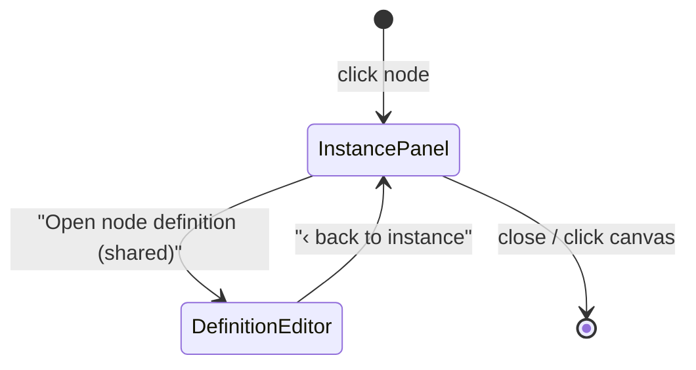

# ADR 0015 — Separate node-instance editing from node-definition editing (and surface docstrings as node metadata)

Status: **proposed** · Scope: `graph-engine/` · Relates to: ADR 0004 (graph ⟷
source bijection: the `@main` call site IS the instance, the `@node` function
IS the definition), ADR 0005 (widget seam), ADR 0007 (derived sockets),
ADR 0011 (whole-graph structural editing), ADR 0013 (inspector-hosted widget
editing — the instance surface this ADR names and completes)

## Problem

Clicking a node opens the inspector, whose one prominent action is **"Edit
source"** (`web/src/components/NodeInspector.tsx`, toolbar) — and that button
opens the **`@node` function definition**: the shared function body behind the
node's *type*, which every instance of that type executes
(`web/src/components/SourceEditor.tsx`, `EditSourceEditor`). Meanwhile the
inspector body *below* the button is quietly showing (and, since ADR 0013,
editing) something entirely different: **this instance's** configuration — its
literals, its wires, its run values.

Two very different objects — *how THIS node is invoked* vs *what EVERY node of
this type does* — are presented in one unlabelled panel, with the definition
editor occupying the primary action slot. Users editing "this node" land in a
file-level Monaco buffer whose save affects every sibling instance; the only
warning ("Shared function — saving affects all N nodes of this type") appears
*after* they are already inside.

ADR 0004 already draws the line precisely; the UI just doesn't:

```
GRAPH (canvas)        WIRING (@main body)                NODE BODIES (@node defs)
node "steps"     ⟷   steps = handcalc(lines=…,     ─┐   @node def handcalc(…):
                       C_min=…, F_max=…)             │       """Typeset …"""
  = the INSTANCE       (call site: literals + wires) └──     = the DEFINITION
                                                             (shared by module.qualname)
```

## Context — what exists today (all `file:line` on `integration/wave-1`)

**The instance surface already exists but is unnamed.**
- `web/src/inspect.ts` (`inspectNode`) derives everything instance-scoped:
  per-input `InputSource` (wired / literal / widget / default / required),
  bound literals, run values, derived sockets.
- `web/src/components/NodeInspector.tsx:64-93` (`InputRow`) renders each input
  and — ADR 0013 D4 — mounts an inline editor (`InspectorWidgetSlot`) for every
  unwired widget-bearing input. Editing a literal here rewrites **only this
  node's wiring statement** in the `.py` (statement-level write-back, ADR 0004
  Amendment A1, `server/writeback.py`). This *is* instance editing; it just
  isn't framed as such.

**The definition surface exists and is correctly scoped, but wrongly placed.**
- `NodeInspector.tsx:155-175`: the toolbar's `Edit source` button (tooltip
  "Edit the @node function `<typeName>` — the source behind this node") flips
  `editingSource`, expanding the panel into `SourceEditor`.
- `SourceEditor.tsx:55-195` (`EditSourceEditor`): fetches
  `GET /api/source/{specId}`, edits the **function def** in Monaco, saves via
  `PUT /api/source/{specId}` into the real `.py`; `sharedNodeCount > 1` shows
  the shared-function banner (`SourceEditor.tsx:152-156`) — but only once
  inside.

**The engine can already render the call site.**
- `engine/composite.py:215` (`wiring_lines`) / `composite.py:92-120`
  (`_arg_exprs`) emit exactly the one-statement canonical form
  (`steps = handcalc(lines='…', C_min=min_capacity['value'], …)`); the
  statement-level write-back locates each node's real statement span by AST
  (`server/writeback.py`), so the *actual bytes* of an instance's wiring line
  are addressable today.

**Docstring plumbing (the investigation, reported):**
- Captured: `engine/spec.py:385` — `node_spec` sets
  `"doc": inspect.getdoc(fn) or ""` on every node spec. Docstrings are already
  first-class node-type metadata in the served spec (`GET /api/specs`).
- Card: `web/src/components/SpecNode.tsx:110-114` renders `spec.doc` on the
  node card, clamped to two lines with the full text in the `title` tooltip
  (`web/src/styles.css:567-577` documents the clamp).
- Inspector: `web/src/inspect.ts:151` copies `spec.doc` into `InspectedNode`;
  `NodeInspector.tsx:185` renders it as a full paragraph.
- Composites: `engine/authoring.py:258-263` — `EntryPointRegistry.register`
  keeps the **first line** of the `@main` docstring for the graph picker.
- **Not captured anywhere:** inline `#` comments. `inspect.getdoc` reads only
  `__doc__`; the AST parse path (`from_composite`) drops comments (`ast`
  doesn't keep trivia); write-back *preserves* comment bytes around unchanged
  statements (ADR 0004 A1) but has no model of them. There is no channel from
  a `#` comment to the UI.

So: the graph view **does** pull the function docstring onto nodes already —
card (clamped + tooltip) and inspector (full text). What's missing is not
capture but *framing*: the docstring is type metadata, and nothing labels it as
"what this node type does" vs the instance details around it.

## Decisions

### D1 — Two named surfaces, not one panel with two kinds of information

Node click opens the **Instance panel** (the inspector, explicitly framed as
"this node"). The **Definition editor** (today's `Edit source`) becomes a
clearly labelled drill-in: *"Open node definition — shared, affects all N
instances"*. The two surfaces never mix content:



- **Instance panel** (default): node id · title header, type chip, docstring
  header line (D4), the ADR 0013 input editors (literals/widgets), wires
  ("← max_force.value"), run values, outputs — plus the call-site line (D2).
  Everything on it is scoped to ONE node id.
- **Definition editor**: today's `SourceEditor` in `edit` mode, unchanged
  mechanically, reframed as the *type* surface (D3).

### D2 — The instance panel shows the call-site wiring statement (read-only v1)

Add a "wiring" row to the instance panel: the node's actual `@main` statement,
e.g.

```python
steps = handcalc(lines='margin = C_min - F_max', C_min=min_capacity['value'], F_max=max_force['value'])
```

- **Source of truth: the real file bytes.** A new endpoint
  `GET /api/graphs/{entry_id}/nodes/{node_id}/statement` returns the node's
  statement text + `path` + line span, located the same way
  `server/writeback.py` finds splice spans (AST over the composite body,
  node id = assignment target, ADR 0004 D3). Serving the true bytes (the
  user's own formatting, multi-line literals) is honest in a way a
  client-side re-render is not; the canonical emitter (`wiring_lines`)
  remains the fallback when the file and graph disagree mid-edit.
- **Read-only in v1**, with the file path + line shown (same pattern as
  `SourceEditor.tsx:148-151`'s `path · lines a–b` label). Structured editing
  (the ADR 0013 widgets above it) remains the write path; the statement row
  re-fetches after every commit, closing the loop "I edited the widget →
  that's the line it rewrote". Making the statement itself editable is
  deferred (FOR REVIEW #1) — it would add a second one-statement parse path
  whose failure modes (renaming the variable = renaming the node id, adding a
  call = structural edit) belong to ADR 0011's whole-graph editing, not here.

### D3 — The definition drill-in is explicit, honest before entry, and secondary

- Rename the toolbar action `Edit source` → **`Open node definition`**, with
  the shared-scope warning **on the button itself, before entry**:
  subtitle "shared — affects all N instances" whenever `sharedNodeCount > 1`
  (data already threaded: `NodeInspector` receives `sharedNodeCount`; today it
  is only forwarded to `SourceEditor`'s in-editor banner). For N == 1, the
  subtitle reads "defined in `sym` — only this node uses it".
- Demote it visually: a secondary row under the instance header (beside the
  `typeName` chip it acts on), not the primary toolbar slot. The primary slot
  belongs to instance actions.
- Inside, the existing banner (`SourceEditor.tsx:152-156`) stays; the back
  button reads **`‹ back to instance`** (today: `‹ Inspector`), returning to
  the same node's instance panel with selection preserved (the existing
  `editingSource` boolean in `App.tsx:64-66` already models exactly this
  two-level stack; it only needs the naming).

### D4 — Docstrings stay type-level metadata; surface them with type framing

- **Keep and formalize what exists**: card = two-line clamp + full-text
  tooltip (`SpecNode.tsx:110`); instance panel = docstring under a small
  "node type" caption together with the `typeName` chip and the D3 drill-in —
  so the doc reads as *the definition's* summary, sitting visually with the
  door that leads to the definition; definition editor = the docstring is the
  first thing in the Monaco buffer anyway.
- **Recommendation: auto-attach is already done — do not add a second
  channel.** `spec.py:385` makes every `@node` docstring node metadata with
  zero authoring effort; the fix is presentation (captions/grouping), not
  plumbing. No per-instance description field: a description of behavior
  belongs to the type; duplicating it per instance would drift.
- **Inline `#` comments: explicitly out of scope for node metadata.** They are
  not captured (see Context) and should not become spec fields — the docstring
  is the API-documentation channel and has clear Python semantics. The one
  future use worth naming: a comment attached to a *wiring line* is the
  natural carrier for a per-instance annotation ("this one uses the staging
  CSV"), but that requires the comment-anchoring model ADR 0004 A1 already
  defers (CST-based editing). Deferred with it; noted in FOR REVIEW #5.

### D5 — No engine or schema changes

Everything above is web + one read-only server route. Specs, graph docs,
bind/write-back, and the widget commit path (ADR 0005/0013) are untouched.

## Verification criteria

1. Clicking any node opens the **instance panel**; Monaco does **not** load
   (the definition chunk stays lazy, `SourceEditor.tsx:8`).
2. The instance panel shows: node id, type chip, docstring under a "node type"
   caption, every input with source tag/editor (unchanged ADR 0013 behavior),
   and a wiring row whose text **byte-matches the statement in the `.py`**
   (assert against the file in a server test).
3. Editing a literal in the instance panel rewrites only that node's statement
   (existing `tests/test_writeback_fidelity.py` invariants hold) and the
   wiring row refreshes to the new statement.
4. The definition action is labelled "Open node definition" and, when the type
   has >1 instance (capacity_check has two `read_table` and two
   `select_extreme` instances), shows "shared — affects all N instances"
   **before** entry; entering shows the existing in-editor banner; `‹ back to
   instance` returns to the same node id's instance panel.
5. Saving a definition change to `select_extreme` visibly affects both
   instances on the next run (behavioral, existing save path).
6. Docstring visible in all three places (card clamp+tooltip, instance panel
   type section, definition buffer) for a node with a docstring; a node
   without one renders no empty doc block.
7. `GET /api/graphs/{id}/nodes/{node_id}/statement` 404s for an unknown node
   id and returns `{text, path, startLine, endLine}` for a known one.

## Build plan (small, independently landable)

1. **FE naming/mode split** — rename action + move to type section, back
   label, instance framing/captions. Pure `NodeInspector.tsx`/CSS; no data
   changes.
2. **Shared-count-before-entry** — thread the existing `sharedNodeCount` into
   the button subtitle. Trivial; lands with (1).
3. **Statement endpoint** — server route + `Workspace.node_statement(node_id)`
   reusing the write-back span locator; unit tests (criterion 7, byte-match
   test of criterion 2).
4. **Wiring row** — `api.ts` fetch + read-only row with `path · lines` label;
   refresh on commit.
5. **Docstring presentation polish** + Playwright coverage of criteria 1–4, 6.

Steps 1–2 alone already fix the reported confusion; 3–4 deliver the "show me
this instance's actual Python" half; 5 closes the docstring framing.

## MAJOR DECISIONS / FOR REVIEW

1. **What the instance editor shows** — recommended: structured inputs
   (editable, ADR 0013) **plus** the real call-site statement (read-only).
   Alternatives: structured-only (loses the "here is your Python" payoff), or
   an *editable* statement (a per-statement `from_composite` round-trip;
   powerful but overlaps ADR 0011's whole-graph editing and adds rename/
   structural failure modes — propose deferring to a follow-up ADR if wanted).
2. **Statement source of truth** — recommended: real file bytes via the new
   endpoint (honest, shows user formatting). Alternative: client-side
   canonical render from the graph doc (no new route, but shows normalized
   text that may not match the file).
3. **Placement of the drill-in** — recommended: with the type section
   (docstring + typeName + button as one "definition" group). Alternatives:
   keep toolbar position but relabel; also add a card context-menu entry.
4. **Navigation model** — recommended: keep the existing two-level
   expand-in-place (`editingSource`), renamed. Alternative: separate modal or
   route for the definition editor (survives node deselection, but loses the
   "launched from a node" anchoring both ADRs value).
5. **Docstring vs comments scope** — recommended: docstring = type metadata
   (already captured, `spec.py:385`); inline `#` comments never become spec
   fields; per-instance notes deferred until ADR 0004 A1's comment-anchoring
   work exists. Alternative: capture wiring-line trailing comments now via a
   line-based heuristic (cheap but fragile against the write-back).
6. **Interaction with ADR 0011/0013** — this ADR renames and frames ADR 0013's
   inspector editing as the instance surface and does not touch the widget
   commit path; canvas structural editing (ADR 0011) stays on the canvas, and
   the wiring row must simply re-fetch after structural saves. Confirm no
   in-flight 0011/0013 work conflicts with the toolbar/CSS churn in step 1.
7. **ADR number** — 0015 as requested; note 0014 is unused in every branch's
   history (highest existing is 0013). Confirm 0014 isn't reserved by another
   in-flight design before this merges.
