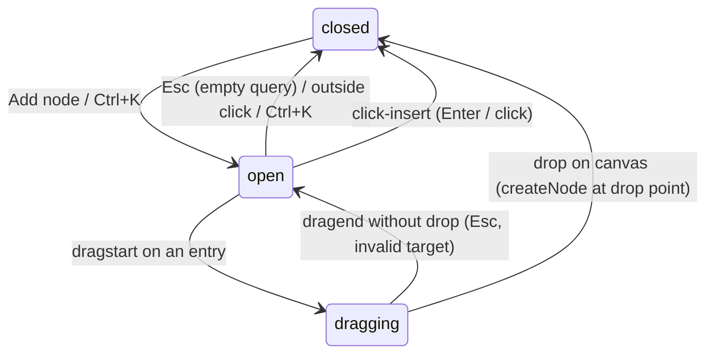

# ADR 0017 — Node catalog: an on-demand, capability-grouped "Add node" picker

Status: **proposed — MAJOR DECISIONS / FOR REVIEW below are for sign-off** ·
Scope: `graph-engine/web` only (no engine change, no server change, no
node-spec schema change) · Relates to: ADR 0011 (whole-graph editing — W5 built
the palette this ADR replaces, and the `createNode` / drag-MIME machinery this
ADR reuses verbatim), ADR 0014 (workbench regions — this ADR retires the left
region), ADR 0008 (the sync store and its `useSyncExternalStore` rules; the
catalog reads specs through the same selectors), ADR 0009 (the `GraphPicker`
top-bar popover whose dismiss/Escape pattern the catalog generalises),
ADR 0005/0007 (the node-spec shape the catalog renders from).

Numbering note: as of 2026-07-24, ADR 0016 is the highest number in use across
`integration/wave-1` and all `docs/adr-*` branches; **0017 is free** (the 0012
gap is pre-existing).

## Context — what exists, and why it isn't good enough

ADR 0011 stream W5 delivered the first node palette
(`web/src/components/Palette.tsx`): a permanently-visible left-region panel
listing every registered `@node` type from `GET /api/specs`, grouped by the
spec's `module` field, with a search box, click-to-place, and a drag payload
(`PALETTE_SPEC_MIME = 'application/x-graph-engine-spec'`) that
`GraphView.tsx`'s `onDragOver`/`onDrop` already consume. ADR 0014 W1 then gave
it a resizable, collapsible home as the workbench's left region
(`components/workbench/Workbench.tsx`, `LEFT = { default: 15, min: 10, max: 25 }`).

The machinery underneath is solid and stays:

- **`GET /api/specs`** serves `registry.specs()` — "the palette a UI renders
  from" (`server/__init__.py`). Spec shape (`web/src/types.ts::NodeSpec`):
  `id` (= `module.qualname`), `name`, `title`, `module`, `qualname`, `doc`,
  `inputs[]`, `outputs[]`, optional `renderer` / `dynamicInputs`.
- **`createNode(type, position)`** (`web/src/store/sync.ts`) mints an id
  server-side, adds the node optimistically, persists through the single-flight
  queue, and refreshes the advisory "needs wiring" validation. Both click and
  drag already funnel into it.
- **The canvas already accepts catalog drags**: `GraphView` checks
  `PALETTE_SPEC_MIME` on dragover and calls `createNode(specId, dropPosition)`
  on drop. Nothing on the canvas needs to change for this ADR.
- **Needs-wiring badges live on the canvas now** (`GraphView.tsx`
  `needsWiringByNode`, mirrored onto each node) — the palette's bottom strip
  was explicitly W5's *stand-in* "until W4 badges them on the canvas from the
  same store field". W4 landed; the strip is redundant.

What's wrong is the presentation, and the owner has judged it directly:

1. **It's flat and ugly.** One undifferentiated scroll of every registered
   type; group headers are raw module names (`showcase` / `sym` / `table`)
   that mean nothing to a user thinking "I want to read a CSV" or "I want a
   card at the end".
2. **Pack groupings aren't collapsible** — `ge-palette__group` is a plain
   `<section>` with an `<h3>`; twenty-plus sym entries shove everything else
   off screen.
3. **It's permanently front-and-center** for an action that is *occasional*.
   Adding a node is a moment, not a mode: the left region spends 10–25% of the
   viewport, always, on a list you consult a few times per session. The canvas
   — the thing this IDE is *about* — pays for it.

### Locked criteria (decided with the owner — not re-litigated here)

1. **Placement**: the catalog is an **on-demand, searchable picker** opened
   from a **top-bar "Add node" button** — command-palette style (VS Code /
   Linear / Obsidian quick-switcher quality bar). NOT a permanently-visible
   panel. NO new right-side activity-bar/icon rail — deferred.
2. **Organization**: nodes group **by capability** (Input/Data · Math · Table
   · Logic · Render/Output — exact set decided in D2), as **collapsible
   sections**, ignoring which pack a node comes from, with a prominent search
   that filters across all sections.
3. **Add interaction**: **both** drag-onto-canvas (precise placement) **and**
   click-to-insert (sensible default spot, then wire).

### Constraints that bind every choice below

- **Offline / no-CDN** (ADR 0003/0014): every asset bundled; the Playwright
  suite asserts `externalRequestsZero`. No icon fonts — glyphs are unicode,
  like the workbench rails (`☰`, `▤`).
- **Store rules** (ADR 0008): the sync store holds *shared server-derived*
  state behind one mutation funnel; presentation-local state (like
  `store/layout.ts`, key `ge:workbench:v1`) lives in its own versioned
  module beside it. Catalog UI state follows the layout-store pattern.
- **Engine stays pure-stdlib** and the node-spec schema is frozen/versioned
  (`engine/schemas`, `freeze_schemas.py`). This ADR does not touch it (D2,
  FOR REVIEW 1).
- Design tokens: all styling uses the existing `--ge-*` variables
  (`web/src/styles.css`); the picker introduces no new hard-coded colors.

## Decisions (proposed)

### D1 — The surface: a top-bar anchored command palette

A single top-bar button — **`＋ Add node`**, placed in `.ge-toolbar` where
"+ New node" sits today — opens an anchored popover panel (the "catalog").
It is the `GraphPicker` popover pattern (ADR 0009 D6) grown up:

- **Anchoring & size**: opens below the button, right-aligned into the canvas
  area; fixed width ~400px, `max-height: min(60vh, 560px)`, internal scroll.
  Renders above the workbench (`position: fixed` layer, no portal library
  needed), styled `--ge-panel-glass` + `--ge-shadow` like the graph-picker
  menu.
- **Structure**, top to bottom:
  1. **Search input** — autofocused on open, placeholder "Search nodes…",
     never loses focus while the catalog is open (all list navigation is
     virtual, via `aria-activedescendant` — the listbox pattern).
  2. **Sections** — the D2 capability sections, each a sticky header row
     (glyph · label · count · chevron) over its entry rows.
  3. **Footer** — one persistent action row: **"Create new node…"**, which
     closes the catalog and opens the existing New-node dock tab
     (`setCreatingSource(true)` in `App.tsx`). This *replaces* the top-bar
     "+ New node" stand-in button — `App.tsx`'s own comment reserved exactly
     this: "the palette (11-W5) grows its own 'New node' entry". Authoring
     becomes discoverable at the moment you fail to find the node you wanted.
- **Dismiss**: light-dismiss on outside pointer-down; Escape (two-stage, D5);
  and automatically after a successful insert (click/Enter) or drop (D4).
  Escape inside the catalog is consumed (`preventDefault`, capture phase, the
  `GraphPicker` precedent) so App's Escape cascade — source editor → inspector
  → export → run results — never fires through it.
- **Empty / no-match state**: when the query matches nothing, the section list
  is replaced by `no nodes match "query"` plus the footer's "Create new
  node…" row — the dead end points at the escape hatch.
- **Data**: specs come from the store (`useSyncSelector((s) => s.specs)`),
  hydrated at boot and refreshed by source saves, exactly as the palette reads
  them today. A type authored in the New-node panel appears in the catalog on
  the next specs read with zero new plumbing (`server/app.py` line 401 already
  promises "the new type appears in the palette on the very next specs read").

The button is disabled until `ready` (like Run/Export), so the catalog can
never open against an unhydrated store.

### D2 — The capability taxonomy: five sections + a fallback, mapped in a frontend registry

**Final section set**, in pipeline order (the order data flows through a
graph, which is also the order a user builds one):

| # | Section | Glyph | Meaning |
|---|---------|-------|---------|
| 1 | **Input / Data** | `⇥` | Bring values into the graph: files, CSVs, mock APIs |
| 2 | **Table** | `▤` | Operate on tabular data: recipes, row selection |
| 3 | **Math** | `∑` | Compute: reductions, symbolic math, units, calc sheets |
| 4 | **Logic** | `⧉` | Select, branch, judge: pick-one-of, pass/fail checks |
| 5 | **Render / Output** | `▣` | Produce human-readable results: text, cards, MathML |
| 6 | **Other** | `·` | Fallback — only rendered when non-empty |

**Mapping rule** — a pure function in a new frontend module
`web/src/catalog/categories.ts`, resolved in strict precedence order:

1. `spec.category` — **forward-compatibility seam only.** If a future engine
   ever serves a `category` field on the spec (the schemas are
   additive-tolerant, so an unknown field is already legal), it wins. Nothing
   declares it today and this ADR does not add it (FOR REVIEW 1).
2. `CATEGORY_BY_ID[spec.id]` — an exact-id map covering every known node
   (table below). Exact ids win over module defaults so a pack can contain
   mixed-capability nodes (calc's `render_summary` is Render/Output while the
   rest of calc is Math).
3. `CATEGORY_BY_MODULE[spec.module]` — pack defaults: `sources` → Input/Data,
   `table` → Table, `calc` → Math, `sym` → Math.
4. **Other** — everything else, notably freshly user-authored nodes in an
   example module (`NewNodePanel` appends to the served module, e.g.
   `showcase`), which therefore surface immediately in a visible section
   instead of being mis-filed.

**The concrete table** — every `@node` currently in the repo (packs first,
then example-local nodes), with the section each lands in. This is the build's
checklist for `CATEGORY_BY_ID`:

| Spec id (`module.qualname`) | One-line doc (from the docstring) | Section |
|---|---|---|
| `sources.read_csv` | Read one named column of a CSV into a list of floats | Input / Data |
| `sources.mock_api` | In-process mock "API client", same shape as read_csv | Input / Data |
| `table.read_table` | Read a CSV into a table `{'columns': [...], 'rows': [[...]]}` | Input / Data |
| `table.apply_recipe` | Apply a versioned op-list recipe to a table | Table |
| `table.table_summary` | Render a table as a small, self-contained HTML card | Render / Output |
| `calc.total` | Sum the values | Math |
| `calc.average` | Arithmetic mean of the values | Math |
| `calc.median` | Median (middle value) of the values | Math |
| `calc.minimum` | Smallest of the values | Math |
| `calc.maximum` | Largest of the values | Math |
| `calc.render_summary` | Render a small, self-contained HTML card | Render / Output |
| `sym.parse_expr` | Parse text into a SymPy expression (or equation) | Math |
| `sym.solve_for` | Solve an expression for a symbol; list of solutions | Math |
| `sym.substitute` | Substitute a value for a symbol (still symbolic) | Math |
| `sym.evaluate_numeric` | Evaluate an expression to a plain float | Math |
| `sym.quantity` | Attach a real SI unit to a number | Math |
| `sym.multiply` | `factor * a * b` — units carry through and reduce | Math |
| `sym.typeset_calc` | Typeset calculation lines with values substituted | Math |
| `sym.handcalc` | Calc sheet: derived symbol sockets, typeset result | Math |
| `sym.pick` | Pick one element out of a list (e.g. one root) | Logic |
| `sym.describe` | Format any value as short text, optional `label =` prefix | Render / Output |
| `sym.latex_to_mathml` | Convert LaTeX math to native MathML (zero-JS) | Render / Output |
| `sym.join_text` | Join up to three text fragments with a separator | Render / Output |
| `sym.calc_notes` | Format a calc's results map as symbol-value notes | Render / Output |
| `sym.render_math_card` | Self-contained HTML card: title, MathML, caption | Render / Output |
| `showcase.dashboard` | Compose table + math cards into one page | Render / Output |
| `capacity_check.select_extreme` | Pick the row with the highest/lowest column | Table |
| `capacity_check.check_verdict` | Read the calc's boolean result; fail the run if false | Logic |
| `minimal.read_values` | Read a one-column CSV into a list of floats | Input / Data |
| `minimal.total` | Sum the values | Math |
| `minimal.average` | Arithmetic mean of the values | Math |
| `minimal.render_summary` | Render totals as an HTML card | Render / Output |

(Only one example module is served per entry point, so same-named nodes from
different modules never co-exist ambiguously in one catalog; the id disambiguates
regardless.)

Judgment calls, made once here so the table is not re-argued row by row:
`read_table` is Input/Data, not Table — its capability is *bringing data in*;
Table is for operating on tables you already have. `typeset_calc`/`handcalc`
are Math, not Render/Output — their primary product is the computed results
(the typeset LaTeX is a byproduct socket); the Render section is for nodes
whose *purpose* is a human-readable artifact. `pick` and `check_verdict` seed
the Logic section — small today, but it is where ADR 0016's deferred
"on-FAIL action" work will land, and a named home beats re-filing later.

**Sections never appear empty**: a section with zero (or zero *matching*)
entries is not rendered. In the served demo (showcase = `showcase` + `sym` +
`table` modules), the catalog shows all five sections; in `minimal` it shows
three. That is correct behavior, not a bug: the catalog reflects what is
actually placeable in the current entry point.

### D3 — Row anatomy and section anatomy

Each **entry row** (`data-testid="node-catalog-entry"`):

- **Name** — `spec.name`, primary text.
- **One-line doc** — first docstring line (reuse `firstDocLine`), muted
  (`--ge-muted`), single line, ellipsized. Undocumented nodes show nothing
  (never a placeholder).
- **Origin hint** — `spec.id` (`module.qualname`) in faint mono
  (`--ge-faint`, `--ge-mono`) on the right edge. The pack is demoted from
  organizing principle to provenance metadata — visible for trust and
  debugging, ignored for grouping.
- The full docstring first line rides `title=` for hover, as today.
- Rows carry `data-spec-id` and `data-category` for tests and styling.

Each **section header** (`data-testid="node-catalog-section"` on the section,
toggle on the header): chevron (`▸`/`▾`) + glyph + label + entry count. The
whole header row is the collapse/expand toggle (`aria-expanded` on it). Sticky
within the scroll container so long sections keep their label in view.

### D4 — Insert: click-to-insert primary, drag first-class

**Click-to-insert** (and Enter, D5) is the catalog's primary action:

- Calls the existing `createNode(specId, position)` with a **viewport-centre
  default position**: the centre of the visible canvas in graph coordinates,
  offset by the existing stagger (`nodeCount`-based, so repeated adds never
  stack exactly). The palette's blind `{x: 80…, y: 80…}` top-left constant is
  retired — "a sensible default spot" means *where the user is looking*.
  Mechanism: `GraphView` exposes a `getInsertPosition()` through a small
  imperative handle (the `FocusRequest` seam precedent), falling back to the
  old stagger when the canvas ref is unavailable.
- After insert: the catalog **closes**, the new node is **selected**
  (`onSelectNode`), which opens the Inspector in the right dock (ADR 0013/0014
  machinery, zero new code) — the natural next step after adding is wiring and
  configuring, and selection is how the app already expresses "work on this
  node".
- **Multi-add**: `Alt+click` / `Alt+Enter` inserts *without* closing the
  catalog (stagger walks each new node), for building up several nodes in one
  visit. The default stays close-on-insert — palette muscle memory should not
  make the common single-add two-step.

**Drag-onto-canvas** reuses the W5→W4 contract byte-for-byte: rows are
`draggable`, `dragstart` sets `PALETTE_SPEC_MIME` = spec id, and
`GraphView`'s existing `onDragOver`/`onDrop` do the rest. The canvas does not
change. The transient-popover tension is resolved in D6 (FOR REVIEW 2).

Both paths funnel into the same `createNode` — one write path, optimistic
overlay, single-flight persistence, advisory needs-wiring refresh (ADR 0011).
This ADR adds **no new backend interaction of any kind**.

### D5 — The keyboard model (the VS Code / Linear bar)

| Key | Where | Effect |
|---|---|---|
| `Ctrl/Cmd+K` | global | Open the catalog (focus search). Ignored when the event target is editable — `input`, `textarea`, `[contenteditable]`, or inside `.ge-source` (Monaco owns `Ctrl+K` chords) — the same guard shape as App's Escape cascade. |
| `Ctrl/Cmd+K` (again) / click outside | catalog open | Close. |
| printable keys | catalog | Type-to-filter — the search input holds real focus for the catalog's whole lifetime. |
| `↓` / `↑` | catalog | Move the **virtual highlight** to the next/previous *visible* entry row, skipping headers, flowing across section boundaries; wraps at the ends. Highlight is `aria-activedescendant` state, not DOM focus. The first visible entry is highlighted on open and whenever the query changes. |
| `Home` / `End` | catalog | First / last visible entry. |
| `←` | catalog | Collapse the section containing the highlight (highlight moves to its header's first following visible entry, or stays clamped). |
| `→` | catalog | Expand the highlighted entry's section if collapsed (no-op otherwise). |
| `Enter` | catalog | Insert the highlighted entry (D4) and close. |
| `Alt+Enter` | catalog | Insert and stay open (multi-add). |
| `Escape` | catalog | Two-stage: a non-empty query clears to the full list; an empty query closes the catalog. Consumed either way (never reaches App's cascade). |

ARIA: the panel is `role="dialog"` (`aria-label="Add node"`); the list is
`role="listbox"` controlled by the search input (`aria-controls`,
`aria-activedescendant`); entries are `role="option"` with `aria-selected` on
the highlight; section headers carry `aria-expanded`.

**Search behavior with collapsed sections**: while a query is active, matching
overrides collapse — every section with matches renders expanded regardless of
its stored collapsed state, so a search can never be silently swallowed by a
folded section. Clearing the query restores the stored collapse state. Match
scope: case-insensitive substring over `name`, the one-line doc, *and* the
spec id (so `sym.` or `read_` narrows by provenance too — a strict superset of
the palette's name+doc matching).

**Collapse persistence**: the collapsed-section set persists in a new
presentation-local module `web/src/store/catalog.ts` — the `store/layout.ts`
pattern exactly (own versioned localStorage key `ge:catalog:v1`, synchronous
writes, safe no-op when storage is unavailable, deliberately **outside** the
ADR 0008 sync store). Highlight and query are ephemeral (reset on open);
collapse state is durable. "Reset layout" (ADR 0014 D5) also clears
`ge:catalog:v1` — one escape hatch for all persisted UI state.

### D6 — Drag from a transient popover: the catalog sheers away during the drag

The awkward composition — dragging *out of* a popover that wants to
light-dismiss — is resolved with one rule: **a drag in progress pins the
catalog open but gets it out of the way; the drop closes it; a cancelled drag
restores it.**

Mechanics, all standard HTML5 DnD (no library, no pointer capture):

- On `dragstart` the catalog enters a **ghost state**: `opacity` drops to a
  dim ~0.25 and `pointer-events: none` — the canvas beneath becomes a full
  drop target *including the area the popover covered*, while the catalog
  stays visibly present as context ("your drag came from here"). The browser's
  drag image is captured at dragstart, so dimming the source panel afterward
  does not affect the cursor ghost.
- Light-dismiss is suspended during the drag (the ghost state gates the
  outside-pointer-down handler) — a drop is not an "outside click".
- `drop` on the canvas → existing `onDrop` → `createNode(specId, dropPoint)`
  → the catalog closes and the new node is selected (same post-insert behavior
  as click, D4).
- `dragend` without a drop (Escape mid-drag, released over an invalid target)
  → the catalog restores to its normal open state, query and highlight intact.

This keeps drag genuinely first-class — grab a row, drop it exactly where it
belongs — without inventing a pin/tear-off window. Click/Enter remains the
primary path the UI optimizes for; the D4 viewport-centre default means
click-insert usually lands close to where a drag would have anyway.

### D7 — The left region is removed; the workbench narrows to two sashes

With the catalog in the top bar, the left region has no tenant. Decision:
**remove it entirely** (FOR REVIEW 3):

- `Workbench.tsx` drops the `palette` slot, the left `Panel`, its sash
  (`sash-left`), its collapse button (`collapse-left`), the left `Rail`, and
  the `LEFT` constants. The region model becomes
  `center (canvas ╱ bottom) │ right` — two sashes, three regions.
- `store/layout.ts` narrows `collapsed` to `{ right, bottom }`. The persisted
  shape changes → **bump the storage key to `ge:workbench:v2`**; the ADR 0014
  restore path already treats a missing/corrupt value as defaults, so v1 blobs
  are simply orphaned (acceptable: the stored state is two booleans and a
  width map).
- `Palette.tsx` is deleted, along with its needs-wiring strip — the canvas
  badges (`GraphView`'s `needsWiringByNode`, ADR 0011 D6) are the surviving,
  canonical surface for the same store field, exactly as W5 planned.
- `PALETTE_SPEC_MIME` moves to the catalog module (`web/src/catalog/`);
  `GraphView`'s import path updates, value unchanged.
- ADR 0014's region diagram gets a superseded-in-part note pointing here.

Not chosen: keeping an empty collapsed left rail "for later" (a rail that
expands to nothing is broken UX), or repurposing the region for a graph
outline/minimap (real idea, separate ADR — nothing should squat in the region
meanwhile, and the owner has explicitly deferred any activity-bar concept).
The canvas simply gains 10–25% width on every screen, which is the point of
the whole redesign.

**Amends ADR 0014 (workbench layout).** As of stream 17-W4 (landed), the left
region ADR 0014 defined (`left │ center │ right`, `LEFT = { default: 15, min: 10,
max: 25 }`, the `left` rail and the `☰ Nodes` collapse affordance) is removed:
the workbench region model is now `center (canvas ╱ bottom) │ right`, two sashes.
The layout store's `RegionKey` drops `left`, its persisted collapse map narrows to
`{ right, bottom }`, and its storage key bumps `ge:workbench:v1` → `ge:workbench:v2`
(a stale v1 blob falls to defaults through the existing fail-safe parse — the
accepted one-time reset). ADR 0014's region diagram is superseded-in-part by this
note; reinstating a left region later remains a small, additive `Workbench.tsx`
change, as ADR 0014's model intended. (ADR 0014's own document is not present on
this branch; this note is the authoritative record of the amendment here.)

### D8 — Testability: testids and the observable contract

New testids (single-value, kebab-case, consistent with the existing registry):

| testid | Element |
|---|---|
| `add-node-button` | The top-bar trigger |
| `node-catalog` | The popover panel (`role="dialog"`) |
| `node-catalog-search` | The search input |
| `node-catalog-section` | One section (`data-category="input-data" \| "table" \| "math" \| "logic" \| "render-output" \| "other"`) |
| `node-catalog-section-toggle` | The section's header/toggle row (`aria-expanded`) |
| `node-catalog-entry` | One row (`data-spec-id`, `data-category`, `aria-selected` on the highlight) |
| `node-catalog-empty` | The no-match state |
| `node-catalog-new-node` | The "Create new node…" footer row |

Observable assertions a Playwright spec (`web/tests/node-catalog.spec.ts`,
replacing `palette.spec.ts`) makes — each is a real DOM observation, no
internal state peeking:

1. **Open/close**: click `add-node-button` → `node-catalog` visible and
   `node-catalog-search` focused; `Escape` (empty query) / outside click /
   `Ctrl+K` → hidden. Escape with a node selected closes the catalog only
   (inspector stays — the cascade is not double-fired).
2. **Sections**: demo boot → sections `input-data`, `table`, `math`, `logic`,
   `render-output` each visible with ≥1 entry; entry
   `[data-spec-id="table.read_table"]` sits inside
   `[data-category="input-data"]` (the exact-id map beats the module default).
3. **Collapse + persistence**: toggle Math closed → its entries hidden,
   `aria-expanded="false"`; reload → still collapsed (`ge:catalog:v1`);
   `reset-layout` → expanded.
4. **Search**: fill `read_table` → the `table.read_table` entry visible, Math
   section not rendered; a query matching only entries in a *collapsed*
   section still shows them (override); clear restores collapse; garbage
   query → `node-catalog-empty` visible with `node-catalog-new-node` still
   present.
5. **Keyboard insert**: open → type `average` → `Enter` → catalog hidden, a
   new canvas node of type `average` exists (assert via the canvas node
   testids), and the Inspector tab shows it selected. Node count asserted by
   identity, not `toHaveCount`.
6. **Multi-add**: `Alt+Enter` twice → two nodes, catalog still open.
7. **Drag**: `dragstart` on an entry → `node-catalog` has the ghost state
   (assert `data-dragging="true"` on the panel); HTML5 drop on the canvas →
   node created at the drop point, catalog hidden. (The existing
   `canvas-editing.spec.ts` drag helper is reused.)
8. **New-node handoff**: click `node-catalog-new-node` → catalog closes, the
   New-node dock tab opens (existing `new-node-authoring.spec.ts` entry
   assertions).
9. **`externalRequestsZero`** on every action, as everywhere.

`web/tests/frontend-registry.ts`: the `palette` panel entry is **replaced** by
a `node-catalog` panel carrying the actions above in the registry's
declarative step/check vocabulary (the vocabulary already covers everything
needed: `click`, `fill`, `pressKey`, `waitVisible`, `visible`/`hidden`,
`countAtLeast`; drag-from-catalog is the one `review: true` action, like other
un-encodable flows). The workbench panel's testid list drops `sash-left` /
`collapse-left` / `rail-left`.

## Build plan — four frontend-only streams, each independently mergeable

Every stream ships its own spec updates and keeps `frontend-registry.ts` in
sync (the registry is canonical; the sanity harness follows it). No stream
touches `engine/`, `server/`, or `nodepacks/`.

- **17-W1 — Taxonomy + catalog core.** `web/src/catalog/categories.ts` (the
  D2 registry + resolution function, unit-tested against the full spec table),
  the `NodeCatalog` component (button, popover, search, sections with
  click-collapse, click-to-insert at viewport centre, footer "Create new
  node…"), wired into the top bar. The left palette **stays** during this
  stream — the two coexist for one merge, so W1 is reviewable purely as an
  addition. New `node-catalog.spec.ts` covers assertions 1, 2, 4 above.
- **17-W2 — Keyboard + persistence.** The D5 model (`Ctrl/Cmd+K`, virtual
  highlight, arrows across sections, `←`/`→` collapse, Enter / Alt+Enter,
  two-stage Escape), `store/catalog.ts` collapse persistence + reset-layout
  hookup, ARIA wiring. Assertions 3, 5, 6.
- **17-W3 — Drag-out-of-catalog.** The D6 ghost-state mechanism
  (`data-dragging`, suspended light-dismiss, close-on-drop / restore-on-
  cancel). Canvas untouched. Assertion 7.
- **17-W4 — Retire the left region.** Delete `Palette.tsx` + the needs-wiring
  strip, remove the left panel/sash/rail from `Workbench.tsx`, narrow
  `store/layout.ts` (storage key → `ge:workbench:v2`), move
  `PALETTE_SPEC_MIME`, remove the top-bar "+ New node" stand-in button
  (assertion 8 proves the replacement path first), delete `palette.spec.ts`,
  update `workbench-layout.spec.ts` + the registry's workbench/palette
  panels, add the ADR 0014 superseded-note. Assertion 8; full sanity-harness
  run green.

Order is W1 → W2 → W3 → W4 (W4 must land last — it removes the old surface
only after the new one is fully proven), but W2 and W3 are independent of each
other.

## MAJOR DECISIONS / FOR REVIEW

**1. Capability taxonomy source — frontend registry vs node-declared
`category`. Recommendation: (a) frontend-only registry, with the resolution
order honoring a future `spec.category` field.** A node-declared category
matches the project's declarative ethos (Widget/Renderer precedent shows
additive spec fields are cheap), but category is *presentation vocabulary*,
not execution semantics: the bijection (ADR 0004) maps graph ⟷ source, and a
`category=` kwarg on `@node` would put UI copy into every pack while buying
nothing the frontend map doesn't already give — the node universe is ~30 ids,
all in-repo. It would also touch the frozen schema set (`engine/schemas`,
`freeze_schemas.py`), the `@node`/`node_spec` signature, and force every
*user-authored* node (NewNodePanel) to answer a taxonomy question before it
can exist; the frontend map instead files unknown nodes under **Other**
automatically. The D2 resolution order (`spec.category` → exact id → module
default → Other) means if the ecosystem later grows third-party packs that
genuinely need self-description, promoting the field is an additive engine
change with the frontend already listening — no repainting. Scope if (b) is
chosen anyway: `engine/spec.py` (`node_spec` + a `category` kwarg on
`registry.node`), a vocabulary guard, schema note (additive, no version
bump — the Renderer treatment), and `category=` edits across four packs +
examples; the web resolution order is unchanged either way, which is exactly
why (a) is the right first move.

**2. Drag from an on-demand picker. Recommendation: the D6 ghost-state model —
drag pins the catalog open, dims it to a pass-through ghost, drop closes it,
cancel restores it.** Alternatives considered: (i) close the popover on
dragstart — the drag loses its visual origin and a cancelled drag strands the
user back at a closed catalog; (ii) a pin/tear-off affordance — a second
window-management concept for a transient surface, exactly the
"bolted-on" feel to avoid; (iii) drag-disabled picker (click only) — violates
the locked D3. The ghost model needs no new dependency, ~30 lines, and makes
the popover itself stop being a drop obstacle. Paired with click-insert at
viewport centre (D4), drag is reserved for the case it's genuinely better at:
precise placement.

**3. Left region fate. Recommendation: remove it (D7).** The alternatives —
an empty collapsed rail (expands to nothing) or a squatting placeholder panel
— are both worse than a clean two-sash workbench, and reinstating a left
region later is a small, additive `Workbench.tsx` change (the panel-group
seams remain; ADR 0014's model was explicitly built to allow regions to come
and go). Cost acknowledged honestly: the layout storage key bumps to
`ge:workbench:v2` and v1 sizes are forgotten once.

**4. Keyboard-first quality. Recommendation: the D5 model — `Ctrl/Cmd+K` to
open, persistent-focus search, virtual highlight with `aria-activedescendant`,
arrows that flow across sections and skip headers, `←`/`→` for collapse,
Enter / Alt+Enter, two-stage Escape.** `Ctrl/Cmd+K` is the quick-switcher
convention (Linear, Slack, GitHub) and is guarded away from Monaco's `Ctrl+K`
chords by the editable-target check; the browser's own `Ctrl+K` (Firefox
search bar) is preventDefault-able. The one deliberate deviation from VS
Code's palette: sections stay *visible and collapsible* rather than a single
flat ranked list, because the catalog is also a *browsing* surface (what can
this IDE do?) — search flattens it de facto by hiding non-matching sections,
so the two modes coexist without a mode switch.

## Consequences

- Adding a node becomes possible-but-not-front-and-center: one button, one
  shortcut, a surface that costs zero pixels until summoned — and the canvas
  permanently gains the former left region's width.
- Users navigate by *what they want done* (five capability sections), not by
  Python module layout; packs remain visible as provenance metadata on each
  row.
- The engine, server, HTTP API, spec schema, and bijection are untouched;
  every insert path funnels through the proven `createNode` machinery. The
  entire ADR is deletable-frontend: reverting W1–W4 restores today's UI.
- New follow-up seams: the Logic section is the landing zone for ADR 0016's
  deferred verdict-action work; the `spec.category` resolution slot is the
  landing zone for pack self-description; the vacated left region is free for
  a future outline/minimap ADR.
- Two small one-time costs: workbench layout persistence resets
  (`ge:workbench:v2`), and `palette.spec.ts` + the registry's palette panel
  are replaced rather than migrated (test intent is preserved by the D8
  assertion list — coverage parity is the review checklist for 17-W4).
