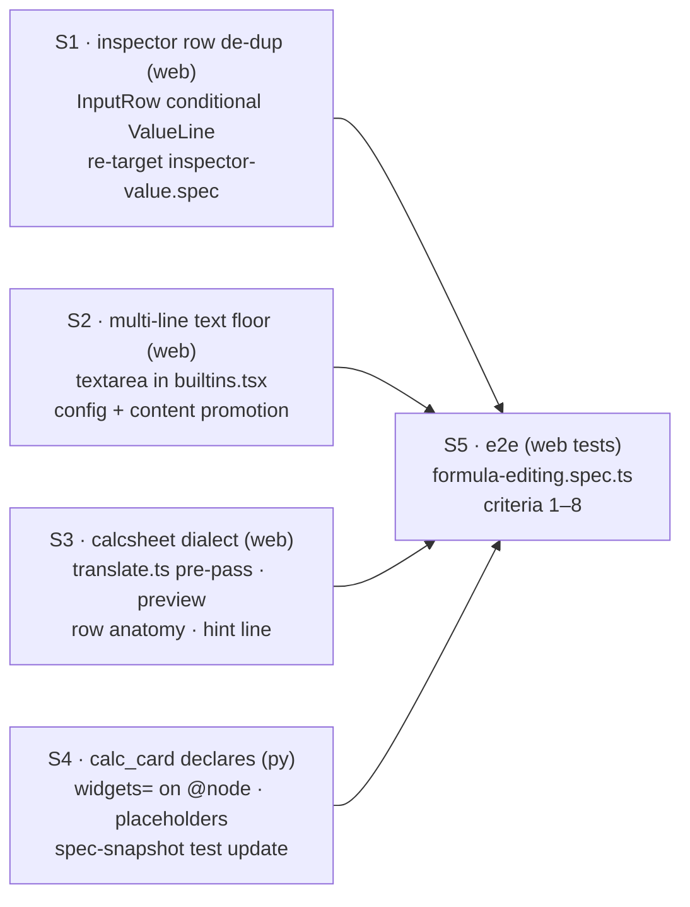

# ADR 0018 — Formula editing: multi-line calc literals in the inspector

Status: **proposed — MAJOR DECISIONS / FOR REVIEW below are for sign-off** ·
Scope: `graph-engine/web/` + a widget declaration in `nodepacks/sheet/` ·
Relates to: ADR 0004 (graph ⟷ source bijection; writeback fidelity), ADR 0005
(widget seam: registry, editor props, commit path; A-D5 Python-authoritative),
ADR 0007 (`DerivedInputs`, the derive endpoint, the calc widget), ADR 0013
(inspector-only editing; `InspectorWidgetSlot`, the `InputRow` value line),
ADR 0015 (instance panel rows), ADR 0017 (node catalog — the discovery surface
these nodes are found through)

The owner's verdict on editing `sheet.calc_card`'s `formulas`/`checks` in the
inspector, verbatim intent: *a separate read-only box that exists "just to copy"
the input duplicates the editor; the input box is single-line for an inherently
multi-line literal; and nothing in the UI teaches the mini-syntax.* All three
are real, all three have a specific cause in the code, and none needs new
architecture — the fixes are a conditional in one component, one widget
declaration on the Python side, and a bounded extension of machinery ADR 0007
and 0013 already built.

## Context — the regression, with the code that causes it

### 1. Every editable input renders its value twice

`web/src/components/NodeInspector.tsx`, `InputRow` (lines 67–96): an unwired
widget-bearing input mounts `InspectorWidgetSlot` (the editor, ADR 0013 D4) —
and then renders `<ValueLine resolved={resolved} />` **unconditionally** (line
93). `ValueLine` (lines 49–56) resolves to `InspectorValueBlock`
(`components/InspectorValue.tsx`, lines 70–114): the scrollable, expandable,
copy-on-hover block added deliberately for long values (commit `ea835bec`,
"inspector value fields are scrollable/expandable with copy-to-clipboard").

For an **output** — a latex blob, a rendered HTML document, a results dict —
that block is exactly right: the value exists nowhere else, it is long, and
copying it verbatim is a real workflow (`inspector-value.spec.ts` locks all of
this in). For an **editable literal** it is pure noise: `inputValue()` (lines
40–47) returns the run value or the literal itself, and a literal-bound
input's run value *is* the literal — so the row shows the same text twice,
one copy of which cannot be edited. Worse, before any value exists the row
shows the editor plus a `no value yet` placeholder line under it.

### 2. `formulas` and `checks` get a single-line `<input>`

`nodepacks/sheet/__init__.py`, the `@node` decorator on `calc_card` (lines
305–314) declares `outputs`, `dynamic`, and `renderer` — but **no `widgets=`**.
So both `formulas: str` and `checks: str` (lines 318–319) fall through
`engine/spec.py`'s type-derived mapping (`_WIDGET_BY_TYPE`, lines 170–175:
`"str" → {"kind": "text"}`) and resolve to `TextEditor`
(`web/src/widgets/builtins.tsx`, lines 19–41): a **single-line**
`<input type="text">` where **Enter commits** (via blur, lines 36–38).

The literals are inherently multi-line — one entry per line is the whole
mini-syntax (`parse_formulas`/`parse_checks`, sheet/`__init__.py` lines
34–47). In the capacity example the committed value is
`"r = F_max / C_min  # demand / capacity\nU = 100 * r [%]  # utilisation"`
(`examples/capacity_check/capacity_check.py`, line 103) — in a single-line
input the `\n` is invisible, un-typeable, and Enter destroys your draft's
future by committing instead of adding a line.

The bitter part: the almost-identical node already has the right editor.
`sym.handcalc` declares
`widgets={"lines": Widget("calc", language="python-calc", multiline=True)}`
(`nodepacks/sym/__init__.py`, line 357) and gets the ADR 0007 D8 calc editor —
multi-line textarea, live KaTeX preview, debounced server-side derive with
per-line errors, derived-symbol chips with wired/added/removed states, and
prune-on-commit. `calc_card` has the same `DerivedInputs` seam on `formulas`
(line 307) and gets none of it, purely because it never declared a widget.

### 3. The mini-syntax is undiscoverable

Three fields per line — expression, `# reference`, trailing `[unit]` — are
documented only in Python docstrings. In the UI: the single-line `TextEditor`'s
placeholder is the input *name* (`builtins.tsx` line 32 — literally the word
`formulas`), there is no hint line, no preview, and validation
(`UserError("formulas line 2: …")`) surfaces only when a run fails.

### What already exists to build on (no new machinery)

- The **calc editor generalizes beyond `handcalc` by construction**:
  `CalcEditor.tsx` gates its derive/chips path on
  `spec?.dynamicInputs?.param === input.name` (line 80) and calls
  `/api/specs/{spec_id}/derive` with *the node's own spec id* — for
  `calc_card.formulas` that endpoint runs `formula_free_symbols`, which calls
  `parse_formulas` and raises the node's own line-numbered `UserError`s. Live
  validation and socket chips are already wired; nobody has mounted them.
  A non-deriving param (`checks`) degrades, by the editor's own explicit
  branch (lines 75–81, 148–153), to a plain multi-line commit — textarea +
  preview, no chips. Exactly what `checks` needs.
- The **preview pipeline is shared and extracted** (ADR 0013 D3):
  `calc/preview.tsx` serves both the editor's live draft preview and the
  card's block preview from one `calc/translate.ts` → KaTeX path. Its one gap
  for the sheet syntax: any line containing `#` (or the `[unit]` bracket
  shape) falls back to raw text (`translate.ts` line 31) — correct honesty
  for `python-calc`, wrong for a language where `#` and `[…]` are structure.
- The **commit seam needs zero changes**: `commitEquation` (formulas, with
  socket reconciliation) and `commitLiteral` (checks) both exist and both ride
  the single-flight store queue (ADR 0008).

## Decisions (proposed)

### D1 — An editable row drops the value block unless the run value differs from the literal

**The rule (`InputRow`):** when a row is editable (unwired + widget-bearing —
the existing `editable` predicate, `NodeInspector.tsx` line 75), render
`ValueLine` **only when** there is a resolved run value whose full text
differs from the committed literal's full text
(`fullValue(run.value) !== fullValue(literal.value)`). Otherwise render no
value line at all — no duplicate block, no `no value yet` placeholder (the
editor's own empty state covers it, D4). Non-editable rows (wired inputs,
non-widget inputs, spec-less rows) and **all outputs** keep
`InspectorValueBlock` exactly as it is — scrollable, expandable, copy on
hover.

Why this option and not the other two:

- *Drop it entirely for editable rows* is almost right but throws away a real
  signal: the rare case where what the last run consumed is **not** what the
  literal now says. The stale-run guard (ADR 0008 G1, `inspect.ts`) already
  prevents the common mixed-epoch case, but a genuine difference — an int
  editor that rounded on commit, a default that changed after the run — is
  exactly the "what flowed vs what is set" distinction worth one extra block.
  The difference predicate makes the block *informative by construction*: it
  can only appear when it says something the editor doesn't.
- *Collapse it into the editor (copy button on the editor)* adds chrome to
  every editor to serve a niche need. The editor's text is already selectable
  and copyable by normal means; the copy affordance earns its pixels on long
  **read-only** values, where selection is painful — which is precisely the
  surfaces D1 keeps it on. The complaint is not "copy is bad", it is "a whole
  second box for my own editable text is bad". Kill the box, keep copy where
  it was genuinely useful.

Blast radius: one conditional in `InputRow`; `inspector-value.spec.ts`'s
"an input value block copies its full value too" re-targets to a wired or
non-widget input row (the behavior it proves lives on unchanged there).

### D2 — `formulas`/`checks` get the calc editor (declared, with a sheet dialect); every other multi-line string gets a multi-line default

Two tiers, both shipped — they fix different populations:

**Tier 1 (the generic floor, option c).** The `text` kind learns multi-line:

- `Widget("text", multiline=True)` (config-driven) renders a `<textarea>`
  instead of `<input type="text">` — same commit contract, D5 keyboard rules.
- **Content promotion:** even without the config, a committed string value
  containing `\n` renders the textarea. Rationale: a single-line input cannot
  even *display* such a value, let alone edit it — you cannot edit what you
  cannot see. Promotion is by committed value only (never by draft), so the
  editor never switches shape mid-edit; it can only switch on the next mount
  after a commit, and only one way (a promoted editor that loses its last
  newline stays a textarea until remount — no flicker).
- This fixes every current and future long/multi-line `str` param in the app
  with no per-node work, and is the graceful floor `calc_card` would land on
  even if Tier 2 never shipped.

**Tier 2 (the rich fix, option a).** `calc_card` declares the calc widget on
both params — the entire Python-side change, mirroring `handcalc` line 357:

```python
@node(
    outputs=["result", "height"],
    widgets={
        "formulas": Widget(
            "calc", language="calcsheet", multiline=True,
            placeholder="symbol = expression [unit]  # reference",
        ),
        "checks": Widget(
            "calc", language="calcsheet", multiline=True,
            placeholder="expression  # description",
        ),
    },
    dynamic=DerivedInputs(param="formulas", derive=formula_free_symbols),
    renderer=Renderer("html-card", socket="result", height=DEFAULT_CARD_HEIGHT,
                      heightSocket="height"),
)
def calc_card(...):
```

This is the exact opt-in mechanism `engine/spec.py` already defines: a
declared `Widget` overrides the type-derived one (`_input_spec`, line 219),
`config` is opaque JSON threaded through to the editor (`WidgetEditorProps.
config`). No engine change, no schema change, no new endpoint. What each param
gets, from the editor's existing branches:

| | `formulas` | `checks` |
|---|---|---|
| textarea, auto-rows, live preview | ✓ | ✓ |
| debounced `/derive` validation (line-numbered `UserError`s from `parse_formulas`) | ✓ (`dynamicInputs.param === "formulas"`) | — (not the deriving param; plain multiline commit branch) |
| symbol chips (kept / + added / removed, `wired`, "will unwire") | ✓ | — (chips row renders only when `specId !== null`) |
| commit path | `commitEquation` (socket reconciliation + prune toast) | `onCommit` → `commitLiteral` |

**Option (b) — a new "entry-lines" widget kind — is rejected**: it would
re-implement ~90 % of `CalcEditor` (textarea, debounce, preview mount, commit
container, blur containment) to avoid a `language` config key, and would fork
the preview pipeline ADR 0013 D3 just unified. The calc kind *is* the
line-oriented-entry-list editor; the sheet syntax is a dialect of its value
language, not a different shape.

**The dialect (`language: "calcsheet"`), in `calc/translate.ts`:** a pre-pass
that runs before the existing per-line translation when the config says so —
split each non-blank, non-comment line into `(expression, unit, ref)` using
the same textual rules as `_entries`/`_UNIT` (strip text after the first `#`
as the ref; strip a trailing `[…]` off a formula expression as the unit), then
feed **only the expression** through the existing
`groupSubscripts → sympyToLatex → KaTeX` path. The preview renders unit and
ref as visually distinct annotations beside the typeset expression (D4). This
is presentation-only mirroring, held to the honesty rule (ADR 0005 A-D5): if
the expression trips `hasUnsupportedShape`, that line falls back to labelled
raw text; Python's parse — via derive for `formulas`, at run for `checks` —
remains the only authority on validity. The default language (`python-calc`,
`handcalc`) is untouched: `#` still means "not math, raw fallback" there.

### D3 — Free text stays the write surface; the preview is the structure, read-only

The three-field-per-line shape invites a per-row grid (expression | reference
| unit) that serializes back to the literal. **Rejected for v1**, on the
bijection and single-parser constraints:

- **Round-trip fidelity (ADR 0004).** The literal in the `.py` is one string;
  a grid needs a canonical serializer. Whitespace is free in the mini-syntax
  (`_entries` strips and splits; the example uses two spaces before `#`), and
  blank lines and whole-line `#` comments are *explicitly allowed and
  skipped* (sheet/`__init__.py` lines 106–107). A grid cannot represent a
  blank line or a comment line at all, and would silently normalize any
  hand-authored spacing to its canonical form on first touch — rewriting
  source the user did not edit. Free text is trivially bijective: what you
  type **is** the literal, byte for byte; `repr()` writeback (ADR 0004) does
  the rest.
- **One parser (ADR 0005 A-D5 / 0007 D4).** A grid must parse the incoming
  literal to populate its cells — a JS re-implementation of `parse_formulas`
  that will drift from the Python one. The derive endpoint exists precisely
  so the browser never parses this language.
- **The discoverability win a grid promises is achievable read-only.** The
  live preview renders each line *as* its parsed anatomy — typeset expression,
  unit chip, reference gutter (D4). The user sees the structure the syntax
  encodes without the UI owning a second serialization. If real usage still
  shows syntax friction, a grid can be added later as a *view* over the same
  literal — but it must clear the canonical-serialization bar first, and
  nothing in this design forecloses it.

### D4 — Discoverability: placeholder, hint line, anatomy-revealing preview, live line-numbered errors

The concrete minimum, all inside the calc editor (Tier 2) unless noted:

1. **Placeholder** (empty state): the syntax skeleton from the widget config —
   `symbol = expression [unit]  # reference` / `expression  # description`.
   Ships in the same declaration as D2; the generic textarea (Tier 1) keeps
   honoring `config.placeholder` as `TextEditor` does today.
2. **Persistent format hint** — one muted line under the textarea, the
   pattern `ge-calc-hint` already establishes (CalcEditor.tsx line 285), for
   the `calcsheet` dialect:
   `one entry per line · # text = reference · trailing [unit] = display unit · ⌘/Ctrl+Enter or click away to apply`.
3. **The preview teaches the anatomy** (the load-bearing affordance): per
   line, the typeset expression, then the unit as a small chip (`[%]` → `%`),
   then the reference right-aligned in a muted gutter — the same three slots
   the rendered C4 card gives them, so the preview reads as "this is the row
   you are authoring". Typing `# demand / capacity` and watching it jump to
   the reference gutter *is* the syntax lesson.
4. **Live, line-numbered errors for `formulas`** — free, via the existing
   debounced derive: `parse_formulas`' messages already name the line and the
   rule (`"formulas line 2: 'U' is defined twice…"`, `"…has no '=' — each
   formula is '<symbol> = <expression>'…"`) and render in the existing
   `calc-derive-error` slot. An invalid draft is never committed
   (CalcEditor.tsx line 159) — the file stays clean.
5. **Derived-symbol chips for `formulas`** — also free — make the
   formulas→sockets mechanic visible while typing: add `F_max` to an
   expression and a `+ F_max` chip appears before you ever commit.

`checks` gets 1–3 but not 4–5 in v1: it is not the deriving param, so there is
no keystroke-time server seam, and inventing one is out of scope here. Its
errors surface at run, as today — but now legibly, in a multi-line editor with
a preview (see FOR REVIEW 6 for the follow-up seam).

### D5 — Commit semantics: Enter is a newline; ⌘/Ctrl+Enter and blur commit — everywhere multi-line

The rule, stated once and applied to both tiers: **in any multi-line editor,
Enter inserts a newline and never commits; commit is ⌘/Ctrl+Enter or focus
leaving the editor as a whole.** This is verbatim the calc editor's existing
model (CalcEditor.tsx: container-level `onKeyDown` for meta/ctrl+Enter, lines
203–208; container-level blur with `relatedTarget` containment so moving
between the textarea and a chip's value field doesn't half-commit, lines
196–201). The Tier 1 textarea adopts the same two bindings; the single-line
`TextEditor`/`NumberEditor` keep plain-Enter-commits (their Enter has no other
meaning). No new interaction model is introduced — the calc editor's hint line
already teaches this one, and `handcalc` users already know it.

Two boundary behaviors, inherited and kept: closing the inspector blurs the
focused editor first, so an in-progress draft settles rather than drops
(`InspectorWidgetSlot`'s unmount-blur effect, lines 32–38); and a draft the
server rejects (derive error on `formulas`) stays in the textarea with the
error shown — commit is refused, nothing is lost, nothing is written.

### D6 — Anatomy and states of the editor row

The full inspector row for `formulas` after this ADR (checks identical minus
chips/errors-from-derive; generic Tier 1 identical minus preview/chips/hint
dialect):

```
┌ inspector row ─────────────────────────────────────────────┐
│ formulas   str                              [literal]      │  row head (unchanged)
│ ┌────────────────────────────────────────────────────────┐ │
│ │ r = F_max / C_min  # demand / capacity                 │ │  textarea, rows = max(2, lines)
│ │ U = 100 * r [%]  # utilisation                         │ │
│ └────────────────────────────────────────────────────────┘ │
│  r = F_max / C_min            demand / capacity            │  preview: typeset · ref gutter
│  U = 100·r  [%]               utilisation                  │           · unit chip
│  sockets   [F_max wired] [C_min wired]                     │  chips (formulas only)
│  one entry per line · # = reference · [unit] · ⌘⏎ applies  │  hint line
└────────────────────────────────────────────────────────────┘
   (no ValueLine below — D1: it would duplicate the textarea)
```

| State | Editor | Preview | Errors | Commit |
|---|---|---|---|---|
| **empty** | placeholder shows the syntax skeleton | absent (renders nothing on empty text, `CalcPreview` line 54) | none | committing empty is a valid literal (`formulas=""` → zero rows, zero derived sockets) |
| **valid draft** | text as typed | per-line typeset + unit chip + ref gutter, ~debounce | none; chips show pending socket set (`kept`/`added`/`removed`) | ⌘/Ctrl+Enter or blur → `commitEquation`/`commitLiteral`; prune toast if sockets were unwired |
| **invalid draft** (`formulas`) | text as typed, kept | lines that still parse render; broken line falls back to raw | `calc-derive-error` shows the server's line-numbered message | refused (`outcome.ok` guard) — draft retained, file untouched |
| **committing** | text frozen in place | unchanged | `calc-commit-error` on a rejected save | store single-flight queue (ADR 0008); `rev` bump refreshes the Call site row, closing the "that's the line it rewrote" loop (ADR 0015 D2) |
| **run value ≠ literal** | editor shows the literal | — | — | D1: the ValueLine reappears with the differing run value + copy |

**Derived sockets update on commit, not per keystroke** (unchanged ADR 0007
D8 rule): the chips are the keystroke-time *forecast*; `commitEquation`
reconciles the real sockets, prunes edges into removed ones in the same save,
and toasts what it unwired. Renaming `F_max` → `F_applied` in the formulas
textarea therefore shows `+ F_applied` / `F_max will unwire` chips live,
and on apply the card's sockets, the wires, and (per the deriver) the card's
inputs section all follow from the one literal.

### D7 — Testids and the observable Playwright contract

New/changed testids (existing ones — `inspector-widget-slot`,
`widget-editor-calc-input`, `calc-preview`, `calc-derive-error`,
`calc-symbol-chip`, `calc-symbol-value`, `inspector-value`,
`inspector-value-copy` — are reused untouched):

| testid | element |
|---|---|
| `widget-editor-text-multiline` | the Tier 1 `<textarea>` (config- or content-promoted) |
| `calc-preview-row` | one preview line (attrs: `data-line`, `data-fallback`) |
| `calc-preview-unit` | the unit chip inside a preview row |
| `calc-preview-ref` | the reference gutter inside a preview row |
| `calc-format-hint` | the dialect hint line |

Observable assertions a build must satisfy (spec: `web/tests/formula-editing.spec.ts`, plus re-targets noted in the stream table):

1. **Multi-line editing works end-to-end.** Open the capacity graph, select
   the `card` node: `inspector-widget-slot[data-input="formulas"]` contains
   `widget-editor-calc-input` (a `textarea`) whose value contains a newline.
   Type a third line `m = C_min - F_max  # margin`, press Control+Enter,
   assert via `GET /api/graph` that the node's `formulas` literal contains the
   new line verbatim.
2. **Enter does not commit.** Focus the formulas textarea, press Enter, assert
   the textarea gained a line and the store issued no save (no `PUT
   /api/graph` request; existing store-spec network-assertion pattern).
3. **No duplicate value box.** Within the `formulas` input row
   (`inspector-input`), `inspector-value` matches nothing and the text
   `no value yet` appears nowhere. Within the `result` **output** row,
   `inspector-value` is visible and `inspector-value-copy` copies the full
   HTML (re-target of `inspector-value.spec.ts`'s input-row copy test to a
   read-only row).
4. **Syntax is on the surface.** The empty `checks` editor shows placeholder
   `expression  # description`; `calc-format-hint` is visible under the
   formulas editor.
5. **The preview reveals the anatomy.** With
   `U = 100 * r [%]  # utilisation` committed, the formulas
   `calc-preview-row[data-line="2"]` contains KaTeX markup (`.katex`),
   `calc-preview-unit` with text `%`, and `calc-preview-ref` with text
   `utilisation` — and `data-fallback="false"` (the `#`/`[…]` no longer force
   raw fallback in the `calcsheet` dialect).
6. **Live line-numbered validation (`formulas`).** Type a line without `=`;
   `calc-derive-error` becomes visible and its text matches
   `/formulas line \d+/`; press Control+Enter; assert no `PUT /api/graph`
   fired and the literal is unchanged.
7. **Chips forecast sockets.** Add `+ q` to an expression: a
   `calc-symbol-chip[data-symbol="q"][data-state="added"]` appears before any
   commit; delete `F_max` from the draft: its chip shows `will unwire`.
   Commit; the canvas card's `F_max` handle is gone and the prune toast names
   it (existing `calc-widget.spec.ts` flow, re-pointed at `calc_card`).
8. **Tier 1 floor.** On a plain `str` param whose committed value contains
   `\n` (fixture node), `widget-editor-text-multiline` renders (not
   `widget-editor-text`), Enter inserts a newline, Control+Enter commits.

## Build plan — five small streams, independently mergeable

Each stream lands alone with the app better than before it; none blocks
another's merge (S5 asserts whatever has landed, gated last).



| Stream | Owns (writes) | Must not touch | Notes |
|---|---|---|---|
| **S1** | `components/NodeInspector.tsx` (the `InputRow` conditional only), `web/tests/inspector-value.spec.ts` (re-target one test) | `InspectorValue.tsx`, `InspectorWidgetSlot.tsx`, store | Fixes complaint #1 alone. Smallest possible diff. |
| **S2** | `widgets/builtins.tsx` (textarea variant + promotion), `styles.css` (one class) | `registry.ts` contract, calc editor | Fixes complaint #2 as a floor for **every** multi-line string param. |
| **S3** | `widgets/calc/translate.ts` (dialect pre-pass), `widgets/calc/preview.tsx` (+unit/ref slots), `widgets/calc/CalcEditor.tsx` (thread `config.language`, dialect hint), `calc.css` | `derive.ts`, `useDerivedSync.ts`, store, math widget | Pure presentation; `python-calc` behavior byte-identical. |
| **S4** | `nodepacks/sheet/__init__.py` (the `widgets=` block — the only Python diff), `tests/test_nodepacks_sheet.py` (spec snapshot: the two inputs now carry `{"kind": "calc", …}`) | engine, calcsheet, examples | Fixes #2 and most of #3 **even if it merges first**: the calc editor mounts today and degrades to multiline + derive + chips with raw-text preview until S3 lands. |
| **S5** | `web/tests/formula-editing.spec.ts` (new), re-point one `calc-widget.spec.ts` flow at `calc_card` | everything else | Lands after the rest; encodes D7. |

No two streams share a file. S3+S4 merged in either order compose without
coordination (the dialect activates only when a spec declares
`language="calcsheet"`; the declaration works without the dialect).

## Bijectivity / honesty notes

- **Nothing new is serialized.** The literal remains one string, written back
  by `repr()` exactly as ADR 0004 specifies; the editor's text is that string
  byte-for-byte (D3). Preview, chips, hint, and the ValueLine conditional are
  views — the graph JSON and the `.py` are identical for identical edits.
- **Python stays the only parser.** The dialect pre-pass mirrors `_entries`/
  `_UNIT` for display and falls back to raw text when unsure; validity comes
  only from `parse_formulas` (via derive) and the run. The `js`-side never
  gains authority over the mini-syntax.
- **`checks` validation asymmetry is deliberate and visible** (FOR REVIEW 6):
  keystroke-time truth exists only where ADR 0007 built a seam. We do not
  fake it client-side.

## Consequences

- The inspector's editable rows show one thing: the editor. Long outputs keep
  the deliberately-added copy/expand block; it stops shadowing inputs.
- `calc_card` reaches parity with `handcalc`'s editing experience by
  declaration — two config-bearing lines of Python — proving the ADR 0005/0007
  widget seam does its job: rich editing is opted into, not rebuilt.
- The `calc` widget kind becomes what it structurally already was: the editor
  for line-oriented calc literals, with per-node dialects via `config` —
  no registry growth, no new kind.
- Every other multi-line string param in the app stops being uneditable, via
  the Tier 1 floor.
- The mini-syntax is taught where it is used: placeholder, hint, an
  anatomy-revealing preview, and (for `formulas`) live line-numbered errors
  and socket chips.
- No engine, schema, store, server, or bijection changes anywhere.

## MAJOR DECISIONS / FOR REVIEW

1. **Editable rows: value block only on difference** — an editable input
   renders no `ValueLine` unless a fresh run value's text differs from the
   committed literal's; outputs and read-only rows keep the copy/expand block
   unchanged. Alternatives: drop unconditionally for editable rows (loses the
   drift signal); copy button on the editor (chrome on every editor for a
   selectable text). *(Recommend: difference rule — the block becomes
   informative by construction.)*
2. **Editor choice: reuse the calc widget (a) + generic multi-line floor (c);
   no new kind (b).** `calc_card` declares `Widget("calc",
   language="calcsheet", multiline=True, placeholder=…)` on `formulas` and
   `checks`; the `text` kind gains config- and content-promoted textareas for
   everything else. *(Recommend: a+c — (b) re-implements the calc editor to
   avoid a config key.)*
3. **Free text stays the write surface; no structured grid in v1.** The grid
   cannot represent blank/comment lines, forces canonical re-serialization of
   hand-authored spacing (a silent source rewrite, against ADR 0004's
   fidelity), and needs a JS parser Python already owns. The preview renders
   the parsed anatomy read-only instead. *(Recommend: free text + anatomy
   preview; a grid may come later as a view if it clears the
   canonical-serialization bar.)*
4. **Discoverability minimum**: syntax-skeleton placeholder + persistent hint
   line + typeset preview with unit chip and reference gutter + (formulas
   only) live line-numbered derive errors and symbol chips. *(Recommend:
   confirm; anything less leaves the syntax undocumented at the point of
   use.)*
5. **Commit model**: in every multi-line editor Enter inserts a newline;
   ⌘/Ctrl+Enter and focus-leave commit — exactly the shipped calc-editor
   semantics, extended verbatim to the Tier 1 textarea. Single-line editors
   keep plain-Enter-commits. *(Recommend: confirm — one rule, already
   taught by the calc hint line.)*
6. **`checks` has no keystroke-time validation in v1** (it is not the
   deriving param, so no server seam exists; errors surface at run — now in a
   legible editor). Follow-up option: generalize the derive endpoint into a
   per-param validate seam (`validate={"checks": parse_checks}` on `@node`).
   *(Recommend: accept for v1; open a ticket for the validate seam rather
   than inventing client-side parsing.)*
