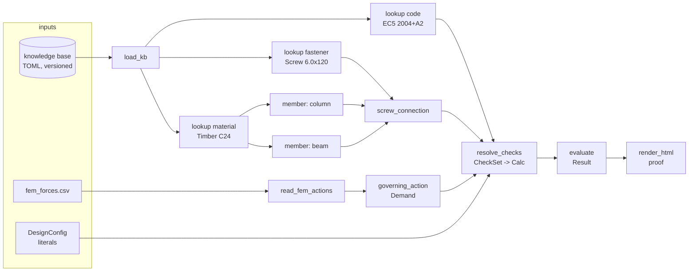

# ADR 0022 — The engineering design-check domain model

Status: **proposed — first pass; OPEN QUESTIONS at the end are for sign-off** ·
Scope: a new domain library (`designcheck`) + a new node pack (`design`) +
two small additive changes to `calcsheet`; **no engine changes** · Relates to:
ADR 0003 (execution environment — the KB rides the same dependency/mount
descriptor), ADR 0004 (graph⟷source bijection — everything UI-editable must be
a source literal, D5/D7), ADR 0007 (derived input sockets), ADR 0010/0013
(node-declared renderers), ADR 0019 (type-driven output rendering — this ADR
produces values, 0019 presents them), ADR 0020 (multi-line literals — the
authored-literal surface this ADR mostly *avoids* needing), ADR 0021 (renderable
`Result` — this ADR is its first real consumer and depends on its split).

Numbering note: as of 2026-07-24, 0022 is the next free number across
`docs/adr-*` branches (0020 and 0021 are in flight on their own branches; 0012
remains a pre-existing gap).

This is deliberately a **breadth-first map**: every type and flow needed for a
full capacity-check-and-design workflow is named and given enough shape to
build against, with exactly one worked example carried to real numbers. Depth
per type is intentionally thin; follow-up ADRs sharpen individual types once
the map is confirmed.

## The ask

> "Map out all of the data types and functional flows required for a full
> capacity check and design workflow. This means we need: a type for the design
> config; types that express material properties for multiple different
> materials; types that express members — i.e. column, beam, and screws for the
> connection; something to represent a set of formulas that must hold according
> to a building code; a knowledge base that includes both material and member
> types and options of building codes; and the building code itself.
>
> The e2e demo should be creating a simple proof, based on read-in data that we
> assume to come from an FEM model, that a designed screw connection is
> sufficient to resist vertical shear force within a desired safety factor."

## Context — what exists, and the line this ADR draws on top of it

Everything below layers on machinery that already works:

- **`calcsheet`** evaluates a declarative `Calc` (inputs, formulas, checks)
  into one `Result` and renders the four-slot card
  (`symbol │ definition │ value+unit │ reference`). Crucially, **`Calc` is
  data, not decorated source** (`model.py` docstring) — it can be *built by a
  program* just as well as typed by a person. That is the hinge this whole
  design turns on: a building code's clauses can be *compiled into* a `Calc`.
  The per-row `ref` gutter and per-check `description` are the natural home for
  clause citations; they already render. What is missing: checks are **binary
  pass/fail** (`CheckResult.passed`), with no machine-readable margin.
- **`nodepacks/sheet`** (`calc_card`) evaluates and renders in one node.
  **ADR 0021** splits this into `calc → Result → render_*`, putting `Result`
  on a wire. This ADR assumes that split: the domain layer produces
  `Calc`/`Result` values and reuses the shared renderers unchanged.
- **`nodepacks/sym`** already does real dimensional analysis via
  **`forallpeople`** (`quantity()`, SI environment, auto-reducing derived
  units). Units enforcement here is a question of *where*, not *whether*.
- **`examples/capacity_check`** is the toy ancestor: two CSVs → max/min → one
  card, `U = 100 · F_max/C_min`, no materials, no code, no clauses. The demo
  below is its grown-up successor and deliberately keeps its five-node shape
  recognisable.
- **ADR 0004** constrains the authoring surface: anything the UI edits must
  survive as a JSON-able literal in a straight-line `@main`. Knowledge-base
  *content* (material tables, clause formulas) must therefore **not** live in
  source literals — it is data loaded by nodes, addressed by literal *keys*.
  Only the small, per-project knobs (the design config, KB addresses, layout
  numbers) are literals. This is also why ADR 0020's multi-line-literal
  machinery is barely needed here: the clause formulas that would have been
  giant literals live in the KB instead.

**The layering** (dependency arrows point down; nothing below imports anything
above):

```
graph (examples/…)            the demo composite — straight-line @main
   │ wires
design (node pack)            thin @node wrappers; lazy imports, like sheet/sym
   │ calls
designcheck (new library)     domain types, knowledge base, clause resolution
   │ builds Calc / consumes Result of
calcsheet (existing library)  generic evaluate + render; gains utilisation
   │
engine (unchanged)            sockets carry live Python objects (ADR 0021 D2)
```

`calcsheet` stays domain-free: it learns nothing about timber, screws or
Eurocodes. The engine changes not at all.

## The type map

Each type states: purpose · illustrative fields · identity/versioning · and
**origin** — `authored` (a source literal, UI-editable per ADR 0004),
`kb` (loaded from the knowledge base), or `computed` (produced by a node or
library call, lives on wires). All domain types are frozen dataclasses in
`designcheck`, mirroring `calcsheet`'s "inert data, behaviour in functions"
creed (and ADR 0021 D1's dependency-direction argument).

### T1 — `DesignConfig` (authored)

The run-level knobs; the one type that is *entirely* literals.

```python
@dataclass(frozen=True)
class DesignConfig:
    code: str                 # KB address of the code, e.g. "codes/ec5@2004-A2-2014"
    service_class: int        # environment class per the chosen code (EC5: 1..3)
    load_duration: str        # "permanent" | "long" | "medium" | "short" | "instantaneous"
    target_utilisation: float # project margin: eta_max = 1/SF, e.g. 0.833 for SF 1.2
    units: str                # units policy: "SI-structural" (N, mm, MPa) for v1
    project: str = ""         # free-text project metadata for the report header
    kb_overlays: tuple[str, ...] = ()   # extra KB directories (T8)
```

- **Identity:** none of its own — it is per-graph configuration, versioned with
  the `.py` module like any other literal (ADR 0004 D2: the module is the
  source of truth, so config history is git history).
- All fields are flat scalars, so on the canvas they are ordinary node
  parameters with type-derived widgets — no new widget work, no ADR 0020
  dependence. `service_class`/`load_duration` are interpreted *by the chosen
  code*; they are the code-agnostic names for "environment" and "duration"
  knobs every code has some form of.
- `target_utilisation` is where the owner's "within a desired safety factor"
  lives: it becomes an *extra* check row alongside the code's own `≤ 1.0`.

### T2 — `Material` (kb)

A **family** of types, not one type. Different materials have genuinely
different property sets (timber has `rho_k` and grain-direction strengths;
fastener steel has `f_uk`; concrete has `f_ck`), and a
lowest-common-denominator blob (`dict[str, float]`) would throw away exactly
the type safety this layer exists to add.

**Design: a closed tagged union — one dataclass per family, sharing a `KbRef`
identity header, joined as `Material = Timber | Steel | Concrete |
FastenerSteel`.**

```python
@dataclass(frozen=True)
class KbRef:            # identity header shared by every KB-loaded value (T8)
    address: str        # "materials/timber/C24"
    version: str        # "2024.1" — the KB snapshot it was pinned from
    source: str         # provenance citation: "EN 338:2016 Table 1"

@dataclass(frozen=True)
class Timber:
    ref: KbRef
    grade: str          # "C24"
    rho_k: float        # characteristic density [kg/m^3]
    f_mk: float         # bending strength [MPa]
    f_c0k: float        # compression ∥ grain [MPa]
    E_mean: float       # [MPa]  … (illustrative, not exhaustive)

@dataclass(frozen=True)
class FastenerSteel:
    ref: KbRef
    f_uk: float         # ultimate tensile strength [MPa]
```

- Clause applicability (T6) and formula parameter binding are *per family*: a
  timber embedment clause demands a `Timber`, and passing a `Steel` is a typed
  error at resolve time, not a silent zero at evaluate time.
- The union is closed per `designcheck` release; adding a family is an
  additive dataclass + KB schema, not an edit to existing ones. (Third-party
  families are out of scope for v1 — Open Question 3 covers user *entries*,
  which is the common case.)
- **Characteristic values only.** A material never stores design values —
  see "Characteristic vs design" below.

### T3 — `Member` (authored geometry + kb material reference)

Column, beam, and fastener. What is shared: identity, role, a material
reference. What is specific: geometry and the property set that geometry
implies. Same closed-union pattern as T2.

```python
@dataclass(frozen=True)
class RectSection:
    b: float            # width  [mm]
    h: float            # depth  [mm]

@dataclass(frozen=True)
class StructuralMember:          # shared core of column/beam
    name: str                    # "col-B2" — matches the FEM model's element ids
    role: str                    # "column" | "beam"
    section: RectSection
    material: Material           # resolved T2 value (wired), not a string
    length: float                # [mm]

@dataclass(frozen=True)
class Screw:                     # the fastener is kb-first: a product, not geometry you author
    ref: KbRef                   # "fasteners/screw/csk-6.0x120"
    d: float                     # outer diameter [mm]
    L: float                     # length [mm]
    steel: FastenerSteel         # its material, resolved from the same KB entry
```

- **Origin split:** a screw is a *product* — looked up whole from the KB
  (geometry and steel grade come with it). A column/beam is *authored* —
  its section dims and length are project literals — but its `material` is a
  wired KB value. Members are computed values on wires; only their scalar
  geometry is literal.
- Identity: `name` for structural members (ties to FEM element ids, T9);
  `KbRef` for products.

### T4 — `Connection` (computed; the demo's subject)

The screw connection as a first-class value — it is *the thing the proof is
about*, so it must exist as one object a check set can be resolved against,
not as loose parameters.

```python
@dataclass(frozen=True)
class ScrewConnection:
    name: str                    # "conn-01" — matches the FEM element id
    fastener: Screw
    members: tuple[StructuralMember, ...]   # (column, beam) — order = (head-side, point-side)
    n: int                       # number of fasteners
    shear_planes: int            # 1 for the demo
    spacing: float               # in-row spacing [mm]
    angle_to_grain: float        # load-to-grain angle [deg], per member convention
```

- Built by a node from its parts (fastener + members wired in, layout numbers
  literal). It carries everything clause applicability (T6) needs to decide
  "does this clause govern here": member material families, fastener diameter,
  shear plane count, angles.
- Future connection kinds (bolted, dowelled, nailed) are sibling dataclasses
  in the same union; the demo needs only this one.

### T5 — `BuildingCode` (kb)

The code itself **as data**: identity, its factor tables, and its clauses.

```python
@dataclass(frozen=True)
class BuildingCode:
    ref: KbRef                   # "codes/ec5", version "2004-A2-2014"
    name: str                    # "EN 1995-1-1:2004+A2:2014 (Eurocode 5)"
    gamma_M: Mapping[str, float] # partial factors by domain: {"connections": 1.3, "solid_timber": 1.3, ...}
    k_mod: Mapping[tuple[int, str], float]  # (service_class, load_duration) -> factor
    clauses: tuple[Clause, ...]
```

- Identity is the **edition string** — "EC5:2004+A2:2014" is a different code
  object from "EC5:2023"; both can coexist in the KB and a graph pins one via
  `DesignConfig.code`. A code entry is immutable per KB version; corrections
  are a new KB version, never an in-place edit (T8).
- Factor *tables* live on the code; factor *selection* (which γ_M, which
  k_mod cell) happens at resolve time (T7) and is emitted as visible input
  rows with clause refs — see "Characteristic vs design".

### T6 — `Clause` (kb)

Be explicit about what a clause **is** here: **an identifier, a formula, its
applicability conditions, and the citation text** — nothing else.

```python
@dataclass(frozen=True)
class Clause:
    id: str                      # "ec5-8.6f" — stable KB-local key
    citation: str                # "EC5 §8.2.2 Eq (8.6f)" — the ref-gutter text
    title: str                   # "Fastener yielding + embedment (mode f)"
    kind: str                    # "formula" | "check"
    formula: str                 # calcsheet expression text over declared symbols:
                                 #   "1.15 * sqrt(2 * M_yRk * f_hk * d)"
    defines: str                 # the symbol it yields: "F_vRk"  (kind="formula")
    check: str = ""              # relational expr: "eta <= 1.0"  (kind="check")
    unit: str = ""               # display unit of `defines`: "N"
    requires: tuple[str, ...] = ()   # symbols it reads — the resolver orders clauses by this
    applies: tuple[str, ...] = ()    # applicability predicates, declarative:
                                     #   ("connection.kind == 'screw'", "fastener.d <= 6.0",
                                     #    "members.all_timber",)
    notes: str = ""              # scope caveats ("rope effect neglected"), rendered as fine print
```

- **The formula language is `calcsheet`'s existing expression language**
  (sympy-parsed, evaluated once, MathML-typeset for free). No new evaluator;
  a clause is precisely one prospective `Formula(symbol, expr, ref=citation,
  unit=unit)` or `Check(expr, description=citation+title)` row.
- **Applicability is declarative and closed**: a small predicate vocabulary
  evaluated by the resolver against the `Connection`/`Member` facts (equality,
  comparison, family tests). Not arbitrary Python — KB files must stay
  reviewable data, and the ADR 0003 sandbox posture must not be undermined by
  executable knowledge-base content.
- Clauses that *select factors* rather than compute (γ_M, k_mod) are `kind=
  "formula"` clauses whose expr is a plain symbol lookup the resolver binds
  from the code's tables — so factor values enter the sheet as **rows with
  citations**, not as invisible multiplications.

### T7 — `CheckSet` (computed) — clauses become a `Calc`

The resolution product: *this* code applied to *this* connection under *this*
config. "A set of formulas that must hold."

```python
@dataclass(frozen=True)
class CheckSet:
    subject: str                     # "conn-01 — screw connection, vertical shear"
    code: KbRef                      # which code+edition produced it
    clauses: tuple[Clause, ...]      # the applicable subset, in dependency order
    bindings: Mapping[str, Binding]  # symbol -> where its value comes from:
                                     #   material property / member geometry /
                                     #   code factor / demand input / computed
    calc: "calcsheet.Calc"           # the compiled, ready-to-evaluate sheet
```

`resolve(code, connection, demand, config) -> CheckSet` is a pure library
function that:

1. filters `code.clauses` by applicability against the connection facts;
2. orders survivors by `requires` (a topological sort; a cycle or an
   unsatisfiable symbol is a resolve-time `UserError` naming the clause);
3. binds every leaf symbol to its source — material properties (T2), member
   geometry (T3), code factors (T5, via config's service class/duration),
   demand values (T9) — recording each binding for traceability;
4. **emits a `calcsheet.Calc`**: bound leaves become `Input` rows whose `ref`
   is the KB address or FEM provenance; clauses become `Formula` rows whose
   `ref` is the citation; check clauses plus the config's
   `target_utilisation` become `Check` rows.

This is the load-bearing move of the whole design: **the domain layer's output
is a plain `calcsheet.Calc`**, so evaluation, the `Result` type, utilisation
reporting, rendering, and every ADR 0021 renderer are inherited, not
duplicated — and the proof can never disagree with the numbers because it *is*
the generic one-evaluation pipeline. It also resolves a real tension with
ADR 0007: `calc_card`'s derived sockets derive from an *authored literal*;
KB-generated formula text wired into a literal param would break that model.
Building the `Calc` programmatically sidesteps it — the `design` pack's check
node takes a `CheckSet` on a wire and has no formulas literal at all.

### T8 — `KnowledgeBase` (data on disk; entries loaded to `kb` values)

The catalogue of materials, fastener products, and codes.

- **Where it lives:** versioned **TOML files shipped as package data** of
  `designcheck` (`designcheck/kb/materials/timber.toml`,
  `…/fasteners/screws.toml`, `…/codes/ec5.toml`), plus zero or more **user
  overlay directories** with the same layout, named in
  `DesignConfig.kb_overlays` and mounted per ADR 0003. TOML because entries
  are hand-reviewed tables with comments (provenance notes next to numbers);
  stdlib `tomllib` reads it.
- **Addressing & pinning:** an entry is addressed
  `"<kind>/<family>/<id>"` (`"materials/timber/C24"`,
  `"fasteners/screw/csk-6.0x120"`, `"codes/ec5"`) and resolved against a KB
  **snapshot version** (`"2024.1"`, one version string per KB root, declared
  in its `kb.toml` manifest). Every loaded value carries its `KbRef(address,
  version, source)`; the report footer lists all pins, so a reviewer can
  reproduce the run byte-for-byte from the module + KB version.
- **User additions without forking:** an overlay directory earlier in the
  search path wins by address; overlay entries carry their own version and
  `source` provenance. Shipping *no* builtin data and requiring user files was
  considered and rejected for v1 — a batteries-included demo KB is what makes
  the example runnable — but the overlay mechanism is the same either way
  (Open Question 3).
- The KB is **read at run time by nodes** (a library call inside `load_kb` /
  lookup nodes), never serialised into graph JSON; only *addresses* are
  literals. This keeps the bijection clean and the KB independently
  versionable.

### T9 — `Demand` (read from FEM output; computed)

The FEM-derived actions: what is read, its schema, its units, its cases.

```python
@dataclass(frozen=True)
class ActionRow:                # one CSV row, unit-checked at ingest
    element: str                # FEM element/connection id: "conn-01"
    case: str                   # load case or combination id: "ULS-2"
    N: float; V_y: float; V_z: float   # [kN], sign convention documented in the schema
    M_y: float; M_z: float             # [kN·m]

@dataclass(frozen=True)
class Demand:                   # the reduction the checks consume
    element: str
    component: str              # "V_z"
    value: float                # governing magnitude [kN]
    case: str                   # which case governed — provenance for the ref gutter
    source: str                 # "fem_forces.csv"
```

- **Schema:** CSV with a header row whose column names carry units in
  brackets — `element,case,N[kN],V_y[kN],V_z[kN],M_y[kNm],M_z[kNm]`. The
  reader *parses* the bracket, checks it against the expected dimension, and
  converts to the config's units policy. A missing/foreign unit is a
  `UserError` at read time — unit slips die at the boundary (see "Units").
- **Load cases vs combinations:** v1 assumes the FEM file already contains
  **factored design-level combinations** (ULS rows); `governing_action` takes
  the max magnitude across rows and *records which case governed*. Generating
  combinations from characteristic cases (EN 1990 ψ-factors) is a real,
  separable feature and is explicitly out of scope (Open Question 5).

## Functional flow — the pipeline, in this system's idiom

End-to-end: FEM data + KB selections + design config → resolved
materials/members → applicable clauses → evaluated formulas → checks with
utilisations → rendered proof.



As a straight-line `@main` (ADR 0004 D7 — one call per assignment, each call a
node), with the node/library split annotated:

```python
@main
def screw_shear_proof(fem_path: str = "fem_forces.csv") -> str:
    # -- graph nodes (design pack); KB reads are library calls INSIDE these --
    kb      = load_kb()                                    # design.load_kb — opens the packaged KB
                                                           #   (+ overlays); output: a KB handle, pinned
    code    = get_code(kb, address="codes/ec5")            # design.get_code -> BuildingCode
    timber  = get_material(kb, address="materials/timber/C24")      # -> Timber
    screw   = get_fastener(kb, address="fasteners/screw/csk-6.0x120")  # -> Screw
    column  = member(name="col-B2", role="column", b=120, h=120, length=2800, material=timber)
    beam    = member(name="beam-B2-4", role="beam", b=60, h=180, length=4200, material=timber)
    conn    = screw_connection(name="conn-01", fastener=screw, member_a=column,
                               member_b=beam, n=4, shear_planes=1,
                               spacing=60, angle_to_grain=90)          # -> ScrewConnection
    actions = read_fem_actions(path=fem_path)              # design.read_fem_actions — unit-checked ingest
    demand  = governing_action(actions, element="conn-01", component="V_z")   # -> Demand
    checks  = resolve_checks(code=code, connection=conn, demand=demand,
                             service_class=2, load_duration="medium",
                             target_utilisation=0.833)     # -> CheckSet (carries the compiled Calc)
    # -- from here down it is ADR 0021's generic pipeline, unchanged --------
    sheet   = evaluate(checks)                             # sheet/design.evaluate -> calcsheet Result
    proof   = render_html(sheet)                           # ADR 0021 renderer node -> HTML string
    return proof
```

**Which steps are graph nodes vs library calls:** every assignment above is a
node (that is what makes the run inspectable on the canvas — the `CheckSet`
and `Result` are wire values you can click). *Inside* those nodes, library
calls do the work: TOML parsing and address lookup inside `load_kb`/`get_*`,
predicate filtering + topological ordering + `Calc` emission inside
`resolve_checks`, `calcsheet.evaluate_calc` inside `evaluate`. Clause
filtering is **not** a node-per-clause — clauses are data rows, not graph
structure; the graph stays a fixed, legible shape regardless of how many
clauses a code has. `DesignConfig`'s fields appear as flat literals on
`resolve_checks` (they could alternatively be a `design_config` node emitting
the dataclass; flat params are fewer nodes and every field gets a typed widget
— first-pass choice, revisit if the config grows).

Nodes follow the `sheet`/`sym` lazy-import contract: importing the `design`
pack and listing its spec works with `designcheck` uninstalled; only running
needs it.

## The E2E demo — concretely

**Scenario:** a timber beam hangs off a timber column on four screws; FEM says
the connection carries a vertical (member-axis-perpendicular) shear. Prove the
screws resist it within the project's target safety factor of 1.2.

**Code and material system — the pick:** **Eurocode 5 (EN
1995-1-1:2004+A2:2014), timber-to-timber, carbon-steel screws.** Justification:
the connection the owner named (column + beam + screws) is EC5's home turf;
EC5's factor structure (γ_M, k_mod, service classes) is the *richest* common
case, so a model that fits EC5 degrades gracefully to simpler codes rather
than the reverse; and the arithmetic of the screw shear check is compact
enough to keep illustrative. Contentious only if the primary audience is
US-market (NDS/AISC) — flagged as Open Question 1.

> **Illustrative, not certified engineering.** The demo uses a deliberately
> reduced clause subset (one Johansen failure mode, β=1, rope effect and
> spacing/edge-distance rules neglected — each neglect named in `Clause.notes`
> and rendered as fine print). The numbers are coherent and dimensionally
> sound, but the demo proves the *pipeline*, not a building.

**FEM input file** — `fem_forces.csv` (units in headers, checked at ingest):

```csv
element,case,N[kN],V_y[kN],V_z[kN],M_y[kNm],M_z[kNm]
conn-01,ULS-1,1.2,0.1,3.1,0.0,0.0
conn-01,ULS-2,1.4,0.2,4.2,0.0,0.0
conn-01,ULS-3,0.9,0.1,2.8,0.0,0.0
```

`governing_action(element="conn-01", component="V_z")` →
`Demand(value=4.2 kN, case="ULS-2", source="fem_forces.csv")`.

**Knowledge-base selections** (KB snapshot `2024.1`):

| Address | Entry | Key values | Source (provenance) |
|---|---|---|---|
| `materials/timber/C24` | Timber C24 | ρ_k = 350 kg/m³ | EN 338:2016 Table 1 |
| `fasteners/screw/csk-6.0x120` | Countersunk screw 6.0 × 120 | d = 6.0 mm, f_uk = 600 MPa | manufacturer DoP (demo fixture) |
| `codes/ec5` @ `2004-A2-2014` | Eurocode 5 | γ_M(connections)=1.3; k_mod(SC2, medium)=0.80; clauses below | EN 1995-1-1 |

**Design config:** code `codes/ec5`, service class 2, load duration `medium`,
`target_utilisation = 0.833` (SF 1.2), units `SI-structural`, project
"Demo hall — beam B2-4 support".

**Clauses that resolve as applicable** (d = 6.0 mm ≤ 6 mm, so nail rules
apply to the screw per §8.7.1(3); both members timber; single shear):

| Clause id | Citation | Yields | Formula (calcsheet expr) |
|---|---|---|---|
| `ec5-8.15` | EC5 §8.3.1.1 Eq (8.15) via §8.7.1(3) | `f_hk` [MPa] | `0.082 * rho_k * d**-0.3` |
| `ec5-8.14` | EC5 §8.3.1.1 Eq (8.14) | `M_yRk` [N·mm] | `0.3 * f_uk * d**2.6` |
| `ec5-8.6f` | EC5 §8.2.2 Eq (8.6f) | `F_vRk` [N] | `1.15 * sqrt(2 * M_yRk * f_hk * d)` *(β=1; rope effect neglected — notes)* |
| `ec5-2.17` | EC5 §2.4.3 Eq (2.17) | `F_vRd` [N] | `k_mod * F_vRk / gamma_M` |
| (resolver) | demand distribution | `F_vEd` [N] | `1000 * V_Ed / n` |
| (resolver) | utilisation | `eta` | `F_vEd / F_vRd` |
| `ec5-8.1.1` | EC5 §8.1.1 | check | `eta <= 1.0` |
| (config) | project target SF 1.2 | check | `eta <= eta_max` |

**Resolved input rows** (each `ref` is what the four-slot gutter shows):

| Symbol | Value | Unit | ref |
|---|---|---|---|
| `rho_k` | 350 | kg/m³ | kb: materials/timber/C24 @2024.1 |
| `d` | 6.0 | mm | kb: fasteners/screw/csk-6.0x120 @2024.1 |
| `f_uk` | 600 | MPa | kb: fasteners/screw/csk-6.0x120 @2024.1 |
| `k_mod` | 0.80 | — | EC5 Table 3.1 · SC2, medium-term |
| `gamma_M` | 1.3 | — | EC5 Table 2.3 · connections |
| `n` | 4 | — | connection conn-01 |
| `V_Ed` | 4.2 | kN | fem_forces.csv · V_z · ULS-2 |
| `eta_max` | 0.833 | — | design config · SF 1.2 |

**Evaluated formulas and checks** (3 s.f., illustrative):

```
f_hk  = 0.082 · 350 · 6.0⁻⁰·³            = 16.8   MPa    EC5 Eq (8.15)
M_yRk = 0.3 · 600 · 6.0²·⁶               = 1.90e4 N·mm   EC5 Eq (8.14)
F_vRk = 1.15 · √(2 · M_yRk · f_hk · d)   = 2.25e3 N      EC5 Eq (8.6f)
F_vRd = 0.80 · F_vRk / 1.3               = 1.38e3 N      EC5 Eq (2.17)
F_vEd = 1000 · 4.2 / 4                   = 1.05e3 N      demand per screw
eta   = F_vEd / F_vRd                    = 0.759  —      utilisation

CHECK  eta ≤ 1.0     0.759 ≤ 1.0   = True   PASS   EC5 §8.1.1 — design resistance
CHECK  eta ≤ 0.833   0.759 ≤ 0.833 = True   PASS   project target: SF ≥ 1.2
```

**The rendered proof** is the existing four-slot card, unchanged in structure:
header `Screw connection conn-01 — vertical shear · EC5:2004+A2:2014` with the
overall PASS pill; GIVEN section = the eight input rows above, refs in the
gutter; CALCULATION section = the six formula rows, each with typeset MathML
definition, value+unit, and its clause citation in the gutter; CHECKS section =
the two check chips, now showing **`η = 0.759` with its limit** (the
utilisation extension below) rather than a bare boolean; a new footer line
lists the KB pins (`kb 2024.1 · codes/ec5 @2004-A2-2014`) and the clause
`notes` fine print. Everything is `Result`-derived; with ADR 0021, `paper =
render_pdf(sheet)` is one more node on the same wire.

## Cross-cutting decisions

### Units and dimensional correctness

**Recommendation: `forallpeople` becomes load-bearing in `designcheck` — at
the boundaries, not inside the sheet.** Concretely:

- **Ingest:** `read_fem_actions` parses the `[kN]` header brackets into
  `forallpeople` quantities, checks the *dimension* (a `V_z[mm]` column is a
  `UserError` at read time), and converts to the config's units policy.
- **KB:** every numeric property in a KB file carries a unit string in its
  schema; the loader validates dimension-per-property the same way. A KB entry
  cannot ship a density in the wrong dimension and load silently.
- **Resolve:** clause `requires` symbols carry expected dimensions in the KB;
  binding checks them once, then strips to floats in the canonical unit system
  (N, mm, MPa — consistent by construction) before emitting the `Calc`.
- **Inside `calcsheet`: unchanged.** Its units stay display strings, exactly
  as documented ("this package does no unit algebra"). Making
  `evaluate_calc` unit-aware end-to-end is the deeper option — it would catch
  a wrong *formula* (not just a wrong input), but it drags `forallpeople` into
  the generic library and makes every existing sheet author deal with units.
  Deferred, flagged as Open Question 4.

Engineering wrongness hides in unit slips; this puts the tripwires at the two
places numbers enter (FEM file, KB file) and the one place they meet (binding),
which is where slips actually happen.

### Characteristic vs design values

The conversion (`X_d = k_mod · X_k / γ_M`) lives in **exactly one place: as
resolver-emitted rows of the sheet itself** — `k_mod` and `gamma_M` are input
rows with table citations, and Eq (2.17) is a formula row. Materials store
characteristic values only (T2); no library function quietly returns a design
value. This gives the "happens exactly once" guarantee *and* the "visible in
the report" guarantee for free, because the report is generated from the same
rows that computed it — a reviewer sees which γ_M was used and where it came
from, on the line where it was applied.

### Utilisation, not just pass/fail

Today `Check`/`CheckResult` are binary. The owner asked for "within a desired
safety factor", and an engineer reads margins, not booleans. **Additive change
to `calcsheet` (this ADR's only touch on it):**

- `Check` gains `utilisation: str = ""` — the name of a symbol whose value
  *is* this check's utilisation (usually the LHS: `eta`).
- `CheckResult` gains `utilisation: float | None` (the resolved value) and
  `limit: float | None` (the RHS evaluated); `Result` gains
  `governing: tuple[str, float] | None` — the highest utilisation and which
  check it came from.
- The verdict stays binary and stays authoritative (`passed`,
  `Result.passed` unchanged); utilisation **augments** it — recommended over
  *replacing* checks with a ratio type, because non-ratio checks (`spacing >=
  4*d`, geometry validity) remain naturally boolean and must keep working
  (Open Question 2).
- The HTML renderer shows `η = 0.759 ≤ 0.833` on the check chip (the
  `substituted` string already carries the numbers; this makes them
  machine-readable and rankable). All existing calcs are unaffected —
  the field defaults to "none".

### Traceability

The property that makes the artifact worth anything to a reviewer: **every
number in the proof traces to a clause, a KB entry with version, or an
input.** Mechanism, in order of load-bearing-ness:

1. **The ref gutter is the carrier.** The resolver *always* fills `ref`:
   KB address@version for KB-bound inputs, `file · column · case` for demand
   inputs, table citation for factors, clause citation for formulas. A row
   with an empty ref cannot be emitted by the resolver (it can only come from
   a hand-authored calc, where it remains the author's business).
2. **`CheckSet.bindings`** is the machine-readable ledger of the same facts —
   what the report shows as gutter text, tooling can read as data.
3. **The footer pins the run:** KB snapshot version(s), code edition,
   `as_of`. Module source + KB version = full reproducibility (ADR 0004 D2
   gives the module half via git; the KB manifest gives the other).

First pass keeps `ref` as a disciplined string (the grammar above), because
that is what `calcsheet` renders today; promoting it to a structured
`Provenance` type on `Row` is a natural follow-up once ADR 0021's `to_dict`
archival form lands.

### What stays generic vs what becomes domain-specific

| Layer | Changes |
|---|---|
| engine | **none** |
| `calcsheet` | **two additive changes only:** utilisation on checks (above); the footer/notes slot in the renderer. No timber, no clauses, no KB — it keeps evaluating whatever `Calc` it is handed. |
| `nodepacks/sheet`, `sym` | none (the demo consumes ADR 0021's `evaluate`/`render_html` split as-is) |
| **`designcheck`** (new library) | T1–T9, the KB loader, the resolver. Depends on `calcsheet` (to build `Calc`) and `forallpeople` (boundary checks). Own package, own extra (`uv sync --extra design`). |
| **`nodepacks/design`** (new pack) | thin `@node` wrappers over `designcheck`, lazy-imported per the `sheet`/`sym` contract |
| `examples/screw_connection` (new) | the demo composite + CSV + (KB ships inside `designcheck`) |

The line: **anything that knows what a screw is lives in `designcheck`/
`design`; anything that evaluates or renders a sheet stays where it is.**
Everything is additive layering; nothing existing is modified except the two
named `calcsheet` extensions.

## Phased build plan

1. **Phase 1 — utilisation in `calcsheet`** (valuable alone, no domain code):
   the additive `Check.utilisation` / `CheckResult.utilisation` / governing
   summary + renderer chip. Every *existing* calc card can immediately show
   margins. Small PR, own tests, lands regardless of the rest.
2. **Phase 2 — `designcheck` core as a pure library:** T1–T9 dataclasses, the
   TOML KB with the demo entries (C24, one screw, EC5 subset), the resolver
   emitting a `Calc`. Fully testable headless (`resolve → evaluate → assert
   η == 0.759…`); no engine, no UI. This is where the numbers get proven.
3. **Phase 3 — the `design` pack + the e2e example:** node wrappers,
   `examples/screw_connection/` with the FEM CSV, the straight-line `@main`
   above, wired through ADR 0021's `evaluate`/`render_html`. The demo becomes
   a shipped, runnable graph.
4. **Phase 4 — hardening and breadth:** KB overlay directories + user-entry
   docs; more clauses (full Johansen mode set, rope effect, spacing rules as
   boolean checks); a second material family exercised end-to-end
   (steel-to-timber); structured `Provenance`; load combinations if
   confirmed in scope.

## What this ADR deliberately does NOT cover

- **Certified code coverage.** The EC5 subset is a demo fixture; completing a
  code (all failure modes, national annexes) is content work on the KB, not
  design work, and is explicitly out of scope.
- **Load combination generation** (EN 1990 ψ-factors, case superposition) —
  v1 reads factored combinations from the FEM file (Open Question 5).
- **Member self-checks** (beam bending/shear, column buckling). The type map
  supports them — they are more clauses over `StructuralMember` facts — but
  the demo proves the connection only.
- **Design iteration / optimisation** ("find the n that passes"): the flow is
  one-shot check; wrapping it in a search is future graph-level work.
- **FEM import beyond CSV** (direct solver formats, APIs) — `read_fem_actions`
  is the seam; `sources`' CSV↔API swap pattern applies when needed.
- **PDF and other renderings, `Result.to_dict`** — owned by ADR 0021; this ADR
  only consumes them.
- **UI editors for KB content** and third-party *family* extensions (new
  material families as plugins). User *entries* via overlays are in (T8).
- **A DSL beyond the declarative applicability predicates** — if predicate
  needs outgrow the closed vocabulary, that is its own ADR.

## Open questions

1. **First code/material system: EC5 (2004+A2:2014), timber-to-timber, steel
   screws?** Contentious only if the primary market is US (NDS). *Default:
   yes — EC5 timber as specified; the type map is code-agnostic either way.*
2. **Utilisation augments the binary check model rather than replacing it?**
   (Boolean stays authoritative; ratio is additive metadata.) *Default:
   augment.*
3. **Knowledge base ships as `designcheck` package data with user overlay
   directories?** (vs. user-files-only with no builtin KB.) *Default: package
   data + overlays — the demo must run out of the box.*
4. **Units enforcement stops at the boundaries for v1** (FEM ingest, KB load,
   resolver binding via `forallpeople`), with `calcsheet` evaluation staying
   unit-blind? The deeper unit-aware-evaluation option is deferred. *Default:
   boundaries only.*
5. **Load combinations out of scope for v1** — the FEM file carries factored
   ULS combinations and we take the governing row? *Default: yes, out of
   scope; `Demand` records which case governed so adding combination
   generation later is additive.*
6. **Naming: library `designcheck`, node pack `design`?** (Pack names stay
   short like `sheet`/`sym`; the library name avoids shadowing, per the
   `sheet`-not-`calcsheet` precedent.) *Default: as proposed.*
