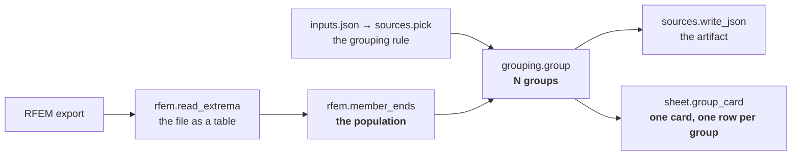

# Grouping strategies

*How a population of member forces is divided into connection groups, and how to
add a new way of dividing it.*

Written for an engineer who has never seen this codebase. Nothing below assumes
you know the graph engine; the only prerequisite is that you can read Python.

---

## 1. What a grouping strategy is, and why the concept exists

A structural model gives you a force at every member end — hundreds or thousands
of numbers. A connection design is a drawing: a plate, a bolt pattern, a bearing
detail. You cannot draw one per member end, and you should not draw one for the
whole model either. So you **group**: you decide which member ends will share a
connection design, and each group gets one design, sized for whatever force
governs that group.

That decision — *how do you divide them?* — is an engineering judgement, and it
changes from project to project:

- **Standardise.** One detail for the whole model, sized for the worst case.
  Simple to fabricate, wasteful for the light ends.
- **Tier by load.** "Above 600 kN one detail, above 400 kN another, the rest a
  third." Three drawings; the light ends stop paying for the heavy one.
- **Group by geometry.** All the ends at a column head, all the ends of a member
  family, all the ends the fabricator can reach with the same tool.
- **Group by whatever this project's engineer decides**, which is the whole
  point: the list above is not closed and never will be.

A **grouping strategy** is one such rule, written down as a function. This
codebase ships two of them (`single` and `tiered`); the value of the abstraction
is that a third is an *addition* — a new file plus one registration — rather
than an edit to any existing logic.



The three packs know strictly different things, and that separation is what
makes strategies portable:

| Pack | Knows |
|---|---|
| `rfem` | what an RFEM export looks like — its columns, its extremum rows, its units |
| `grouping` | what a *group* is, and nothing about RFEM, bearing pressure or cards |
| `sheet` | what a calculation and a card are, and nothing about how a population was divided |

A strategy lives in `grouping`, so it works on any population from any source.

**Where the files are.**

| | |
|---|---|
| the contract | `graph-engine/nodepacks/grouping/contract.py` |
| the registry | `graph-engine/nodepacks/grouping/registry.py` |
| the shipped strategies | `graph-engine/nodepacks/grouping/single.py`, `tiered.py` |
| the node | `grouping.group`, in `graph-engine/nodepacks/grouping/__init__.py` |
| the summary card | `sheet.group_card`, in `graph-engine/nodepacks/sheet/__init__.py` |
| a worked example | `graph-engine/examples/beam_bearing_pressure_tiered/` |
| the tests | `graph-engine/tests/test_grouping_strategies.py` |
| the authoring/audit skill | `.agents/skills/grouping-strategy/SKILL.md` |

---

## 2. The contract, in full

A strategy is an ordinary Python function of two arguments:

```python
def my_strategy(population, params) -> list[Group]:
    ...
```

### 2.1 What it receives

**`population`** — a tuple of **force records**, already validated. Each record
is a mapping:

```python
{
    "value": 297.175507,                      # the magnitude — a finite number
    "unit": "kN",                             # every record in one population agrees
    "ref": "RFEM 10103/1578 @ 6.15 m · LK67", # a human-readable identity for the row
    # …and any amount of extra provenance the producer chose to attach:
    "component": "Vz", "signed": -297.175507,
    "member": 10103.0, "node": 1578.0, "position": 6.1500000000005,
    "load_case": "LK67", "source": "export.csv",
}
```

Only `value` is yours to decide on. Everything else is **opaque**: you never
rebuild a record, never edit one, and hand the *original objects* back inside
your groups. That single rule is the entire mechanism by which provenance
survives grouping — see §3.4.

You are guaranteed, before your function is entered, that the population is a
non-empty ordered sequence of mappings; every `value` is a finite, non-boolean
real number; `unit` and `ref` are strings; and all records share one unit. You do
**not** re-check any of that (`grouping.contract.validate_population` did).

**`params`** — your strategy's own parameters, as a plain JSON mapping. They come
from the project's `inputs.json`:

```json
"grouping": {
  "strategy": "tiered",
  "params": { "thresholds": [150, 50] }
}
```

The parameters are nested under `params` on purpose: that is *your* namespace, so
you may call a parameter anything at all without ever colliding with a key the
envelope might grow later. You validate them yourself and raise
`engine.UserError` with a sentence the user can act on. **Refuse a key you do not
read** — call `reject_unknown_params(...)`. Ignoring `{"threshold": [150]}`
because you wanted `thresholds` is how a typo becomes a silently wrong design.

### 2.2 What it returns

An ordered list of `Group` (a frozen dataclass, `grouping.contract.Group`):

```python
Group(
    key="T1",                     # a valid Python identifier, unique in the result
    label="[150, ∞) kN",          # what a reviewer reads
    members=(record, record, …),  # the records that fell here, as handed in
    governing=record,             # the one this group is designed for
    extra={"lower": 150.0, "upper": None},   # optional, strategy-specific
)
```

- **`key`** is not decoration. The summary card suffixes the calculation's
  symbols with it — `eta` becomes `eta_T1` — so it must be an identifier.
- **`label`** is free text, and it is what the card's row says. Make it state the
  rule, not just the ordinal: `[150, ∞) kN` beats `Tier 1`.
- **`members`** is derived from, not declared alongside, the count: `group.count`
  is `len(members)`, so the two cannot disagree.
- **`governing`** must be *identically* one of your own `members` (see §3.4).
- **`extra`** is where you put machine-readable descriptors a different renderer
  might want — `tiered` puts its numeric bounds there so nothing has to parse
  `label` back into numbers.

The **order of the list** is your editorial choice and is the order of the rows
on the card. It must be a function of the input, not of dict or file order.

### 2.3 How it is run

Never directly. `grouping.registry.apply_strategy(name, population, params)` is
the only front door, and it does three things in order:

1. validates the population, so you are handed something you can trust;
2. calls you;
3. checks the invariants below on what you returned.

`single` and `tiered` go through exactly that door. There is no fast path for
either — a strategy that got to skip the checks would make the contract a
comment.

---

## 3. The invariants, and why each one matters

Five are enforced on every call. Two more are yours to uphold, because no cheap
runtime check proves them.

### 3.1 Total — every member end lands in some group

A member end in no group is a connection nobody designed. It will not show up as
an error later; it will show up as a hole in the drawing set, or not at all.

### 3.2 Exclusive — no member end lands in two groups

A member end in two groups is a connection designed twice, to two different
forces, with no statement of which one the fabricator should build. Together with
§3.1 this is what makes the word *partition* honest. It is checked by object
identity **and multiplicity**, so a population that legitimately holds the same
record twice is still checked correctly.

### 3.3 Non-empty — no group has zero members

A group nobody falls into is almost always a mistake in the parameters — a
threshold in the wrong place, or in the wrong unit. Consider thresholds of 600
and 400 kN applied to a model whose largest `|Vz|` is 297 kN: silently dropping
the two empty tiers turns "three connection types" into one and says nothing.
Raising instead turns a wrong drawing set into a message you can act on.

Say what is wrong *and what the data actually is*. `tiered`'s message reads:

```
tier T1 [600, ∞) kN catches no member end. The population spans 0.677614 kN to
297.176 kN, so this threshold is in the wrong place (or in the wrong unit). An
empty tier is not dropped silently: it would turn 3 connection types into 2
without saying so.
```

### 3.4 Governing is a real member

`governing` must be *identically* (`is`, not `==`) one of the group's own
members. This is the invariant that makes provenance impossible to fake: because
you cannot synthesise a governing record, the member, node, position and load
case that reach the card are the export's own. A record that is merely *equal* to
a member — a copy, a reconstruction — is rejected too, so "I rebuilt it with the
same numbers" is not a way around it.

Note what this invariant does **not** say: it does not say the maximum governs.
*What* governs a group is a design question you own (§4.1); the framework only
checks that your answer came out of the group.

### 3.5 Keys are identifiers, and unique

Because keys become symbol suffixes, `T1` works and `[150, ∞)` does not.
Duplicates would silently merge two groups' rows into one on the card.

### 3.6 Deterministic (yours to uphold)

The same population and the same params must always give the same groups, byte
for byte. An artifact that re-renders differently tomorrow is not an artifact.
In practice this means: no clock, no randomness, no iteration over an unordered
set, and no dependence on the id of an object.

### 3.7 Order-independent (yours to uphold)

Shuffling the population must change nothing — *including* which record governs.
This forbids the obvious spelling:

```python
governing = max(members, key=force_of)          # ✗ order-dependent under a tie
governing = governing_by_magnitude(members)     # ✓ ties break on `ref`
```

`max` returns the *first* maximal element in iteration order, so on two equal
forces the answer depends on the row order of the export file. Sorting the
candidates by `(-value, ref)` makes the answer a function of the records rather
than of their order, and two records with the same magnitude and the same ref are
indistinguishable anyway.

Both properties are proved by tests rather than by the runtime: see
`test_a_shipped_strategy_is_deterministic` and
`test_a_shipped_strategy_is_order_independent`, which are parametrised over
*every* shipped strategy, so a new one is covered the moment it is added to the
`SHIPPED` table.

---

## 4. The four design questions an author must answer

Before writing any code, answer these four in prose. If you cannot, the rule is
not yet a rule.

### 4.1 What governs a group?

The largest magnitude is the obvious answer and the one both shipped strategies
give, but it is not the only one. A strategy might govern by a percentile (to
discard a single modelling artefact), by an envelope over a support, or by a
different component entirely. Whatever you choose:

- it must be one of the group's own members (§3.4);
- its tie-break must be order-independent (§3.7);
- and the choice belongs in your module's docstring, because it is the single
  most consequential thing your strategy decides.

### 4.2 What happens at a boundary?

Any strategy that cuts a continuum has boundaries, and a value will eventually
land exactly on one. Two things matter:

- **Pick a convention and state it.** `tiered` uses half-open intervals
  `[lower, upper)` — a value exactly on a threshold falls in the tier that
  threshold *opens*, i.e. the upper one. With thresholds 600 and 400, exactly
  `400.0` belongs to `[400, 600)`.
- **Half-open is not a coin toss.** It is the only convention under which
  adjacent bands can neither overlap (§3.2) nor leave a gap (§3.1), and the only
  one where "≥ 400 kN gets the heavier detail" reads the same in the parameters
  as it does on the drawing.

Beware floating point: do not test a boundary by equality. `lower <= v < upper`
is exact and total; `v == threshold` is neither.

### 4.3 What does an empty group mean?

For `tiered`, an error (§3.3). That is the right default and you should need a
reason to depart from it. If your strategy has one — a rule where a group being
empty is genuinely expected and informative — then you must *not* return the
empty group (invariant 3 forbids it); you skip it, and you say in your docstring
why skipping is safe here when it is an error there.

### 4.4 How is provenance preserved?

By doing nothing. Carry the record objects through; do not copy them, do not
project them down to a number, do not rebuild them. If you find yourself building
a dict, stop — you are about to break §3.4, and the card will lose the member and
load case that make it an engineering document.

---

## 5. Worked example: `single`

`nodepacks/grouping/single.py` — the whole implementation:

```python
def single(population, params):
    reject_unknown_params(params, strategy="single", accepted=())
    members = tuple(population)
    return [
        Group(
            key="all",
            label="all member ends",
            members=members,
            governing=governing_by_magnitude(members),
        )
    ]

register("single", single, summary="one group over every member end, …")
```

The four questions, answered:

- **What governs?** The largest magnitude in the model, with `ref` breaking ties.
- **Boundaries?** None — there is one group, so no member end is near an edge.
- **Empty group?** Unreachable: the population is guaranteed non-empty, so the
  one group always has members.
- **Provenance?** The record is handed back exactly as it came in.

`single` matters out of proportion to its size, because it is the case that
already shipped. `rfem.governing_force` — the node that predates all of this —
takes the maximum `|Vz|` over the same filtered rows and returns
`297.175507 kN` at member 10103 / node 1578 / x = 6.15 m / LK67. `single` over
`rfem.member_ends` returns **the same record object's contents**, and a test pins
that equality directly. The degenerate case comes *out* of the abstraction; it is
not bolted onto the side of it.

## 6. Worked example: `tiered`

`nodepacks/grouping/tiered.py`. The user names thresholds, largest first; *n*
thresholds make *n + 1* half-open bands:

```
thresholds = [150, 50]

T1  [150, ∞)   the heaviest ends
T2  [50, 150)
T3  [0, 50)    everything left
```

```python
def bands(thresholds):
    edges = [INFINITY, *thresholds, 0.0]
    return [(edges[i + 1], edges[i]) for i in range(len(edges) - 1)]
```

The four questions:

- **What governs?** The largest magnitude *within the tier* — which is the entire
  reason for tiering.
- **Boundaries?** Half-open, `[lower, upper)`; a value on a threshold goes up.
- **Empty group?** An error, naming the tier, its bounds, and the range the data
  actually spans.
- **Provenance?** Records carried through untouched.

Two parameter rules worth copying:

- **Descending, not sorted for you.** `[50, 150]` is refused rather than
  reordered. Silently reinterpreting the parameters is how a user ends up
  designing to a rule they did not write.
- **Thresholds must be > 0.** The bottom band already starts at 0, so a threshold
  of 0 would create the empty range `[0, 0)`.

On the demo export (184 `Extremum = Vz` rows from
`examples/beam_bearing_pressure_rfem/export.csv`), thresholds `[150, 50]` divide
as:

| tier | range | ends | governing | from |
|---|---|---:|---:|---|
| T1 | `[150, ∞) kN` | 24 | 297.175507 kN | `RFEM 10103/1578 @ 6.15 m · LK67` |
| T2 | `[50, 150) kN` | 97 | 144.104507 kN | `RFEM 10105/1933 @ 0 m · LK80` |
| T3 | `[0, 50) kN` | 63 | 48.985149 kN | `RFEM 10112/1943 @ 5.1 m · LK3` |

24 + 97 + 63 = 184.

---

## 7. What happens downstream

Two consequences of the design are worth understanding before you write a
strategy, because they constrain what a group has to carry.

**One node returns N groups.** How many groups there are is a property of the
*data* — a tier list in a project's inputs — never of the graph. So the canvas
shows one `grouping.group` node whatever the count, and moving a threshold
changes the card without changing the graph. The alternative (a node per group)
would mean re-authoring the graph every time the rule moved.

**One summary node renders them all.** `sheet.group_card` takes a calculation
written **once, for one group**, and instantiates it per group:

- a formula that reads the varying given — or anything derived from it — is
  copied per group and suffixed with the group's `key`;
- a formula that does not is computed **once**. That is how "all groups share one
  geometry" ends up being a property of the arithmetic rather than an assertion:
  `l_ef`, `A_ef` and `f_c90d` appear once on the card, and only `sigma_c90d` and
  `eta` appear per tier;
- a check is copied on the same rule, with the group's `label` folded into its
  description.

The accepted trade-off — the owner's, explicitly — is that the per-group
arithmetic happens inside a node instead of being individually openable on the
canvas. The card carries that burden by putting every intermediate value on it,
subscripted with the group's key, and by naming the strategy *and its exact
parameters* in the fine print, so the division can be checked and not merely
read.

What the card shows per group, and where it comes from:

| on the card | from the `Group` |
|---|---|
| the range / label | `label` (also the `ref` of the count row) |
| how many member ends | `count`, i.e. `len(members)` |
| the governing force + unit | `governing["value"]`, `governing["unit"]` |
| member / node / position / load case | `governing["ref"]` |
| η and the verdict | computed from the governing force by the author's own check |

Because the count and the governing force are two adjacent rows keyed by the same
subscript, a reviewer reads the whole chain — tier → how many ends → which force
→ which export row → which η → PASS/FAIL — without leaving the card.

**Out of scope, deliberately.** Every group shares one *geometry*: only the
governing force varies. Designing a wider bearing plate for the heaviest tier is
the real-world next step and needs a per-group **given**, not just a per-group
force. Nothing here forbids it; nothing here implements it.

---

## 8. Adding a third strategy

Six steps. The first is the one people skip.

**1. Answer the four design questions of §4 in prose**, in your module docstring.
If "what governs a group" is not decided, nothing below will make sense.

**2. Write the module** — `nodepacks/grouping/<name>.py`:

```python
"""``by_support`` — one group per support node, whatever the load.

* **What governs a group** — the largest magnitude at that support.
* **Boundaries** — none; membership is by identity of the support node.
* **Empty groups** — unreachable: a group exists only because a record created it.
* **Provenance** — records are carried through untouched.
"""

from __future__ import annotations

from collections.abc import Mapping, Sequence

from engine import UserError

from .contract import Group, governing_by_magnitude, reject_unknown_params
from .registry import register

ACCEPTED_PARAMS = ("field",)


def by_support(population, params):
    reject_unknown_params(params, strategy="by_support", accepted=ACCEPTED_PARAMS)
    field = params.get("field", "node")

    buckets: dict[str, list] = {}
    for record in population:
        if field not in record:
            raise UserError(
                f"member end {record.get('ref', '')!r} has no {field!r}; "
                f"'by_support' groups by that key"
            )
        buckets.setdefault(str(record[field]), []).append(record)

    # Sorted, so the result depends on the data and not on insertion order.
    groups = []
    for index, key in enumerate(sorted(buckets), start=1):
        members = tuple(buckets[key])
        groups.append(
            Group(
                key=f"S{index}",
                label=f"support {key}",
                members=members,
                governing=governing_by_magnitude(members),
                extra={field: key},
            )
        )
    return groups


register("by_support", by_support, summary="one group per support node")
```

**3. Register it by importing the module** — one line in
`nodepacks/grouping/__init__.py`:

```python
from . import by_support as by_support  # noqa: F401 - imported for its registration
```

That is the whole integration. No existing file's *logic* changes; no dispatch
chain grows a branch; no error message has to learn the new name (they are
generated from the registry).

**4. Add it to the shared test table.** In
`tests/test_grouping_strategies.py`, extend `SHIPPED`:

```python
SHIPPED = {
    "single": {},
    "tiered": {"thresholds": DEMO_THRESHOLDS},
    "by_support": {},
}
```

Every invariant test, the determinism test and the order-independence test are
parametrised over that table, so your strategy is now held to the whole contract
over the real 184-row export. Then add the tests only *you* can write: the
boundary case, the parameter errors, and the distribution your rule produces on
that data.

**5. Add a `## Worked example:` section to this guide**, following §5/§6:
the code, the four questions answered, and the distribution it produces on the
demo export.

**6. Run the audit.** `.agents/skills/grouping-strategy/SKILL.md` has an audit
half that checks a strategy against everything above; run it on your new module
before you open a pull request.

---

## 9. Reference: the API surface

```python
from grouping import (
    Group,                    # the return type
    Strategy,                 # the callable type: (population, params) -> [Group]
    StrategyContractError,    # raised when a strategy breaks an invariant

    register,                 # register(name, fn, summary="…")
    strategy_names,           # -> ["single", "tiered", …]
    get_strategy,             # name -> fn; UserError lists what exists
    apply_strategy,           # the front door: validate, run, check

    validate_population,      # what apply_strategy runs before you
    check_invariants,         # what apply_strategy runs after you
    force_of,                 # record -> float
    governing_by_magnitude,   # order-independent "largest wins"
    population_unit,          # the shared unit of a validated population
    reject_unknown_params,    # refuse a param you do not read

    group,                    # the node
)
```

Errors, and which is which:

| raised | means | fixed by |
|---|---|---|
| `engine.UserError` | the input or the parameters are wrong | the user, in `inputs.json` |
| `StrategyContractError` | the strategy broke an invariant | the author, in the strategy |

A contract violation is deliberately **not** a `UserError`: no threshold the user
could type would fix it, and the message names the strategy so the report points
at the file to open.
