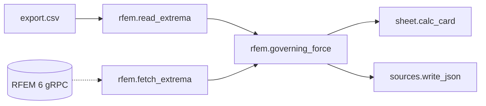

# Replacing the manual RFEM export with the Dlubal API — research and plan

Status: **research / proposal** (2026-07) · Scope: `graph-engine/nodepacks/rfem`,
`examples/beam_bearing_pressure_rfem` · Relates to: ADR 0001 (stdlib core),
ADR 0003 (execution environment), ADR 0004 (graph ⟷ source bijection),
ADR 0005 (node-declared widgets)

No implementation. This is what the official Dlubal documentation and the
official Dlubal-published client package actually say, followed by what an
API-backed path would look like **for this codebase**, and the honest case
against building it.

---

## 0. Read this first — the three findings that shape everything

1. **The API cannot give us our table in one filtered call.** The extremum
   ("governing") tables exist, but only through `get_result_table(...)`, which
   accepts **no filters** and **one loading**. The one call that *is* filterable,
   `get_results(...)`, has **no extremum concept at all** — it returns raw
   per-location results, and Dlubal's own example computes the min in Pandas
   afterwards. There is no overlap: *filtered* and *pre-extremised* are two
   different calls. §3 has the evidence. This directly undercuts the reasoning
   in `rfem.governing_force`'s docstring, which says taking RFEM's own extremum
   answer is "the owner's explicit choice over re-deriving one" — the filterable
   API path forces us to re-derive it. That is a design decision to make
   consciously, not a detail.

2. **Connecting is a bigger commitment than "add an HTTP node".** The RFEM
   server is **Windows-only**, must be running (GUI or headless `RFEM6Server.exe`),
   speaks **gRPC over HTTP/2** on `127.0.0.1:9000` by default, and requires a
   **personal API key plus a metered subscription** — the free tier is 1,000 API
   requests *per month*. Our own agent egress proxy explicitly lists
   "gRPC / HTTP/2-only APIs" as unsupported; that is a preview of what a
   corporate network will do. §2.

3. **Storeys are real and first-class — but not filterable.** RFEM 6 has a
   `BuildingStory` object with `story_no`, `elevation`, `bottom_elevation`, and
   a `FloorSet` join carrying `building_story` + `floor_members`. So storey →
   member numbers is an **exact lookup**, not a Z-coordinate guess. But the
   server will not filter by it: every engineering criterion except **member
   number** and **loading** is client-side. §4.

---

## 1. What we consume today

`nodepacks/rfem/read_extrema` reads `examples/beam_bearing_pressure_rfem/export.csv`,
produced by the committed `xlsx_to_csv.py` from a committed workbook. Eight
columns:

| Column | Meaning | Unit |
|---|---|---|
| `Stab` | member number | — |
| `Knoten` | node number at the member end | — |
| `x_m` | location along the member | m |
| `Extremum` | which component's extremum this row reports (`N`,`Vy`,`Vz`,`MT`,`My`,`Mz`) | — |
| `N_kN`, `Vy_kN`, `Vz_kN` | the axial/shear forces at that row | kN |
| `Lastfall` | the load case that produced the extremum | — |

1104 rows = 46 members × 2 ends × 6 components × max/min. `governing_force`
filters to `Extremum == component` and takes the largest `|force|`.

**What the workbook itself says about its provenance** (read out of the `.xlsx`
package directly, not from the docs):

- sheet name: **`Stäbe | Schnittgrößen`** — "Members | Internal Forces"
- header strings: `Knoten`, `Stelle`/`x [m]`, `Kräfte [kN]`, `N`, `Vy`, `Vz`,
  and **`Zugehörige Belastung`** — "corresponding loading"
- creator: `Qt Xlsx Library` (RFEM is a Qt application — this is a genuine
  RFEM-side export, not something re-saved through Excel)

"Corresponding loading" next to an unnamed extremum-designator column is the
signature of an extreme-value table: each row is *an extremum* and the load case
that caused it. That matters in §3, because it tells us which API surface we are
actually trying to replace.

---

## 2. Which API, and what it takes to connect

### 2.1 Evidence quality — read this before trusting a citation

`www.dlubal.com` and `apidocs.dlubal.com` are **blocked by this environment's
egress policy**: every fetch (WebFetch and `curl`) returned HTTP 403 at the
CONNECT stage. What we could reach was **PyPI**, which hosts Dlubal's own
official client packages, and **GitHub**, which hosts Dlubal's own client repos.

So citations below are marked:

- **[wheel]** — read verbatim out of the official `dlubal.api` **2.15.3** wheel
  downloaded from PyPI (`https://pypi.org/project/dlubal.api/`). This is
  primary evidence: Dlubal's own shipped code, docstrings and examples.
- **[repo]** — read verbatim from a Dlubal GitHub repository README.
- **[extract]** — a search-engine rendering of a `dlubal.com` /
  `apidocs.dlubal.com` page we could **not** open. The URL is real and the
  wording is what the search index returned, but nobody here read the page.
  **Spot-check every [extract] before relying on a number.**

Where the docs are silent, this document says so rather than guessing.

### 2.2 Two generations, one of them frozen

| | API I — "Web Services" | API II — "Dlubal API" |
|---|---|---|
| Transport | SOAP / WSDL over HTTP | **gRPC over HTTP/2** |
| Python client | `RFEM` (PyPI), `RFEM_Python_Client` (GitHub) | `dlubal.api` (PyPI) |
| Default endpoint | `http://localhost:8081/wsdl` | `127.0.0.1:9000` |
| Client licence | MIT | see §5.2 — contradictory |
| Status | **maintenance mode** | current |

The `RFEM_Python_Client` README states, verbatim **[repo]**
(https://github.com/dlubal-software/RFEM_Python_Client):

> "effective **23.05.2025**, we are transitioning our existing Webservice into
> **maintenance mode**. This means that while the Webservice will continue to be
> available for existing use, **no new enhancements or functionality** will be
> added to it going forward." … "For **new projects**, we highly recommend using
> the **Dlubal API**, now based on **gRPC**."

Dlubal's KB 001921 "API II for RFEM 6 / RSTAB 9: New Features and Differences"
adds that new RFEM 6 functionality lands only in API II while API I stays
"frozen", and puts API II at roughly **10× faster** **[extract]**
(https://www.dlubal.com/en/support-and-learning/support/knowledge-base/001921).

Note the wording: *maintenance mode* / *frozen*, never "deprecated". **No
end-of-life date for API I could be found.** Open question.

**RFEM 5** is a different world: `RF-COM` is a **separately licensed add-on
module** based on COM/ActiveX, embedded in VB / VBA / Visual C++. FAQ 003034:
"The RF-COM/RS-COM interface requires valid licenses for RF-COM/RS-COM, as well
as for RFEM/RSTAB and the respective add-on modules whose data is to be used"
**[extract]** (https://www.dlubal.com/en-US/support-and-learning/support/faq/003034,
product page https://www.dlubal.com/en/products/older-products/rfem-add-on-modules/others/rf-com).
Its docs also prescribe `iApp.LockLicense` / `iApp.UnlockLicense` around your
work, warning that an unhandled error leaves RFEM locked until you kill it via
Task Manager **[extract]** (KB 001293). **RF-COM is not a path we should
consider**: it is RFEM 5, it is COM, it is a separate purchase, and it holds a
licence lock. Everything below is RFEM 6 / API II.

### 2.3 What has to be running, where

From `dlubal/api/rfem/application.py`, `Application.__init__` **[wheel]**:

```
url  (str | 127.0.0.1): The gRPC server's URL. Use this to connect to a remote
                        server by specifying its IP.
port (int | 9000):      The server's port number.
ssl  (bool | False):    Enables SSL encryption for secure communication.
```

- **The RFEM server must exist and be reachable.** Two ways:
  - GUI running — "by default, the Dlubal API gRPC server starts together with
    the GUI application itself (RFEM/RSTAB); when the GUI is launched, the
    server is initialized in the background" **[extract]**
    (https://apidocs.dlubal.com/starting_server.html);
  - **headless CLI** — `RFEM6Server.exe --email=… --password=… --license=… --start-grpc-server=9000`,
    with "No special installation is required to use RFEM 6 as a SOAP or GRPC
    server, as the server version of RFEM is installed as part of the usual
    installation" and "You can also run the server without the graphical user
    interface (GUI) using the Command-Line Interface (CLI)" **[extract]**
    (https://www.dlubal.com/en/support-and-learning/support/faq/005603).
    Note the headless server needs **email + password + licence number** — a
    second credential set, separate from the API key.
- **Remote is supported**: pass the server's IP as `url` **[wheel]**. SSL and a
  Root CA are documented at `https://apidocs.dlubal.com/remote_access.html`
  **[extract]**.
- **Authentication is a required bearer API key.** `dlubal/api/common/connection.py`
  injects `("authorization", f"Bearer {api_key}")` on every call **[wheel]**.
  Keys start with `AK`, and may be stored in a `config.ini` at
  `%LOCALAPPDATA%\Dlubal\api\config.ini` (Windows) or
  `$XDG_CONFIG_HOME/Dlubal/api/config.ini` (POSIX) **[wheel]**. Keys are
  generated in Extranet → API & Cloud → API II → My API Keys, are assigned to a
  *company*, and are shown once **[extract]**.
- **Version handshake.** On connect the client compares its own minor version
  against the server's and prints "To ensure full compatibility, please use the
  client version 2.{app_major}.{app_minor}" **[wheel]**. PyPI pins
  `dlubal.api` 2.15.3 to Dlubal App version `X.15.0003.341.9e8952eb01d`
  **[wheel]**. **The client version is coupled to the desktop version.**
- **Platform: the server is Windows-only.** "RFEM and RSTAB are available for
  Windows only. Linux and macOS are not supported" **[extract]**
  (https://www.dlubal.com/en/support-and-learning/support/faq/001493). The
  *client* is cross-platform — the wheel's config path branches on
  `os.name == 'nt'` vs `XDG_CONFIG_HOME` **[wheel]**, and `pywin32` is a
  Windows-only conditional dependency. Dlubal markets the API service as
  "container-ready" **[extract]**
  (https://www.dlubal.com/en/products/dlubal-api/api-service), but the only
  concrete Docker documentation found is a **Debian dev container for the
  client**, not the server **[extract]**. **Open question: can RFEM 6 itself run
  in a container? Assume no until proven.**

### 2.4 Licensing and metering

- A valid RFEM 6 licence (full, trial, academic or student) **plus** an API key
  is required. "Full program licenses, academic and student licenses, and trial
  versions are compatible with the Dlubal API"; demo versions are "in
  preparation" **[extract]**
  (https://www.dlubal.com/en/products/dlubal-api/api-documentation/getting_started).
- The subscription is **metered by request count**, not by seat. The client can
  read its own quota: `get_subscription_info()` returns
  `SubscriptionInfo(api_requests_count, api_requests_limit, subscription_plan)`
  **[wheel]**.
- Published tiers **[extract]**
  (https://www.dlubal.com/en/products/dlubal-api/api-documentation/subscriptions_and_pricing,
  https://apidocs.dlubal.com/pricing.html):

  | Plan | Cost | Requests / month | Overage |
  |---|---|---|---|
  | Free | 0 | 1,000 | none possible |
  | Basic | USD 110/mo | 3,000 | USD 0.08/req |
  | Professional | USD 330/mo | 10,000 | USD 0.050/req |

  "An API request refers to a single call of an API method … regardless of
  whether the method returns a success, error, or any other result" **[extract]**.

**This is the fact that most changes how a node should be written: every graph
run costs metered requests.** A node that issues four calls per run burns the
free tier in 250 runs.

---

## 3. Reading member end forces — and the extrema question

### 3.1 The two calls, and what each will not do

`Application` exposes two relevant reads **[wheel]**:

```python
def get_results(self, results_type: ResultsType, filters=None,
                member_axes_system=None, support_coordinate_system=None,
                model_id=None, **keyword_filters)
    """Retrieves complete, unprocessed results from the database wrapped in a
    DataFrame for more efficient analysis."""

def get_result_table(self, table: ResultTable, loading: ObjectId,
                     member_axes_system=None, support_coordinate_system=None,
                     model_id=None)
    """Retrieves a pre-processed result table wrapped in a DataFrame …
    containing only the most relevant values as displayed in the desktop
    application."""
```

`ResultsQuery` (the wire message behind `get_results`) has exactly five fields —
`model_id`, `results_type`, `filters`, `member_axes_system`,
`support_coordinate_system` — and `ResultsFilter` is exactly
`{column_id: str, filter_expression: str}` **[wheel]**. **There is no extremum
flag, no envelope flag, no "max/min per member" option anywhere in the query
message.**

### 3.2 Does the API return extrema? Yes and no — and the "no" is the one that bites

**Pre-computed extrema exist as `ResultTable` values.** The `ResultTable` enum
contains, per design add-on **[wheel]**:

```
TIMBER_DESIGN_GOVERNING_INTERNAL_FORCES_BY_MEMBER_ENDS_TABLE
TIMBER_DESIGN_GOVERNING_INTERNAL_FORCES_BY_MEMBER_TABLE
TIMBER_DESIGN_GOVERNING_INTERNAL_FORCES_BY_MEMBER_SET_ENDS_TABLE
…and the identical family under STEEL_DESIGN_, CONCRETE_DESIGN_,
   ALUMINUM_DESIGN_, STRESS_ANALYSIS_
```

`…GOVERNING_INTERNAL_FORCES_BY_MEMBER_ENDS_TABLE` is, by name, precisely
"design loads, members, start/end".

**But `get_result_table` takes no filters at all** — only a table type and one
`loading: ObjectId`. And, decisively:

```
$ grep -n "GOVERNING" dlubal/api/rfem/results/results_type_pb2.pyi
(no matches)
```

**There is no `GOVERNING…` value in `ResultsType`** **[wheel]**. The extremum
tables are unreachable from the *filterable* call. Concretely:

| | filter by member? | filter by loading? | extrema pre-computed? |
|---|---|---|---|
| `get_results` | **yes** (`member_no`) | **yes** (`loading`) | **no** |
| `get_result_table` | no | one loading only | **yes** |

**So the choice is forced, and it is the single most consequential design fact
in this document:**

- **(A) `get_results` + compute extrema ourselves.** Filterable, one call,
  raw per-location rows. We re-derive max/min per member end per component in
  Python. This *reverses* the explicit reasoning in `governing_force`'s
  docstring — "RFEM has already done the extremum search … Taking its answer is
  the owner's explicit choice over re-deriving one from every row in the file."
- **(B) `get_result_table` on a `…GOVERNING_INTERNAL_FORCES_BY_MEMBER_ENDS_TABLE`.**
  Keeps RFEM's own answer, but returns the whole model unfiltered, for a single
  loading, and requires the relevant **design add-on** to be licensed and run.

Dlubal's own example takes route (A) and says so out loud — from
`examples/rfem/results/results_filtering.py` **[wheel]**:

```python
results = rfem_app.get_results(
    results_type=rfem.results.ResultsType.STATIC_ANALYSIS_MEMBERS_INTERNAL_FORCES,
    filters=filters).data
# --- Post-processing results by Pandas DataFrame ---
row_n_min = results.loc[results['n'].idxmin()]
n_min = results['n'].min()
```

### 3.3 Which surface produced *our* file — unresolved

Our workbook's sheet is named **`Stäbe | Schnittgrößen`** ("Members | Internal
Forces"), not a design-add-on caption, which points at
`STATIC_ANALYSIS_MEMBERS_INTERNAL_FORCES_TABLE` rather than a
`…_DESIGN_GOVERNING_…` table. But the file carries an extremum designator column
and `Zugehörige Belastung`, and spans ~78 load cases (`LK3`…`LK78`) — which a
single `get_result_table(loading=<one ObjectId>)` call cannot produce.

**Open question, and it is the first thing a spike should answer:** which RFEM 6
table, with which Result Table Manager settings, produced this workbook — and
does any single API call reproduce it? The documentation reachable from here
does not say. Resolution is empirical (§7, Phase 0), not bibliographic.

### 3.4 Columns, shape and units

`get_results` and `get_result_table` both return a `common.Table` wrapping a
**Pandas DataFrame** on `.data`, plus `.warning` **[wheel]**. Column identifiers
seen in Dlubal's own examples for member internal forces **[wheel]**
(`examples/rfem/results/results_in_location.py`):

```python
df_results['location_x']   # position along the member
df_results['v_z']          # shear
df_results['m_y']          # moment
filters: column_id="member_no", column_id="loading"
```

Column metadata is carried on the wire: `TableColumn` is
`{id, name, group_name, unit, attribute_id, table_column, table_id, editable}`
**[wheel]**, and the client can expose it as a two-row header
(`include_names_row=True` → `"name [unit]"`) **[wheel]**.

**Mapping to the eight columns we consume:**

| our column | API source | note |
|---|---|---|
| `Stab` | `member_no` | direct; also the one native filter |
| `Knoten` | — | **not present** in the internal-forces result. Must be joined from `Member.node_start` / `Member.node_end` (a second call) |
| `x_m` | `location_x` | direct |
| `Extremum` | — | **does not exist** on route (A); we synthesise it when we compute the extremum |
| `N_kN`,`Vy_kN`,`Vz_kN` | `n`, `v_y`, `v_z` | naming confirmed for `v_z`/`m_y`; `n` confirmed; `v_y` inferred from the pattern — **unconfirmed** |
| `Lastfall` | `loading` | direct |

**Units are an open question, and a dangerous one.** `get_object_table` has a
`use_current_units` flag documented as "Identifier whether user defined or SI
units are used to represent values" **[wheel]**, and Dlubal's modelling examples
are annotated "Editable parameters (SI units)" **[wheel]** — which suggests the
API works in **SI base units (N, m)**, i.e. **forces in newtons, not kilonewtons**.
But `get_results` exposes **no such flag at all**, and no doc we could reach
states the unit convention for results. The only trustworthy answer is the
per-column `unit` string in `TableColumn`. **Any implementation must read the
unit from column metadata and refuse to guess** — a silent factor-1000 error
here would produce a plausible-looking wrong bearing check.

### 3.5 Rate, size and performance

- **Metering, not throttling.** The documented limit is a **monthly request
  quota** (§2.4), readable at runtime via `get_subscription_info()` **[wheel]**.
  **No per-second or concurrency limit is documented anywhere we could reach.**
- **Bulk is the documented performance mechanism.** KB 001921: "API II allows
  multiple objects to be combined into a list and then transferred, which means
  that only a few API calls are required rather than a large number of small
  ones" **[extract]**. The client mirrors this with paired
  `create_object`/`create_object_list`, `get_object`/`get_object_list`, etc.
  **[wheel]**.
- **Large payloads are anticipated by design.** The channel is opened with
  `grpc.max_send_message_length = -1`, `grpc.max_receive_message_length = -1`
  and `grpc.Compression.Gzip` **[wheel]** — uncapped message size, compression
  on by default.
- **Results come in bulk, per query, not per object.** One `get_results` call
  returns a whole DataFrame. A naive implementation is slow in the *other*
  direction: fetching unfiltered raw internal forces for a whole model means
  every mesh location × every loading. `get_results` is described as "complete,
  unprocessed results" **[wheel]**, and a GitHub issue on the older client is
  literally titled "Clarification on Excessive Results for Member Internal
  Forces Retrieval" (https://github.com/dlubal-software/RFEM_Python_Client/issues/343).
  **Always pass `member_no` and `loading` filters.**
- **No model-locking protocol** exists for API II (unlike RF-COM's
  `LockLicense`). Nothing documents what happens if the model is edited in the
  GUI mid-query. Open question.

---

## 4. Selection criteria — what is native, what is ours

### 4.1 The native filter set is two columns wide

Dlubal's own shipped example says it in a comment, verbatim **[wheel]**
(`examples/rfem/results/results_filtering.py`):

```python
# Add optional filters to limit the amount of data retrieved from the database.
# Currently, filters can only be applied to 'object_no' and/or 'loading'!
filters=[
    rfem.results.ResultsFilter(column_id='member_no', filter_expression='1,3,6'),
    rfem.results.ResultsFilter(column_id='loading',   filter_expression='LC1, CO1'),
]
```

`filter_expression` is a **string**; comma-separated lists are demonstrated.
**Whether ranges (`1-10`), wildcards or comparisons are supported is not
documented** — open question.

`get_object_list(objs, only_selected=False, model_id=None)` has **no attribute
filter whatsoever** **[wheel]** — object type and "is it selected in the GUI",
and nothing else. `get_object_id_list` adds only `object_type` + `parent_no`.

### 4.2 Criterion by criterion

| Criterion | Native? | How |
|---|---|---|
| **Member number list** | **native** (results) | `ResultsFilter(column_id='member_no', …)` |
| **Load case / combination** | **native** | `ResultsFilter(column_id='loading', …)`; or `loading: ObjectId` on `get_result_table` |
| **Floor / storey** | **client-side** | exact lookup — see §4.3 |
| **Cross-section** | **client-side** | fetch `Member.cross_section_start`, filter in Python. (Only *grouped* tables exist server-side: `…_INTERNAL_FORCES_BY_SECTION_TABLE`.) |
| **Material** | **client-side** | via `CrossSection.material`; `…_BY_MATERIAL_TABLE` groups but cannot select |
| **Member type** | **client-side** | `Member.type` ∈ `TYPE_BEAM`, `TYPE_COLUMN`, `TYPE_RIB`, `TYPE_TRUSS`, `TYPE_TENSION`, `TYPE_RIGID`, `TYPE_RESULT_BEAM`, … **[wheel]**. Dlubal's own `examples/rfem/modeling/steel_hall.py` does exactly this loop client-side |
| **Member set / structural group** | **client-side lookup** | `MemberSet.members` is a member-number list; fetch the set, then filter by number (which *is* native) |
| **Geometric (Z-range, bbox, plane)** | **client-side** | no geometric query parameter exists on any list/results method. `ClippingBox`/`ClippingPlane` are *visibility guide objects*, not query filters |
| **Criteria-based "Object Selection"** | **not exposed** | `OBJECT_TYPE_GROUP_OF_OBJECT_SELECTIONS` exists but `OBJECT_TYPE_OBJECT_SELECTION` does **not**, and `GroupOfObjectSelections.object_selections` is a bare `repeated int` whose targets are unresolvable through the API **[wheel]** |

**The rule that falls out: fetch by type, filter in Python, then feed the
resulting member numbers back as the one native filter.** Every criterion
collapses into "compute a member-number list client-side, pass it as
`member_no`". That is a *good* shape for us — it means one selection concept in
our UI, not eight.

### 4.3 Storeys — first class, and better than a Z-range

RFEM 6 models storeys as real objects, and API II exposes them **[wheel]**:

```
OBJECT_TYPE_BUILDING_STORY, OBJECT_TYPE_FLOOR_SET,
OBJECT_TYPE_SHEAR_WALL, OBJECT_TYPE_DEEP_BEAM, OBJECT_TYPE_BUILDING_GRID
```

`BuildingStory` carries `story_no`, `name`, `elevation`, `bottom_elevation`,
`height`, `thickness`, `mass`, `center_of_gravity_x/y` — and, critically,
`members_included_in_floors: repeated int` **[wheel]**.

`FloorSet` is the join **[wheel]**:

```
building_story: int
floor_members:  repeated int
connected_members: repeated int
members_included_in_floors: repeated int
```

So `storey → member numbers` is an **exact model-declared mapping**, obtained by
`get_object_list(objs=[rfem.building_model.FloorSet()])` and reading two fields.
No elevation-band heuristic needed.

Two caveats:

- **The Building Model add-on is probably required.** The old SOAP client's enums
  include a `building_model_active` toggle, which strongly implies the objects
  are add-on-gated **[wheel]**, and the feature is sold as a separate add-on
  (https://www.dlubal.com/en/products/rfem-fea-software/add-ons-for-rfem-6/special-solutions/building-model)
  **[extract]**. **Whether `BuildingStory`/`FloorSet` reads fail, or return
  empty, without it is not documented.** Open question.
- **A Z-range fallback is always available.** `Node.coordinate_3` /
  `global_coordinate_3` and `Member.center_of_gravity_z` are on the objects
  **[wheel]**, so a client-side elevation band works on any model. It should be
  the fallback, not the default — the model's own storey assignment is better
  data than our arithmetic.

Storey *results* tables exist too (`STATIC_ANALYSIS_BUILDING_STORIES_STORY_ACTIONS_TABLE`,
`…_INTERSTORY_DRIFTS_TABLE`, …) but only in `ResultTable`, never in `ResultsType`
**[wheel]** — i.e. reachable only through the unfilterable call. Not what we
need, but worth knowing.

Also note the spelling: the API says **`Story`/`STORIES`** (American) throughout.
Searching the package for "storey" finds nothing.

---

## 5. The plan

### 5.1 The node seam — one node swapped, nothing else

`sources` was built around a CSV↔API swap: `read_csv` and `mock_api` emit the
same `list` shape, so one replaces the other and the rest of the graph does not
notice. `rfem` gets the same treatment, at the same seam — **the table**, not
the record.



The contract both sides must honour is exactly what `read_extrema` returns
today: `{'columns': [...], 'rows': [[...]], 'source': str}` — the `table` pack's
shape, with the eight columns of §1 and cells parsed as `float` where possible.
`governing_force` already validates the columns it needs and raises `UserError`
naming the ones it did not find, so a wrong-shaped API table fails loudly at the
same place a wrong-shaped CSV does.

Three consequences worth stating:

- **`source` becomes the API's provenance line, not a file name.** Today it is
  `Path(path).name`, deliberately not the absolute path, because it ends up in a
  written artifact. The API sibling should put an equally short, equally
  human-meaningful string there — model name plus fetch timestamp, e.g.
  `RFEM Hauptmodell.rf6 @ 2026-07-26T15:14Z`. `governing_force` copies it into
  the record untouched; nothing else changes.
- **The `Extremum` column is synthesised on route (A).** If we compute the
  extrema ourselves, we emit the same six designators, so `governing_force`'s
  filter — the node whose docstring insists the filter is not optional — keeps
  working unchanged. The *meaning* has shifted (our extremum search, not
  RFEM's), and that shift must be recorded in the `ref`/provenance, not hidden.
- **The extremum computation is its own pure node, not part of the fetch.** Same
  argument as the existing read/select split: reading and *deriving* have
  different lifetimes. So the pack grows to four nodes, three of which are pure:

```
rfem.read_extrema        (file → table)          pure, exists
rfem.fetch_raw           (API → raw table)       NETWORK, new
rfem.extrema_from_raw    (raw table → table)     pure, new
rfem.governing_force     (table → record)        pure, exists
```

`fetch_raw` is deliberately thin — connect, query, hand back rows. Everything
that can be wrong about the *engineering* lives in `extrema_from_raw`, which is
a pure function with a committed fixture and no network. That is what makes the
risky half testable offline.

### 5.2 Dependencies — the real cost

`dlubal.api` 2.15.3's own metadata **[wheel]**:

```
Requires-Python: >=3.10
Requires-Dist: grpcio==1.76.0
Requires-Dist: grpcio-tools==1.76.0
Requires-Dist: pandas==2.2.3; python_version < "3.14"
Requires-Dist: openpyxl<4.0.0,>=3.1.0
Requires-Dist: pywin32>=307; platform_system == "Windows"
Requires-Dist: vtk==9.6.0
Requires-Dist: dlubal.api.geo-zone-tool>=0.0.5
```

This is a heavy tree for an engine that is pure stdlib by design (ADR 0001):
**grpcio** (compiled), **pandas**, **openpyxl**, and **vtk** — a full 3-D
visualisation toolkit, hundreds of megabytes, pinned to an exact version, pulled
in for `get_result_contour`, which we would never call. Two of the three pins
are exact (`==`), so this package will fight any other dependency in the same
environment.

**Licence is contradictory and must be resolved before use.** The wheel metadata
says `License-Expression: MIT`; the README in the same wheel says "This package
is proprietary software and requires an **active API Service subscription**.
Unauthorized use is prohibited." **[wheel]**. Both statements ship in the same
artifact. **Open question — ask Dlubal in writing.** (The older SOAP client,
`RFEM` on PyPI, is unambiguously MIT and depends only on `suds`, `requests`,
`six`, `mock`, `xmltodict` — a far lighter tree, at the cost of being frozen.)

**Where it sits:** exactly where `sym` sits today — a node-pack-scoped optional
extra in `pyproject.toml` (`rfem-api = ["dlubal.api>=2.15,<3"]`), lazy-imported
inside `fetch_raw`'s body so `import rfem`, spec listing, and every existing test
keep working without it. Per ADR 0003 the graph then declares
`dependencies: [{"name": "dlubal.api", "version": "2.15.*"}]`. **The version
must be pinned to the desktop's minor version** (§2.3) — which means the
declared dependency is a property of *someone's RFEM installation*, not of our
graph. That is unusual and worth a comment in the descriptor.

### 5.3 Offline and reproducibility — the honest treatment

ADR 0003 declares `network: "none"` as the only value v1 accepts, and the
example's `build_graph()` sets it explicitly. A network-reaching node is a
genuine departure from that, and there are four distinct problems, not one.

**(a) The descriptor cannot yet express what this node needs.** ADR 0003
decision 3 makes `network` a *closed enum, `"none"` only*, precisely so a future
`"restricted"`/`"full"` is an additive value rather than a new field. This node
is the first real customer for that. But "restricted" alone is not enough — we
would want to name the endpoint. The schema-tolerant route (ADR 0001 decision 7,
`additionalProperties: true`) is a sibling key rather than a shape change:

```jsonc
"environment": {
  "dependencies": [{"name": "dlubal.api", "version": "2.15.*"}],
  "mounts": [],
  "network": "restricted",
  "hosts": ["127.0.0.1:9000"]     // additive; ignored by older validators
}
```

**(b) Nothing enforces it.** ADR 0003 is explicit that enforcement is C2–C5's
job and that v1 is "accident-proof, not malice-proof". Network posture is C5 and
does not exist. **So shipping a network node before C5 means the declaration is
documentation, not a guard.** Say that in the node's docstring rather than
letting the descriptor imply a containment it does not provide.

**(c) A secret enters the picture, and ADR 0004 makes that dangerous.** The API
key is a bearer credential. ADR 0004 D5 round-trips literal arguments into the
composite's source text — **an `api_key="AK…"` parameter would be written into a
`.py` file and committed.** Therefore: **the key must never be a node
parameter.** `fetch_raw` reads it from the environment or from Dlubal's own
`config.ini` (§2.3) and takes no credential argument at all. Host and port may
be literals; the key may not. This is a hard rule, not a preference.

**(d) Reproducibility.** A run whose input is a live query is not reproducible by
construction: the model changes, the load cases are renumbered, someone re-meshes.
The engine's answer should be **snapshot-first**:

- `fetch_raw` takes a `snapshot_path` and *always writes* the raw table it
  received, next to the run, with a manifest: model name, `model_id`, server
  version string, fetch timestamp, the filters used, row count, and a SHA-256 of
  the raw rows. That is the run's evidence.
- **The committed export keeps its job.** `export.csv` +
  `260726_GZT_DesignLoadsMembers_Start_End.xlsx` remain the fixture the offline
  tests and the shipped example run against. `read_extrema` is not deprecated by
  any of this; it becomes the *replay* path for a snapshot the API produced, and
  `tests/test_rfem_export_csv.py`'s cell-for-cell round-trip stays the contract.
- The intended workflow is therefore **fetch → snapshot → commit → replay**, and
  the API node is best understood as a **fixture producer** rather than a
  run-time dependency of the calc. A calc sheet that must be re-renderable in
  five years should be wired to `read_extrema` over a committed snapshot, not to
  `fetch_raw`.
- A parity test — `fetch_raw` against a recorded gRPC response, asserted equal to
  the committed CSV — is the analogue of the existing CSV↔`mock_api` swap test,
  and inherits its caveat: parity is a fixture convenience, not an invariant.

### 5.4 Selection in our UI

ADR 0004 D5: literals are literals, editable in the inspector, round-tripping
through `ast.literal_eval`. ADR 0005 A-D2 lets a node declare
`widgets={"param": Widget(kind, **config)}` with **static JSON config**.

**Priority order — what an engineer reaches for:**

| # | Parameter | Literal form | Native? | Widget |
|---|---|---|---|---|
| 1 | `component` | `'Vz'` | — | `Widget("select", options=["N","Vy","Vz","MT","My","Mz"])` — static, six values, trivial |
| 2 | `loading` | `'LK67'` or `'LC1, CO1'` | **native** | text is honest today; a picker needs live options (see below) |
| 3 | `members` | `[10101, 10102]` or `'1,3,6'` | **native** | list-of-ints literal; a text field is adequate |
| 4 | `storey` | `'2.OG'` or `2` | client-side | needs live options |
| 5 | `member_type` | `'TYPE_BEAM'` | client-side | static enum — same as #1 |
| 6 | `cross_section` / `material` | `'GL24h'` | client-side | needs live options |
| 7 | `z_range` | `(6.0, 9.5)` | client-side | two numbers; the fallback when there is no Building Model add-on |

**The live-options problem, and the way around it.** Four of these want a
dropdown whose contents come from the model — and ADR 0005's `Widget` config is
*static JSON, declared at import time* (`json.dumps(config)` runs at decoration).
There is no contract today for "options fetched from a live query", and inventing
one for this would be a large ADR-0005 amendment for a small gain.

The pack's own existing answer applies: **split it into a node.**

```
rfem.model_index(kind='storeys')  →  table  →  (rendered in the UI)
```

`model_index` returns the model's storeys / sections / materials / load cases as
an ordinary `table` — which the UI already renders, and which
`table.apply_recipe` can already filter. The engineer *reads* the catalogue on
the canvas and *types* the literal into the selector node. No dynamic-options
widget, no new widget kind, no schema change — and the catalogue is itself a
node, so it is inspectable, cacheable and snapshot-able like everything else.
The cost is one extra metered API call per fetch, which argues for calling it
deliberately rather than on every run.

**Selection composes into one thing.** Per §4.2, every client-side criterion
reduces to a member-number list. So the selection node's output is a list of
member numbers, and `fetch_raw` passes that list as the one native `member_no`
filter. That keeps the metered call small and puts all the engineering judgement
in a pure, testable node.

### 5.5 A phased path — riskiest unknown first

**Phase 0 — the spike (no engine code, throwaway).** On a Windows machine with
RFEM 6, the model that produced our workbook, and a free-tier API key:

1. connect (`Application(url='127.0.0.1', port=9000)`) — does the environment
   permit it at all?
2. `get_results(STATIC_ANALYSIS_MEMBERS_INTERNAL_FORCES, filters=[member_no, loading])`
   for member `10103` — **what are the column names, and what does
   `TableColumn.unit` say?** (§3.4: newtons or kilonewtons.)
3. try `get_result_table` on `STATIC_ANALYSIS_MEMBERS_INTERNAL_FORCES_TABLE` and
   on `TIMBER_DESIGN_GOVERNING_INTERNAL_FORCES_BY_MEMBER_ENDS_TABLE` — **does
   either reproduce our 1104-row workbook?** (§3.3.)
4. `get_object_list(objs=[FloorSet()])` — **do storeys come back on this model?**
5. `get_subscription_info()` — how many requests did steps 1–4 cost?

**Exit criterion: reproduce `|Vz| = 297.175507 kN` at `10103/1578 @ 6.15 m ·
LK67` from the API.** If we cannot, nothing below is worth building. Record the
raw responses; they become the offline fixtures for every phase after this.

**Phase 1 — `rfem.extrema_from_raw`, pure, offline.** Raw internal-forces table
→ our eight-column extrema table. Zero network, tested against the Phase 0
fixture *and* against `export.csv`. This is where the "we now do RFEM's extremum
search ourselves" risk lives, and it lives in a pure function with a golden file.
Ship this even if Phase 2 never happens — it is useful on its own for any raw
export.

**Phase 2 — `rfem.fetch_raw`, the network node.** Lazy import, credential from
the environment only, mandatory snapshot write, `dependencies` +
`network: "restricted"` in the descriptor, and a docstring that states plainly
that nothing enforces the declaration yet. One metered call per run.

**Phase 3 — selection.** `rfem.select_members` (pure: storeys/sections/types →
member-number list) and `rfem.model_index` (the catalogue table). Widgets only
where the options are static.

**Phase 4 — reproducibility ergonomics.** Snapshot manifest, replay mode, the
`fetch → commit → replay` workflow documented in the example, and a decision on
whether the shipped example stays wired to `read_extrema` (recommendation: yes).

### 5.6 The case against

Stated as a reviewer would state it, because several of these are strong.

1. **It reverses a documented design decision.** `governing_force` exists in its
   current form *because* RFEM had already done the extremum search and we chose
   to take its answer. The filterable API path forces us to re-derive it. Our
   arithmetic will be subtly different from RFEM's in ways we will discover from
   a wrong number in a calc sheet, not from a test.
2. **The server is Windows-only, and must be running.** Our engine is Linux, our
   CI is Linux, and there is no Linux RFEM. Every API-backed run needs a Windows
   host with a licensed RFEM alive on it. "Container-ready" is a marketing
   claim we could not substantiate for the server.
3. **gRPC/HTTP-2 is the wrong transport for constrained networks.** This very
   environment's egress proxy documents "gRPC / HTTP/2-only APIs" as
   *not supported, report do not work around*. A customer's network is likely to
   behave the same way, and there is no REST fallback.
4. **The engine stops being free to run.** 1,000 requests/month on the free tier,
   metered per method call including failures. Re-running a calc sheet costs
   money. That is a category change for a tool whose runs are currently free and
   infinite.
5. **Version lock in both directions.** The client's minor version must match the
   desktop's; a Dlubal update silently makes our pinned dependency "incompatible"
   (it warns, it does not fail). Our `environment.dependencies` would encode a
   property of someone else's installation.
6. **The dependency is heavy and its licence is contradictory.** `vtk==9.6.0` and
   `pandas==2.2.3` in a stdlib-only engine, and the same wheel declares both
   `MIT` and "proprietary … unauthorized use is prohibited".
7. **Reproducibility is lost unless we design it back in.** A graph whose input is
   a live query does not re-run to the same answer. The snapshot design in §5.3
   restores it — but if snapshotting is the point, a committed export already
   achieves it, and the API's value shrinks to "a faster way to make the export".
8. **The declaration is not a guard.** ADR 0003's enforcement streams do not
   exist. Adding `network: "restricted"` to a saved graph today buys documented
   intent and nothing else.
9. **Credentials near a source-round-tripping system.** ADR 0004 writes literals
   into `.py` files. One careless parameter and an API key is committed. The rule
   in §5.3(c) prevents it, but the hazard is structural.

**The counter-case, briefly.** The manual step is genuinely the weak link: it is
undocumented, unrepeatable, and invisible in the artifact. Even if we never wire
`fetch_raw` into a shipped calc, Phases 0–1 alone convert "somebody exported a
spreadsheet" into "here is the query that produced this snapshot, and here is
the code that turned it into our table" — which is most of the value, at a small
fraction of the risk.

---

## 6. Recommendation

Do **Phase 0 and Phase 1**. Treat Phase 2 as conditional on Phase 0's exit
criterion *and* on a written answer from Dlubal about the licence contradiction.
Keep the shipped example wired to `read_extrema` over a committed snapshot
regardless — the API's job is to produce that snapshot reproducibly, not to be
in the critical path of a calc sheet that must still render in five years.

---

## 7. Open questions the documentation could not answer

Marked honestly; none of these should be filled in with a guess.

1. **Which RFEM 6 table and settings produced our workbook**, and whether any
   single API call reproduces its 1104 rows across ~78 load cases. §3.3.
2. **The unit convention of `get_results`** — newtons or kilonewtons, metres or
   millimetres. `get_results` has no `use_current_units` flag; only
   `TableColumn.unit` can be trusted. §3.4.
3. **The exact column identifier for `Vy`.** `n`, `v_z`, `m_y`, `location_x`,
   `member_no`, `loading` are confirmed from Dlubal's examples; `v_y` is
   inferred.
4. **Whether the node number at each member end is obtainable in the same call**,
   or requires a second `get_object_list` for `Member.node_start`/`node_end`.
5. **`filter_expression` grammar** beyond comma-separated lists — ranges,
   wildcards, comparisons.
6. **Whether `BuildingStory`/`FloorSet` reads require the Building Model add-on**
   to be licensed and active, and what they return when it is not. §4.3.
7. **Whether `FloorSet` objects are auto-generated or require user setup.**
   `FloorSet` has an `is_generated` field, which is suggestive, not conclusive.
8. **Whether RFEM 6 (the server) can run in a container** at all. §2.3.
9. **The licence of `dlubal.api`** — `MIT` (metadata) vs "proprietary …
   unauthorized use is prohibited" (README), in the same artifact. §5.2.
10. **Any per-second or concurrency limit**, and **what happens if the model is
    edited in the GUI mid-query** — no model-locking protocol is documented for
    API II. §3.5.
11. **An end-of-life date for API I (SOAP).** The language is "maintenance mode"
    and "frozen", never "deprecated with a sunset".
12. **Whether a later `dlubal.api` than 2.15.3 lifts the
    "`object_no` and/or `loading` only" filter restriction.** 2.15.3 was latest
    at the time of this research.
13. **Whether `get_object_list` supports prototype-attribute filtering**
    (e.g. `get_object_list(objs=[MemberLoad(load_case=1)])`). A search extract of
    `https://apidocs.dlubal.com/source/rst_methods/rfem/get_object_list.html`
    hints at it; the shipped docstring documents no such behaviour and no shipped
    example uses it. **Unverified.**

---

## 8. Sources

**Primary — read directly (official Dlubal artifacts):**

- `dlubal.api` **2.15.3** wheel — https://pypi.org/project/dlubal.api/ — all
  **[wheel]** citations: `dlubal/api/rfem/application.py`,
  `dlubal/api/common/connection.py`, `dlubal/api/common/packing.py`,
  `dlubal/api/common/table.py`, `dlubal/api/common/table_data_pb2.pyi`,
  `dlubal/api/common/common_messages_pb2.pyi`,
  `dlubal/api/rfem/results/{results_query,results_type,result_table}_pb2.pyi`,
  `dlubal/api/rfem/results/settings/result_settings_pb2.pyi`,
  `dlubal/api/rfem/object_type_pb2.pyi`, `dlubal/api/rfem/object_id_pb2.pyi`,
  `dlubal/api/rfem/building_model/{building_story,floor_set}_pb2.pyi`,
  `dlubal/api/rfem/structure_core/{member,node}_pb2.pyi`,
  `examples/rfem/results/{results_access,results_filtering,results_in_location}.py`,
  `examples/rfem/{design_results,select_objects,demo_limits}.py`,
  `examples/rfem/modeling/{cantilever_beam,steel_hall}.py`, `METADATA`
- `RFEM` **2.0.1** (legacy SOAP client) — https://pypi.org/project/RFEM/
- `dlubal-software/RFEM_Python_Client` README —
  https://github.com/dlubal-software/RFEM_Python_Client — **[repo]**
- `dlubal-software` GitHub organisation (7 repos; `Dlubal_JavaScript_Library`
  is archived) — https://github.com/dlubal-software
- GitHub issue #343, "Clarification on Excessive Results for Member Internal
  Forces Retrieval" —
  https://github.com/dlubal-software/RFEM_Python_Client/issues/343

**Secondary — [extract] only; `dlubal.com` and `apidocs.dlubal.com` returned
HTTP 403 to every fetch from this environment. Verify before relying on any
figure.**

- Dlubal API documentation — https://apidocs.dlubal.com/index.html ·
  starting the server https://apidocs.dlubal.com/starting_server.html ·
  authentication https://apidocs.dlubal.com/access_control.html ·
  remote access https://apidocs.dlubal.com/remote_access.html ·
  pricing https://apidocs.dlubal.com/pricing.html
- Getting Started — https://www.dlubal.com/en/products/dlubal-api/api-documentation/getting_started
- Subscriptions and pricing — https://www.dlubal.com/en/products/dlubal-api/api-documentation/subscriptions_and_pricing
- API service (product) — https://www.dlubal.com/en/products/dlubal-api/api-service
- KB 001921, "API II for RFEM 6 / RSTAB 9: New Features and Differences" —
  https://www.dlubal.com/en/support-and-learning/support/knowledge-base/001921
- FAQ 005603, "Starting RFEM 6 as Server" —
  https://www.dlubal.com/en/support-and-learning/support/faq/005603
- FAQ 005510 (web-service port range) —
  https://www.dlubal.com/en/support-and-learning/support/faq/005510
- FAQ 001493, "Operating Systems for RFEM and RSTAB" —
  https://www.dlubal.com/en/support-and-learning/support/faq/001493
- FAQ 005380 (RFEM on Apple Silicon via Windows guest) —
  https://www.dlubal.com/en/support-and-learning/support/faq/005380
- Building Model add-on — manual https://www.dlubal.com/en/downloads-and-information/documents/online-manuals/rfem-6-building-model ·
  Definition of Stories …/002391 · Building Stories …/005742 · Floor Sets …/005743 ·
  product https://www.dlubal.com/en/products/rfem-fea-software/add-ons-for-rfem-6/special-solutions/building-model
- RFEM 6 manual — Object Selection https://www.dlubal.com/en/downloads-and-information/documents/online-manuals/rfem-6/000218 ·
  Member Sets …/000044 · Structure Modifications …/000085 ·
  Results by Member …/000481
- KB 001785, "Grouping Objects in RFEM 6 and RSTAB 9" —
  https://www.dlubal.com/en/support-and-learning/support/knowledge-base/001785
- RF-COM (RFEM 5) — https://www.dlubal.com/en/products/older-products/rfem-add-on-modules/others/rf-com ·
  FAQ 003034 https://www.dlubal.com/en-US/support-and-learning/support/faq/003034 ·
  KB 001293 (VBA tutorial, `LockLicense`) https://www.dlubal.com/en/support-and-learning/support/knowledge-base/001293
