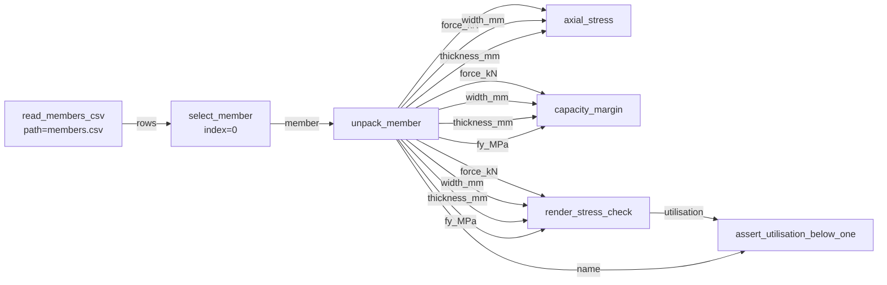

# Nodezator structural-check demo

A small, self-contained project that shows the whole Nodezator idea end to end:
you write **ordinary Python functions**, Nodezator renders them as **visual
nodes**, you wire them into a **graph**, and that graph is nothing more than a
picture of a plain Python program you can run (and export) without the app.

The worked example is a tiny structural check:

> read a CSV of steel members → pick one → compute its axial stress →
> render the equations as typeset math → **assert `f(x) < 1`** (utilisation).

It exercises everything requested:

| Requirement | Where |
|---|---|
| Read a CSV with named columns + 3 rows | `read_members_csv` · [`members.csv`](members.csv) |
| Select one row | `select_member` |
| Two math nodes… | `axial_stress`, `capacity_margin` |
| …one of which is **imperative** | `capacity_margin` (a `while` loop that ramps load to yield) |
| Use **forallpeople** (real units) | `axial_stress`, `render_stress_check` |
| Use **handcalcs** to display equations | `render_stress_check` |
| Assert some `f(x) < 1` | `assert_utilisation_below_one` (utilisation ratio) |

Plus a bonus: `unpack_member` demonstrates Nodezator's **multiple named
outputs** feature.

## Layout

```
nodezator-structural-demo/
├── members.csv              # 3 members, named columns
├── demolib/                 # <-- the real logic: plain, framework-free Python
│   ├── data.py              #     read_members_csv, select_member, unpack_member
│   ├── mechanics.py         #     axial_stress (forallpeople), capacity_margin (imperative)
│   └── report.py            #     render_stress_check (handcalcs), assert_utilisation_below_one
├── run_demo.py              # runs the pipeline WITHOUT Nodezator (proves app-independence)
└── demo_nodepack/           # <-- the Nodezator node pack (thin adapters over demolib)
    ├── data/
    │   ├── read_members_csv/__main__.py
    │   ├── select_member/__main__.py
    │   └── unpack_member/__main__.py
    ├── mechanics/
    │   ├── axial_stress/__main__.py
    │   └── capacity_margin/__main__.py
    └── report/
        ├── render_stress_check/__main__.py
        └── assert_utilisation_below_one/__main__.py
```

The key design choice: **the logic lives once, in `demolib/`.** Each node script
(`__main__.py`) just imports a function and assigns `main_callable`. That is
*the entire* Nodezator contract — a callable bound to the name `main_callable`.
The same functions are imported by `run_demo.py`. Nothing is duplicated, and
nothing in `demolib/` knows Nodezator exists.

## Run it without the app

Managed with [uv](https://docs.astral.sh/uv/):

```bash
uv sync                                   # installs forallpeople + handcalcs into .venv
uv run python run_demo.py 0               # member M1-tie  -> utilisation 0.80 -> PASS
uv run python run_demo.py 1               # member M2-strut -> utilisation 1.20 -> FAIL (exits 1)
```

Optional extras: `uv sync --extra export` (Markdown/PDF export, below) and
`uv sync --extra app` (the Nodezator GUI). Plain `pip install .` /
`pip install .[export]` works too if you prefer pip.

Console output for row 0:

```
Member selected : M1-tie  (row index 0)
  axial_stress      -> 200.000 MPa
  capacity_margin   -> {'safe_steps': 13, 'yield_load_kN': 130.0, 'utilisation': 0.8}
  utilisation f(x)  -> 0.8
PASS — M1-tie: utilisation f(x) = 0.800 < 1.0
```

It also writes [`report.html`](report.html) — open it in a browser to see the
handcalcs equations typeset by MathJax:

```
σ = P / A = 100.000 kN / 500.000 mm²  = 200.000 MPa      (axial stress)
U = σ / f_y = 200.000 MPa / 250.000 MPa = 0.800          (utilisation)
```

## Run it as a visual graph

1. `pip install nodezator` and launch `nodezator`.
2. **Load the node pack:** menubar → *Graph → Load node pack* → select the
   `demo_nodepack/` folder. The three categories (`data`, `mechanics`,
   `report`) appear in the node-insertion menu.
3. Drop in the nodes and wire them up:



Every edge above is exactly "feed this output into that parameter". An input
socket left **unconnected** shows a widget (the type hint + default decide which
one), so you can, e.g., type the `index` or `path` by hand instead of wiring it.

> **Note on the CSV path:** `read_members_csv` defaults to `members.csv`
> (relative to the working directory). In the app, type an absolute path into
> the node's `path` widget if the file isn't found.

## The round-trip: graph → Python

Nodezator's *Export as Python* walks the graph in dependency order, gives each
node output a variable, turns each connection into "pass that variable as this
argument", and turns each unconnected widget into a literal. The result for the
graph above is essentially `run_demo.py` — a flat script that imports these same
functions and calls them in order. That is why you are never locked in: the
graph *is* the program.

The `third_party_import_text = "from demolib.… import …"` line in each
`__main__.py` is what makes those exports self-contained — Nodezator injects it
into the generated script so the callables resolve.

## Export to Markdown / PDF — and back

The rendered calculation is just a LaTeX **string** plus its scalar inputs, so
exporting *forward* is easy:

```bash
uv sync --extra export
uv run python export_report.py 0          # -> report.md  and  report.pdf
```

- **Markdown** (`report.md`) — zero extra tooling; the `$$…$$` block renders on
  GitHub, in Jupyter, VS Code, Obsidian, etc.
- **PDF** (`report.pdf`) — printed from the MathJax HTML by the pre-installed
  Chromium (via Playwright). *Note:* MathJax is loaded from a CDN, so a fully
  typeset PDF needs network at render time; offline (or in a locked-down
  sandbox) the PDF still contains the raw LaTeX, readably. Bundle MathJax/KaTeX
  locally if you need guaranteed offline typesetting.

**The reverse direction is the interesting part.** A PDF is a *rendering* — the
source LaTeX, the inputs, and the graph are not recoverable from the printed
glyphs. So `export_report.py` **embeds the source** (inputs + LaTeX as a JSON
attachment) inside the PDF. "Convert back" then means *extract the payload*, not
reverse-engineer the page:

```bash
uv run python export_report.py --extract report.pdf
# Recovered member : M1-tie  ...  Re-computed util. 0.8 -> MATCH
```

This mirrors the whole project's theme: the **source of truth is the Python**
(and the graph); Markdown and PDF are downstream, lossy renders. Round-tripping
works only when the source travels along inside the artifact.

## The two libraries, briefly

- **[forallpeople](https://github.com/connorferster/forallpeople)** — attaches
  real SI units to numbers. We feed base SI (`N`, `m`, `Pa`) and it auto-selects
  prefixes on display, so `2e8 Pa` prints as `200.000 MPa` and a
  same-dimension ratio (stress / strength) collapses to a plain dimensionless
  `float` — exactly the `f(x)` the assertion needs.
- **[handcalcs](https://github.com/connorferster/handcalcs)** — renders a
  function body as a hand-calculation: symbolic form → substituted values →
  result, per line. We use the `@handcalc(jupyter_display=False)` decorator so
  it returns a LaTeX string we can drop into HTML (or a Jupyter cell).

## Requirements

Declared in [`pyproject.toml`](pyproject.toml), locked in `uv.lock`. Core deps
`forallpeople` + `handcalcs` run the logic; the `export` extra
(`playwright`, `pypdf`) adds Markdown/PDF export; the `app` extra (`nodezator`)
opens the graph visually. Python 3.10+.
